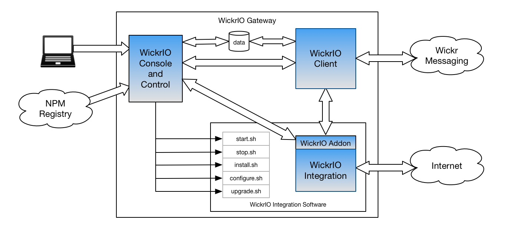

This guide provides documentation for Wickr IO Integrations. If you're
using AWS Wickr, see [AWS Wickr
Administration Guide](../adminguide/what-is-wickr.md "../adminguide/what-is-wickr.md").

# Develop a custom Wickr IO integration on

AWS Wickr

**High Level Overview**

To customize your experience with integrations in AWS Wickr, Wickr IO offers a [JavaScript](https://github.com/WickrInc/wickrio-bot-api "https://github.com/WickrInc/wickrio-bot-api") library which makes it
easy to develop your own bots. This document contains the process of creating a new integration,
an “emoji bot,” which responds to messages with a random emoji.
