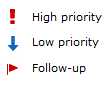
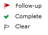

# Working with email

messages

Send, copy, move, print, and delete email messages from Amazon WorkMail. If your administrator
has created an alias for you, you can also send email using that alias.

If you are notified that you have reached 90 percent of your mailbox quota, you can delete
email to free up space.

###### Topics

- [Sending email messages](#create_send_email "#create_send_email")
- [Sending email from an alias](#send_alias "#send_alias")
- [Sending email to a subaddress](#email-sub-address "#email-sub-address")
- [Copying or moving email messages](#copy_move_email "#copy_move_email")
- [Printing email messages](#print_email "#print_email")
- [Deleting email messages](#delete_email_message "#delete_email_message")

## Sending email messages

You can create and send a message to one or more recipients, include attachments, set
the priority, or add a flag to indicate that the message is important.

###### To send a message

1. In the Amazon WorkMail web application, choose the mail icon on the shortcut
   bar.
2. On the menu bar, choose **+ New item** and **New
   email**.

###### Tip

You can also choose the plus sign (+) on the tab bar. 3. To add recipients, for **To**, type one or more names.
Amazon WorkMail suggests previously used email addresses. You can remove suggestions
from this list by selecting a name and choosing
**Delete**.

To add users from the address book or to add them to the
**CC** or **BCC** fields, choose
**To**, and select one or more users from the address book
as appropriate. 4. (Optional) Do one of the following:

    * To add an attachment, choose **Attach**.


    ###### Note

    The total size of the attached files can’t exceed 25 MB.
    * To mark the message as important or high priority, low priority, or for
     follow-up, choose the exclamation mark (!), down arrow, or flag icon.


    
    * To mark the message for follow-up or as a completed task, choose the flag or
     the checkmark icon.


    
    * To save the message as a draft in the **Drafts** folder,
     choose **Save**.

5. Enter your text in the lower half of the contents pane, and choose
   **Send**.

## Sending email from an alias

###### Note

To view the From field on the WebMail client, select the From button above the subject.

You can send and receive email using an alias that your administrator configures for you. Recipients outside
of your organization then see the sender as your alias address instead of your primary
address. For information about configuring aliases, see [Edit User Email
Addresses](../adminguide/edit_user_email_addresses.md "../adminguide/edit_user_email_addresses.md").

###### Note

Sending email from an alias is not supported for EWS clients, IMAP/SMTP clients, or ActiveSync mobile devices.

If you send an email from an alias to someone in your organization, the message is
still received from your primary address.

For information about sending email as a delegate, see [Working with delegates](delegates_overview.md "delegates_overview.md").

###### To send an email from an alias

1. In the Amazon WorkMail web application, choose the mail icon on the shortcut bar and
   choose **+ New item**, **New email**.
2. For **From**, type the alias from which to send email.

###### Tip

To include a display name, use the SMTP standard format `Your Name
 <`youralias`@example.com>`. 3. When you're ready to send the email, choose **Send**.

## Sending email to a subaddress

###### Note

The email address (anything before the @) cannot exceed 64 characters.

You can add a `+` tag to your Amazon WorkMail email address to help
filter your incoming email messages. This is also known as subaddressing.

To send emails to a subaddress, add the `+` sign followed by
a text string of your choice to the first part of your Amazon WorkMail email address. The following example
shows how to add a `+sales` tag to a standard email address
(jdoe@example.com), converting it to a subaddress.

```
`jdoe`+`sales`@`example`.com
```

In the preceding example, the recipient can use the `+sales`
tag to filter the email messages sent to the subaddress. Amazon WorkMail recognizes text after
the first `+` sign as a subaddress. If a sender adds a
`+` tag that matches an existing email address in your
organization, that email message is sent to the existing email address. Amazon WorkMail allows
`+` signs in email addresses as well as
subaddresses.

You can't send email messages from a subaddress. Instead, contact your
administrator to create an alias for you. For more information, see [Sending email from an alias](#send_alias "#send_alias").

## Copying or moving email messages

You can copy or move a message from one folder to another.

###### To copy or move a message

1. In the Amazon WorkMail web application, choose the mail icon on the shortcut
   bar.
2. Do one of the following:
   - To copy an item, select the message in the contents pane and choose
     **Copy/Move**.
   - To copy more than one message, press the **Ctrl** key
     while you select each message in the contents pane, and then choose
     **Copy/Move**.
   - To move a single message, drag the item to its new location.

   ###### Tip

   The folder names directly under the dragged message are
   highlighted and show the target location when you release the
   message.
   - To move multiple consecutive messages, press the
     **Shift** key while you select all the messages to
     move, and then drag them to the desired folder.
   - To move messages that are not consecutive, press the
     **Ctrl** key while you select each message to move,
     release the **Ctrl** key, and then drag them into the
     designated folder.

3. In the **Copy/move messages** dialog box, select the
   destination folder and choose either **Copy** or
   **Move**.

## Printing email messages

If you have a printer attached to your computer and your computer is set up to print
documents, you can print your messages.

###### To print a message

1. In the Amazon WorkMail web application, on the shortcut bar, choose the mail
   icon.
2. In the navigation pane, select the folder that contains the message to
   print.
3. In the contents pane, select the message to print and choose
   **Print** on the menu bar.

## Deleting email messages

When you no longer need an email message, you can delete it. Deleting unwanted email
also helps you to free up space in your inbox.

###### To delete a message

1. In the Amazon WorkMail web application, choose the mail icon on the shortcut
   bar.
2. Do one of the following:
   - In the contents pane, select a message and press the
     **Delete** key.
   - In the contents pane, open the message and choose
     **Delete**.
   - In the **Message** tab, choose
     **Delete**.

If you mistakenly delete a message, calendar item, or contact, you can restore it. All
deleted email, calendar items, and contacts are stored in the Deleted Items folder in
the application.

###### Note

You can only restore items that are still in the Deleted Items folder. If you've
emptied the Deleted Items folder, those items are unrecoverable.

###### To restore a deleted item

1. In the Amazon WorkMail web application, choose the mail icon on the shortcut
   bar.
2. In the **Deleted Items** folder, select the message to
   restore and choose **Copy/Move**.

###### Tip

You can also choose the plus sign (+) on the tab bar. 3. In the **Copy/move messages** dialog box, select the
destination folder and choose **Move**.
