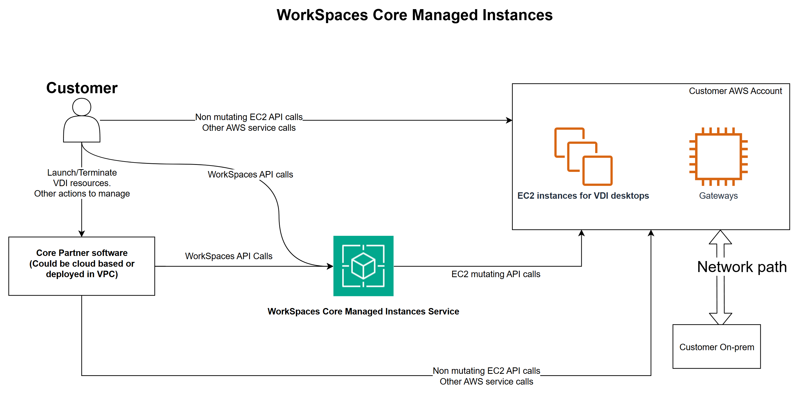

# Architecture

Amazon WorkSpaces Core Managed Instances introduce an updated architecture that allows EC2 instances
to be launched directly into the customer’s AWS account, rather than into an account owned by
Amazon WorkSpaces Core. These instances are referred to as WorkSpaces Core managed EC2 instances. Under
this model, WorkSpaces Core partners have direct access to most EC2 APIs within the customer’s
account. For mutable operations such as launch and terminate an instance, partners must use the
Amazon WorkSpaces Core SDK instead of native EC2 APIs.

WorkSpaces Core Managed Instances operate with:

- Direct EC2 instance deployment in your AWS account
- Native AWS feature support (AMIs, KMS, Systems Manager)
- WorkSpaces Core SDK for instance lifecycle management

This model differs significantly from Amazon WorkSpaces Core bundles, which rely on pre-defined infrastructure
launched within Amazon WorkSpaces owned accounts. Concepts such as directories, bundles, and images from Amazon WorkSpaces Core
bundles do not apply here.

## API Operations

For Amazon WorkSpaces Instances API information see [WorkSpaces Instances
API Reference](../../../workspaces-instances/latest/api/Welcome.md "../../../workspaces-instances/latest/api/Welcome.md").
