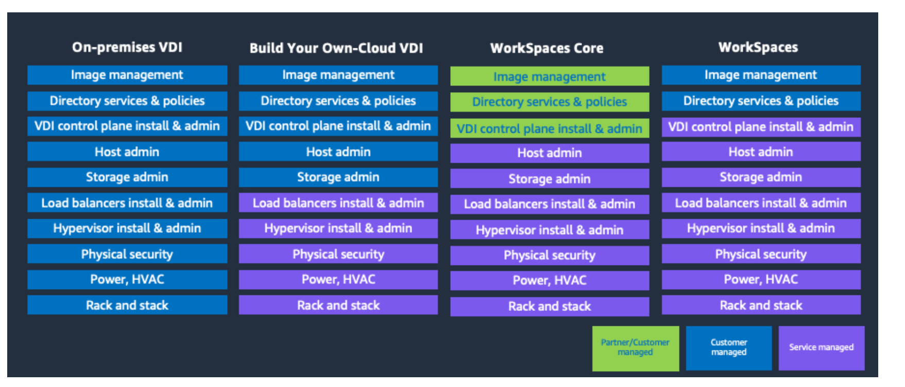

# Shared responsibility model

Security and compliance is a shared responsibility between AWS and its partners. This
shared model can help relieve your operational burden. AWS operates, manages and controls the
components from the host operating system and visualization layer to the physical security of the
facilities in which the service operates. The customer assumes responsibility and management of
the guest operating system (including updates and security patches), other associated application
software, and the configuration of the security group firewall that's provided by AWS.

Customers should carefully consider the services that they choose. Their responsibilities
vary depending on the services used, the integration of those services into their IT environment,
and applicable laws and regulations. The nature of this shared responsibility also provides the
flexibility and customer control that permits the deployment. For more information, see [Shared Responsibility
Model](https://aws.amazon.com/compliance/shared-responsibility-model/ "https://aws.amazon.com/compliance/shared-responsibility-model/").

###### Topics

- [Shared responsibilities with Amazon WorkSpaces Core](#shared-responsibilities "#shared-responsibilities")
- [Amazon WorkSpaces Core responsibilities](#core-responsibilities "#core-responsibilities")
- [Customer and partner responsibilities](#customer-responsibilities "#customer-responsibilities")

## Shared responsibilities with Amazon WorkSpaces Core

The following responsibilities are shared between your company and Amazon WorkSpaces Core:

- Compliance validation.
- Amazon WorkSpaces image management for Amazon WorkSpaces Core bundles. However, customers are responsible
  for image managed for Amazon WorkSpaces Core Managed Instances.
- AWS Identity and Access Management (IAM) for WorkSpaces. This responsibility includes IAM configurations and
  policies. This responsibility doesn't include access to the desktop through the customer and/or
  partner directory, or gateway services.

## Amazon WorkSpaces Core responsibilities

The following responsibilities belong to Amazon WorkSpaces Core:

- Infrastructure security.
- Encryption at rest (which must be enabled) for Amazon WorkSpaces Core bundles. For more information, see [Encrypted
  WorkSpaces](../../../workspaces/latest/adminguide/encrypt-workspaces.md "../../../workspaces/latest/adminguide/encrypt-workspaces.md") in the _Amazon WorkSpaces Administration
  Guide_.
- Resilience in Amazon WorkSpaces Core bundles (except for cross-Region redirection).
- WorkSpaces API operations, AWS Command Line Interface (AWS CLI), SDK, CDK, and console.
- WorkSpaces based monitoring.
- WorkSpaces dedicated hardware requirements.
- Windows operating system (OS) updates and security patches for WorkSpaces Core bundles.

## Customer and partner responsibilities

The following responsibilities belong to your company:

- Lifecycle of the Amazon WorkSpaces Core desktop, including calling our API, CLI, or console to
  provision the desktop, receiving any status, and calling our API, CLI, or console to terminate
  the desktop.
- Registration of Amazon WorkSpaces Core desktops within the customer or partner solution.
- Brokering Active Directory users to the Amazon WorkSpaces Core desktop.
- Gateway services for securely accessing the Amazon WorkSpaces Core desktop.
- Multi-Region resilience.
- Customers are responsible for Windows OS updates and security patches for WorkSpaces Core Managed Instances.
- Customers must provision and attach encrypted Amazon EBS volumes for Amazon WorkSpaces Core managed instances.
  For more information, refer to Encryption at Rest for EBS Storage. For more information, see
  [Data Protection in Amazon EC2](../../../AWSEC2/latest/UserGuide/data-protection.md#encryption-rest "../../../AWSEC2/latest/UserGuide/data-protection.md#encryption-rest").
- Additional monitoring, security, and analytic solutions. These solutions are also the
  responsibility of the customer or partner operating the solution.

The following images show the shared responsibility model and shared responsibility with
AWS and your partner.

