# Customization guidelines

Customize the sign-in and loading experience for your end users by updating the branding elements and text on sign-in and loading pages. You can modify visual elements like logos and wallpapers, edit text elements such as welcome messages and headers, and optionally configure a Terms of Service agreement that users must accept before starting their session.

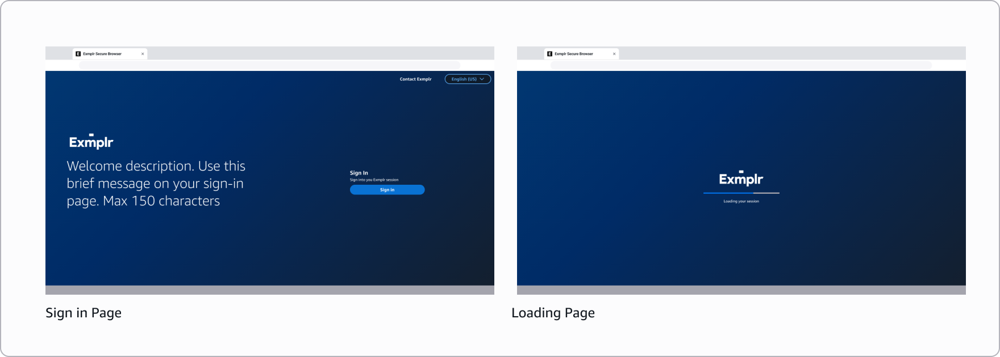

## Content editor

### Company logo

The logo appears on the sign-in screen and loading screen, providing consistent branding throughout the user experience.

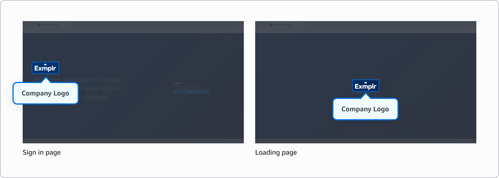

- Supported formats: JPG or ICO or PNG
- Maximum file size: 100 KB

**Do**

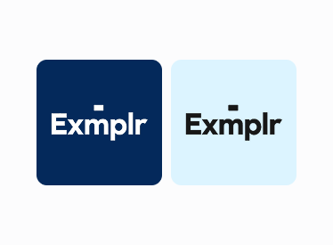

- If you have different logo variations (such as different colors or styles), choose the one that provides the best contrast with your selected wallpaper background.

**Don't**

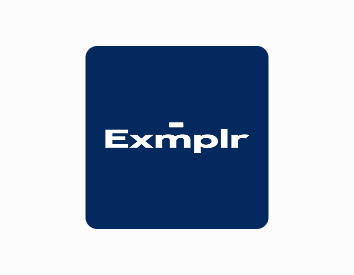

- Don't ignore aspect ratio when re-sizing your logo.
- Don't use logos not sized correctly beforehand as they may look distorted.

### Favicon

A favicon is a small icon that appears in browser tabs, helping users identify your application among multiple open tabs.

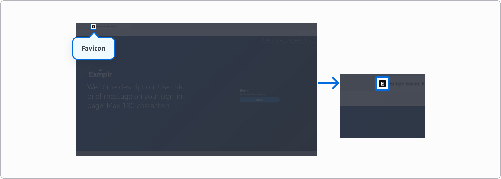

- Supported formats: JPG or ICO or PNG
- Maximum file size: 100 KB
- Recommended aspect ratio: 1:1

### Wallpaper

The wallpaper serves as the background image across all screens, creating a cohesive visual experience. Choose an image that complements your branding without interfering with content readability.

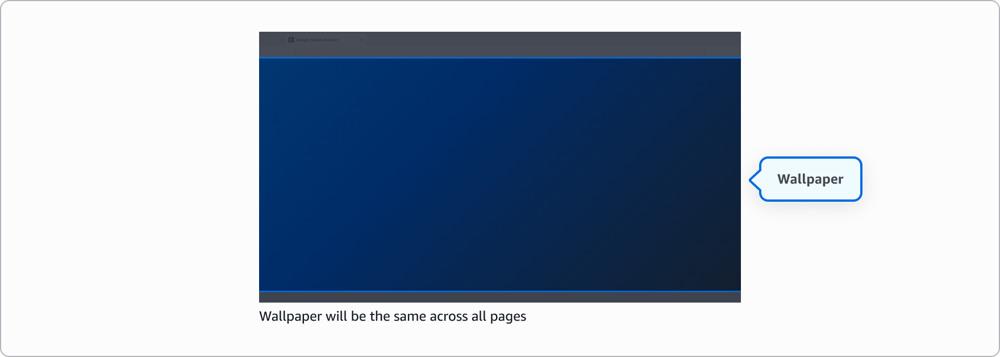

- Supported formats: JPG or PNG
- Maximum file size: 5 MB
- Recommended aspect ratio: 16:9
- Recommended minimum resolution: 1920 x 1080

**Do**

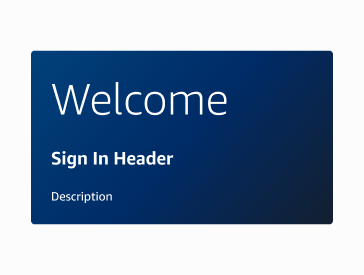

- Use subtle, low contrast wallpapers or blurred images that don't interfere with foreground content.
- Consider preset text placement to avoid busy areas behind text.
- Utilize brand colors and use overlays to create better contrast and readability.

**Don't**

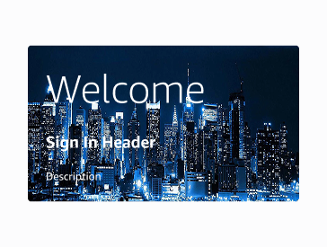

- Don't use busy, saturated, or high-detail images directly behind important text.
- Don't use visually complex images or images with sharp transitions that will cause readability limitations with preset text locations.
- Don't rely solely on color to separate text from background without sufficient contrast.

### Color theme

Select between light or dark themes that reflect on fonts, buttons and modals.

- Light theme - Best for darker backgrounds, providing clear contrast and reducing eye strain when working in low-light environments.
- Dark theme - Optimal for light backgrounds, offering comfortable viewing and reduced glare in bright settings.

**Do**

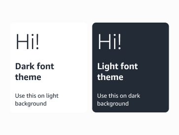

- Ensure strong contrast with background elements/wallpaper.
- Use dark color theme on light backgrounds.
- Use light color theme on dark backgrounds.

**Don't**

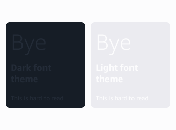

- Don't place light or dark fonts over images or complex wallpapers.

## Text editor

The Text editor lets you customize the text that appears on your end users' sign-in screen. To enable branding customization, you must add at least one language.

**For new user:** We detect your browser language preference and display the portal page in that language if you configured it in your branding languages. If your browser language isn't in your configured languages, we default to English (en-US) if available. If you didn't configure English, we use the first language in alphabetical order from your configured languages.

**For returning users:** We store your language preference from your previous session in a browser cookie. If that language is in your configured branding languages, we use it. Otherwise, we follow the same fallback logic: English (en-US) if available, or the first configured language in alphabetical order.

The following locales (language codes) are supported:

- German (de-DE)
- English (en-US)
- Spanish (es-ES)
- French (fr-FR)
- Indonesian (id-ID)
- Italian (it-IT)
- Japanese (ja-JP)
- Korean (ko-KR)
- Portuguese (pt-BR)
- Chinese - Simplified (zh-CN)
- Chinese - Traditional (zh-TW)

For security reasons, the following characters are blocked in all text fields:

- < (less than)
- > (greater than)
- & (ampersand)
- ' (straight apostrophe)
- ` (backtick/grave accent)
- ~ (tilde)
- \ (backslash)

### Browser tab title

The text shown in the browser tab. Maximum 25 characters.

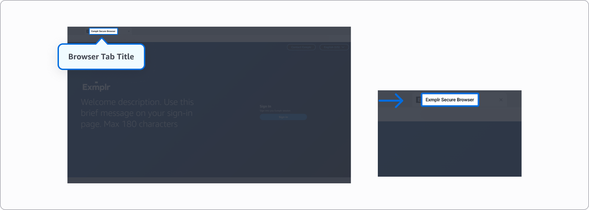

**Recommendation**

Consider using short and clear titles so they remain readable even when multiple tabs are open.

### Welcome description

A brief description alongside your company logo on sign-in screen. Maximum 150 characters.

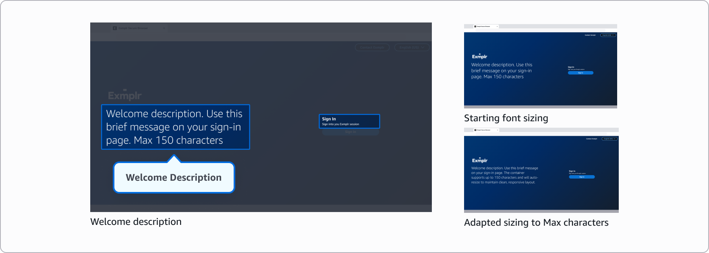

**Recommendation**

Keep text concise for better readability. Note that longer text will automatically scale to a smaller font size, while shorter messages display more prominently.

### Contact section

**Contact button - optional**

Contact button text on the sign-in screen. If left blank, "Contact us" will be displayed. Maximum 30 characters.

**Contact link - optional**

Contact button link on the sign-in screen. You can use:

- An HTTPS URL to direct users to a web page
- A mailto: link to open the user's email client

If left blank, the contact button will be hidden from screen.

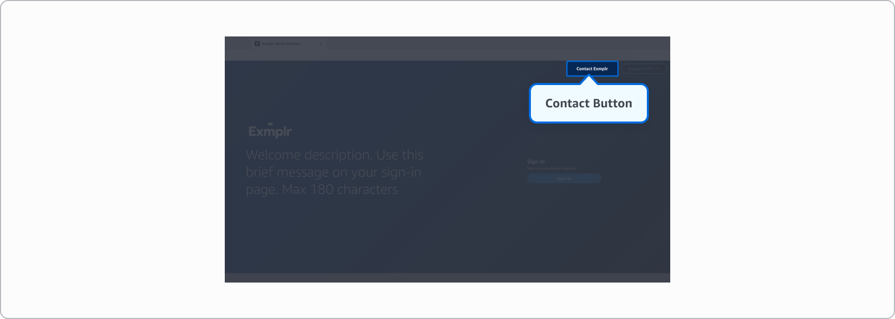

**Recommendation**

Keep the text short, ideally 2-3 words.

### Sign in section

**Sign in header - optional**

Header for the sign-in section of the login page. If left blank, "Sign in" will be displayed. Maximum 100 characters.

**Sign in description - optional**

Description text for the sign-in section. If left blank, "Sign in to your WorkSpaces Secure Browser Session" will be displayed. Maximum 250 characters.

**Sign in button - optional**

Text displayed on the sign-in button. If left blank, "Sign in" will be displayed. Maximum 30 characters.

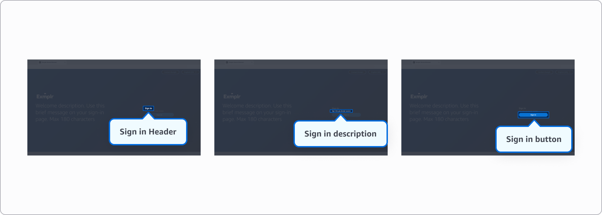

**Recommendations**

- Keep the text short.
- Consider that the sign-in button directs users to the identity provider configured for your portal. You can customize the button text to reflect your specific identity provider.

### Loading description

Text shown during connection on loading screen. If left blank, "Connecting..." will be displayed. Maximum 300 characters.

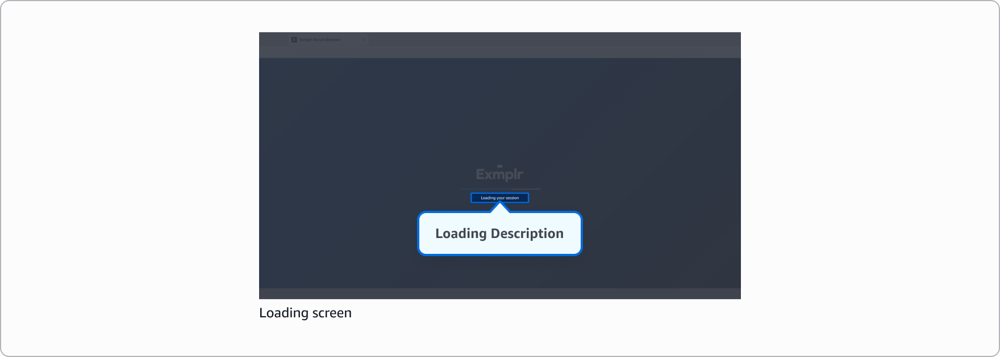

**Recommendation**

This message is only displayed while the session is loading, so end users may not have time to read it. Try to avoid making it too long.

## Terms of service - optional

You can customize the terms of service that end users must review and accept before they start a streaming session. This content can be added by either uploading a Markdown file or using the built-in Markdown editor.

Users will be presented with the terms of service after successfully signing in. They must scroll through the entire document and click on the "Accept" button to proceed to their Secure Browser session. If the user clicks "Decline", they will be redirected back to the sign-in page.

Note that this is an optional setting - if you don't add a terms of service, users will proceed directly to their sessions after signing in.

**Supported formatting:**

- Basic text styles (bold, italic)
- Headings
- Ordered and unordered lists
- Blockquotes
- Horizontal rules
- Simple paragraphs and line breaks

**For security, the following elements are blocked:**

- Scripts and code execution
- Interactive elements like forms and iframes
- Unsafe protocols and file paths
- HTML attributes and styling
- External links and tables

Keep in mind that your terms of service file must not exceed 150KB in size.
