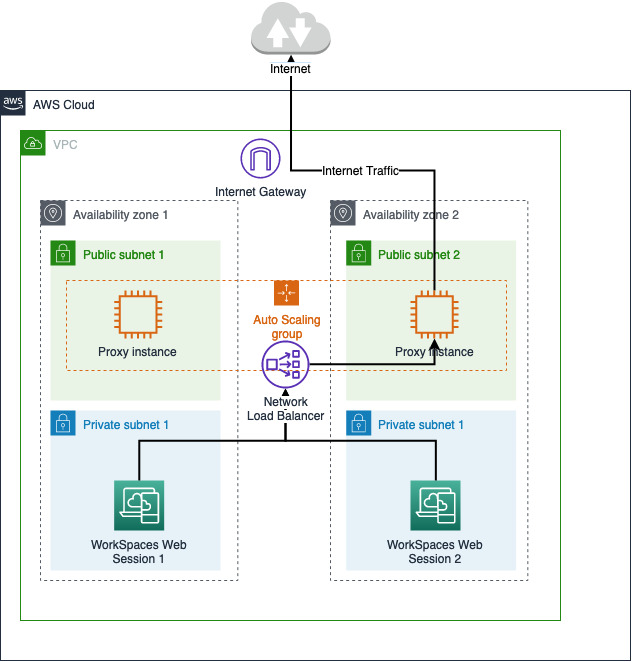

# Restricted internet browsing architecture for Amazon WorkSpaces Secure Browser

The following is an example of a typical proxy setup in your VPC. The proxy Amazon EC2
instance is in public subnets and associated with Elastic IP, so they have access to
internet. A network load balancer hosts an auto scaling group of proxy instances. This
ensures that proxy instances can scale up automatically, and the network load balancer
is the single proxy endpoint, which can be consumed by WorkSpaces Secure Browser sessions.

