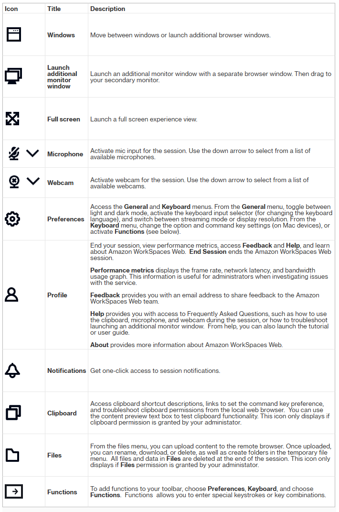

# Using the toolbar in Amazon WorkSpaces Secure Browser

To learn how to use the toolbar, follow these steps.

To move the toolbar, select the lighter bar in the top section of the tool bar, drag it
to your desired location, then release it to drop it.

To collapse the toolbar, hover over it, and select the up-arrow button, or double-click
the lighter bar in the top section. The collapsed view provides you with more screen real
estate, and one-click access to the most commonly used icons.

To increase the size of the display, select the browser window and zoom in. To increase
the display size of the toolbar icons and text, select the toolbar and zoom in.

To zoom in or out on a Windows device, follow these steps:

1. Select the toolbar or web content.
2. Press **Ctrl** + **+** to zoom in, or press
   **Ctrl** + **-** to zoom out.
   To zoom in or out on a Mac device, follow these steps:

3. Select the toolbar or web content.
4. Press **Cmd** + **+** to zoom in, or press
   **Cmd** + **-** to zoom out.
   To dock the toolbar to the top of the screen, choose **Preferences**,
   **General**, and **Docked** under **Toolbar
   mode**.

The following table includes a description of all the available icons in the
toolbar:

###### Note

The Clipboard and Files icons are hidden by default, unless your administrator grants
these permissions. Only administrators can enable or disable clipboard and files on a web
portal. If these icons are hidden and you need to access them, contact your
administrator.
