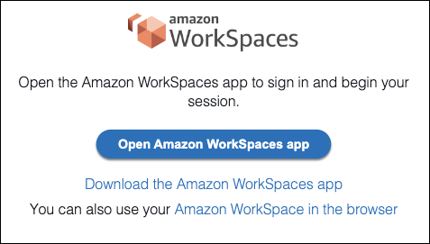

# Access Microsoft Entra ID-joined WorkSpaces Personal

You can create Windows 10 or 11 BYOL personal WorkSpaces that are Microsoft Entra ID-joined and enrolled to Intune.
For more details, see [Create a dedicated Microsoft Entra ID directory with WorkSpaces Personal](launch-entra-id.md "launch-entra-id.md").

## Authentication workflow

The following sections describe the authentication workflow initiated by WorkSpaces client application, WorkSpaces Web Access, and a
SAML 2.0 identity provider (IdP), Microsoft Entra ID:

- When the flow is initiated by the IdP. For example, when users choose an application in
  the Entra ID’s user portal in a web browser..
- When the flow is initiated by the WorkSpaces client. For example, when users open the client application and
  sign in.
- When the flow is initiated by WorkSpaces Web Access. For example, when users open
  Web Access in a browser and sign in.

In these examples, users enter `user@example.onmicrosoft.com`to sign in to the IdP.
On Entra ID, an enterprise application is configured to integrate with IAM Identity Center. Users create a WorkSpace
for their user names in a directory that uses IAM Identity Center as the identity source to connect to an Entra ID tenant.
Additionally, users install the [WorkSpaces client application](https://clients.amazonworkspaces.com/ "https://clients.amazonworkspaces.com/") on their
device or the user uses Web Access in a web browser.

###### Identity provider (IdP)-initiated flow with client application

The IdP-initiated flow allows users to automatically register the WorkSpaces client
application on their devices without having to enter a WorkSpaces registration code. Users don't
sign in to their WorkSpaces using the IdP-initiated flow. WorkSpaces authentication must originate
from the client application.

1. Using their web browser, users sign in to the IdP (Microsoft Entra ID).
2. After signing in to the IdP, users choose the AWS IAM Identity Center application from the IdP user
   portal.
3. Users are redirected to the AWS access portal in the browser. Then, users choose the WorkSpaces icon.
4. Users are redirected to the page below and the WorkSpaces client application is opened automatically. Choose
   **Open Amazon WorkSpaces app** if the client application doesn't opened automatically.

 5. The WorkSpaces client application is now registered and users can continue to sign by clicking
**Continue to sign in to WorkSpaces**.

###### Identity provider (IdP)-initiated flow with Web Access

The IdP-initiated Web Access flow allows users to automatically register their WorkSpaces through a web browser
without having to enter a WorkSpaces registration code. Users don't
sign in to their WorkSpaces using the IdP-initiated flow. WorkSpaces authentication must originate
from Web Access.

1. Using their web browser, users sign in to the IdP.
2. After signing in to the IdP, users click the AWS IAM Identity Center application from the IdP user
   portal.
3. Users are redirected to AWS access portal in the browser. Then, users choose the WorkSpaces icon.
4. Users are redirected to this page in the browser. To open WorkSpaces, choose
   **Amazon WorkSpaces in the browser**.

 5. The WorkSpaces client application is now registered and users can continue to sign in through WorkSpaces Web Access.

###### WorkSpaces client-initiated flow

The client-initiated flow allows users to sign in to their WorkSpaces after signing in to an
IdP.

1. Users launch the WorkSpaces client application (if it isn't already running) and
   clicks **Continue to sign in to WorkSpaces**.
2. Users are redirected to their default web browser to sign in to the IdP. If the
   users are already signed in to the IdP in their browser, they don't need to sign in again
   and will skip this step.
3. Once signed in to the IdP, users are redirected to a pop up. Follow the prompts
   to allow your web browser to open the client application.
4. Users are redirected to the WorkSpaces client application, on Windows login screen.
5. Users complete sign-in to Windows using their Entra ID username and credentials.

###### WorkSpaces Web Access-initiated flow

The Web Access-initiated flow allows users to sign in to their WorkSpaces after signing in to an
IdP.

1. Users launch the WorkSpaces Web Access and chooses **Sign in**.
2. In the same browser tab, users are redirected to IdP portal. If the users are already
   signed in to the IdP in their browser, they don't need to sign in again and can skip this step.
3. Once signed in to the IdP, users redirected to this page in the browser, and
   clicks **Log in to WorkSpaces**.
4. Users are redirected to the WorkSpaces client application, on the Windows login screen.
5. Users complete sign-in to Windows using their Entra ID username and credentials.

## First-time user experience

If you're logging in for the first time to a Microsoft Entra ID-joined Windows WorkSpaces, you must
go through the out-of-box experience (OOBE). During OOBE, the WorkSpaces are joined to Entra ID. You can customize
the OOBE experience by configuring the Autopilot profile assigned to the Microsoft Intune device group that you
create for your WorkSpaces. For more information, see [Step 3: Configure Windows Autopilot user-driven mode](launch-entra-id.md#entra-step-3 "launch-entra-id.md#entra-step-3").
