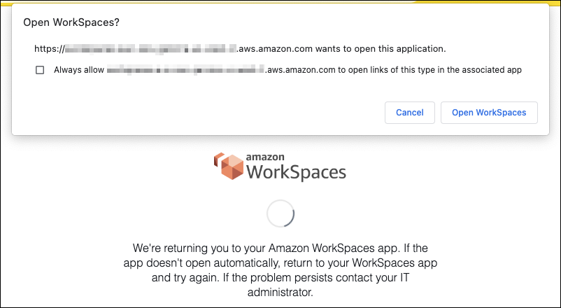

# Integrate SAML 2.0 with WorkSpaces Personal

###### Note

SAML 2.0 is available only when your WorkSpaces Personal directories are managed through AWS Directory Service including Simple AD,
AD Connector, and AWS Managed Microsoft AD directory. The feature doesn't apply to directories that are
managed by Amazon WorkSpaces, which normally use IAM Identity Center for user authentication instead of SAML 2.0 federation.

Integrating SAML 2.0 with your WorkSpaces for desktop session authentication allows your users
to use their existing SAML 2.0 identity provider (IdP) credentials and authentication methods
through their default web browser. By using your IdP to authenticate users for WorkSpaces, you can
protect WorkSpaces by employing IdP features like multi-factor authentication and contextual access
policies.

## Authentication workflow

The following sections describe the authentication workflow initiated by WorkSpaces client application, WorkSpaces Web Access, and a
SAML 2.0 identity provider (IdP):

- When the flow is initiated by the IdP. For example, when users choose an application in
  the IdP user portal in a web browser.
- When the flow is initiated by the WorkSpaces client. For example, when users open the client application and
  sign in.
- When the flow is initiated by WorkSpaces Web Access. For example, when users open Web Access in a browser and sign in.

In these examples, users enter `user@example.com`to sign in to the IdP.
The IdP has a SAML 2.0 service provider application configured for a WorkSpaces directory and
users are authorized for the WorkSpaces SAML 2.0 application. Users create a WorkSpace for
their usernames, `user`, in a directory that's enabled for SAML 2.0
authentication. Additionally, users install the [WorkSpaces client application](https://clients.amazonworkspaces.com/ "https://clients.amazonworkspaces.com/") on their
device or the user uses Web Access in a web browser.

###### Identity provider (IdP)-initiated flow with client application

The IdP-initiated flow allows users to automatically register the WorkSpaces client
application on their devices without having to enter a WorkSpaces registration code. Users don't
sign in to their WorkSpaces using the IdP-initiated flow. WorkSpaces authentication must originate
from the client application.

1. Using their web browser, users sign in to the IdP.
2. After signing in to the IdP, users choose the WorkSpaces application from the IdP user
   portal.
3. Users are redirected to this page in the browser, and the WorkSpaces client application
   is opened automatically.

 4. The WorkSpaces client application is now registered and users can continue to sign by clicking
**Continue to sign in to WorkSpaces**.

###### Identity provider (IdP)-initiated flow with Web Access

The IdP-initiated Web Access flow allows users to automatically register their WorkSpaces through a web browser
without having to enter a WorkSpaces registration code. Users don't
sign in to their WorkSpaces using the IdP-initiated flow. WorkSpaces authentication must originate
from Web Access.

1. Using their web browser, users sign in to the IdP.
2. After signing in to the IdP, users click the WorkSpaces application from the IdP user
   portal.
3. Users are redirected to this page in the browser. To open WorkSpaces, choose
   **Amazon WorkSpaces in the browser**.

 4. The WorkSpaces client application is now registered and users can continue to sign in through WorkSpaces Web Access.

###### WorkSpaces client-initiated flow

The client-initiated flow allows users to sign in to their WorkSpaces after signing in to an
IdP.

1. Users launch the WorkSpaces client application (if it isn't already running) and
   clicks **Continue to sign in to WorkSpaces**.
2. Users are redirected to their default web browser to sign in to the IdP. If the
   users are already signed in to the IdP in their browser, they don't need to sign in again
   and will skip this step.
3. Once signed in to the IdP, users are redirected to a pop up. Follow the prompts
   to allow your web browser to open the client application.

 4. Users are redirected to the WorkSpaces client application to complete sign in to their
WorkSpace. WorkSpaces usernames are populated automatically from the IdP SAML 2.0
assertion. When you use [certificate-based authentication (CBA)](certificate-based-authentication.md "certificate-based-authentication.md") , users are automatically signed in. 5. Users are signed in to their WorkSpace.

###### WorkSpaces Web Access-initiated flow

The Web Access-initiated flow allows users to sign in to their WorkSpaces after signing in to an
IdP.

1. Users launch the WorkSpaces Web Access and chooses **Sign in**.
2. In the same browser tab, users are redirected to IdP portal. If the users are already
   signed in to the IdP in their browser, they don't need to sign in again and can skip this step.
3. Once signed in to the IdP, users redirected to this page in the browser, and
   clicks **Log in to WorkSpaces**.
4. Users redirected to the WorkSpaces client application to complete sign in to their
   WorkSpace. WorkSpaces usernames are populated automatically from the IdP SAML 2.0
   assertion. When you use [certificate-based authentication (CBA)](certificate-based-authentication.md "certificate-based-authentication.md") , users are automatically signed in.
5. Users are signed in to their WorkSpace.
