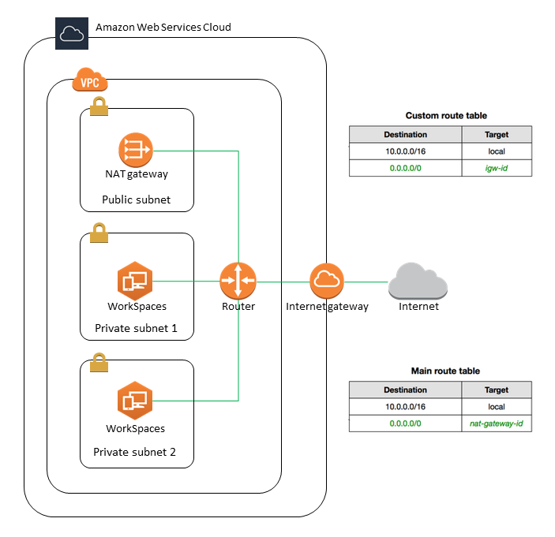

# Configure a VPC for WorkSpaces Personal

WorkSpaces launches your WorkSpaces in a virtual private cloud (VPC).

You can create a VPC with two private subnets for your WorkSpaces and a NAT gateway in a public subnet.
Alternatively, you can create a VPC with two public subnets for your WorkSpaces and associate a public IP
address or Elastic IP address with each WorkSpace.

For more information about VPC design considerations, see
[Best Practices for VPCs and Networking in Amazon WorkSpaces Deployments](https://d1.awsstatic.com/whitepapers/best-practices-vpcs-networking-amazon-workspaces-deployments.pdf "https://d1.awsstatic.com/whitepapers/best-practices-vpcs-networking-amazon-workspaces-deployments.pdf") and
[Best Practices for Deploying WorkSpaces - VPC Design](../../../whitepapers/latest/best-practices-deploying-amazon-workspaces/vpc-design.md "../../../whitepapers/latest/best-practices-deploying-amazon-workspaces/vpc-design.md").

###### Contents

- [Requirements](#configure-vpc-requirements "#configure-vpc-requirements")
- [Configure a VPC with private subnets and a NAT gateway](#configure-vpc-nat-gateway "#configure-vpc-nat-gateway")
- [Configure a VPC with public subnets](#configure-vpc-public-subnets "#configure-vpc-public-subnets")

## Requirements

Your VPC's subnets must reside in different Availability Zones in the Region where you're launching
WorkSpaces. Availability Zones are distinct locations that are engineered to be isolated from failures
in other Availability Zones. By launching instances in separate Availability Zones, you can protect your
applications from the failure of a single location. Each subnet must reside entirely within one Availability
Zone and cannot span zones.

###### Note

Amazon WorkSpaces is available in a subset of the Availability Zones in each supported Region. To determine
which Availability Zones you can use for the subnets of the VPC that you're using for WorkSpaces, see
[Availability Zones for WorkSpaces Personal](azs-workspaces.md "azs-workspaces.md").

## Configure a VPC with private subnets and a NAT gateway

If you use Directory Service to create an AWS Managed Microsoft or a Simple AD, we recommend that you configure
the VPC with one public subnet and two private subnets. Configure your directory to launch your WorkSpaces
in the private subnets. To provide internet access to WorkSpaces in a private subnet, configure a NAT
gateway in the public subnet.

###### To create a VPC with one public subnet and two private subnets

1. Open the Amazon VPC console at
   [https://console.aws.amazon.com/vpc/](https://console.aws.amazon.com/vpc/ "https://console.aws.amazon.com/vpc/").
2. Choose **Create VPC**.
3. Under **Resources to create**, choose **VPC and more**.
4. For **Name tag auto-generation**, enter a name for the VPC.
5. To configure the subnets, do the following:
   1. For **Number of Availability Zones**, choose **1**
      or **2**, depending on your needs.
   2. Expand **Customize AZs** and choose your Availability Zones.
      Otherwise, AWS selects them for you. To make an appropriate selection, see
      [Availability Zones for WorkSpaces Personal](azs-workspaces.md "azs-workspaces.md").
   3. For **Number of public subnets**, ensure that you have one
      public subnet per Availability Zone.
   4. For **Number of private subnets**, ensure that you have at
      least one private subnet per Availability Zone.
   5. Enter a CIDR block for each subnet. For more information, see [Subnet sizing](../../../vpc/latest/userguide/configure-subnets.md#subnet-sizing "../../../vpc/latest/userguide/configure-subnets.md#subnet-sizing") in the _Amazon VPC User Guide_.

6. For **NAT gateways**, choose **1 per AZ**.
7. Choose **Create VPC**.

###### IPv6 CIDR blocks

You can associate IPv6 CIDR blocks with your VPC and subnets. However, if you
configure your subnets to automatically assign IPv6 addresses to instances launched in the
subnet, then you cannot use Graphics bundles. (You can use Graphics.g4dn, GraphicsPro.g4dn,
and GraphicsPro bundles, however.) This restriction arises from a hardware limitation of
previous-generation instance types that do not support IPv6.

To work around this issue, you can temporarily disable the **auto-assign IPv6 addresses**
setting on the WorkSpaces subnets before launching Graphics bundles, and then reenable
this setting (if needed) after launching Graphics bundles so that any other bundles receive
the desired IP addresses.

By default, the **auto-assign IPv6 addresses** setting is disabled.
To check this setting from the Amazon VPC console, in the navigation pane, choose **Subnets**.
Select the subnet, and choose **Actions**, **Modify auto-assign IP settings**.

## Configure a VPC with public subnets

If you prefer, you can create a VPC with two public subnets. To provide internet access
to WorkSpaces in public subnets, configure the directory to assign Elastic IP addresses
automatically or manually assign an Elastic IP address to each WorkSpace.

###### Tasks

- [Step 1: Create a VPC](#create-vpc-public-subnet "#create-vpc-public-subnet")
- [Step 2: Assign public IP addresses to your WorkSpaces](#assign-eip "#assign-eip")

### Step 1: Create a VPC

Create a VPC with one public subnet as follows.

###### To create the VPC

1. Open the Amazon VPC console at
   [https://console.aws.amazon.com/vpc/](https://console.aws.amazon.com/vpc/ "https://console.aws.amazon.com/vpc/").
2. Choose **Create VPC**.
3. Under **Resources to create**, choose **VPC and more**.
4. For **Name tag auto-generation**, enter a name for the VPC.
5. To configure the subnets, do the following:
   1. For **Number of Availability Zones**, choose **2**.
   2. Expand **Customize AZs** and choose your Availability Zones.
      Otherwise, AWS selects them for you. To make an appropriate selection, see
      [Availability Zones for WorkSpaces Personal](azs-workspaces.md "azs-workspaces.md").
   3. For **Number of public subnets**, choose **2**.
   4. For **Number of private subnets**, choose **0**.
   5. Enter a CIDR block for each public subnet. For more information, see [Subnet sizing](../../../vpc/latest/userguide/configure-subnets.md#subnet-sizing "../../../vpc/latest/userguide/configure-subnets.md#subnet-sizing") in the _Amazon VPC User Guide_.

6. Choose **Create VPC**.

###### IPv6 CIDR blocks

You can associate an IPv6 CIDR block with your VPC and subnets. However, if you
configure your subnets to automatically assign IPv6 addresses to instances launched in the
subnet, then you cannot use Graphics bundles. (You can use GraphicsPro bundles, however.)
This restriction arises from a hardware limitation of previous-generation instance types
that do not support IPv6.

To work around this issue, you can temporarily disable the **auto-assign IPv6 addresses**
setting on the WorkSpaces subnets before launching Graphics bundles, and then reenable
this setting (if needed) after launching Graphics bundles so that any other bundles receive
the desired IP addresses.

By default, the **auto-assign IPv6 addresses** setting is disabled.
To check this setting from the Amazon VPC console, in the navigation pane, choose **Subnets**.
Select the subnet, and choose **Actions**, **Modify auto-assign IP settings**.

### Step 2: Assign public IP addresses to your WorkSpaces

You can assign public IP addresses to your WorkSpaces automatically or manually.
To use automatic assignment, see [Configure automatic public IP addresses for WorkSpaces Personal](automatic-assignment.md "automatic-assignment.md").
To assign public IP addresses manually, use the following procedure.

###### To assign a public IP address to a WorkSpace manually

1. Open the WorkSpaces console at [https://console.aws.amazon.com/workspaces/v2/home](https://console.aws.amazon.com/workspaces/v2/home "https://console.aws.amazon.com/workspaces/v2/home").
2. In the navigation pane, choose **WorkSpaces**.
3. Expand the row (choose the arrow icon) for the WorkSpace and note the value of **WorkSpace IP**.
   This is the primary private IP address of the WorkSpace.
4. Open the Amazon EC2 console at
   [https://console.aws.amazon.com/ec2/](https://console.aws.amazon.com/ec2/ "https://console.aws.amazon.com/ec2/").
5. In the navigation pane, choose **Elastic IPs**. If you do not
   have an available Elastic IP address, choose **Allocate Elastic IP
   address** and choose **Amazon's pool of IPv4
   addresses** or **Customer owned pool of IPv4
   addresses**, and then choose **Allocate**. Make note
   of the new IP address.
6. In the navigation pane, choose **Network Interfaces**.
7. Select the network interface for your WorkSpace. To find the network interface for your
   WorkSpace, enter the **WorkSpace IP** value (which you noted earlier)
   in the search box, and then press **Enter**. The **WorkSpace IP**
   value matches the primary private IPv4 address for the network interface. Note that the
   VPC ID of the network interface matches the ID of your WorkSpaces VPC.
8. Choose **Actions**, **Manage IP Addresses**. Choose **Assign new IP**, and
   then choose **Yes, Update**. Make note of the new IP address.
9. Choose **Actions**, **Associate Address**.
10. On the **Associate Elastic IP Address** page, choose an
    Elastic IP address from **Address**. For **Associate to private IP address**, specify the new private
    IP address, and then choose **Associate Address**.
