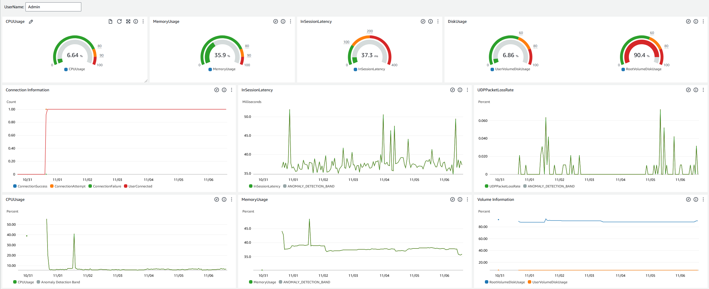
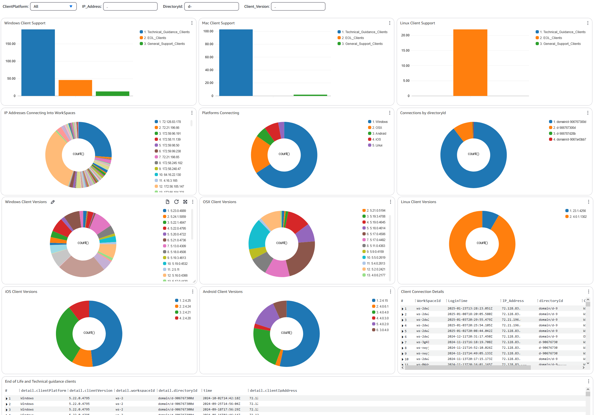
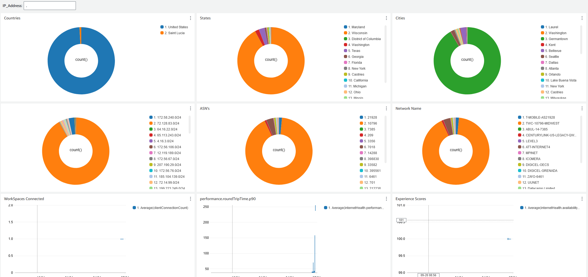

# Create custom CloudWatch dashboards using CloudFormation

templates

AWS provides CloudFormation templates that you can use to create custom CloudWatch dashboards for
WorkSpaces. Choose from the following CloudFormation template options to create custom dashboards for
your WorkSpaces in the CloudFormation console.

## Considerations before getting

started

Consider the following before you get started with custom CloudWatch dashboards:

- Create your dashboards in the same AWS Region as the deployed WorkSpaces you
  want to monitor.
- You can also create custom dashboards using the CloudWatch console.
- A cost might be associated with custom CloudWatch dashboards. For information
  about pricing, see [Amazon CloudWatch
  Pricing](https://aws.amazon.com/cloudwatch/pricing "https://aws.amazon.com/cloudwatch/pricing")

## Help Desk dashboard

The Help Desk dashboard displays the following metrics for a specific
WorkSpace:

- CPU usage
- Memory usage
- In-session latency
- Root volume
- User volume
- Packet loss
- Disk usage

Following is an example of the Help Desk dashboard.

Complete the following procedure to create a custom dashboard in CloudWatch using
CloudFormation.

1. [Open the Create Stack page in the CloudFormation console](cloudformation/home.md#/stacks/new?stackName=YourStackName&templateURL=https://cfn-templates-global-prod-iad.s3.us-east-1.amazonaws.com/cfn-templates/workspaces_helpdesk_dashboard.yaml "cloudformation/home.md#/stacks/new?stackName=YourStackName&templateURL=https://cfn-templates-global-prod-iad.s3.us-east-1.amazonaws.com/cfn-templates/workspaces_helpdesk_dashboard.yaml"). This link
   opens the page with the Amazon S3 bucket location of the Help Desk custom CloudWatch
   dashboard template pre-populated.
2. Review the default selections on the **Create Stack**
   page. Note that the **Amazon S3 URL** field is pre-populated
   with the Amazon S3 bucket location of the CloudFormation template.
3. Choose **Next**.
4. In the **Stack name** text box, enter the name of the
   stack.

The stack name is an identifier that helps you find a particular stack
from a list of stacks. A stack name can contain only alphanumeric characters
(case-sensitive) and hyphens. It must start with an alphabetic character and
can't be longer than 128 characters. 5. In the **DashboardName** text box, enter the name you
want to give your dashboard.

The dashboard name can contain only alphanumerics, dash
(`–`), and underscore (`_`). 6. Choose **Next**. 7. Review the default selections on the **Configure stack
options** page, and choose **Next**. 8. Scroll down to **Transforms might require access
capabilities** and check the boxes for acknowledgement. Then
choose **Submit** to create the stack and the custom CloudWatch
dashboard.

###### Important

A cost might be associated with custom CloudWatch dashboards. For
information about pricing, see [Amazon CloudWatch
Pricing](https://aws.amazon.com/cloudwatch/pricing "https://aws.amazon.com/cloudwatch/pricing") 9. Open the CloudWatch console at
[https://console.aws.amazon.com/cloudwatch/](https://console.aws.amazon.com/cloudwatch/ "https://console.aws.amazon.com/cloudwatch/"). 10. In the left navigation bar, choose **Dashboards**. 11. Under **Custom Dashboards**, choose the dashboard with
the dashboard name you entered earlier in this procedure. 12. Using the Help Desk sample template, enter the UserName of the WorkSpace to monitor its
data.

## Connection Insights

dashboard

The Connection Insights dashboard displays the client versions, platforms, and IP
addresses that are connected to your WorkSpaces. This dashboard allows you to better
understand how your users are connecting so that you can proactively notify your
users using an outdated client. The dynamic variables allows you to monitor the
details of IP addresses or specific directories.

Following is an example of the Connection Insights dashboard.

Complete the following procedure to create a custom dashboard in CloudWatch using
CloudFormation.

1. [Open the Create Stack page in the CloudFormation console](cloudformation/home.md#/stacks/new?stackName=YourStackName&templateURL=https://cfn-templates-global-prod-iad.s3.us-east-1.amazonaws.com/cfn-templates/workspaces_connection_insights_dashboard.yaml "cloudformation/home.md#/stacks/new?stackName=YourStackName&templateURL=https://cfn-templates-global-prod-iad.s3.us-east-1.amazonaws.com/cfn-templates/workspaces_connection_insights_dashboard.yaml"). This link
   opens the page with the Amazon S3 bucket location of the Connection Insights
   custom CloudWatch dashboard template pre-populated.
2. Review the default selections on the **Create Stack**
   page. Note that the **Amazon S3 URL** field is pre-populated
   with the Amazon S3 bucket location of the CloudFormation template.
3. Choose **Next**.
4. In the **Stack name** text box, enter the name of the
   stack.

The stack name is an identifier that helps you find a particular stack
from a list of stacks. A stack name can contain only alphanumeric characters
(case-sensitive) and hyphens. It must start with an alphabetic character and
can't be longer than 128 characters. 5. In the **DashboardName** text box, enter the name you
want to give your dashboard. Enter other relevant CloudWatch access group setup
information.

The dashboard name can contain only alphanumerics, dash
(`–`), and underscore (`_`). 6. Under **LogRetention**, enter the number of days you want
to retain your LogGroup for. 7. Under **SetupEventBridge**, choose whether you want to
deploy the EventBridge rule to get WorkSpaces access logs. 8. Under **WorkSpaceAccessLogsName**, enter the name of the
CloudWatch LogGroup that has the WorkSpaces access logs. 9. Choose **Next**. 10. Review the default selections on the **Configure stack
options** page, and choose **Next**. 11. Scroll down to **Transforms might require access
capabilities** and check the boxes for acknowledgement. Then
choose **Submit** to create the stack and the custom CloudWatch
dashboard.

###### Important

A cost might be associated with custom CloudWatch dashboards. For
information about pricing, see [Amazon CloudWatch
Pricing](https://aws.amazon.com/cloudwatch/pricing "https://aws.amazon.com/cloudwatch/pricing") 12. Open the CloudWatch console at
[https://console.aws.amazon.com/cloudwatch/](https://console.aws.amazon.com/cloudwatch/ "https://console.aws.amazon.com/cloudwatch/"). 13. In the left navigation bar, choose **Dashboards**. 14. Under **Custom Dashboards**, choose the dashboard with
the dashboard name you entered earlier in this procedure. 15. You can now monitor you WorkSpace's data using the Connection Insights
dashboard.

## Internet Monitoring

dashboard

The Internet Monitoring dashboard displays details about the Internet Service
Provider (ISP) that your users are using to join their WorkSpaces instances. It provides
details on the city, state, ASN, network name, number of connected WorkSpaces,
performance, and experience scores. You can also use specific IP addresses to get
the details of your users connecting from a specific location. Deploy CloudWatch internet
monitor to get ISP data information. For more information, see [Using
Amazon CloudWatch Internet Monitor](../../../AmazonCloudWatch/latest/monitoring/CloudWatch-InternetMonitor.md "../../../AmazonCloudWatch/latest/monitoring/CloudWatch-InternetMonitor.md").

Following is an example of the Internet Monitoring dashboard.

###### To create a custom dashboard in CloudWatch using CloudFormation

###### Note

Before creating a custom dashboard, make sure you create an Internet Monitor with CloudWatch Internet Monitor. For more information, see
[Creating a monitor in Amazon CloudWatch Internet Monitor using the console](../../../AmazonCloudWatch/latest/monitoring/CloudWatch-IM-get-started.md "../../../AmazonCloudWatch/latest/monitoring/CloudWatch-IM-get-started.md")

1. [Open the Create Stack page in the CloudFormation console](cloudformation/home.md#/stacks/new?stackName=YourStackName&templateURL=https://cfn-templates-global-prod-iad.s3.us-east-1.amazonaws.com/cfn-templates/workspaces_cloudwatch_internet_monitor_dashboard.yaml "cloudformation/home.md#/stacks/new?stackName=YourStackName&templateURL=https://cfn-templates-global-prod-iad.s3.us-east-1.amazonaws.com/cfn-templates/workspaces_cloudwatch_internet_monitor_dashboard.yaml"). This link
   opens the page with the Amazon S3 bucket location of the Internet Monitoring
   custom CloudWatch dashboard template pre-populated.
2. Review the default selections on the **Create Stack**
   page. Note that the **Amazon S3 URL** field is pre-populated
   with the Amazon S3 bucket location of the CloudFormation template.
3. Choose **Next**.
4. In the **Stack name** text box, enter the name of the
   stack.

The stack name is an identifier that helps you find a particular stack
from a list of stacks. A stack name can contain only alphanumeric characters
(case-sensitive) and hyphens. It must start with an alphabetic character and
can't be longer than 128 characters. 5. In the **DashboardName** text box, enter the name you
want to give your dashboard. Enter other relevant CloudWatch access group setup
information.

The dashboard name can contain only alphanumerics, dash
(`–`), and underscore (`_`). 6. Under **ResourcesToMonitor**, enter the directory ID of
the directory that you've enabled internet monitoring for. 7. Under **MonitorName**, enter the name of the internet
monitor you want to use. 8. Choose **Next**. 9. Review the default selections on the **Configure stack
options** page, and choose **Next**. 10. Scroll down to **Transforms might require access
capabilities** and check the boxes for acknowledgement. Then
choose **Submit** to create the stack and the custom CloudWatch
dashboard.

###### Important

A cost might be associated with custom CloudWatch dashboards. For
information about pricing, see [Amazon CloudWatch
Pricing](https://aws.amazon.com/cloudwatch/pricing "https://aws.amazon.com/cloudwatch/pricing") 11. Open the CloudWatch console at
[https://console.aws.amazon.com/cloudwatch/](https://console.aws.amazon.com/cloudwatch/ "https://console.aws.amazon.com/cloudwatch/"). 12. In the left navigation bar, choose **Dashboards**. 13. Under **Custom Dashboards**, choose the dashboard with
the dashboard name you entered earlier in this procedure. 14. You can now monitor you WorkSpace's data using the Internet Monitoring
dashboard.
