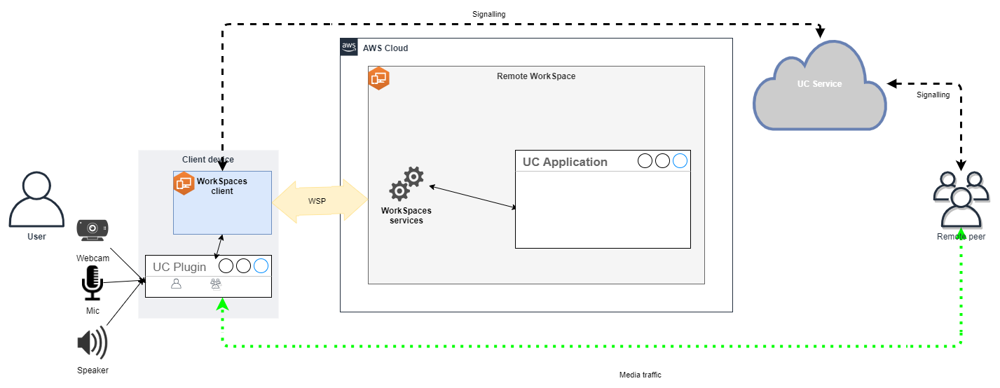
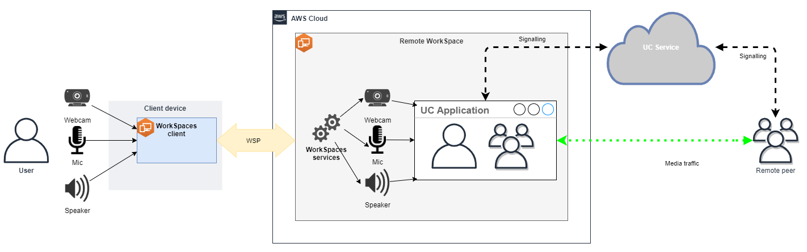
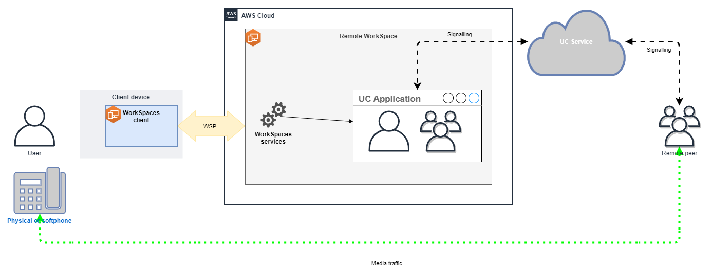

# Optimize WorkSpaces for real-time

communication in WorkSpaces Personal

Amazon WorkSpaces offers a diverse range of techniques to facilitate the deployment of Unified
Communication (UC) applications like Microsoft Teams, Zoom, Webex and others. In
contemporary application landscapes, most UC applications consist of a variety of features,
including 1:1 chat rooms, collaborative group chat channels, seamless file storage and
exchange, live events, webinars, broadcasts, interactive screen sharing and control,
whiteboarding, and offline audio/video messaging capabilities. Most of this functionality is
seamlessly available on WorkSpaces as standard features, without the need for additional
fine-tuning or enhancement. However, it's worth noting that real-time communication
elements, particularly one-on-one calling and collective group meetings, represent an
exception to this rule. The successful incorporation of such functionality frequently
demands dedicated focus and planning during the process of WorkSpaces deployment.

When planning your implementation of real-time communication functionalities of UC
applications on Amazon WorkSpaces, you have three distinct Real-Time Communication (RTC)
configuration modes to choose from. The selection of which depends on the specific
application or applications that you intend to provide to your users and the client devices
you plan to use.

This document focus on optimizing the user experience for the most common UC applications
in Amazon WorkSpaces. For WorkSpaces Core specific optimizations, please refer to the partner-specific
documentation.

###### Topics

- [Overview of media optimization
  modes](#media-optimization-modes-overview "#media-optimization-modes-overview")
- [Which RTC optimization mode to use?](#choosing-optimization-mode "#choosing-optimization-mode")
- [RTC Optimization Guidance](#rtc-optimization-guidance "#rtc-optimization-guidance")

## Overview of media optimization

modes

Following are the media optimization options available.

### Option 1: Media Optimized Real-Time

Communication (Media Optimized RTC)

In this mode, third-party UC and VoIP applications are executed on the remote
WorkSpace, while their media framework is offloaded to the supported client for
direct communication. The following UC applications use this approach on
Amazon WorkSpaces:

- [Zoom meetings](https://support.zoom.us/hc/en-us/articles/10372235268749-Using-Zoom-for-Amazon-WorkSpaces "https://support.zoom.us/hc/en-us/articles/10372235268749-Using-Zoom-for-Amazon-WorkSpaces")
- [Cisco Webex meetings](https://www.cisco.com/c/en/us/td/docs/voice_ip_comm/cloudCollaboration/wbxt/vdi/wbx-vdi-deployment-guide.html "https://www.cisco.com/c/en/us/td/docs/voice_ip_comm/cloudCollaboration/wbxt/vdi/wbx-vdi-deployment-guide.html")
- [Microsoft Teams 2.0 (Public Preview)](https://learn.microsoft.com/en-us/microsoftteams/vdi-2 "https://learn.microsoft.com/en-us/microsoftteams/vdi-2")

For Media Optimized RTC mode to function, the UC application vendor should develop
the integration with WorkSpaces using one of the available Software Development Kits
(SDK), such as the [DCV Extension SDK](../../../dcv/latest/extsdkguide/what-is.md "../../../dcv/latest/extsdkguide/what-is.md"). This mode
requires the UC components to be installed on the client device.

For more information about configuring this mode, see [Configure Media Optimized
RTC](#configure-media-optimized-rtc "#configure-media-optimized-rtc").

### Option 2: In-Session Optimized Real-Time

Communication (In-session Optimized RTC)

In this mode, the unaltered UC application runs on the WorkSpace, channeling audio
and video traffic via the DCV to the client device. Local audio
from the microphone and video stream from a webcam are redirected to the WorkSpace,
where they are consumed by the UC application. This mode provides broad application
compatibility and efficiently delivers the UC application from the remote WorkSpace
to a variety of client platforms. You don't need to deploy the UC application
components to the client device.

For more information about configuring this mode, see [Configure In-session Optimized
RTC](#configure-in-session-optimized-rtc "#configure-in-session-optimized-rtc").

### Option 3: Direct Real-Time Communication (Direct

RTC)

In this mode, the application operating within the WorkSpace takes control over
the physical or virtual telephone set located on the user's desk or client OS. This
results in the audio traffic traversing directly from the physical telephone at the
user's workstation or the virtual phone operating on the client device to the remote
call peer. Notable instances of applications functioning within this mode
encompass:

- [Amazon Connect Optimization for Amazon WorkSpaces](../../../whitepapers/latest/best-practices-deploying-amazon-workspaces/connect-optimization.md "../../../whitepapers/latest/best-practices-deploying-amazon-workspaces/connect-optimization.md")
- [Genesys Cloud WebRTC media helper](https://help.mypurecloud.com/articles/about-webrtc-media-helper/ "https://help.mypurecloud.com/articles/about-webrtc-media-helper/")
- [Microsoft Teams SIP Gateway](https://learn.microsoft.com/en-us/microsoftteams/sip-gateway-plan "https://learn.microsoft.com/en-us/microsoftteams/sip-gateway-plan")
- [Microsoft Teams Desk phones and Teams displays](https://www.microsoft.com/en-us/microsoft-teams/across-devices/devices/category/desk-phones-teams-displays/34 "https://www.microsoft.com/en-us/microsoft-teams/across-devices/devices/category/desk-phones-teams-displays/34")
- Participation in audio conferencing through the dial-in or "dial my phone"
  features of the UC application.

For more information about configuring this mode, see [Configure Direct RTC](#configure-direct-rtc "#configure-direct-rtc").

## Which RTC optimization mode to use?

Different RTC optimization modes can be employed concurrently or set up to complement
each other as a fallback. For instance, consider enabling Media Optimized RTC for Cisco
Webex meetings. This configuration ensures that users experience optimized communication
when accessing WorkSpace through a desktop client. However, in scenarios where Webex is
accessed from a shared internet kiosk lacking UC optimization components, Webex will
seamlessly transition to In-session Optimized RTC mode to maintain functionality. When
users engage with multiple UC applications, the RTC configuration modes may vary based
on their unique requirements.

The following table represents common UC application features and defines which RTC
configuration mode provides the best result.

| Feature                        | Direct RTC                          | Media Optimized RTC          | In-session Optimized RTC        |
| ------------------------------ | ----------------------------------- | ---------------------------- | ------------------------------- | ----------------------------------------------------------------------------------------------------------------------------------------------------------------------------------------------------------------------------------------------------------------------------------------------------------------------------------------------------------------------------------------------------------------------------------------------------------------------------------------------------------------------------------------------------------------------------------------------------------------------------------------------------------------------------------------------------------------------------------------------------------------------------------------------------------------------------------------------------------------------------------------------------------------------------------------------------------------------------------------------------------------------------------------------------------------------------------------------------------------------------------------------------------------------------------------------------------------------------------------------------------------------------------------------------------------------------------------------------------------------------------------------------------------------------------------------------------------------------------------------------------------------------------------------------------------------------------------------------------------------------------------------------------------------------------------------------------------------------------------------------------------------------------------------------------------------------------------------------------------------------------------------------------------------------------------------------------------------------------------------------------------------------------------------------------------------------------------------------------------------------------------------------------------------------------------------------------------------------------------------------------------------------------------------------------------------------------------------------------------------------------------------------------------------------------------------------------------------------------------------------------------------------------------------------------------------------------------------------------------------------------------------------------------------------------------------------------------------------------------------------------------------------------------------------------------------------------------------------------------------------------------------------------------------------------------------------------------------------------------------------------------------------------------------------------------------------------------------------------------------------------------------------------------------------------------------------------------------------------------------------------------------------------------------------------------------------------------------------------------------------------------------------------------------------------------------------------------------------------------------------------------------------------------------------------------------------------------------------------------------------------------------------------------------------------------------------------------------------------------------------------------------------------------------------------------------------------------------------------------------------------------------------------------------------------------------------------------------------------------------------------------------------------------------------------------------------------------------------------------------------------------------------------------------------------------------------------------------------------------------------------------------------------------------------------------------------------------------------------------------------------------------------------------------------------------------------------------------------------------------------------------------------------------------------------------------------------------------------------------------------------------------------------------------------------------------------------------------------------------------------------------------------------------------------------------------------------------------------------------------------------------------------------------------------------------------------------------------------------------------------------------------------------------------------------------------------------------------------------------------------------------------------------------------------------------------------------------------------------------------------------------------------------------------------- | --------------------------------- | ---------------------------------------------------------------------------------------------------------------------------------------------- | ------------------------------------------------------------------------------------------------------------------------------------------------------------------------------------------------------------------------------------------------------ | --------------------------------------------------------------------------------------------------------------------------------------------------------------------------------------------------------------------------------------------------------------------------------------------------------------------------------------------------------------------------------------------------------------------------------------------------------------------------------------------------------------------------------------------------------------------------------------------------------------------------------------------------------------------------------------------------------------------------------------------------------------------------------------------------------------------------------------------------------------------------------------------------------------------------------------------------------------------------------------------------------------------------------------------------------------------------------------------------------------------------------------------------------------------------------------------------------------------------------------------------------------------------------------------------------------------------------------------------------------------------------------------------------------------------------------------------------------------------------------------------------------------------------------------------------------------------------------------------------------------------------------------------------------------------------------------------------------------------------------------------------------------------------------------------------------------------------------------------------------------------------------------------------------------------------------------------------------------------------------------------------------------------------------------------------------------------------------------------------------------------------------------------------------------------------------------------------------------------------------------------------------------------------------------------------------------------------------------------------------------------------------------------------------------------------------------------------------------------------------------------------------------------------------------------------------------------------------------------------------------------------------------------------------------------------------------------------------------------------------------------------------------------------------------------------------------------------------------------------------------------------------------------------------------------------------------------------------------------------------------------------------------------------------------------------------------------------------------------------------------------------------------------------------------------------------------------------------------------------------------------------------------------------------------------------------------------------------------------------------------------------------------------------------------------------------------------------------------------------------------------------------------------------------------------------------------------------------------------------------------------------------------------------------------------------------------------------------------------------------------------------------------------------------------------------------------------------------------------------------------------------------------------------------------------------------------------------------------------------------------------------------------------------------------------------------------------------------------------------------------------------------------------------------------------------------------------------------------------------------------------------------------------------------------------------------------------------------------------------------------------------------------------------------------------------------------------------------------------------------------------------------------------------------------------------------------------------------------------------------------------------------------------------------------------------------------------------------------------------------------------------------------------------------------------------------------------------------------------------------------------------------------------------------------------------------------------------------------------------------------------------------------------------------------------------------------------------------------------------------------------------------------------------------------------------------------------------------------------------------------------------------------------------------------------------------------------------------------------------------------------------------------------------------------------------------------------------------------------------------------------------------------------------------------------------------------------------------------------------------------------------------------------------------------------------------------------------------------------------------------------------------------------------------------------------------------------------------------------------------------------------------------------------------------------------------------------------------------------------------------------------------------------------------------------------------------------------------------------------------------------------------------------------------------------------------------------------------------------------------------------------------------------------------------------------------------------------------------------------------------------------------------------------------------------------------------------------------------------------------------------------------------------------------------------------------------------------------------------------------------------------------------------------------------------------------------------------------------------------------------------------------------------------------------------------------------------------------------------------------------------------------------------------------------------------------------------------------------------------------------------------------------------------------------------------------------------------------------------------------- | ------------------------------------------------------------------------------------------------------------------------------------------------------------------------------------------------------------------------------------ | -------------------------------------------------------------------------------------------------------------------------------------------------------------------------------------------------------------------------------------------------------------------------------------------------------------------------------------------------------------------------------------------------------------------------------------------------------------------------------------------------------------------------------------------------------------------------------------------------------------------------------------------------------------------------------------------------------------------------------------------------------------------------------------------------------------------------------------------------------------------------------------------------------------------------------------------------------------------------------------------------------------------------------------------------------------------------------------------------------- |
| **1:1 chat**                   | Does not require RTC configuration  |                              | **Group chat rooms**            | Does not require RTC configuration                                                                                                                                                                                                                                                                                                                                                                                                                                                                                                                                                                                                                                                                                                                                                                                                                                                                                                                                                                                                                                                                                                                                                                                                                                                                                                                                                                                                                                                                                                                                                                                                                                                                                                                                                                                                                                                                                                                                                                                                                                                                                                                                                                                                                                                                                                                                                                                                                                                                                                                                                                                                                                                                                                                                                                                                                                                                                                                                                                                                                                                                                                                                                                                                                                                                                                                                                                                                                                                                                                                                                                                                                                                                                                                                                                                                                                                                                                                                                                                                                                                                                                                                                                                                                                                                                                                                                                                                                                                                                                                                                                                                                                                                                                                                                                                                                                                                                                                                                                                                                                                                                                                                                                                                                                                                    |
| **Group audio conferencing**   | Best                                | Best                         | Good                            |
| **Group video conferencing**   | Good                                | Best                         | Good                            |
| **1:1 audio calls**            | Best                                | Best                         | Good                            |
| **1:1 video calls**            | Good                                | Best                         | Good                            |
| **Whiteboarding**              | Does not require RTC configuration  |                              | **Audio/video clips/messaging** | Not applicable                                                                                                                                                                                                                                                                                                                                                                                                                                                                                                                                                                                                                                                                                                                                                                                                                                                                                                                                                                                                                                                                                                                                                                                                                                                                                                                                                                                                                                                                                                                                                                                                                                                                                                                                                                                                                                                                                                                                                                                                                                                                                                                                                                                                                                                                                                                                                                                                                                                                                                                                                                                                                                                                                                                                                                                                                                                                                                                                                                                                                                                                                                                                                                                                                                                                                                                                                                                                                                                                                                                                                                                                                                                                                                                                                                                                                                                                                                                                                                                                                                                                                                                                                                                                                                                                                                                                                                                                                                                                                                                                                                                                                                                                                                                                                                                                                                                                                                                                                                                                                                                                                                                                                                                                                                                                                        | Good                              | Best                                                                                                                                           |
| **File Sharing**               | Not applicable                      | Depends on UC application    | Best                            |
| **Screen sharing and control** | Not applicable                      | Depends on UC application    | Best                            |
| **Webinars/Broadcast events**  | Not applicable                      | Good                         | Best                            | ## RTC Optimization Guidance ### Configure Media Optimized RTC Media Optimized RTC mode is made possible by the UC application vendor use of the SDKs provided by Amazon. The architecture requires UC vendor to develop a UC-specific plugin or extension and deploy it to the client. The SDK, which includes publicly available options like the DCV Extension SDK and customized private versions, establishes a control channel between the UC application module operating within the WorkSpace and a plugin on the client side. Typically, this control channel instructs the client extension to initiate or join a call. Once the call is established through the client-side extension, the UC plugin captures audio from the microphone and video from the webcam, which are then transmitted directly to the UC cloud or a call peer. The incoming audio is played locally, and video is overlaid on the remote client UI. The control channel is responsible for communicating the call's status.  Amazon WorkSpaces currently supports following applications with Media Optimized RTC mode:  • [Zoom meetings](https://support.zoom.us/hc/en-us/articles/10372235268749-Using-Zoom-for-Amazon-WorkSpaces "https://support.zoom.us/hc/en-us/articles/10372235268749-Using-Zoom-for-Amazon-WorkSpaces") (for PCoIP and DCV WorkSpaces)  • [Cisco Webex meetings](https://www.cisco.com/c/en/us/td/docs/voice_ip_comm/cloudCollaboration/wbxt/vdi/wbx-vdi-deployment-guide.html "https://www.cisco.com/c/en/us/td/docs/voice_ip_comm/cloudCollaboration/wbxt/vdi/wbx-vdi-deployment-guide.html") (for DCV WorkSpaces only)  • [Microsoft Teams 2.0 (Public Preview)](https://learn.microsoft.com/en-us/microsoftteams/vdi-2 "https://learn.microsoft.com/en-us/microsoftteams/vdi-2") (for DCV WorkSpaces only) If you are using an application that is not on the list, it is advisable to engage the application vendor and request support for WorkSpaces Media Optimized RTC. To expedite this process, encourage them to contact [aws-av-offloading@amazon.com](mailto:aws-av-offloading@amazon.com "mailto:aws-av-offloading@amazon.com"). While Media Optimized RTC mode enhances call performance and minimizes WorkSpace resource utilization, it does possess certain limitations:  • The UC client extension must be installed on the client device.  • The UC client extension requires independent management and updates.  • UC client extensions might not be available on certain client platforms, such as, mobile platforms, or web clients.  • Some UC application functionalities could be constrained in this mode; for instance, screen sharing behavior might differ.  • Usage of client-side extensions might not be suitable for scenarios like Bring Your Own Device (BYOD) or shared kiosks. If Media Optimized RTC mode proves unsuitable for your environment or certain users are unable to install the client extension, configuring In-session Optimized RTC mode as a fallback option is recommended. ### Configure In-session Optimized RTC In the In-session Optimized RTC mode, the UC application operates on the WorkSpace without any modifications, providing a like-local experience. The audio and video streams generated by the application are captured by DCV and transmitted to the client side. At the client, the microphone (on both DCV and PCoIP WorkSpaces) and webcam (only on DCV WorkSpaces) signals are captured, redirected back to the WorkSpace, and seamlessly passed to the UC application. Notably, this option ensures exceptional compatibility, even with legacy applications, offering a cohesive user experience regardless of the application's origin. In-session optimization works with web client as well.  DCV has been meticulously optimized to enhance the performance of Remote RTC mode. The optimization measures encompass:  • Utilization of an Adaptive UDP-based QUIC transport, ensuring efficient data transmission.  • Establishment of a low-latency audio path, facilitating fast audio input and output.  • Implementation of voice-optimized audio codecs to maintain audio quality while reducing CPU and network utilization.  • Webcam redirection, enabling the integration of webcam functionalities.  • Configuration of webcam resolution to optimize performance.  • Integration of adaptive display codecs to balance speed and visual quality.  • Audio jitter correction, guaranteeing smooth audio transmission. These optimizations collectively contribute to a robust and fluid experience in Remote RTC mode. #### Sizing recommendations To effectively support Remote RTC mode, it's crucial to ensure proper sizing of Amazon WorkSpaces. The remote WorkSpace must meet or exceed the system requirements of the respective Unified Communication (UC) application. The following table outlines the minimum supported and recommended WorkSpaces configurations for popular UC applications when used for video and audio calls: |
|                                | Video calls                         | Audio calls                  |                                 |
| ---                            | ---                                 | ---                          | ---                             |
| Application                    | CPU requirements for RTC app        | RAM requirements for RTC app | Minimally supported WorkSpace   | Recommended WorkSpace                                                                                                                                                                                                                                                                                                                                                                                                                                                                                                                                                                                                                                                                                                                                                                                                                                                                                                                                                                                                                                                                                                                                                                                                                                                                                                                                                                                                                                                                                                                                                                                                                                                                                                                                                                                                                                                                                                                                                                                                                                                                                                                                                                                                                                                                                                                                                                                                                                                                                                                                                                                                                                                                                                                                                                                                                                                                                                                                                                                                                                                                                                                                                                                                                                                                                                                                                                                                                                                                                                                                                                                                                                                                                                                                                                                                                                                                                                                                                                                                                                                                                                                                                                                                                                                                                                                                                                                                                                                                                                                                                                                                                                                                                                                                                                                                                                                                                                                                                                                                                                                                                                                                                                                                                                                                                 | Minimally supported WorkSpace     | Recommended WorkSpace                                                                                                                          | Reference                                                                                                                                                                                                                                              |
| Microsoft Teams                | 2 core required, 4 core recommended | 4.0 GB RAM                   | Power (4 vCPU, 16 GB memory)    |  • PowerPro (8 vCPU, 32 GB memory)  • GeneralPurpose.4xlarge (16vCPU, 64 GB memory)  • GeneralPurpose.8xlarge (32vCPU, 128 GB memory)                                                                                                                                                                                                                                                                                                                                                                                                                                                                                                                                                                                                                                                                                                                                                                                                                                                                                                                                                                                                                                                                                                                                                                                                                                                                                                                                                                                                                                                                                                                                                                                                                                                                                                                                                                                                                                                                                                                                                                                                                                                                                                                                                                                                                                                                                                                                                                                                                                                                                                                                                                                                                                                                                                                                                                                                                                                                                                                                                                                                                                                                                                                                                                                                                                                                                                                                                                                                                                                                                                                                                                                                                                                                                                                                                                                                                                                                                                                                                                                                                                                                                                                                                                                                                                                                                                                                                                                                                                                                                                                                                                                                                                                                                                                                                                                                                                                                                                                                                                                                                                                                                                                                                        | Performance (2 vCPU, 8 GB memory) |  • PowerPro (8 vCPU, 32 GB memory)  • GeneralPurpose.4xlarge (16vCPU, 64 GB memory)  • GeneralPurpose.8xlarge (32vCPU, 128 GB memory) | [Hardware requirements for Microsoft Teams](https://learn.microsoft.com/en-us/microsoftteams/hardware-requirements-for-the-teams-app "https://learn.microsoft.com/en-us/microsoftteams/hardware-requirements-for-the-teams-app")                       |
| Zoom                           | 2 core required, 4 core recommended | 4.0 GB RAM                   | Power (4 vCPU, 16 GB memory)    |  • PowerPro (8 vCPU, 32 GB memory)  • GeneralPurpose.4xlarge (16vCPU, 64 GB memory)  • GeneralPurpose.8xlarge (32vCPU, 128 GB memory)                                                                                                                                                                                                                                                                                                                                                                                                                                                                                                                                                                                                                                                                                                                                                                                                                                                                                                                                                                                                                                                                                                                                                                                                                                                                                                                                                                                                                                                                                                                                                                                                                                                                                                                                                                                                                                                                                                                                                                                                                                                                                                                                                                                                                                                                                                                                                                                                                                                                                                                                                                                                                                                                                                                                                                                                                                                                                                                                                                                                                                                                                                                                                                                                                                                                                                                                                                                                                                                                                                                                                                                                                                                                                                                                                                                                                                                                                                                                                                                                                                                                                                                                                                                                                                                                                                                                                                                                                                                                                                                                                                                                                                                                                                                                                                                                                                                                                                                                                                                                                                                                                                                                                        | Performance (2 vCPU, 8 GB memory) |  • PowerPro (8 vCPU, 32 GB memory)  • GeneralPurpose.4xlarge (16vCPU, 64 GB memory)  • GeneralPurpose.8xlarge (32vCPU, 128 GB memory) | [Zoom system requirements: Windows, macOS, Linux](https://support.zoom.us/hc/en-us/articles/201362023-Zoom-system-requirements-Windows-macOS-Linux "https://support.zoom.us/hc/en-us/articles/201362023-Zoom-system-requirements-Windows-macOS-Linux") |
| Webex                          | 2 core required                     | 4.0 GB RAM                   | Power (4 vCPU, 16 GB memory)    |  • PowerPro (8 vCPU, 32 GB memory)  • GeneralPurpose.4xlarge (16vCPU, 64 GB memory)  • GeneralPurpose.8xlarge (32vCPU, 128 GB memory)                                                                                                                                                                                                                                                                                                                                                                                                                                                                                                                                                                                                                                                                                                                                                                                                                                                                                                                                                                                                                                                                                                                                                                                                                                                                                                                                                                                                                                                                                                                                                                                                                                                                                                                                                                                                                                                                                                                                                                                                                                                                                                                                                                                                                                                                                                                                                                                                                                                                                                                                                                                                                                                                                                                                                                                                                                                                                                                                                                                                                                                                                                                                                                                                                                                                                                                                                                                                                                                                                                                                                                                                                                                                                                                                                                                                                                                                                                                                                                                                                                                                                                                                                                                                                                                                                                                                                                                                                                                                                                                                                                                                                                                                                                                                                                                                                                                                                                                                                                                                                                                                                                                                                        | Performance (2 vCPU, 8 GB memory) |  • PowerPro (8 vCPU, 32 GB memory)  • GeneralPurpose.4xlarge (16vCPU, 64 GB memory)  • GeneralPurpose.8xlarge (32vCPU, 128 GB memory) | [System requirements for Webex services](https://help.webex.com/en-us/article/fz1e4b/System-requirements-for-Webex-services "https://help.webex.com/en-us/article/fz1e4b/System-requirements-for-Webex-services")                                      | It's important to note that video conferencing involves significant resource usage for video encoding and decoding. In physical machine scenarios, these tasks are offloaded to the GPU. In non-GPU WorkSpaces, these tasks are performed on the CPU in parallel with remote protocol encoding. Therefore, for users regularly engaged in video streaming or video calls, opting for the PowerPro or higher configuration is highly recommended. Screen sharing also consumes notable resources, with resource consumption increasing with higher resolutions. As result, on non-GPU WorkSpaces, screen sharing is often limited to a lower frame rate. #### Leverage the UDP-based QUIC transport with DCV UDP transport is particularly well-suited for transmitting RTC applications. To maximize efficiency, ensure that your network is set up to utilize QUIC transport for DCV. Note that UDP-based transport is available with native clients only. #### Configure UC application for WorkSpaces For enhanced video processing capabilities, such as background blur, virtual backgrounds, reactions, or hosting live events, opting for a GPU-enabled WorkSpace is essential to achieve optimal performance. Most of the UC applications provide guidance to disable advanced video processing to reduce CPU utilization on non-GPU WorkSpaces. For more information, refer to the following resources.  • Microsoft Teams: [Teams for Virtualized Desktop Infrastructure](https://https://learn.microsoft.com/en-us/microsoftteams/vdi-2 "https://https://learn.microsoft.com/en-us/microsoftteams/vdi-2")  • Zoom Meetings: [Managing the user experience for incompatible VDI plugins](https://support.zoom.us/hc/en-us/articles/4411856902285-Managing-the-user-experience-for-incompatible-VDI-plugins- "https://support.zoom.us/hc/en-us/articles/4411856902285-Managing-the-user-experience-for-incompatible-VDI-plugins-")  • Webex: [Deployment guide for Webex App for Virtual Desktop Infrastructure (VDI) - Manage and troubleshoot Webex App for VDI [Webex App]](https://www.cisco.com/c/en/us/td/docs/voice_ip_comm/cloudCollaboration/wbxt/vdi/wbx-vdi-deployment-guide/manage-teams-vdi.html#id_138538 "https://www.cisco.com/c/en/us/td/docs/voice_ip_comm/cloudCollaboration/wbxt/vdi/wbx-vdi-deployment-guide/manage-teams-vdi.html#id_138538")  • Google Meet: [Using VDI](https://support.google.com/a/answer/1279090?hl=en#VDI "https://support.google.com/a/answer/1279090?hl=en#VDI") #### Enable bi-directional audio and webcam redirection Amazon WorkSpaces inherently support audio-in, audio-out, and camera redirection through video-in by default. However, if these features have been disabled for any specific reasons, you can follow the provided guidance to re-enable redirection. For more information, refer to [Enable or disable video-in redirection for DCV](group_policy.md#gp_video_in_wsp "group_policy.md#gp_video_in_wsp") in the _Amazon WorkSpaces Administration Guide_. Users need to select the camera they want to use in session after connecting. For more information, users should refer to [Webcams and other video devices](../userguide/peripheral_devices.md#devices-webcams "../userguide/peripheral_devices.md#devices-webcams") in the _Amazon WorkSpaces User Guide_. #### Limit maximum webcam resolution For users employing Power, PowerPro, GeneralPurpose.4xlarge, or GeneralPurpose.8xlarge WorkSpaces for video conferencing, it is strongly recommended to restrict the maximum resolution of redirected webcams. In the case of PowerPro, GeneralPurpose.4xlarge, or GeneralPurpose.8xlarge, the recommended maximum resolution is 640 pixels in width by 480 pixels in height. For Power, the recommended maximum resolution is 320 pixels in width by 240 pixels in height. Complete the following steps to configure the maximum webcam resolution. 1. Open the Windows Registry Editor. 2. Navigate to the following registry path: `HKEY_USERS/S-1-5-18/Software/GSettings/com/nicesoftware/dcv/webcam` 3. Create a string value named `max-resolution` and set it to the desired resolution in the `(X,Y)` format, where `X` represents the horizontal pixel count (width) and `Y` represents the vertical pixel count (height). For example, specify `(640,480)`) to represent a resolution that is 640 pixels in width and 480 pixel in height. #### Enable voice-optimized audio configuration By default, WorkSpaces are set to deliver 7.1 high-fidelity audio from WorkSpaces to the client, ensuring superior music playback quality. However, if your primary use case involves audio or video conferencing, modifying the audio codec profile to a voice-optimized setting can conserve CPU and network resources. Complete the following steps to set the audio profile to voice optimized. 1. Open the Windows Registry Editor. 2. Navigate to the following registry path: `HKEY_USERS/S-1-5-18/Software/GSettings/com/nicesoftware/dcv/audio` 3. Create a string value name `default-profile` and set it to `voice`. #### Use good quality headsets for audio and video calls To enhance the audio experience and prevent echo, it's crucial to utilize high-quality headsets. Utilizing desktop speakers can lead to echo issues on the remote end of the call. ### Configure Direct RTC The configuration of Direct RTC mode depends on the specific Unified Communication (UC) application and does not necessitate any changes in the WorkSpaces configuration. The following list offers a non-exhaustive compilation of optimizations for various UC applications.   • Microsoft Teams: + [Plan for SIP Gateway](https://learn.microsoft.com/en-us/microsoftteams/sip-gateway-plan "https://learn.microsoft.com/en-us/microsoftteams/sip-gateway-plan") + [Audio Conferencing in Microsoft 365](https://learn.microsoft.com/en-us/microsoftteams/audio-conferencing-in-office-365 "https://learn.microsoft.com/en-us/microsoftteams/audio-conferencing-in-office-365") + [Plan your Teams voice solution](https://learn.microsoft.com/en-us/microsoftteams/cloud-voice-landing-page "https://learn.microsoft.com/en-us/microsoftteams/cloud-voice-landing-page")  • Zoom Meetings: + [Enabling or disabling toll call dial-in numbers](https://support.zoom.us/hc/en-us/articles/360060920371-Enabling-or-disabling-toll-call-dial-in-numbers "https://support.zoom.us/hc/en-us/articles/360060920371-Enabling-or-disabling-toll-call-dial-in-numbers") + [Using desk phone call control](https://support.zoom.us/hc/en-us/articles/4912628206477-Using-desk-phone-call-control "https://support.zoom.us/hc/en-us/articles/4912628206477-Using-desk-phone-call-control") + [Desk phone companion mode](https://support.zoom.us/hc/en-us/articles/360049007912-Desk-phone-companion-mode "https://support.zoom.us/hc/en-us/articles/360049007912-Desk-phone-companion-mode")  • Webex: + [Webex App | Make calls with your desk phone](https://help.webex.com/en-us/article/5mgmmb/Webex-App-%7C-Make-calls-with-your-desk-phone "https://help.webex.com/en-us/article/5mgmmb/Webex-App-%7C-Make-calls-with-your-desk-phone") + [Webex App | Supported calling options](https://help.webex.com/en-us/article/xga73p/Webex-App-%7C-Supported-calling-options "https://help.webex.com/en-us/article/xga73p/Webex-App-%7C-Supported-calling-options")  • BlueJeans: + [Dialing into a Meeting from a Desk Telephone](https://support.bluejeans.com/s/article/Dialing-into-a-meeting-from-a-Desk-Telephone "https://support.bluejeans.com/s/article/Dialing-into-a-meeting-from-a-Desk-Telephone")  • Genesys: + [Genesys Cloud WebRTC media helper](https://help.mypurecloud.com/articles/about-webrtc-media-helper/ "https://help.mypurecloud.com/articles/about-webrtc-media-helper/")  • Amazon Connect: + [Amazon Connect Optimization for Amazon WorkSpaces](../../../whitepapers/latest/best-practices-deploying-amazon-workspaces/connect-optimization.md "../../../whitepapers/latest/best-practices-deploying-amazon-workspaces/connect-optimization.md")  • Google Meet: + [Use a phone for audio in a video meeting](https://support.google.com/meet/answer/9518557?hl=en "https://support.google.com/meet/answer/9518557?hl=en") |
