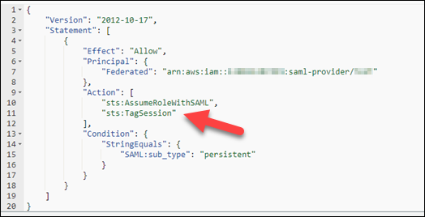

# Configure SAML 2.0 and create a WorkSpaces Pools

directory

You can enable WorkSpaces client application registration and signing in to WorkSpaces in a
WorkSpaces Pool by setting up identity federation using SAML 2.0. To do this, you use an
AWS Identity and Access Management (IAM) role and a relay state URL to configure your SAML 2.0 identity provider
(IdP) and enable it for AWS. This grants your federated users access to a WorkSpace Pool
directory. The relay state is the WorkSpaces directory endpoint to which users are forwarded
after successfully signing in to AWS.

###### Important

WorkSpaces Pools doesn't support IP-based SAML 2.0 configurations.

###### Topics

- [Step 1: Consider the
  requirements](#saml-directory-consider-the-requirements "#saml-directory-consider-the-requirements")
- [Step 2: Complete the
  prerequisites](#saml-directory-complete-the-prereqs "#saml-directory-complete-the-prereqs")
- [Step 3: Create a SAML identity provider
  in IAM](#saml-directory-create-saml-idp "#saml-directory-create-saml-idp")
- [Step 4: Create
  WorkSpace Pool directory](#saml-directory-create-wsp-pools-directory "#saml-directory-create-wsp-pools-directory")
- [Step 5: Create a SAML 2.0
  federation IAM role](#saml-directory-saml-federation-role-in-iam "#saml-directory-saml-federation-role-in-iam")
- [Step 6: Configure your SAML 2.0
  identity provider](#saml-directory-configure-saml-idp "#saml-directory-configure-saml-idp")
- [Step 7: Create assertions for the
  SAML authentication response](#saml-directory-create-assertions "#saml-directory-create-assertions")
- [Step 8: Configure the relay state
  of your federation](#saml-directory-configure-relay-state "#saml-directory-configure-relay-state")
- [Step 9: Enable integration with
  SAML 2.0 on your WorkSpace Pool directory](#saml-directory-enable-saml-integration "#saml-directory-enable-saml-integration")
- [Troubleshooting](#saml-pools-troubleshooting "#saml-pools-troubleshooting")
- [Specify Active Directory details for your
  WorkSpaces Pools directory](pools-service-account-details.md "pools-service-account-details.md")

## Step 1: Consider the

requirements

The following requirements apply when setting up SAML for a WorkSpaces Pools
directory.

- The workspaces_DefaultRole IAM role must exist in your AWS account. This
  role is automatically created when you use the WorkSpaces Quick Setup or if you
  previously launched a WorkSpace using the AWS Management Console. It grants Amazon WorkSpaces
  permission to access specific AWS resources on your behalf. If the role
  already exists, you might need to attach the AmazonWorkSpacesPoolServiceAccess
  managed policy to it, which Amazon WorkSpaces uses to access required resources in the
  AWS account for WorkSpaces Pools. For more information, see [Create the workspaces_DefaultRole Role](workspaces-access-control.md#create-default-role "workspaces-access-control.md#create-default-role") and
  [AWS managed policy:
  AmazonWorkSpacesPoolServiceAccess](managed-policies.md#workspaces-pools-service-access "managed-policies.md#workspaces-pools-service-access").
- You can configure SAML 2.0 authentication for WorkSpaces Pools in the
  AWS Regions that support the feature. For more information, see [AWS Regions and Availability Zones for
  WorkSpaces Pools](wsp-pools-regions.md "wsp-pools-regions.md").
- To use SAML 2.0 authentication with WorkSpaces, the IdP must support
  unsolicited IdP-initiated SSO with a deep link target resource or relay state
  endpoint URL. Examples of IdPs that support this include ADFS, Azure AD, Duo
  Single Sign-On, Okta, PingFederate, and PingOne. Consult your IdP documentation
  for more information.
- SAML 2.0 authentication is supported only on the following WorkSpaces clients.
  For the latest WorkSpaces clients, see the [Amazon WorkSpaces Client Download
  page](https://clients.amazonworkspaces.com/ "https://clients.amazonworkspaces.com/").
  - Windows client application version 5.20.0 or later
  - macOS client version 5.20.0 or later
  - Web Access

## Step 2: Complete the

prerequisites

Complete the following prerequisites before configuring your SAML 2.0 IdP connection
to a WorkSpaces Pool directory.

- Configure your IdP to establish a trust relationship with AWS.
- See [Integrating third-party SAML solution providers with AWS](../../../IAM/latest/UserGuide/id_roles_providers_saml_3rd-party.md "../../../IAM/latest/UserGuide/id_roles_providers_saml_3rd-party.md") for more
  information on configuring AWS federation. Relevant examples include IdP
  integration with IAM to access the AWS Management Console.
- Use your IdP to generate and download a federation metadata document that
  describes your organization as an IdP. This signed XML document is used to
  establish the relying party trust. Save this file to a location that you can
  access from the IAM console later.
- Create a WorkSpaces Pool directory by using the WorkSpaces console. For more
  information, see [Using Active Directory with WorkSpaces Pools](active-directory.md "active-directory.md").
- Create a WorkSpaces Pool for users who can sign in to the IdP using a supported
  directory type. For more information, see [Create a WorkSpaces Pool](set-up-pools-create.md "set-up-pools-create.md").

## Step 3: Create a SAML identity provider

in IAM

To get started, you must create a SAML IdP in IAM. This IdP defines your
organization's IdP-to-AWS trust relationship using the metadata document generated by
the IdP software in your organization. For more information, see [Creating and managing a SAML identity provider](../../../IAM/latest/UserGuide/id_roles_providers_create_saml.md#idp-manage-identityprovider-console "../../../IAM/latest/UserGuide/id_roles_providers_create_saml.md#idp-manage-identityprovider-console") in the _AWS Identity and Access Management
User Guide_. For information about working with SAML IdPs in
AWS GovCloud (US) Regions, see [AWS Identity and Access Management](../../../govcloud-us/latest/UserGuide/govcloud-iam.md "../../../govcloud-us/latest/UserGuide/govcloud-iam.md") in the
_AWS GovCloud (US) User Guide_.

## Step 4: Create

WorkSpace Pool directory

Complete the following procedure to create a WorkSpaces Pool directory.

1. Open the WorkSpaces console at [https://console.aws.amazon.com/workspaces/v2/home](https://console.aws.amazon.com/workspaces/v2/home "https://console.aws.amazon.com/workspaces/v2/home").
2. Choose **Directories** in the navigation pane.
3. Choose **Create directory**.
4. For **WorkSpace type**, choose **Pool**.
5. In the **User identity source** section of the page:
   1. Enter a placeholder value into the **User access
      URL** text box. For example, enter `placeholder`
      into the text box. You will edit this later after setting up the
      application entitlement in your IdP.
   2. Leave the **Relay state parameter name** text box
      blank. You will edit this later after setting up the application
      entitlement in your IdP.

6. In the **Directory information** section of the page, enter
   a name and a description for the directory. The directory name and description
   must be less than 128 characters, can contain alphanumeric characters and the
   following special characters: `_ @ # % * + = : ? . / ! \ -`. The
   directory name and description cannot start with a special character.
7. In the **Networking and security** section of the
   page:
   1. Choose a VPC and 2 subnets that have access to the network resources
      that your application needs. For increased fault tolerance, you should
      choose two subnets in different Availability Zones.
   2. Choose a security group that allows WorkSpaces to create network links in
      your VPC. Security groups control what network traffic is allowed to flow
      from WorkSpaces to your VPC. For example, if your security group restricts all
      inbound HTTPS connections, users accessing your web portal won't be able
      to load HTTPS websites from the WorkSpaces.

8. The **Active Directory Config** section is optional.
   However, you should specify your Active Directory (AD) details during the
   creation of your WorkSpaces Pools directory if you plan to use an AD with your
   WorkSpaces Pools. You can't edit the **Active Directory Config** for
   your WorkSpaces Pools directory after you create it. For more information about
   specifying your AD details for your WorkSpaces Pool directory, see [Specify Active Directory details for your
   WorkSpaces Pools directory](pools-service-account-details.md "pools-service-account-details.md"). After you complete the
   process outlined in that topic, you should return to this topic to finish
   creating your WorkSpaces Pools directory.

You can skip the **Active Directory Config** section if you
don't plan on using an AD with your WorkSpaces Pools. 9. In the **Streaming properties** section of the page:

    * Choose the clipboard permissions behavior, and enter a copy to local
     character limit (optional), and paste to remote session character limit
     (optional).
    * Choose to allow or not allow print to local device.
    * Choose to allow or not allow diagnostic logging.
    * Choose to allow or not allow smart card sign in. This feature applies
     only if you enabled AD configuration earlier in this procedure.

10. In the **Storage** section of the page, you can choose to
    enable home folders.
11. In the **IAM role section** of the page, choose an IAM
    role to be available to all desktop streaming instances. To create a new one,
    choose **Create new IAM role**.

When you apply an IAM role from your account to a WorkSpace Pool
directory, you can make AWS API requests from a WorkSpace in the
WorkSpace Pool without manually managing AWS credentials. For more
information, see [Creating a role to
delegate permissions to an IAM user](../../../IAM/latest/UserGuide/id_roles_create_for-user.md "../../../IAM/latest/UserGuide/id_roles_create_for-user.md") in _AWS Identity and Access Management User
Guide_. 12. Choose **Create directory**.

## Step 5: Create a SAML 2.0

federation IAM role

Complete the following procedure to create a SAML 2.0 federation IAM role in the
IAM console.

1. Open the IAM console at [https://console.aws.amazon.com/iam/](https://console.aws.amazon.com/secretsmanager/ "https://console.aws.amazon.com/secretsmanager/").
2. Choose **Roles** in the navigation pane.
3. Choose Create role.
4. Choose **SAML 2.0 federation** for the trusted entity
   type.
5. For SAML 2.0-based provider, choose the identity provider you created in
   IAM. For more information, see [Create a
   SAML identity provider in IAM](../../../IAM/latest/UserGuide/id_roles_providers_create_saml.md "../../../IAM/latest/UserGuide/id_roles_providers_create_saml.md").
6. Choose **Allow programmatic access only** for the access to
   be allowed.
7. Choose **SAML:sub_type** for the attribute.
8. For **Value**, enter `https://signin.aws.amazon.com/saml`.
   This value restricts role
   access to SAML user streaming requests that include a SAML subject type
   assertion with a value of `persistent`. If the SAML:sub_type is
   persistent, your IdP sends the same unique value for the `NameID`
   element in all SAML requests from a particular user. For more information, see
   [Uniquely identifying users in SAML-based federation](../../../IAM/latest/UserGuide/id_roles_providers_saml.md#CreatingSAML-userid "../../../IAM/latest/UserGuide/id_roles_providers_saml.md#CreatingSAML-userid") in
   _AWS Identity and Access Management User Guide_.
9. Choose **Next** to continue.
10. Don't make changes or selections in the **Add permissions**
    page. Choose **Next** to continue.
11. Enter a name and a description for the role.
12. Choose **Create role**.
13. In the **Roles** page, choose the role you must
    created.
14. Choose the **Trust relationships** tab.
15. Choose **Edit trust policy**.
16. In the **Edit trust policy** JSON text box, add the
    **sts:TagSession** action to the trust policy. For more
    information, see [Passing session tags in
    AWS STS](../../../IAM/latest/UserGuide/id_session-tags.md "../../../IAM/latest/UserGuide/id_session-tags.md") in _AWS Identity and Access Management User Guide_.

The result should look like the following example.

 17. Choose **Update policy**. 18. Choose the **Permissions** tab. 19. In the **Permissions policies** section of the page choose
**Add permissions** and then choose **Create inline
policy**. 20. In the **Policy editor** section of the page, choose
**JSON**. 21. In the **Policy editor** JSON text box, enter the following
policy. Be sure to replace:

    * `<region-code>` with the code of the
     AWS Region in which you created your WorkSpace Pool directory.
    * `<account-id>` with the AWS account
     ID.
    * `<directory-id>` with the ID of the
     directory you created earlier. You can get this in the WorkSpaces
     console.

For resources in AWS GovCloud (US) Regions, use the following format for the
ARN:
`arn:aws-us-gov:workspaces:`<region-code>`:`<account-id>`:directory/`<directory-id>``. 22. Choose Next. 23. Enter a name for the policy, and then choose **Create
policy**.

## Step 6: Configure your SAML 2.0

identity provider

Depending on your SAML 2.0 IdP, you might need to manually update your IdP to trust
AWS as a service provider. You do this by downloading the
`saml-metadata.xml` file found at [https://signin.aws.amazon.com/static/saml-metadata.xml](https://signin.aws.amazon.com/static/saml-metadata.xml "https://signin.aws.amazon.com/static/saml-metadata.xml"), and then uploading
it to your IdP. This updates your IdP’s metadata.

For some IdPs, the update might already be configured. You can skip this step if
it's already configured. If the update isn't already configured in your IdP, review
the documentation provided by your IdP for information about how to update the
metadata. Some providers give you the option to type the URL of the XML file into
their dashboard, and the IdP obtains and installs the file for you. Others require
you to download the file from the URL and then upload it to their dashboard.

###### Important

At this time, you can also authorize users in your IdP to access the WorkSpaces
application you have configured in your IdP. Users who are authorized to access
the WorkSpaces application for your directory don't automatically have a WorkSpace
created for them. Likewise, users that have a WorkSpace created for them are not
automatically authorized to access the WorkSpaces application. To successfully connect
to a WorkSpace using SAML 2.0 authentication, a user must be authorized by the IdP
and must have a WorkSpace created.

## Step 7: Create assertions for the

SAML authentication response

Configure the information that your IdP sends to AWS as SAML attributes in its
authentication response. Depending on your IdP, this is might already be configured. You
can skip this step if it's already configured. If it's not already configured, provide
the following:

- **SAML Subject NameID** — The unique
  identifier for the user who is signing in. Don't change the format/value of
  this field. Otherwise, the home folder feature will not work as expected
  because the user will be treated as different user.

###### Note

For domain-joined WorkSpaces Pools, the `NameID` value for the user
must be provided in the `domain\username` format using the
`sAMAccountName`, or in the `username@domain.com`
format using `userPrincipalName`, or just `userName`.
If you are using the `sAMAccountName` format, you can specify the
domain by using either the NetBIOS name or the fully qualified domain name
(FQDN). The `sAMAccountName` format is required for Active
Directory one-way trust scenarios. For more information, see [Using Active Directory with WorkSpaces Pools](active-directory.md "active-directory.md"). if just
`userName` is provided, the user will be logged in to the
primary-domain

- **SAML Subject Type (with a value set to
  `persistent`)** — Setting the value to
  `persistent` ensures that your IdP sends the same unique value
  for the `NameID` element in all SAML requests from a particular
  user. Make sure that your IAM policy includes a condition to only allow SAML
  requests with a SAML `sub_type` set to `persistent`, as
  described in the [Step 5: Create a SAML 2.0
  federation IAM role](#saml-directory-saml-federation-role-in-iam "#saml-directory-saml-federation-role-in-iam") section.
- **`Attribute` element with the
  `Name` attribute set to
  https://aws.amazon.com/SAML/Attributes/Role** — This element
  contains one or more `AttributeValue` elements that list the IAM
  role and SAML IdP to which the user is mapped by your IdP. The role and IdP are
  specified as a comma-delimited pair of ARNs. An example of the expected value
  is
  `arn:aws:iam::`<account-id>`:role/`<role-name>`,arn:aws:iam::`<account-id>`:saml-provider/`<provider-name>``.
- **`Attribute` element with the
  `Name` attribute set to
  https://aws.amazon.com/SAML/Attributes/RoleSessionName** —
  This element contains one `AttributeValue` element that provides an
  identifier for the AWS temporary credentials that are issued for SSO. The
  value in the `AttributeValue` element must be between 2 and 64
  characters long, can contain alphanumeric characters and the following special
  characters: `_ . : / = + - @`. It can't contain spaces. The value is
  typically an email address or a user principal name (UPN). It shouldn't be a
  value that includes a space, such as a user's display name.
- **`Attribute` element with the
  `Name` attribute set to
  https://aws.amazon.com/SAML/Attributes/PrincipalTag:Email**
  — This element contains one `AttributeValue` element that
  provides the email address of the user. The value must match the WorkSpaces user
  email address as defined in the WorkSpaces directory. Tag values may include
  combinations of letters, numbers, spaces, and `_ . : / = + - @`
  characters. For more information, see [Rules for tagging in
  IAM and AWS STS](../../../IAM/latest/UserGuide/id_tags.md#id_tags_rules "../../../IAM/latest/UserGuide/id_tags.md#id_tags_rules") in the _AWS Identity and Access Management User
  Guide_.
- (Optional) **`Attribute` element with the
  `Name` attribute set to
  https://aws.amazon.com/SAML/Attributes/PrincipalTag:UserPrincipalName**
  — This element contains one `AttributeValue` element that
  provides the Active Directory `userPrincipalName` for the user who
  is signing in. The value must be provided in the
  `username@domain.com` format. This parameter is used with
  certificate-based authentication as the Subject Alternative Name in the end
  user certificate. For more information, see [Certificate-based authentication and WorkSpaces Personal](certificate-based-authentication.md "certificate-based-authentication.md").
- (Optional) **`Attribute` element with the
  `Name` attribute set to
  https://aws.amazon.com/SAML/Attributes/PrincipalTag:ObjectSid (optional)** — This element contains one `AttributeValue`
  element that provides the Active Directory security identifier (SID) for the
  user who is signing in. This parameter is used with certificate-based
  authentication to enable strong mapping to the Active Directory user. For more
  information, see [Certificate-based authentication and WorkSpaces Personal](certificate-based-authentication.md "certificate-based-authentication.md").
- (Optional) **`Attribute` element with the
  `Name` attribute set to
  https://aws.amazon.com/SAML/Attributes/PrincipalTag:Domain**
  — This element contains one `AttributeValue` element that
  provides the Active Directory DNS fully qualified domain name (FQDN) for users
  signing in. This parameter is used with certificate-based authentication when
  the Active Directory `userPrincipalName` for the user contains an
  alternative suffix. The value must be provided in the `domain.com`
  format, and must include any subdomains.
- (Optional) **`Attribute` element with the
  `Name` attribute set to
  https://aws.amazon.com/SAML/Attributes/SessionDuration** —
  This element contains one `AttributeValue` element that specifies
  the maximum amount of time that a federated streaming session for a user can
  remain active before re-authentication is required. The default value is
  `3600` seconds (60 minutes). For more information, see the [SAML SessionDurationAttribute](../../../IAM/latest/UserGuide/id_roles_providers_create_saml_assertions.md#saml_role-session-duration "../../../IAM/latest/UserGuide/id_roles_providers_create_saml_assertions.md#saml_role-session-duration") in the _AWS Identity and Access Management User
  Guide_.

###### Note

Although `SessionDuration` is an optional attribute, we
recommend that you include it in the SAML response. If you don't specify
this attribute, the session duration is set to a default value of
`3600` seconds (60 minutes). WorkSpaces desktop sessions are
disconnected after their session duration expires.

For more information about how to configure these elements, see [Configuring SAML assertions for the authentication response](../../../IAM/latest/UserGuide/id_roles_providers_create_saml_assertions.md "../../../IAM/latest/UserGuide/id_roles_providers_create_saml_assertions.md") in the
_AWS Identity and Access Management User Guide_. For information about specific
configuration requirements for your IdP, see your IdP's documentation.

## Step 8: Configure the relay state

of your federation

Use your IdP to configure the relay state of your federation to point to the
WorkSpaces Pool directory relay state URL. After successful authentication by AWS, the user
is directed to the WorkSpaces Pool directory endpoint, defined as the relay state in the SAML
authentication response.

The following is the relay state URL format:

```

https://relay-state-region-endpoint/sso-idp?registrationCode=registration-code

```

The following table lists the relay state endpoints for the AWS Regions where
WorkSpaces SAML 2.0 authentication is available. AWS Regions in which the WorkSpaces Pools
feature is not available have been removed.

| Region                           | Relay state endpoint                                                                                                                                                                                                                                                                                                                                                                                                  |
| -------------------------------- | --------------------------------------------------------------------------------------------------------------------------------------------------------------------------------------------------------------------------------------------------------------------------------------------------------------------------------------------------------------------------------------------------------------------- |
| US East (N. Virginia) Region     | • workspaces.euc-sso.us-east-1.aws.amazon.com<br>• (FIPS) workspaces.euc-sso-fips.us-east-1.aws.amazon.com                                                                                                                                                                                                                                                                                                            |
| US West (Oregon) Region          | • workspaces.euc-sso.us-west-2.aws.amazon.com<br>• (FIPS) workspaces.euc-sso-fips.us-west-2.aws.amazon.com                                                                                                                                                                                                                                                                                                            |
| Asia Pacific (Mumbai) Region     | workspaces.euc-sso.ap-south-1.aws.amazon.com                                                                                                                                                                                                                                                                                                                                                                          |
| Asia Pacific (Seoul) Region      | workspaces.euc-sso.ap-northeast-2.aws.amazon.com                                                                                                                                                                                                                                                                                                                                                                      |
| Asia Pacific (Singapore) Region  | workspaces.euc-sso.ap-southeast-1.aws.amazon.com                                                                                                                                                                                                                                                                                                                                                                      |
| Asia Pacific (Sydney) Region     | workspaces.euc-sso.ap-southeast-2.aws.amazon.com                                                                                                                                                                                                                                                                                                                                                                      |
| Asia Pacific (Tokyo) Region      | workspaces.euc-sso.ap-northeast-1.aws.amazon.com                                                                                                                                                                                                                                                                                                                                                                      |
| Canada (Central) Region          | workspaces.euc-sso.ca-central-1.aws.amazon.com                                                                                                                                                                                                                                                                                                                                                                        |
| Europe (Frankfurt) Region        | workspaces.euc-sso.eu-central-1.aws.amazon.com                                                                                                                                                                                                                                                                                                                                                                        |
| Europe (Ireland) Region          | workspaces.euc-sso.eu-west-1.aws.amazon.com                                                                                                                                                                                                                                                                                                                                                                           |
| Europe (London) Region           | workspaces.euc-sso.eu-west-2.aws.amazon.com                                                                                                                                                                                                                                                                                                                                                                           |
| South America (São Paulo) Region | workspaces.euc-sso.sa-east-1.aws.amazon.com                                                                                                                                                                                                                                                                                                                                                                           |
| AWS GovCloud (US-West)           | • workspaces.euc-sso.us-gov-west-1.amazonaws-us-gov.com<br>• (FIPS)<br>workspaces.euc-sso-fips.us-gov-west-1.amazonaws-us-gov.com<br>NoteFor information about working with SAML IdPs in<br>AWS GovCloud (US) Regions, see [Amazon WorkSpaces](../../../govcloud-us/latest/UserGuide/govcloud-workspaces.md "../../../govcloud-us/latest/UserGuide/govcloud-workspaces.md") in the _AWS GovCloud (US) User<br>Guide_. |
| AWS GovCloud (US-East)           | • workspaces.euc-sso.us-gov-east-1.amazonaws-us-gov.com<br>• (FIPS)<br>workspaces.euc-sso-fips.us-gov-east-1.amazonaws-us-gov.com<br>NoteFor information about working with SAML IdPs in<br>AWS GovCloud (US) Regions, see [Amazon WorkSpaces](../../../govcloud-us/latest/UserGuide/govcloud-workspaces.md "../../../govcloud-us/latest/UserGuide/govcloud-workspaces.md") in the _AWS GovCloud (US) User<br>Guide_. |

## Step 9: Enable integration with

SAML 2.0 on your WorkSpace Pool directory

Complete the following procedure to enable SAML 2.0 authentication for the WorkSpaces Pool
directory.

1. Open the WorkSpaces console at [https://console.aws.amazon.com/workspaces/v2/home](https://console.aws.amazon.com/workspaces/v2/home "https://console.aws.amazon.com/workspaces/v2/home").
2. Choose **Directories** in the navigation pane.
3. Choose the **Pools directories** tab.
4. Choose the ID of the directory you want to edit.
5. Choose **Edit** in the **Authentication**
   section of the page.
6. Choose **Edit SAML 2.0 Identity Provider**.
7. For the **User Access URL**, which is sometimes know as the
   "SSO URL", replace the placeholder value with the SSO URL provided to you by
   your IdP.
8. For the **IdP deep link parameter name**, enter the
   parameter that is applicable to your IdP and the application you have
   configured. The default value is `RelayState` if you omit the
   parameter name.

The following table lists the user access URLs and deep link parameter names
that are unique to various identity providers for applications.

| Identity provider      | Parameter        | User access URL                                                                           |
| ---------------------- | ---------------- | ----------------------------------------------------------------------------------------- |
| ADFS                   | `RelayState`     | `https://`<host>`/adfs/ls/idpinitiatedsignon.aspx?RelayState=RPID=`<relaying-party-uri>`` |
| Azure AD               | `RelayState`     | `https://myapps.microsoft.com/signin/`<app-id>`?tenantId=`<tenant-id>``                   |
| Duo Single Sign-On     | `RelayState`     | `https://`<sub-domain>`.sso.duosecurity.com/saml2/sp/`<app-id>`/sso`                      |
| Okta                   | `RelayState`     | `https://`<sub-domain>`.okta.com/app/`<app-name>`/`<app-id>`/sso/saml`                    |
| OneLogin               | `RelayState`     | `https://`<sub-domain>`.onelogin.com/trust/saml2/http-post/sso/`<app-id>``                |
| JumpCloud              | `RelayState`     | `https://sso.jumpcloud.com/saml2/`<app-id>``                                              |
| Auth0                  | `RelayState`     | `https://`<default-tenant-name>`.us.auth0.com/samlp/`<client-id>``                        |
| PingFederate           | `TargetResource` | `https://`<host>`/idp/startSSO.ping?PartnerSpId=`<sp-id>``                                |
| PingOne for Enterprise | `TargetResource` | `https://sso.connect.pingidentity.com/sso/sp/initsso?saasid=`<app-id>`&idpid=`<idp-id>``  |

9. Choose **Save**.

###### Important

Revoking SAML 2.0 from a user won't directly disconnect their session. They
will be removed only after the timeout kicks in. They can also terminate it using the
[TerminateWorkspacesPoolSession](../api/API_TerminateWorkspacesPoolSession.md "../api/API_TerminateWorkspacesPoolSession.md") API.

## Troubleshooting

The following information can help you troubleshoot specific issues with your
WorkSpaces Pools.

### I am receiving an "Unable to login" message

in the WorkSpaces Pools client after completing SAML authentication

The `nameID` and `PrincipalTag:Email` in the SAML claims need
to match the username and email configured in Active Directory. Some IdP's may require an
update, refresh, or redeploy after adjusting certain attributes. If you make an adjustment
and it is not reflected in your SAML capture, refer to your IdP's documentation or support
program regarding the specific steps required to make the change take effect.
