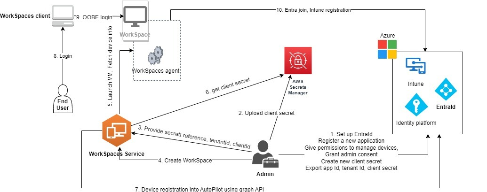

# Create a dedicated Microsoft Entra ID directory with WorkSpaces Personal

In this tutorial, we create Bring Your Own License (BYOL) Windows 10 and 11 personal WorkSpaces that are Microsoft Entra ID
joined and enrolled to Microsoft Intune. Before creating such WorkSpaces, you need to first create a dedicated WorkSpaces Personal
directory for Entra ID-joined WorkSpaces.

###### Note

Microsoft Entra joined personal WorkSpaces are available in all AWS regions where Amazon WorkSpaces is offered except for
Africa (Cape Town), Israel (Tel Aviv), and China (Ningxia).

###### Contents

- [Overview](launch-entra-id.md#entra-overview "launch-entra-id.md#entra-overview")
- [Requirements and limitations](launch-entra-id.md#entra-requirements-limitation "launch-entra-id.md#entra-requirements-limitation")
- [Step 1: Enable IAM Identity Center and synchronize with Microsoft Entra ID](launch-entra-id.md#entra-step-1 "launch-entra-id.md#entra-step-1")
- [Step 2: Register a Microsoft Entra ID application to grant permissions for Windows Autopilot](launch-entra-id.md#entra-step-2 "launch-entra-id.md#entra-step-2")
- [Step 3: Configure Windows Autopilot user-driven mode](launch-entra-id.md#entra-step-3 "launch-entra-id.md#entra-step-3")
- [Step 4: Create an AWS Secrets Manager secret](launch-entra-id.md#entra-step-4 "launch-entra-id.md#entra-step-4")
- [Step 5: Create a dedicated Microsoft Entra ID WorkSpaces directory](launch-entra-id.md#entra-step-5 "launch-entra-id.md#entra-step-5")
- [Configure the IAM Identity Center application for a WorkSpaces directory (optional)](launch-entra-id.md#configure-iam-directory "launch-entra-id.md#configure-iam-directory")
- [Create a cross-Region IAM
  Identity Center integration (optional)](launch-entra-id.md#create-cross-region-iam-identity-integration "launch-entra-id.md#create-cross-region-iam-identity-integration")

## Overview

A Microsoft Entra ID personal WorkSpaces directory contains all the information needed to launch
Microsoft Entra ID-joined WorkSpaces that are assigned to your users managed with Microsoft Entra ID.
User information is made available to WorkSpaces through AWS IAM Identity Center, which acts as an
identity broker to bring your workforce identity from Entra ID to AWS. Microsoft Windows Autopilot
user-driven mode is used to accomplish WorkSpaces Intune enrollment and Entra join. The following
diagram illustrates the Autopilot process.



## Requirements and limitations

- Microsoft Entra ID P1 plan or higher.
- Microsoft Entra ID and Intune is enabled and have role assignments.
- Intune administrator - Required for managing Autopilot deployment profiles.
- Global administrator - Required for granting admin consent for the API permissions
  assigned to the application created in [step 3](launch-workspaces-tutorials.md#entra-step-3 "launch-workspaces-tutorials.md#entra-step-3"). The application can be created without
  this permission. However, a Global Administrator would need to provide admin consent
  on the application permissions.
- Assign Windows 10/11 VDA E3 or E5 user subscription licenses to your WorkSpaces users.
- Entra ID directories only support Windows 10 or 11 Bring Your Own License personal WorkSpaces. The following are supported versions.
  - Windows 10 Version 21H2 (December 2021 Update)
  - Windows 10 Version 22H2 (November 2022 Update)
  - Windows 11 Enterprise 23H2 (October 2023 release)
  - Windows 11 Enterprise 22H2 (October 2022 release)
  - Windows 11 Enterprise 24H2 (October 2024 release)
  - Windows 11 Enterprise 25H2 (September 2025 release)

- Bring Your Own License (BYOL) is enabled for your AWS account and you have a valid Windows 10 or 11 BYOL image
  imported in your account. For more information, see [Bring Your Own Windows desktop licenses in WorkSpaces](byol-windows-images.md "byol-windows-images.md").
- Microsoft Entra ID directories only support Windows 10 or 11 BYOL personal WorkSpaces.
- Microsoft Entra ID directories support only DCV protocol.
- If you are using a firewall for your WorkSpaces, make sure it does not block the outbound traffic to the endpoints for Microsoft Intune and Windows Autopilot. Please review [Network endpoints for Microsoft Intune - Microsoft Intune](https://learn.microsoft.com/en-us/intune/intune-service/fundamentals/intune-endpoints?tabs=north-america "https://learn.microsoft.com/en-us/intune/intune-service/fundamentals/intune-endpoints?tabs=north-america") and [Windows Autopilot requirements](https://learn.microsoft.com/en-us/autopilot/requirements?tabs=networking "https://learn.microsoft.com/en-us/autopilot/requirements?tabs=networking") for details.
- Microsoft Entra ID directories do not support Microsoft Entra ID tenants in Government Community Cloud High (GCCH) and Department of Defense (DoD) environments.

## Step 1: Enable IAM Identity Center and synchronize with Microsoft Entra ID

To create Microsoft Entra ID-joined personal WorkSpaces and assign them to your Entra ID users,
you have to make the user information available to AWS through IAM Identity Center.
IAM Identity Center is the recommended AWS service for managing user access to AWS resources.
For more information, see [What is IAM Identity Center?](../../../singlesignon/latest/userguide/what-is.md "../../../singlesignon/latest/userguide/what-is.md"). This is a one-time setup.

If you don’t have an existing IAM Identity Center instance to integrate with your
WorkSpaces, we recommend that you create one in the same Region as your WorkSpaces. If you have an
existing AWS Identity Center instance in a different Region, you can set up cross-Region
integration. For more information about cross-Region setup, see [Create a cross-Region IAM
Identity Center integration (optional)](#create-cross-region-iam-identity-integration "#create-cross-region-iam-identity-integration").

###### Note

Cross-region integration between WorkSpaces and IAM Identity Center is not supported in
AWS GovCloud (US) Region.

1. Enable IAM Identity Center with your AWS Organizations, especially if you are using a multi-account
   environment. You can also create an account instance of IAM Identity Center. To learn more, see
   [Enabling AWS IAM Identity Center](../../../singlesignon/latest/userguide/get-set-up-for-idc.md "../../../singlesignon/latest/userguide/get-set-up-for-idc.md"). Each WorkSpaces directory can be associated with
   one IAM Identity Center instance, organization or account.

If you are using an organization instance and trying to create a WorkSpaces directory in one of
the member accounts, make sure you have the following IAM Identity Center permissions.

    * `"sso:DescribeInstance"`
    * `"sso:CreateApplication"`
    * `"sso:PutApplicationGrant"`
    * `"sso:PutApplicationAuthenticationMethod"`
    * `"sso:DeleteApplication"`
    * `"sso:DescribeApplication"`
    * `"sso:getApplicationGrant"`

For more information, see [Overview of managing access permissions to your IAM Identity Center resources](../../../singlesignon/latest/userguide/iam-auth-access-overview.md "../../../singlesignon/latest/userguide/iam-auth-access-overview.md").
Also, ensure that no Service Control Policies (SCPs) are blocking these permissions.
To learn more about SCPs, see [Service control policies (SCPs)](../../../organizations/latest/userguide/orgs_manage_policies_scps.md "../../../organizations/latest/userguide/orgs_manage_policies_scps.md"). 2. Configure IAM Identity Center and Microsoft Entra ID to automatically synchronize selected
or all users from your Entra ID tenant to your IAM Identity Center instance. For more information,
see [Configure SAML and SCIM with Microsoft Entra ID and IAM Identity Center](../../../singlesignon/latest/userguide/idp-microsoft-entra.md "../../../singlesignon/latest/userguide/idp-microsoft-entra.md") and
[Tutorial: Configure AWS IAM Identity Center for automatic user provisioning](https://learn.microsoft.com/en-us/entra/identity/saas-apps/aws-single-sign-on-provisioning-tutorial "https://learn.microsoft.com/en-us/entra/identity/saas-apps/aws-single-sign-on-provisioning-tutorial"). 3. Verify that the users you configured on Microsoft Entra ID are synchronized correctly to AWS IAM
Identity Center instance. If you see an error message in Microsoft Entra ID, it indicates that the user in
Entra ID is configured in a way that IAM Identity Center doesn’t support. The error message
will identify this issue. For example, if the user object in Entra ID lacks a first name, a last name,
and/or a display name, you’ll receive an error message similar to `"2 validation errors detected: 
 Value at 'name.givenName' failed to satisfy constraint: Member must satisfy regular expression 
 pattern: [\\p{L}\\p{M}\\p{S}\\p{N}\\p{P}\\t\\n\\r ]+; Value at 'name.givenName' failed to satisfy 
 constraint: Member must have length greater than or equal to 1"`. For more information,
see [Specific users fail to synchronize into IAM Identity Center from an external SCIM provider](../../../singlesignon/latest/userguide/troubleshooting.md#issue2 "../../../singlesignon/latest/userguide/troubleshooting.md#issue2").

###### Note

WorkSpaces uses Entra ID UserPrincipalName (UPN) attribute to identify individual users and the following are its limitations:

- UPNs cannot exceed 63 characters in length.
- If you change the UPN after assigning a WorkSpace to a user, the user won't be able to connect to their WorkSpace
  unless you change the UPN back to what it was before.

## Step 2: Register a Microsoft Entra ID application to grant permissions for Windows Autopilot

WorkSpaces Personal uses Microsoft Windows Autopilot user-driven mode to enroll WorkSpaces to Microsoft Intune
and join them to Microsoft Entra ID.

To allow Amazon WorkSpaces to register WorkSpaces Personal into Autopilot, you must register a Microsoft Entra ID application
that grants necessary Microsoft Graph API permissions. For more information about registering an Entra ID application,
see [Quickstart: Register an application with the Microsoft identity platform](https://learn.microsoft.com/en-us/entra/identity-platform/quickstart-register-app?tabs=certificate "https://learn.microsoft.com/en-us/entra/identity-platform/quickstart-register-app?tabs=certificate").

We recommend providing the following API permissions in your Entra ID application.

- To create a new personal WorkSpace that needs to be joined to Entra ID, following API permission is required.
  - `DeviceManagementServiceConfig.ReadWrite.All`

- When you terminate a personal WorkSpace or rebuild it, the following permissions are used.

###### Note

If you don’t provide these permissions, WorkSpace will be terminated but it will not be removed from your
Intune and Entra ID tenants and you will have to remove them separately.

    + `DeviceManagementServiceConfig.ReadWrite.All`
    + `Device.ReadWrite.All`
    + `DeviceManagementManagedDevices.ReadWrite.All`

- These permissions require admin consent. For more information, see
  [Grant tenant-wide admin consent to an application](https://learn.microsoft.com/en-us/entra/identity/enterprise-apps/grant-admin-consent?pivots=portal "https://learn.microsoft.com/en-us/entra/identity/enterprise-apps/grant-admin-consent?pivots=portal") .

Next, you must add a client secret for the Entra ID application. For more information, see
[Add credentials](https://learn.microsoft.com/en-us/entra/identity-platform/quickstart-register-app?tabs=certificate#add-credentials "https://learn.microsoft.com/en-us/entra/identity-platform/quickstart-register-app?tabs=certificate#add-credentials").
Make sure you remember the client secret string as you will need it when creating the AWS Secrets Manager
secret in Step 4.

## Step 3: Configure Windows Autopilot user-driven mode

Ensure you are familiar with the [Step by step tutorial for Windows Autopilot user-driven Microsoft Entra join in Intune](https://learn.microsoft.com/en-us/autopilot/tutorial/user-driven/azure-ad-join-workflow "https://learn.microsoft.com/en-us/autopilot/tutorial/user-driven/azure-ad-join-workflow").

###### To configure your Microsoft Intune for Autopilot

1. Sign into the Microsoft Intune admin center
2. Create a new Autopilot device group for personal WorkSpaces. For more information, see
   [Create device groups for Windows Autopilot](https://learn.microsoft.com/en-us/autopilot/enrollment-autopilot "https://learn.microsoft.com/en-us/autopilot/enrollment-autopilot").
   1. Choose **Groups**, **New group**
   2. For **Group type**, choose **Security**.
   3. For **Membership type**, choose **Dynamic Device**.
   4. Choose **Edit dynamic query** to create a dynamic membership rule. The rule should be in the following format:

   ```
   (device.devicePhysicalIds -any (_ -eq "[OrderID]:WorkSpacesDirectoryName"))
   ```

   ###### Important

   `WorkSpacesDirectoryName` should match the directory name of the Entra ID WorkSpaces Personal
   directory you create in step 5. This is because the directory name string is used as group tag when WorkSpaces
   registers virtual desktops into Autopilot. Additionally, group tag maps to the `OrderID` attribute on
   Microsoft Entra devices.

3. Choose **Devices**, **Windows**, **Enrollment**. For
   **Enrollment Options**, choose **Automatic Enrollment**. For **MDM user scope**
   select **All**.
4. Create an Autopilot deployment profile. For more information, see
   [Create an Autopilot deployment profile](https://learn.microsoft.com/en-us/autopilot/profiles#create-an-autopilot-deployment-profile "https://learn.microsoft.com/en-us/autopilot/profiles#create-an-autopilot-deployment-profile").
   1. For **Windows Autopilot**, choose **Deployment profiles**,
      **Create profile**.
   2. In the **Windows Autopilot deployment profiles** screen, select the
      **Create Profile** drop down menu and then select **Windows PC**.
   3. In the **Create profile** screen, on **On the Out-of-box experience (OOBE)**
      page. For **Deployment mode**, select **User-driven**. For **Join to Microsoft
      Entra ID**, select **Microsoft Entra joined**. You can customize the computer
      names for your Entra ID-joined personal WorkSpaces by selecting **Yes** for **Apply device name template**,
      to create a template to use when naming a device during enrollment.
   4. On the **Assignments** page, for **Assign to**, choose **Selected groups**.
      Choose **Select groups to include**, and select the Autopilot device group you’ve just created in 2.

## Step 4: Create an AWS Secrets Manager secret

You must create a secret in AWS Secrets Manager to securely store the information, including the application ID
and client secret, for the Entra ID application you created in [Step 2: Register a Microsoft Entra ID application to grant permissions for Windows Autopilot](#entra-step-2 "#entra-step-2").
This is a one-time setup.

###### To create an AWS Secrets Manager secret

1. Create a customer managed key on [AWS Key Management Service](https://aws.amazon.com/kms/ "https://aws.amazon.com/kms/"). The key will later
   be used to encrypt the AWS Secrets Manager secret. Don't use the default key to encrypt your secret as the default key
   cannot be accessed by the WorkSpaces service. Follow the steps below to create the key.
   1. Open the AWS KMS console at [https://console.aws.amazon.com/kms](https://console.aws.amazon.com/kms "https://console.aws.amazon.com/kms").
   2. To change the AWS Region, use the Region selector in the upper-right corner of the page.
   3. Choose **Create key**.
   4. On the **Configure key** page, for **Key type** choose
      **Symmetric**. For **Key usage**, choose **Encrypt and decrypt**.
   5. On the **Review** page, in the Key policy editor, ensure you allow the WorkSpaces service's principal
      `workspaces.amazonaws.com` access to the key by including following permissions in the key policy.

   ```
   {
       "Effect": "Allow",
       "Principal": {
           "Service": [
               "workspaces.amazonaws.com"
           ]
       },
       "Action": [
           "kms:Decrypt",
           "kms:DescribeKey"
       ],
       "Resource": "*"
    }
   ```

2. Create the secret on AWS Secrets Manager, using the AWS KMS key created in previous step.
   1. Open the Secrets Manager console at [https://console.aws.amazon.com/secretsmanager/](https://console.aws.amazon.com/secretsmanager/ "https://console.aws.amazon.com/secretsmanager/").
   2. Choose **Store a new secret**.
   3. On the **Choose secret type** page, for **Secret type**,
      select **Other type of secret**.
   4. For **Key/value pairs**, in the key box, enter “application_id” into the key box, then copy the Entra ID application ID
      from [Step 2](launch-workspaces-tutorials.md#entra-step-2 "launch-workspaces-tutorials.md#entra-step-2") and paste it into
      the value box.
   5. Choose **Add row**, in the key box, enter “application_password”, then copy the Entra ID application client secret
      from [Step 2](launch-workspaces-tutorials.md#entra-step-2 "launch-workspaces-tutorials.md#entra-step-2") and paste it into
      the value box.
   6. Choose the AWS KMS key that you created in the previous step from the **Encryption key** drop-down list.
   7. Choose **Next**.
   8. On the **Configure secret** page, enter a **Secret name** and **Description**.
   9. In the **Resource permissions** section, choose **Edit permissions**.
   10. Make sure you allow the WorkSpaces service's principal `workspaces.amazonaws.com` access to the secret by including following
       resource policy in the resource permissions.

   JSON

   ```
   `{
    "Version":"2012-10-17",
    "Statement" : [ {
    "Effect" : "Allow",
    "Principal" : {
    "Service" : [ "workspaces.amazonaws.com"]
    },
    "Action" : "secretsmanager:GetSecretValue",
    "Resource" : "*"
    } ]
   }`

   ```

## Step 5: Create a dedicated Microsoft Entra ID WorkSpaces directory

Create a dedicated WorkSpaces directory that stores information for your Microsoft Entra ID-joined WorkSpaces and Entra ID users.

###### To create an Entra ID WorkSpaces directory

1. Open the WorkSpaces console at [https://console.aws.amazon.com/workspaces/v2/home](https://console.aws.amazon.com/workspaces/v2/home "https://console.aws.amazon.com/workspaces/v2/home").
2. In the navigation pane, choose **Directories**.
3. On the **Create directory** page, for **WorkSpaces type** choose **Personal**.
   For **WorkSpace device management**, choose **Microsoft Entra ID**.
4. For **Microsoft Entra tenant ID**, enter your Microsoft Entra ID
   tenant ID that you want your directory's WorkSpaces to join to. You won't be able to
   change the tenant ID after the directory is created.
5. For **Entra ID Application ID and password**, select the AWS Secrets Manager secret that you created in
   [Step 4](launch-workspaces-tutorials.md#entra-step-4 "launch-workspaces-tutorials.md#entra-step-4") from the drop down list.
   You won't be able to change the secret associated with the directory after the directory is created. However, you can always update the content
   of the secret, including the Entra ID Application ID and its password through the AWS Secrets Manager console at [https://console.aws.amazon.com/secretsmanager/](https://console.aws.amazon.com/secretsmanager/ "https://console.aws.amazon.com/secretsmanager/").
6. If your IAM Identity Center instance is in the same AWS Region as your WorkSpaces
   directory, for **User identity source**, select the IAM Identity
   Center instance that you configured in [Step 1](launch-workspaces-tutorials.md#entra-step-1 "launch-workspaces-tutorials.md#entra-step-1") from the dropdown list. You won't be able to change the IAM
   Identity Center instance associated with the directory after the directory is
   created.

If your IAM Identity Center instance is in a different AWS Region than your
WorkSpaces directory, choose **Enable Cross-Region** and then select the
Region from the dropdown list.

###### Note

If you have an existing IAM Identity Center instance in a different Region,
you must opt-in to set up a cross-Region integration. For more information about
cross-Region setup, see [Create a cross-Region IAM
Identity Center integration (optional)](#create-cross-region-iam-identity-integration "#create-cross-region-iam-identity-integration"). 7. For **Directory name**, enter a unique name for the directory (For example, `WorkSpacesDirectoryName`).

###### Important

The directory name should match the `OrderID` used to construct the dynamic query for the Autopilot device group that you
created with Microsoft Intune in [Step 3](launch-workspaces-tutorials.md#entra-step-3 "launch-workspaces-tutorials.md#entra-step-3").
The directory name string is used as the group tag when registering personal WorkSpaces into Windows Autopilot. The group tag maps to the `OrderID`
attribute on Microsoft Entra devices. 8. (Optional) For **Description**, enter a description for the directory. 9. For **VPC**, select the VPC that you used to launch your WorkSpaces. For more information, see
[Configure a VPC for WorkSpaces Personal](amazon-workspaces-vpc.md "amazon-workspaces-vpc.md"). 10. For **Subnets**, select two subnets of your VPC that are not from the same Availability Zone.
These subnets will be used to launch your personal WorkSpaces. For more information, see [Availability Zones for WorkSpaces Personal](azs-workspaces.md "azs-workspaces.md").

###### Important

Make sure the WorkSpaces launched in the subnets have internet access, which is needed when users login to the Windows desktops.
For more information, see [Provide internet access for WorkSpaces Personal](amazon-workspaces-internet-access.md "amazon-workspaces-internet-access.md"). 11. For **Configuration**, select **Enable dedicated WorkSpace**. You must enable it to create a dedicated WorkSpaces Personal
directory to launch Bring Your Own License (BYOL) Windows 10 or 11 personal WorkSpaces.

###### Note

If you don't see the **Enable dedicated WorkSpace** option under **Configuration**, your account hasn't been
enabled for BYOL. To enable BYOL for your account, see [Bring Your Own Windows desktop licenses in WorkSpaces](byol-windows-images.md "byol-windows-images.md"). 12. (Optional) For **Tags**, specify the key pair value that you want to use for personal WorkSpaces in the directory. 13. Review the directory summary and choose **Create directory**. It takes several minutes for your directory to be connected.
The initial status of the directory is `Creating`. When directory creation is complete, the status is `Active`.

An IAM Identity Center application is also automatically created on your behalf once the directory is created. To find the application’s
ARN go to the directory's summary page.

You can now use the directory to launch Windows 10 or 11 personal WorkSpaces that are enrolled to Microsoft Intune and joined to Microsoft Entra ID.
For more information, see [Create a WorkSpace in WorkSpaces Personal](create-workspaces-personal.md "create-workspaces-personal.md").

After you've created a WorkSpaces Personal directory, you can create a personal WorkSpace.
For more information, see [Create a WorkSpace in WorkSpaces Personal](create-workspaces-personal.md "create-workspaces-personal.md")

## Configure the IAM Identity Center application for a WorkSpaces directory (optional)

A corresponding IAM Identity Center application is automatically created once a directory is created.
You can find the application’s ARN in the Summary section on the directory detail page. By default, all users
in the Identity Center instance can access their assigned WorkSpaces without configuring the corresponding
Identity Center application. However, you can manage user access to WorkSpaces in a directory by configuring the user
assignment for the IAM Identity Center application.

###### To configure the user assignment for the IAM Identity Center application

1. Open the IAM console at
   [https://console.aws.amazon.com/iam/](https://console.aws.amazon.com/iam/ "https://console.aws.amazon.com/iam/").
2. On the **AWS managed applications** tab, choose the application for the WorkSpaces directory.
   The application names are in the following format: `WorkSpaces.wsd-xxxxx`, where `wsd-xxxxx` is the
   WorkSpaces directory ID.
3. Choose **Actions**, **Edit details**.
4. Change the **User and group assignment method** from **Do not require assignments**
   to **Require assignments**.
5. Choose **Save changes**.

After you make this change, users in the Identity Center instance will lose access their assign WorkSpaces unless they are assigned to the application.
To assign your users to the application, use the AWS CLI command `create-application-assignment` to assign users or groups to an application. For more information, see the
[AWS CLI Command Reference](../../../cli/latest/reference/sso-admin/create-application-assignment.md "../../../cli/latest/reference/sso-admin/create-application-assignment.md").

## Create a cross-Region IAM

Identity Center integration (optional)

We recommend that your WorkSpaces and the associated IAM Identity Center instance are in
the same AWS Region. However, if you already have an IAM Identity Center instance
configured in a different Region from your WorkSpaces Region, you can create a cross-Region
integration. When you create a cross-Region WorkSpaces and IAM Identity Center integration,
you enable WorkSpaces to make cross-Region calls to access and store information from your IAM
Identity Center instance, such as user and group attributes.

###### Important

Amazon WorkSpaces supports cross-Region IAM Identity Center and WorkSpaces integrations only
for organization-level instances. WorkSpaces doesn't support cross-Region IAM Identity
Center integrations for account-level instances. For more information about IAM
Identity Center instance types and their use cases, see, [Understanding
types of IAM Identity Center instances](../../../amazonq/latest/qbusiness-ug/setting-up.md#idc-instance-types "../../../amazonq/latest/qbusiness-ug/setting-up.md#idc-instance-types").

If you create a cross-Region integration between a WorkSpaces directory and an IAM Identity
Center instance, you may experience higher latency when deploying WorkSpaces and during login
because of cross-Region calls. The increase in latency is proportional to the distance
between your WorkSpaces Region and the IAM Identity Center Region. We recommend that you
perform latency tests for your specific use case.

You can enable cross-Region IAM Identity Center connections during
[Step 5: Create a
dedicated Microsoft Entra ID WorkSpaces directory](launch-entra-id.md#entra-step-5 "launch-entra-id.md#entra-step-5"). For **User identity
source**, choose the IAM Identity Center instance that you configured in
[Step 1: Enable IAM Identity Center and synchronize with Microsoft Entra ID](#entra-step-1 "#entra-step-1") from the dropdown menu.

###### Important

You can't change the IAM Identity Center instance associated with the directory
after you create it.
