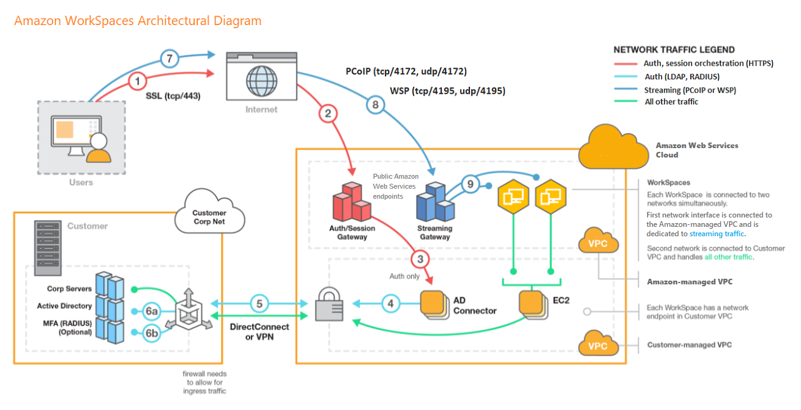
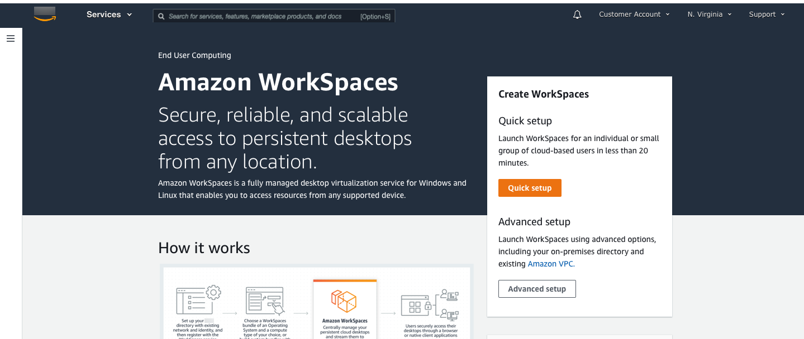
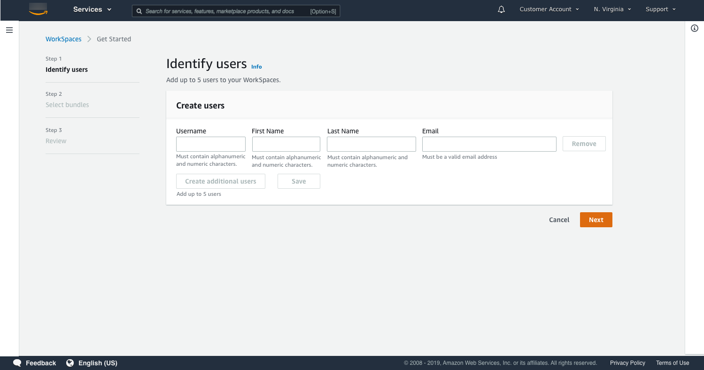
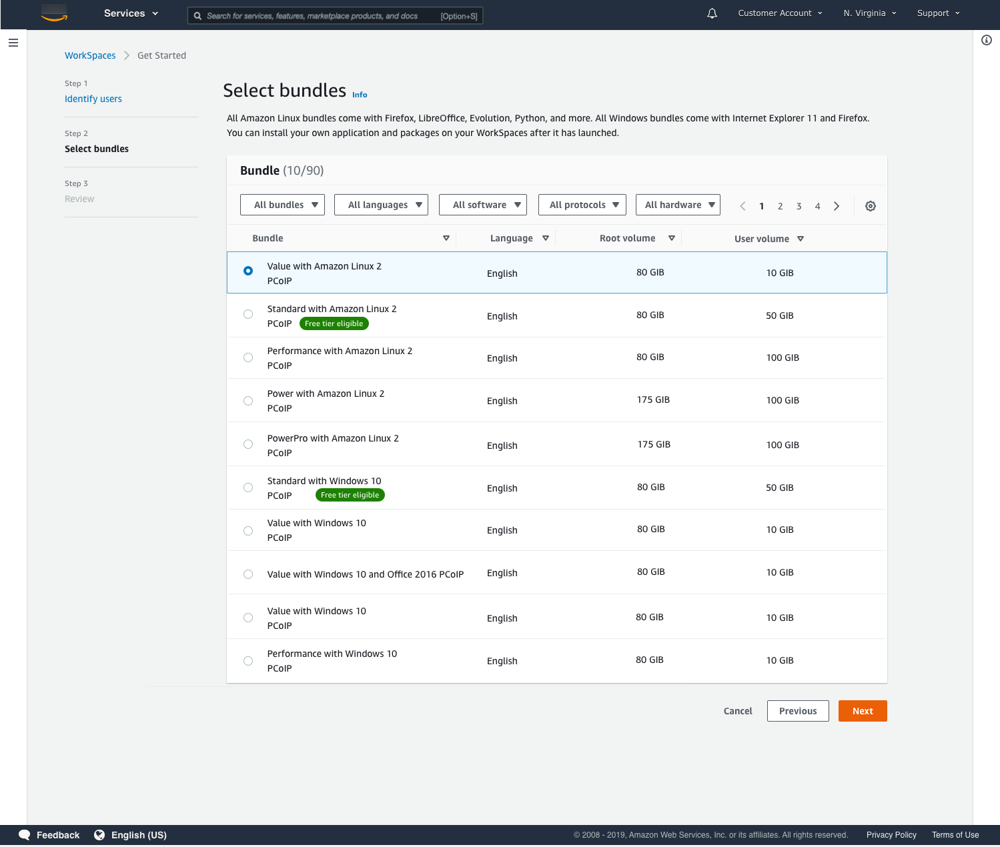

# Use and manage WorkSpaces Personal

WorkSpaces Personal offers persistent virtual desktops that are
tailored for users who need a highly-personalized desktop provisioned for their exclusive use,
similar to a physical desktop computer assigned to an individual.

Each WorkSpace is associated with a virtual private cloud
(VPC), and a directory to store and manage information for your WorkSpaces and users. For
more information, see [Configure a VPC for WorkSpaces Personal](amazon-workspaces-vpc.md "amazon-workspaces-vpc.md"). Directories are either managed
by the WorkSpaces service, or through the Directory Service, which offers the following options: Simple AD, AD Connector, or AWS
Directory Service for Microsoft Active Directory, also known as AWS Managed Microsoft
AD. For more information, see the [AWS Directory Service Administration Guide](../../../directoryservice/latest/admin-guide.md "../../../directoryservice/latest/admin-guide.md").

WorkSpaces uses your IAM Identity Center (for directories managed by Amazon WorkSpaces),
Simple AD, AD Connector, or AWS Managed Microsoft AD directory to
authenticate users. Users access their WorkSpaces by using a client application from a
supported device or, for Windows WorkSpaces, a web browser, and they log in by using their
directory credentials. The login information is sent to an authentication gateway, which
forwards the traffic to the directory for the WorkSpace. After the user is
authenticated, streaming traffic is initiated through the streaming gateway.

Client applications use HTTPS over port 443 for all authentication and session-related
information. Client applications use port 4172 (PCoIP) and port 4195 (DCV) for
pixel streaming to the WorkSpace and ports 4172 and 4195 for network health checks. For
more information, see [Ports for client applications](workspaces-port-requirements.md#client-application-ports "workspaces-port-requirements.md#client-application-ports").

Each WorkSpace has two elastic network interfaces associated with it: a network
interface for management and streaming (eth0) and a primary network interface (eth1).
The primary network interface has an IP address provided by your VPC, from the same
subnets used by the directory. This ensures that traffic from your WorkSpace can easily
reach the directory. Access to resources in the VPC is controlled by the security groups
assigned to the primary network interface. For more information, see [Network interfaces](workspaces-port-requirements.md#network-interfaces "workspaces-port-requirements.md#network-interfaces").

The following diagram shows the architecture of WorkSpaces that use AD Connector.

## Get started with WorkSpaces Personal

As a first-time WorkSpaces user, you can choose to set up your WorkSpaces Personal with quick setup or advanced setup.
The following tutorials describe how to provision a cloud-based desktop, known as a _WorkSpace_
using WorkSpaces and Directory Service.

###### Note

To get started with WorkSpaces Pools, see [Configure SAML 2.0 and create a WorkSpaces Pools
directory](create-directory-pools.md "create-directory-pools.md").

In this tutorial, you learn how to provision a virtual, cloud-based Microsoft
Windows, Amazon Linux 2, Ubuntu Linux, Rocky Linux, or Red Hat Enterprise Linux desktop, known as a _WorkSpace_,
by using WorkSpaces and Directory Service.

This tutorial uses the quick setup option to launch your WorkSpace. This option is
available only if you have never launched a WorkSpace. Alternatively, see [Create a directory for WorkSpaces Personal](launch-workspaces-tutorials.md "launch-workspaces-tutorials.md").

###### Note

This quick setup option and tutorial does not apply to WorkSpaces Pools.

###### Note

Quick setup is supported in the following AWS Regions:

- US East (N. Virginia)
- US West (Oregon)
- Europe (Ireland)
- Asia Pacific (Singapore)
- Asia Pacific (Sydney)
- Asia Pacific (Tokyo)
  To change your Region, see [Choosing a
  Region](../../../awsconsolehelpdocs/latest/gsg/select-region.md "../../../awsconsolehelpdocs/latest/gsg/select-region.md").

###### Tasks

- [Before you begin](#quick-setup-prereqs "#quick-setup-prereqs")
- [What quick setup does](#quick-setup-what-it-does "#quick-setup-what-it-does")
- [Step 1: Launch the
  WorkSpace](#quick-setup-launch-workspace "#quick-setup-launch-workspace")
- [Step 2: Connect to the
  WorkSpace](#quick-setup-connect-workspace "#quick-setup-connect-workspace")
- [Step 3: Clean up (Optional)](#quick-setup-clean-up "#quick-setup-clean-up")
- [Next steps](#quick-setup-next-steps "#quick-setup-next-steps")

#### Before you begin

Before you begin, make sure that you meet the following requirements:

- You must have an AWS account to create or administer a WorkSpace.
  Users do not need an AWS account to connect to and use their
  WorkSpaces.
- WorkSpaces is not available in every Region. Verify the supported Regions
  and [select a Region](../../../awsconsolehelpdocs/latest/gsg/getting-started.md#select-region "../../../awsconsolehelpdocs/latest/gsg/getting-started.md#select-region") for your WorkSpaces. For more information
  about the supported Regions, see [WorkSpaces Pricing by AWS Region](https://aws.amazon.com/workspaces/pricing/#Amazon_WorkSpaces_Pricing_by_AWS_Region "https://aws.amazon.com/workspaces/pricing/#Amazon_WorkSpaces_Pricing_by_AWS_Region").

It's also helpful to review and understand the following before you
proceed:

- When you launch a WorkSpace, you must select a WorkSpace bundle. For
  more information, see [Amazon WorkSpaces Bundles](https://aws.amazon.com/workspaces/details/#Amazon_WorkSpaces_Bundles "https://aws.amazon.com/workspaces/details/#Amazon_WorkSpaces_Bundles") and [Amazon WorkSpaces Pricing](https://aws.amazon.com/workspaces/pricing/ "https://aws.amazon.com/workspaces/pricing/").
- When you launch a WorkSpace, you must select which protocol (PCoIP or
  DCV) you want to use with your bundle.
  For more information, see [Protocols for WorkSpaces Personal](amazon-workspaces-networking.md#amazon-workspaces-protocols "amazon-workspaces-networking.md#amazon-workspaces-protocols").
- When you launch a WorkSpace, you must specify profile information for
  the user, including a user name and email address. Users complete their
  profiles by specifying a password. Information about WorkSpaces and
  users is stored in a directory. For more information, see [Manage directories for WorkSpaces Personal](manage-workspaces-directory.md "manage-workspaces-directory.md").

#### What quick setup does

Quick setup completes the following tasks on your behalf:

- **Creates an IAM role** to allow the
  WorkSpaces service to create elastic network interfaces and list your WorkSpaces
  directories. This role has the name
  `workspaces_DefaultRole`.
- **Creates a virtual private cloud
  (VPC)**. If you want to use an existing VPC instead, make sure
  it meets the requirements noted in [Configure a VPC for WorkSpaces Personal](amazon-workspaces-vpc.md "amazon-workspaces-vpc.md"), and then follow the steps
  in one of the tutorials listed in [Create a directory for WorkSpaces Personal](launch-workspaces-tutorials.md "launch-workspaces-tutorials.md"). Choose the tutorial
  that corresponds to the type of Active Directory that you want to
  use.
- **Sets up a Simple AD directory** in the
  VPC and enables it for WorkDocs. This Simple AD directory is used to store
  user and WorkSpace information. The first AWS account created by quick
  setup is your admin AWS account. † The directory also has an
  Administrator account. For more information, see [What gets created](../../../index.md "../../../index.md") in the
  _AWS Directory Service Administration Guide_.
- **Creates the specified AWS accounts and adds
  them to the directory**.
- **Creates WorkSpaces**. Each WorkSpace
  receives a public IP address to provide internet access. The running
  mode is AlwaysOn. For more information, see [Manage the running mode in WorkSpaces Personal](running-mode.md "running-mode.md").
- **Sends invitation emails to the specified
  users**. If your users don't receive their invitation
  emails, see [Send an invitation email](manage-workspaces-users.md#send-invitation "manage-workspaces-users.md#send-invitation").

† The first AWS account created by quick setup is your admin
AWS account. You can't update this AWS account from the WorkSpaces Console. Don't
share the information for this account with anyone else. To invite other users
to use WorkSpaces, create new AWS accounts for them.

#### Step 1: Launch the

WorkSpace

Using quick setup, you can launch your first WorkSpace in minutes.

###### To launch a WorkSpace

1. Open the WorkSpaces console at [https://console.aws.amazon.com/workspaces/v2/home](https://console.aws.amazon.com/workspaces/v2/home "https://console.aws.amazon.com/workspaces/v2/home").
2. Choose **Quick setup**. If you don't see this button,
   either you have already launched a WorkSpace in this Region, or you
   aren't using one of the [Regions that
   support quick setup](#quick-setup-regions "#quick-setup-regions"). In this case, see [Create a directory for WorkSpaces Personal](launch-workspaces-tutorials.md "launch-workspaces-tutorials.md").

 3. For **Identify users**, enter the
**Username**, **First Name**.
**Last Name**, and **Email**. Then
choose **Next**.

###### Note

If this is your first time using WorkSpaces, we recommend creating a
user for yourself for testing purposes.

 4. For **Bundles**, select a bundle (hardware and
software) for the user with the appropriate protocol (PCoIP or DCV). For
more information about the various public bundles available for
Amazon WorkSpaces, see [Amazon WorkSpaces Bundles](https://aws.amazon.com/workspaces/details/#Amazon_WorkSpaces_Bundles "https://aws.amazon.com/workspaces/details/#Amazon_WorkSpaces_Bundles").

 5. Review your information. Then choose **Create
WorkSpace**. 6. It takes approximately 20 minutes for your WorkSpace to launch. To
monitor the progress, go to the left navigation pane and choose
**Directories**. You will see a directory being
created with an initial status of `REQUESTED` and then
`CREATING`.

After the directory has been created and has a status of
`ACTIVE`, you can choose **WorkSpaces**
in the left navigation pane to monitor the progress of the WorkSpace
launch process. The initial status of the WorkSpace is
`PENDING`. When the launch is complete, the status is
`AVAILABLE` and an invitation is sent to the email
address that you specified for each user. If your users don't receive
their invitation emails, see [Send an invitation email](manage-workspaces-users.md#send-invitation "manage-workspaces-users.md#send-invitation").

#### Step 2: Connect to the

WorkSpace

After you receive the invitation email, you can connect to the WorkSpace using
the client of your choice. After you sign in, the client displays the WorkSpace
desktop.

###### To connect to the WorkSpace

1. If you haven't set up credentials for the user already, open the link
   in the invitation email and follow the directions. Remember the password
   that you specify as you will need it to connect to your
   WorkSpace.

###### Note

Passwords are case-sensitive and must be between 8 and 64
characters in length, inclusive. Passwords must contain at least one
character from each of the following categories: lowercase letters
(a-z), uppercase letters (A-Z), numbers (0-9), and the set
~!@#$%^&\*\_-+=`|\(){}[]:;"'<>,.?/. 2. Review [WorkSpaces
Clients](../userguide/amazon-workspaces-clients.md "../userguide/amazon-workspaces-clients.md") in the _Amazon WorkSpaces User Guide_ for
more information about the requirements for each client, and then do one
of the following:

    * When prompted, download one of the client applications or
     launch **Web Access**.
    * If you aren't prompted and you haven't installed a client
     application already, open [https://clients.amazonworkspaces.com/](https://clients.amazonworkspaces.com/ "https://clients.amazonworkspaces.com/")

     and download one of
     the client applications or launch **Web
     Access**.

###### Note

You cannot use a web browser (Web Access) to connect to Amazon Linux
WorkSpaces. 3. Start the client, enter the registration code from the invitation
email, and choose **Register**. 4. When prompted to sign in, enter the sign-in credentials, and then
choose **Sign In**. 5. (Optional) When prompted to save your credentials, choose
**Yes**.

For more information about using the client applications, such as setting up
multiple monitors or using peripheral devices, see [WorkSpaces Clients](../userguide/amazon-workspaces-clients.md "../userguide/amazon-workspaces-clients.md") and
[Peripheral Device
Support](../userguide/peripheral_devices.md "../userguide/peripheral_devices.md") in the _Amazon WorkSpaces User Guide_.

#### Step 3: Clean up (Optional)

If you are finished with the WorkSpace that you created for this tutorial, you
can delete it. For more information, see [Delete a WorkSpace in WorkSpaces Personal](delete-workspaces.md "delete-workspaces.md").

###### Note

Simple AD is made available to you free of charge to use with
WorkSpaces. If there are no WorkSpaces being used with your Simple AD
directory for 30 consecutive days, this directory will be automatically
deregistered for use with Amazon WorkSpaces, and you will be charged for this
directory as per the [AWS Directory Service pricing terms](https://aws.amazon.com/directoryservice/pricing/ "https://aws.amazon.com/directoryservice/pricing/").

To delete empty directories, see [Delete a directory for WorkSpaces Personal](delete-workspaces-directory.md "delete-workspaces-directory.md"). If you delete your
Simple AD directory, you can always create a new one when you want to
start using WorkSpaces again.

#### Next steps

You can continue to customize the WorkSpace that you just created. For
example, you can install software and then create a custom bundle from your
WorkSpace. You can also perform various administrative tasks for your WorkSpaces
and your WorkSpaces directory. For more information, see the following
documentation.

- [Create a custom WorkSpaces image and bundle for WorkSpaces Personal](create-custom-bundle.md "create-custom-bundle.md")
- [Administer WorkSpaces Personal](administer-workspaces.md "administer-workspaces.md")
- [Manage directories for WorkSpaces Personal](manage-workspaces-directory.md "manage-workspaces-directory.md")

To create additional WorkSpaces, do one of the following:

- If you want to continue using the VPC and the Simple AD directory that
  were created by quick setup, you can add WorkSpaces for additional users
  by following the steps in the [Create a WorkSpace in WorkSpaces Personal](create-workspaces-personal.md "create-workspaces-personal.md") section of the Launch a
  WorkSpace Using Simple AD tutorial.
- If you need to use another directory type or if you need to use an
  existing Active Directory, see the appropriate tutorial in [Create a directory for WorkSpaces Personal](launch-workspaces-tutorials.md "launch-workspaces-tutorials.md").

For more information about using the WorkSpaces client applications, such as
setting up multiple monitors or using peripheral devices, see [WorkSpaces Clients](../userguide/amazon-workspaces-clients.md "../userguide/amazon-workspaces-clients.md") and
[Peripheral Device
Support](../userguide/peripheral_devices.md "../userguide/peripheral_devices.md") in the _Amazon WorkSpaces User Guide_.

In this tutorial, you learn how to provision a virtual, cloud-based Microsoft
Windows, Amazon Linux, Ubuntu Linux, or Red Hat Enterprise Linux desktop, known as a
_WorkSpace_, by using WorkSpaces and Directory Service.

This tutorial uses the advanced setup option to launch your WorkSpace.

###### Note

Advanced setup is supported in all Regions for WorkSpaces.

###### Tasks

- [Before you begin](#advanced-setup-prereqs "#advanced-setup-prereqs")
- [Using advanced setup to launch your
  WorkSpace](#advanced-setup-procedure "#advanced-setup-procedure")

#### Before you begin

Before you begin, make sure you have an AWS account that you can use to
create or administer a WorkSpace. Users don't need an AWS account to connect
to and use their WorkSpaces.

Review and understand the following concepts before you proceed:

- When you launch a WorkSpace, you must select a WorkSpace bundle. For
  more information, see [Amazon WorkSpaces Bundles](https://aws.amazon.com/workspaces/details/#Amazon_WorkSpaces_Bundles "https://aws.amazon.com/workspaces/details/#Amazon_WorkSpaces_Bundles").
- When you launch a WorkSpace, you must select which protocol (PCoIP or
  DCV) you want to use with your bundle.
  For more information, see [Protocols for WorkSpaces Personal](amazon-workspaces-networking.md#amazon-workspaces-protocols "amazon-workspaces-networking.md#amazon-workspaces-protocols").
- When you launch a WorkSpace, you must specify profile information for
  the user, including a user name and email address. Users complete their
  profiles by specifying a password. Information about WorkSpaces and
  users is stored in a directory. For more information, see [Manage directories for WorkSpaces Personal](manage-workspaces-directory.md "manage-workspaces-directory.md").

#### Using advanced setup to launch your

WorkSpace

###### To use advanced setup to launch your WorkSpace:

1. Open the WorkSpaces console at [https://console.aws.amazon.com/workspaces/v2/home](https://console.aws.amazon.com/workspaces/v2/home "https://console.aws.amazon.com/workspaces/v2/home").
2. Choose one of the following directory types, and then choose
   **Next**:
   - AWS Managed Microsoft AD
   - Simple AD
   - AD Connector

3. Enter the directory information.
4. Choose two subnets in a VPC from two different availability zones. For
   more information, see [Configure a VPC with public subnets](amazon-workspaces-vpc.md#configure-vpc-public-subnets "amazon-workspaces-vpc.md#configure-vpc-public-subnets").
5. Review your directory's information and choose **Create
   directory**.
