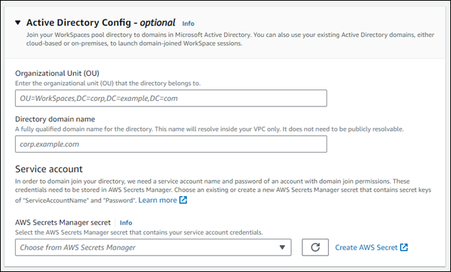
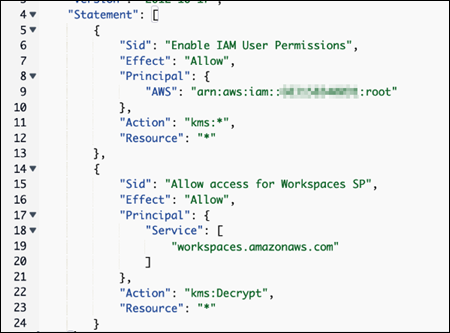

# Specify Active Directory details for your

WorkSpaces Pools directory

In this topic, we show you how to specify your Active Directory (AD) details within the
**Create WorkSpaces Pool directory** page of the WorkSpaces console. As you create
your WorkSpaces Pool directory, you should specify your AD details if you plan to use an AD with
your WorkSpaces Pools. You cannot edit the **Active Directory Config** for your
WorkSpaces Pools directory after you create it. Following is an example of the **Active
Directory Config** section of the **Create WorkSpaces Pool
directory** page.



###### Note

The full process for creating a WorkSpaces Pool directory is outlined in the [Configure SAML 2.0 and create a WorkSpaces Pools
directory](create-directory-pools.md "create-directory-pools.md") topic. The
procedures outlined on this page represent only a subset of steps of the full process to
create a WorkSpaces Pool directory.

###### Topics

- [Specify the organization unit
  and directory domain name for your AD](#pools-specify-ou-and-directory-domain "#pools-specify-ou-and-directory-domain")
- [Specify the service account for your
  AD](#pools-specify-access-account "#pools-specify-access-account")

## Specify the organization unit

and directory domain name for your AD

Complete the following procedure to specify an organizational unit (OU) and a
directory domain name for your AD in the **Create a WorkSpaces Pool
directory** page.

1. For **Organization Unit**, enter the OU that the pool belongs
   to. WorkSpace machine accounts are placed in the organizational unit
   (OU) that you specify for the WorkSpaces Pool directory.

###### Note

The OU name can't contain spaces. If you specify an OU name that contains spaces, when it
attempts to rejoin the Active Directory domain, WorkSpaces cannot cycle the computer objects correctly
and the domain rejoin doesn't work. 2. For **Directory domain name**, enter the fully qualified
domain name (FQDN) of the Active Directory domain (for example,
`corp.example.com`). Each AWS Region can have only one
directory config value with a specific directory name.

    * You can join your WorkSpaces Pool directories to domains in Microsoft Active
     Directory. You can also use your existing Active Directory domains,
     either cloud-based or on-premises, to launch domain-joined WorkSpaces.
    * You can also use AWS Directory Service for Microsoft Active Directory, also known as AWS Managed Microsoft AD, to
     create an Active Directory domain. Then, you can use that domain to
     support your WorkSpaces resources.
    * By joining WorkSpaces to your Active Directory domain, you can:


    	+ Allow your users and applications to access Active Directory
    	 resources, such as printers and file shares from streaming
    	 sessions.
    	+ Use Group Policy settings that are available in the Group
    	 Policy Management Console (GPMC) to define the end user
    	 experience.
    	+ Stream applications that require users to be authenticated
    	 using their Active Directory login credentials.
    	+ Apply your enterprise compliance and security policies to your
    	 WorkSpaces streaming instances.

3. For **Service account**, continue to the [Specify the service account for your
   AD](#pools-specify-access-account "#pools-specify-access-account") next section of this
   page.

## Specify the service account for your

AD

When you configure Active Directory (AD) for your WorkSpaces Pools as part of the directory
creation process, you must specify the AD service account to be used for managing the
AD. This requires that you provide the service account credentials, which must be stored
in AWS Secrets Manager and encrypted using a AWS Key Management Service (AWS KMS) customer managed key. In this section, we
show you how to create the AWS KMS customer managed key and the Secrets Manager secret to store your AD
service account credentials.

### Step 1: Create an AWS KMS

customer managed key

Complete the following procedure to create an AWS KMS customer managed key

1. Open the AWS KMS console at [https://console.aws.amazon.com/kms](https://console.aws.amazon.com/kms "https://console.aws.amazon.com/kms").
2. To change the AWS Region, use the Region selector in the upper-right corner of the page.
3. Choose **Create a key**, and then choose
   **Next**.
4. Choose **Symetric** for the key type, and
   **Encrypt and decrypt** for the key usage, and then
   choose **Next**.
5. Enter an alias for the key, such as
   `WorkSpacesPoolDomainSecretKey`, and then choose
   **Next**.
6. Don't choose a key administrator. Choose **Next** to
   continue.
7. Don't define key usage permissions. Choose **Next** to
   continue.
8. In the Key policy section of the page, add the following:

```
        {
            "Sid": "Allow access for Workspaces SP",
            "Effect": "Allow",
            "Principal": {
                "Service": "workspaces.amazonaws.com"
            },
            "Action": "kms:Decrypt",
            "Resource": "*"
        }
```

The result should appear like the following example.

 9. Choose **Finish**.

Your AWS KMS customer managed key is now ready to be used with Secrets Manager. Continue to the
[Step 2: Create Secrets Manager secret to store your
AD service account credentials](#pools-create-asm-secret "#pools-create-asm-secret") section of this page.

### Step 2: Create Secrets Manager secret to store your

AD service account credentials

Complete the following procedure to create a Secrets Manager secret to store your AD service
account credentials.

1. Open the AWS Secrets Manager console at [https://console.aws.amazon.com/secretsmanager/](https://console.aws.amazon.com/secretsmanager/ "https://console.aws.amazon.com/secretsmanager/").
2. Choose **Create a new secret**.
3. Choose **Other type of secret**.
4. For the first key/value pair, enter `Service Account Name` for
   the key, and the name of the service account for the value, such as
   `domain\username`.
5. For the second key/value pair, enter a `Service Account
Password` for the key, and the password of the service account for
   the value.
6. For the encryption key, choose the AWS KMS customer managed key that you created
   earlier, and then choose **Next**.
7. Enter a name for the secret, such as
   `WorkSpacesPoolDomainSecretAD`.
8. Choose **Edit permissions** in the **Resource
   permissions** section of the page.
9. Enter the following permission policy:

JSON

```
`{
 "Version":"2012-10-17",
 "Statement": [
 {
 "Effect": "Allow",
 "Principal": {
 "Service": [
 "workspaces.amazonaws.com"
 ]
 },
 "Action": "secretsmanager:GetSecretValue",
 "Resource": "*"
 }
 ]
}`

```

10. Choose **Save** to save the permission policy.
11. Choose **Next** to continue.
12. Don't configure automatic rotation. Choose **Next** to
    continue.
13. Choose **Store** to finish storing your secret.

Your AD service account credentials are now stored in Secrets Manager. Continue to the [Step 3: Select the Secrets Manager secret
that contains your AD service account credentails](#continue-creating-pools-directory "#continue-creating-pools-directory") section of this page.

### Step 3: Select the Secrets Manager secret

that contains your AD service account credentails

Complete the following procedure to select the Secrets Manager secret you created in the
Active Directory config for your WorkSpaces Pool directory.

- For **Service account**, choose the AWS Secrets Manager secret that
  contains your service account credentials. Complete the following steps to
  create the secret if you haven't already done so. The secret must be
  encrypted using a AWS Key Management Service customer managed key.

Now that you've completed all of the fields within the **Active Directory
Config** section of the **Create WorkSpaces Pool directory**
page, you can continue to finish creating your WorkSpaces Pool directory. Go to [Step 4: Create
WorkSpace Pool directory](create-directory-pools.md#saml-directory-create-wsp-pools-directory "create-directory-pools.md#saml-directory-create-wsp-pools-directory") and start on step 9 of
the procedure.
