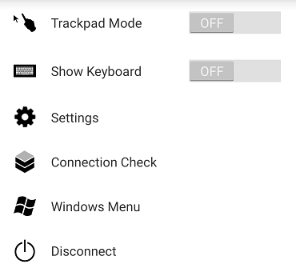

# WorkSpaces Android client application

The following information will help you get started with the WorkSpaces Android client application.

###### Contents

- [Requirements](#android-requirements "#android-requirements")
- [Setup and installation](#android_setup "#android_setup")
- [Connect to your WorkSpace](#android_connecting "#android_connecting")
- [Gestures](#android_gestures "#android_gestures")
- [Sidebar menu](#android_sidebar_menu "#android_sidebar_menu")
- [Keyboard](#android_keyboard "#android_keyboard")
- [Trackpad mode](#android_trackpad_mode "#android_trackpad_mode")
- [Display support](#android_display_support "#android_display_support")
- [Disconnect](#android_disconnect "#android_disconnect")
- [Clipboard support](#android_clipboard_support "#android_clipboard_support")
- [Release notes](#android-release-notes "#android-release-notes")

## Requirements

The Amazon WorkSpaces Android client application requires the following:

- Amazon Kindle Fire tablets released after 2012 with Fire OS 4.0 and later.
- Android tablets and phones with Android OS 4.4 and later. The client application
  works on most devices with Android version 4.4 or later, but some devices might
  not be compatible.

###### Note

Versions of the Android client application after 2.4.15 require devices
with Android OS 9 and later.

Versions of the Android client application after 5.0.0 require devices
with Android OS 13 and later.

- Chromebooks that support installing Android applications. Chromebooks launched in 2019 or later
  support installing Android applications. However, some Chromebooks launched before 2019 might not
  support installing Android applications.

We recommend using the Android client application if your Chromebook supports it. To determine
whether your Chromebook is compatible with the Amazon WorkSpaces Android client application
or whether it requires the Amazon WorkSpaces Chromebook client application, see the
[installation steps for Chromebooks launched before 2019](#chromebook_install_before_2019 "#chromebook_install_before_2019").

- Devices that support running 64-bit applications.

###### Note

- The WorkSpaces Android client application is not available for the DCV.
- If your WorkSpace is located in the Asia Pacific (Mumbai) Region, you must use version 2.4.19 or
  later of the Amazon WorkSpaces Android client application.

## Setup and installation

To download and install the client application, complete the following procedure.

###### (For devices

other than Chromebooks launched before 2019) To download and install the client application

1. On your device, open [https://clients.amazonworkspaces.com/](https://clients.amazonworkspaces.com/ "https://clients.amazonworkspaces.com/") and choose the
   link for your device (either **Android/Chromebook** or **Fire Tablet**).
2. Download and install the application.
3. Verify that the Amazon WorkSpaces client application icon appears on one of the
   device desktops.

###### (For

Chromebooks launched before 2019) To download and install the client application

1. Determine whether your Chromebook supports Android applications by checking its status on the list
   of [Chrome OS Systems Supporting Android Apps](https://sites.google.com/a/chromium.org/dev/chromium-os/chrome-os-systems-supporting-android-apps "https://sites.google.com/a/chromium.org/dev/chromium-os/chrome-os-systems-supporting-android-apps").
2. Depending on your Chromebook's status, do one of the following:
   - If your Chromebook's status is marked as **Stable Channel**, do the
     following:
     1. Follow the instructions in [Install Android apps on your Chromebook](https://support.google.com/chromebook/answer/7021273 "https://support.google.com/chromebook/answer/7021273") to enable your Chromebook to install Android
        applications.

     ###### Note

     In some cases, your WorkSpaces administrator might need to enable your
     Chromebook to install Android applications. If you are unable to install the
     Android client application on your Chromebook, contact your WorkSpaces
     administrator for assistance. 2. On your Chromebook, open [https://clients.amazonworkspaces.com/](https://clients.amazonworkspaces.com/ "https://clients.amazonworkspaces.com/")
     and choose **Android/Chromebook**. 3. Download and install the application. 4. Verify that the Amazon WorkSpaces client application icon appears on one of the
     device desktops.

   - If your Chromebook's status is marked as **Planned** or if your
     Chromebook does not appear on the list, do the following:
     1. Determine whether your Chromebook meets the requirements of the Amazon WorkSpaces
        Chromebook client application:
        - The WorkSpaces Chromebook client application requires a Chromebook with Chrome
          OS version 45 or later. The client application works on most Chromebooks
          with version 45 or later, but some devices might not be compatible. If you
          have problems with a device, you can report the problem on the
          [WorkSpaces forum](https://forums.aws.amazon.com/forum.jspa?forumID=164 "https://forums.aws.amazon.com/forum.jspa?forumID=164").
        - To check the version of Chrome OS on your Chromebook, go to the status
          area, where your account picture appears. Choose **Settings**,
          **About Chrome OS**.

     2. If your Chromebook is running Chrome OS version 45 or later, open the link to the
        [Amazon WorkSpaces Chromebook client application](https://chromewebstore.google.com/detail/amazon-workspaces/ipaonomeflaallpcgnhcaoonfghaojha "https://chromewebstore.google.com/detail/amazon-workspaces/ipaonomeflaallpcgnhcaoonfghaojha") on the Chrome Web Store.
     3. Download and install the application.
     4. Verify that the Amazon WorkSpaces client application icon appears in your Chromebook search.

## Connect to your WorkSpace

To connect to your WorkSpace, complete the following procedure.

###### To connect to your WorkSpace

1. On your device, open the Amazon WorkSpaces client application.
2. The first time that you run the client application, you are prompted for your
   registration code, which is contained in your welcome email. The WorkSpaces client
   application uses the registration code and user name to identify which WorkSpace
   to connect to. When you launch the client application later, the same
   registration code is used. You can enter a different registration code by
   launching the client application and tapping **Enter new registration
   code** on the login screen.
3. Enter your sign-in credentials and tap **Sign In**.
   If your
   WorkSpaces administrator has enabled multi-factor authentication for your
   organization's WorkSpaces, you are prompted for a passcode to complete your
   login. Your WorkSpaces administrator will provide more information about how to
   obtain your passcode.
4. If your WorkSpaces administrator has not disabled the "Remember Me" feature, you
   are prompted to save your credentials securely so that you can connect to your
   WorkSpace easily in the future. Your credentials will be securely cached up to
   the maximum lifetime of your Kerberos ticket.

After the client application connects to your WorkSpace, your WorkSpace
desktop is displayed.

## Gestures

The following gestures are supported for the WorkSpaces Android client
application.

Single tap
Equivalent to a single click in Windows.

Double tap
Equivalent to a double-click in Windows.

Two finger single tap
Equivalent to a right-click in Windows.

Two finger double tap
Toggles the on-screen keyboard display. If a keyboard is
attached to the device, a set of keyboard shortcuts is shown instead.

Swipe from left
Displays the sidebar menu. For more information, see
[Sidebar menu](#android_sidebar_menu "#android_sidebar_menu").

Two finger scroll
Scrolls vertically.

Two finger pinch
Zooms display in or out.

Two finger pan
Pans the desktop when zoomed in.

## Sidebar menu

The sidebar menu is displayed by swiping from the left side of the screen.

The sidebar menu provides quick access to the following features:

**Trackpad Mode** – Turns the trackpad on or off. For more information, see
[Trackpad mode](#android_trackpad_mode "#android_trackpad_mode").

**Show Keyboard** – Toggles the display of the on-screen keyboard. If a keyboard is
already attached, only a row of keyboard shortcuts is displayed.

**Settings** – Displays controls to change the screen resolution or the scroll direction.

**Connection Check** – Displays the connection status.

**Windows Menu** – Displays the Windows Start Menu.

**Disconnect** – Disconnects the client application without logging off.

## Keyboard

To toggle the display of the on-screen keyboard, double-tap with two fingers anywhere
on the screen. Special key combinations are displayed in the top row of the
keyboard.

## Trackpad mode

The trackpad mode is set using the [sidebar menu](#android_sidebar_menu "#android_sidebar_menu").

### Trackpad mode off

When trackpad mode is off, the mouse cursor is placed wherever you tap your finger. In
this mode, a single tap is equivalent to a left mouse button click and a two finger
single tap is equivalent to a right mouse button click.

### Trackpad mode on

When trackpad mode is on, the mouse cursor tracks the movement of your finger on the
screen. In this mode, simulate a left mouse button click by tapping the left mouse
button icon.

Simulate a right mouse button click by tapping the right mouse button icon.

## Display support

The Amazon WorkSpaces Android client application supports a single monitor. Multiple monitors
are not supported.

The maximum supported screen resolution depends on your device's display. Although specific
screen resolution settings are offered in the **Settings** menu, if you choose
**Default**, WorkSpaces matches the resolution that you've set on your device.
If your device supports a resolution higher than 2800x1752, choose **Default**
if you want WorkSpaces to use a higher resolution.

| Resolution setting                                                                   | When to use                                                                                                                                                                                                                                                                                                                                                                                                                                                                          |
| ------------------------------------------------------------------------------------ | ------------------------------------------------------------------------------------------------------------------------------------------------------------------------------------------------------------------------------------------------------------------------------------------------------------------------------------------------------------------------------------------------------------------------------------------------------------------------------------ | -------------------------------------------------------------------------------------------------------------------------------------------------------------------------------------------------------------------------------------------------------------------------------------------------------------------------------------------------------------------------------------------------------------------------------------------------------------------------------------------------------------------------------------------------------------------------------------------------------------------------------------------------------------------------------------------------------------------------------------------------------------------------------------------------------------------------------------------------------------------------------------------------- | ------------------------------------------------------------------------------------------------------------------------------------------------------------------------------------------------------------------------------------------------------------------------------------------------------------------------------------------------------------------------------------------------------------------------------------------------------------------------------------------------------------------------------- |
| **2800x1752**, **2560x1440**, **1920x1080**, **1600x900**, **1280x720**, **960x540** | Choose one of these settings if you want your display to use this exact resolution.                                                                                                                                                                                                                                                                                                                                                                                                  |
| **Default**                                                                          | Choose this setting to match the resolution that you've set on your device, up to the maximum resolution that your device supports. If you choose **Default** and you're using a high DPI display, the screen resolution is adjusted to a lower one so that text and icons are easier to read.                                                                                                                                                                                       |
| **High DPI Mode**                                                                    | Choose this setting for better maximum resolution of your WorkSpace on high DPI displays. If you choose **High DPI Mode** and the text and icons on your WorkSpace are smaller than you'd prefer, either choose **Default** instead, or adjust the scaling settings on your WorkSpace. For more information about high DPI mode and how to adjust the scaling settings on your WorkSpace, see [Enabling high DPI display for WorkSpaces](high_dpi_support.md "high_dpi_support.md"). | ## Disconnect To disconnect the Android client, display the sidebar menu, tap the disconnect icon, and tap **Disconnect**. You can also log off of the WorkSpace, which disconnects the client. ## Clipboard support The clipboard supports copy and paste of text and HTML content only. The maximum uncompressed object size is 20 MB. For more information, see [I'm having trouble copying and pasting](client_troubleshooting.md#copy_paste "client_troubleshooting.md#copy_paste"). ###### Note When copying from a Microsoft Office app, the clipboard only contains the last copied item, and the item is converted into standard format. If you copy content larger than 890 KB from a Microsoft Office app, the app might become slow or unresponsive for up to 5 seconds. ## Release notes The following table describes the changes to each release of the Android client application. |
| Release                                                                              | Date                                                                                                                                                                                                                                                                                                                                                                                                                                                                                 | Changes                                                                                                                                                                                                                                                                                                                                                                                                                                                                                                                                                                                                                                                                                                                                                                                                                                                                                            |
| ---                                                                                  | ---                                                                                                                                                                                                                                                                                                                                                                                                                                                                                  | ---                                                                                                                                                                                                                                                                                                                                                                                                                                                                                                                                                                                                                                                                                                                                                                                                                                                                                                |
| 5.1.1                                                                                | April 2, 2025                                                                                                                                                                                                                                                                                                                                                                                                                                                                        |  • Updated PCoIP SDK for Android.  • Updated the .NET SDK for Android.  • Bug fixes and enhancements.                                                                                                                                                                                                                                                                                                                                                                                                                                                                                                                                                                                                                                                                                                                                                                                     |
| 5.0.1                                                                                | November 6, 2024                                                                                                                                                                                                                                                                                                                                                                                                                                                                     | Bug fixes and enhancements.                                                                                                                                                                                                                                                                                                                                                                                                                                                                                                                                                                                                                                                                                                                                                                                                                                                                        |
| 5.0.0                                                                                | February 26, 2024                                                                                                                                                                                                                                                                                                                                                                                                                                                                    |  • Added support for the Israel (Tel Aviv) Region.  • Updated PCoIP SDK for Android.  • Added accessibility improvements, including screen reader support and keyboard-only navigation enhancement.                                                                                                                                                                                                                                                                                                                                                                                                                                                                                                                                                                                                                                                                                       |
| 4.0.6                                                                                | August 18, 2023                                                                                                                                                                                                                                                                                                                                                                                                                                                                      |  • Improved client custom branding by storing assets in the same AWS Regions as provisioned WorkSpaces.  • Resolved the Spanish keyboard mapping issues.                                                                                                                                                                                                                                                                                                                                                                                                                                                                                                                                                                                                                                                                                                                                     |
| 4.0.5                                                                                | May 5, 2023                                                                                                                                                                                                                                                                                                                                                                                                                                                                          |  • Added connection support to WorkSpaces provisioned in the AWS GovCloud (US-East) Region  • Added accessibility enhancements                                                                                                                                                                                                                                                                                                                                                                                                                                                                                                                                                                                                                                                                                                                                                               |
| 4.0.4                                                                                | December 15, 2022                                                                                                                                                                                                                                                                                                                                                                                                                                                                    | Updated the .NET framework for the WorkSpaces Android client                                                                                                                                                                                                                                                                                                                                                                                                                                                                                                                                                                                                                                                                                                                                                                                                                                       |
| 4.0.3                                                                                | October 20, 2022                                                                                                                                                                                                                                                                                                                                                                                                                                                                     | Upgraded target Android API level to continue supporting 64-bit Android 12 and later versions                                                                                                                                                                                                                                                                                                                                                                                                                                                                                                                                                                                                                                                                                                                                                                                                      |
| 4.0.2                                                                                | August 3, 2022                                                                                                                                                                                                                                                                                                                                                                                                                                                                       | Resolved an issue that the touchpad scrolling was too sensitive within WorkSpaces on Chromebooks                                                                                                                                                                                                                                                                                                                                                                                                                                                                                                                                                                                                                                                                                                                                                                                                   |
| 4.0.1                                                                                | May 12, 2022                                                                                                                                                                                                                                                                                                                                                                                                                                                                         |  • Updated PCoIP SDK for the WorkSpaces Android client  • Updated WSP SDK for the WorkSpaces Android client                                                                                                                                                                                                                                                                                                                                                                                                                                                                                                                                                                                                                                                                                                                                                                                  |
| 3.0.4                                                                                | October 14, 2021                                                                                                                                                                                                                                                                                                                                                                                                                                                                     |  • Resolves crashing issues related to invalid cursor data  • Bug fixes                                                                                                                                                                                                                                                                                                                                                                                                                                                                                                                                                                                                                                                                                                                                                                                                                      |
| 3.0.2                                                                                | July 13, 2021                                                                                                                                                                                                                                                                                                                                                                                                                                                                        | Minor enhancements and fixes                                                                                                                                                                                                                                                                                                                                                                                                                                                                                                                                                                                                                                                                                                                                                                                                                                                                       |
| 3.0.1                                                                                | June 30, 2021                                                                                                                                                                                                                                                                                                                                                                                                                                                                        |  • Adds support for self-service WorkSpace management capabilities.  • Adds support for certificate-based trusted devices.                                                                                                                                                                                                                                                                                                                                                                                                                                                                                                                                                                                                                                                                                                                                                                   |
| 2.4.21                                                                               | May 20, 2021                                                                                                                                                                                                                                                                                                                                                                                                                                                                         |  • Adds 2800x1752 and High DPI Mode in resolution options  • Addresses a crash scenario related to cursor rendering  • Minor enhancements and fixes NoteBecause the 32-bit PCoIP SDK for Android has reached the end of support, Version 2.4.21 is the final release of Amazon WorkSpaces Android client, which supports both 32-bit and 64-bit for Android 9 and above. Next release onwards, Amazon WorkSpaces Android client will only support 64-bit.                                                                                                                                                                                                                                                                                                                                                                                                                                 |
| 2.4.20                                                                               | March 25, 2021                                                                                                                                                                                                                                                                                                                                                                                                                                                                       |  • Addresses a crash issue at login  • Minor enhancements and fixes                                                                                                                                                                                                                                                                                                                                                                                                                                                                                                                                                                                                                                                                                                                                                                                                                          |
| 2.4.19                                                                               | February 22, 2021                                                                                                                                                                                                                                                                                                                                                                                                                                                                    | Enhanced support for resolution 2560x1440                                                                                                                                                                                                                                                                                                                                                                                                                                                                                                                                                                                                                                                                                                                                                                                                                                                          |
| 2.4.18                                                                               | October 19, 2020                                                                                                                                                                                                                                                                                                                                                                                                                                                                     |  • Adds support for certain Chromebook models that were previously not supported  • Fixes multiple key-mapping issues pertaining to English, French, and Japanese keyboard layouts  • Adds support for faster reconnection to WorkSpaces on Chromebook devices when resuming from sleep mode                                                                                                                                                                                                                                                                                                                                                                                                                                                                                                                                                                                              |
| 2.4.17                                                                               | February 24, 2020                                                                                                                                                                                                                                                                                                                                                                                                                                                                    | Minor enhancements and fixes                                                                                                                                                                                                                                                                                                                                                                                                                                                                                                                                                                                                                                                                                                                                                                                                                                                                       |
| 2.4.16                                                                               | January 30, 2020                                                                                                                                                                                                                                                                                                                                                                                                                                                                     | Added support for versions above 64-bit Android 9                                                                                                                                                                                                                                                                                                                                                                                                                                                                                                                                                                                                                                                                                                                                                                                                                                                  |
| 2.4.15                                                                               | June 24, 2019                                                                                                                                                                                                                                                                                                                                                                                                                                                                        |  • Adds support for mouse cursor contextual shape changes  • This is the last version that supports versions below Android 8                                                                                                                                                                                                                                                                                                                                                                                                                                                                                                                                                                                                                                                                                                                                                                 |
| 2.4.14                                                                               |                                                                                                                                                                                                                                                                                                                                                                                                                                                                                      |  • Adds support for the Right alt key mapping with Japanese keyboard layouts  • Resolves an occasional issue with blue overlay                                                                                                                                                                                                                                                                                                                                                                                                                                                                                                                                                                                                                                                                                                                                                               |
| 2.4.13                                                                               |                                                                                                                                                                                                                                                                                                                                                                                                                                                                                      | Minor fixes                                                                                                                                                                                                                                                                                                                                                                                                                                                                                                                                                                                                                                                                                                                                                                                                                                                                                        |
| 2.4.12                                                                               |                                                                                                                                                                                                                                                                                                                                                                                                                                                                                      |  • Resolves an issue that makes the login page bounce on a few devices  • Minor fixes                                                                                                                                                                                                                                                                                                                                                                                                                                                                                                                                                                                                                                                                                                                                                                                                        |
| 2.4.11                                                                               |                                                                                                                                                                                                                                                                                                                                                                                                                                                                                      |  • Resolves an issue with content being selected with two-finger scrolling  • Minor fixes                                                                                                                                                                                                                                                                                                                                                                                                                                                                                                                                                                                                                                                                                                                                                                                                    |
| 2.4.10                                                                               |                                                                                                                                                                                                                                                                                                                                                                                                                                                                                      | Improves support for Japanese keyboard layouts                                                                                                                                                                                                                                                                                                                                                                                                                                                                                                                                                                                                                                                                                                                                                                                                                                                     |
| 2.4.9                                                                                |                                                                                                                                                                                                                                                                                                                                                                                                                                                                                      | Adds support for Samsung Galaxy Note 9                                                                                                                                                                                                                                                                                                                                                                                                                                                                                                                                                                                                                                                                                                                                                                                                                                                             |
| 2.4.7                                                                                |                                                                                                                                                                                                                                                                                                                                                                                                                                                                                      |  • Improves clipboard redirection  • Improves DeX startup                                                                                                                                                                                                                                                                                                                                                                                                                                                                                                                                                                                                                                                                                                                                                                                                                                    |
| 2.4.6                                                                                |                                                                                                                                                                                                                                                                                                                                                                                                                                                                                      | Adds support for uniform resource identifiers (URIs), which enable login orchestration                                                                                                                                                                                                                                                                                                                                                                                                                                                                                                                                                                                                                                                                                                                                                                                                             |
| 2.4.5                                                                                |                                                                                                                                                                                                                                                                                                                                                                                                                                                                                      |  • Adds support for time zone redirection for more Regions: America/Indianapolis America/Indiana/Marengo America/Indiana/Vevay America/Indiana/Indianapolis  • Includes text changes to the Login page user interface                                                                                                                                                                                                                                                                                                                                                                                                                                                                                                                                                                                                                                                                        |
| 2.4.4                                                                                |                                                                                                                                                                                                                                                                                                                                                                                                                                                                                      | Minor improvements to session provision handling                                                                                                                                                                                                                                                                                                                                                                                                                                                                                                                                                                                                                                                                                                                                                                                                                                                   |
| 2.4.2                                                                                |                                                                                                                                                                                                                                                                                                                                                                                                                                                                                      |  • Minor fixes  • Improves copy and paste                                                                                                                                                                                                                                                                                                                                                                                                                                                                                                                                                                                                                                                                                                                                                                                                                                                    |
| 2.4.0                                                                                |                                                                                                                                                                                                                                                                                                                                                                                                                                                                                      |  • New logo  • Improves the user interface and stability                                                                                                                                                                                                                                                                                                                                                                                                                                                                                                                                                                                                                                                                                                                                                                                                                                     |
| 2.3.4                                                                                |                                                                                                                                                                                                                                                                                                                                                                                                                                                                                      |  • Addresses a display overlay issue on Android Oreo when a mouse is connected to the device  • Adds support for Samsung S8/S8+ screen configurations  • Resolves minor issues                                                                                                                                                                                                                                                                                                                                                                                                                                                                                                                                                                                                                                                                                                            |
| 2.3.3                                                                                |                                                                                                                                                                                                                                                                                                                                                                                                                                                                                      | Localization enhancements                                                                                                                                                                                                                                                                                                                                                                                                                                                                                                                                                                                                                                                                                                                                                                                                                                                                          |
| 2.2.0                                                                                |                                                                                                                                                                                                                                                                                                                                                                                                                                                                                      |  • Adds support for the German language  • Improves the Japanese user interface  • Improves stability                                                                                                                                                                                                                                                                                                                                                                                                                                                                                                                                                                                                                                                                                                                                                                                     |
| 2.1.0                                                                                |                                                                                                                                                                                                                                                                                                                                                                                                                                                                                      |  • Adds support for the following new WorkSpace states: STOPPING and STOPPED  • Adds support for audio in, enabling you to make calls or attend web conferences  • Resolves minor issues and improves stability                                                                                                                                                                                                                                                                                                                                                                                                                                                                                                                                                                                                                                                                           |
| 2.0.0                                                                                |                                                                                                                                                                                                                                                                                                                                                                                                                                                                                      |  • Adds support for saving registration codes, enabling you to switch WorkSpaces without re-entering the registration codes  • Improves usability and stability                                                                                                                                                                                                                                                                                                                                                                                                                                                                                                                                                                                                                                                                                                                              |
| 1.0.15                                                                               |                                                                                                                                                                                                                                                                                                                                                                                                                                                                                      |  • Adds advanced connection health checks, enabling you to troubleshoot connection issues  • Improves stability                                                                                                                                                                                                                                                                                                                                                                                                                                                                                                                                                                                                                                                                                                                                                                              |
| 1.0.11                                                                               |                                                                                                                                                                                                                                                                                                                                                                                                                                                                                      |  • Improves the user interface and login experience  • Adds support for choosing the screen resolution  • Adds support for choosing the scrolling direction                                                                                                                                                                                                                                                                                                                                                                                                                                                                                                                                                                                                                                                                                                                               |
| 1.0.10                                                                               |                                                                                                                                                                                                                                                                                                                                                                                                                                                                                      |  • Improves the login experience  • Adds time zone synchronization between the local device and the WorkSpace                                                                                                                                                                                                                                                                                                                                                                                                                                                                                                                                                                                                                                                                                                                                                                                |
| 1.0.9                                                                                |                                                                                                                                                                                                                                                                                                                                                                                                                                                                                      | Improves the login experience                                                                                                                                                                                                                                                                                                                                                                                                                                                                                                                                                                                                                                                                                                                                                                                                                                                                      |
| 1.0                                                                                  |                                                                                                                                                                                                                                                                                                                                                                                                                                                                                      | Initial release                                                                                                                                                                                                                                                                                                                                                                                                                                                                                                                                                                                                                                                                                                                                                                                                                                                                                    | The following table describes the changes to each release of the Chromebook client application. ###### Note Version 2.4.13 is the final release of the Amazon WorkSpaces Chromebook client application. Because [Google is phasing out support for Chrome Apps](https://blog.chromium.org/2020/01/moving-forward-from-chrome-apps.html "https://blog.chromium.org/2020/01/moving-forward-from-chrome-apps.html"), there will be no further updates to the WorkSpaces Chromebook client application, and its use is unsupported. |
| Release                                                                              | Date                                                                                                                                                                                                                                                                                                                                                                                                                                                                                 | Changes                                                                                                                                                                                                                                                                                                                                                                                                                                                                                                                                                                                                                                                                                                                                                                                                                                                                                            |
| ---                                                                                  | ---                                                                                                                                                                                                                                                                                                                                                                                                                                                                                  | ---                                                                                                                                                                                                                                                                                                                                                                                                                                                                                                                                                                                                                                                                                                                                                                                                                                                                                                |
| 2.4.13                                                                               | April 24, 2019                                                                                                                                                                                                                                                                                                                                                                                                                                                                       | Fixed an issue that causes the app not to restore to full-screen mode after a screen unlock                                                                                                                                                                                                                                                                                                                                                                                                                                                                                                                                                                                                                                                                                                                                                                                                        |
| 2.4.12                                                                               |                                                                                                                                                                                                                                                                                                                                                                                                                                                                                      | Minor bug fixes                                                                                                                                                                                                                                                                                                                                                                                                                                                                                                                                                                                                                                                                                                                                                                                                                                                                                    |
| 2.4.11                                                                               |                                                                                                                                                                                                                                                                                                                                                                                                                                                                                      | Minor bug fixes                                                                                                                                                                                                                                                                                                                                                                                                                                                                                                                                                                                                                                                                                                                                                                                                                                                                                    |
| 2.4.10                                                                               |                                                                                                                                                                                                                                                                                                                                                                                                                                                                                      | Improves support for Japanese keyboard layouts                                                                                                                                                                                                                                                                                                                                                                                                                                                                                                                                                                                                                                                                                                                                                                                                                                                     |
| 2.4.8                                                                                |                                                                                                                                                                                                                                                                                                                                                                                                                                                                                      | Improves support for UK keyboards                                                                                                                                                                                                                                                                                                                                                                                                                                                                                                                                                                                                                                                                                                                                                                                                                                                                  |
| 2.4.7                                                                                |                                                                                                                                                                                                                                                                                                                                                                                                                                                                                      |  • Improves clipboard redirection  • Adds support for tap-to-click for trackpads  • Improves device resolution                                                                                                                                                                                                                                                                                                                                                                                                                                                                                                                                                                                                                                                                                                                                                                            |
| 2.4.6                                                                                |                                                                                                                                                                                                                                                                                                                                                                                                                                                                                      |  • Resolves an issue that causes screens to freeze  • Resolves trackpad issues                                                                                                                                                                                                                                                                                                                                                                                                                                                                                                                                                                                                                                                                                                                                                                                                               |
| 2.4.5                                                                                |                                                                                                                                                                                                                                                                                                                                                                                                                                                                                      |  • Adds support for time zone redirection for more Regions: America/Indianapolis America/Indiana/Marengo America/Indiana/Vevay America/Indiana/Indianapolis  • Includes text changes to the Login page user interface                                                                                                                                                                                                                                                                                                                                                                                                                                                                                                                                                                                                                                                                        |
| 2.4.4                                                                                |                                                                                                                                                                                                                                                                                                                                                                                                                                                                                      | Minor improvements to session provision handling                                                                                                                                                                                                                                                                                                                                                                                                                                                                                                                                                                                                                                                                                                                                                                                                                                                   |
| 2.4.2                                                                                |                                                                                                                                                                                                                                                                                                                                                                                                                                                                                      | Resolves a bug with Caps Lock                                                                                                                                                                                                                                                                                                                                                                                                                                                                                                                                                                                                                                                                                                                                                                                                                                                                      |
| 2.4.0                                                                                |                                                                                                                                                                                                                                                                                                                                                                                                                                                                                      |  • New logo  • Improves the user interface and stability                                                                                                                                                                                                                                                                                                                                                                                                                                                                                                                                                                                                                                                                                                                                                                                                                                     |
| 2.2.7                                                                                |                                                                                                                                                                                                                                                                                                                                                                                                                                                                                      | Resolves minor issues                                                                                                                                                                                                                                                                                                                                                                                                                                                                                                                                                                                                                                                                                                                                                                                                                                                                              |
| 2.2.4                                                                                |                                                                                                                                                                                                                                                                                                                                                                                                                                                                                      | Localization enhancements                                                                                                                                                                                                                                                                                                                                                                                                                                                                                                                                                                                                                                                                                                                                                                                                                                                                          |
| 2.2.1                                                                                |                                                                                                                                                                                                                                                                                                                                                                                                                                                                                      |  • Adds support for the German language  • Improves the Japanese user interface  • Improves stability                                                                                                                                                                                                                                                                                                                                                                                                                                                                                                                                                                                                                                                                                                                                                                                     |
| 2.1.3                                                                                |                                                                                                                                                                                                                                                                                                                                                                                                                                                                                      |  • Adds support for the following new WorkSpace states: STOPPING and STOPPED  • Adds support for audio in, enabling you to make calls or attend web conferences  • Resolves minor bugs and improves stability                                                                                                                                                                                                                                                                                                                                                                                                                                                                                                                                                                                                                                                                             |
| 2.0.0                                                                                |                                                                                                                                                                                                                                                                                                                                                                                                                                                                                      |  • Adds support for saving registration codes, enabling you to switch WorkSpaces without re-entering the registration codes  • Improves usability and stability                                                                                                                                                                                                                                                                                                                                                                                                                                                                                                                                                                                                                                                                                                                              |
| 1.0                                                                                  |                                                                                                                                                                                                                                                                                                                                                                                                                                                                                      | Initial release                                                                                                                                                                                                                                                                                                                                                                                                                                                                                                                                                                                                                                                                                                                                                                                                                                                                                    |
