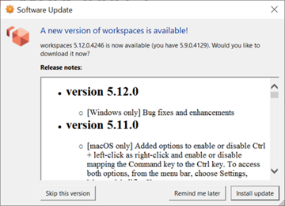

# Troubleshoot WorkSpaces client issues

The following are common issues that you might have with your WorkSpaces client.

###### Issues

- [I didn't receive an email with my Amazon WorkSpaces registration code](#no-welcome-email "#no-welcome-email")
- [After logging in, the Windows client application displays only a white page and I cannot
  connect to my WorkSpace](#windows_white-page "#windows_white-page")
- [My WorkSpaces client gives me a network error, but I am able
  to use other network-enabled apps on my device](#net_error "#net_error")
- [It sometimes takes several minutes to log in to my Windows WorkSpace](#login_delay "#login_delay")
- [When I try to log in, the Amazon WorkSpaces Windows client gets
  stuck on the "Preparing your login page" screen](#login_stuck_preparing_page "#login_stuck_preparing_page")
- [When I try to log in, I get the error message: "No network.
  Network connection lost. Check your network connection or contact your administrator for help."](#login_proxy_server "#login_proxy_server")
- [The Amazon WorkSpaces Windows client application login page is very tiny](#login_tiny_page "#login_tiny_page")
- [I see the following error message: "WorkSpace Status: Unhealthy.
  We were unable to connect you to your WorkSpace. Please try again in a few minutes."](#workspace_unhealthy "#workspace_unhealthy")
- [Sometimes I am logged off of my Windows WorkSpace, even though I closed the session, but did
  not log off](#logged_out "#logged_out")
- [I forgot my password and tried to reset it, but I didn’t
  receive an email with a reset link](#reset_password "#reset_password")
- [I can't connect to the internet from my
  WorkSpace](#internet_access "#internet_access")
- [I installed a third-party security software package and
  now I can't connect to my WorkSpace](#security_software "#security_software")
- [I am getting a "network connection is slow" warning when
  connected to my WorkSpace](#latency_warning "#latency_warning")
- [I got an "invalid certificate" error on the client
  application. What does that mean?](#client_cert_error "#client_cert_error")
- [I'm having trouble when I try to connect to my
  Windows WorkSpace using Web Access](#webaccess_connection_issues "#webaccess_connection_issues")
- [I see the following error message: "Device can't connect to the
  registration service. Check your network settings."](#registration_failure "#registration_failure")
- [I skipped an update to my client application and am having
  trouble updating my client to the latest version](#client_update_skipped "#client_update_skipped")
- [My headset doesn't work in my WorkSpace](#headset_problems "#headset_problems")
- [I am unable to install the Android client application on my Chromebook](#chromebook_android_app "#chromebook_android_app")
- [I'm getting the wrong characters when I type; for example, I get
  \ and | when I try to type quotation marks (' and ")](#lang_keyboard_mismatch "#lang_keyboard_mismatch")
- [The WorkSpaces client application won't run on my Mac](#older_client_osx "#older_client_osx")
- [I'm having trouble using the Windows logo key in Windows WorkSpaces when working on a Mac](#windows_key_osx "#windows_key_osx")
- [My WorkSpace looks blurry on my Mac](#screen_blurry_osx "#screen_blurry_osx")
- [I'm having trouble copying and pasting](#copy_paste "#copy_paste")
- [My screen is flickering or not updating properly, or
  my mouse isn't clicking in the right place](#screen_artifacts "#screen_artifacts")
- [The WorkSpaces client for Windows prompts to
  update to a version that is already installed](#all_users_update_install "#all_users_update_install")
- [I don't see video-in devices listed under Devices
  on my WorkSpaces Windows client](#media-feature-pack "#media-feature-pack")

## I didn't receive an email with my Amazon WorkSpaces registration code

Contact your WorkSpaces administrator for assistance.

## After logging in, the Windows client application displays only a white page and I cannot

connect to my WorkSpace

This problem can be caused by expired Verisign/Symantec certificates on your client computer
(not your WorkSpace). Remove the expired certificate and launch the client application
again.

###### To find and remove expired Verisign/Symantec certificates

1. In the Windows **Control Panel** on your client computer
   (not your WorkSpace), choose **Network and Internet**.
2. Choose **Internet Options**.
3. In the **Internet Properties** dialog box, choose
   **Content**, **Certificates**.
4. In the **Certificates** dialog box, choose the
   **Intermediate Certificate Authorities** tab. In the list
   of certificates, select all certificates that were issued by Verisign or
   Symantec that are also expired, and choose **Remove**. Do not
   remove any certificates that are not expired.
5. On the **Trusted Root Certificate Authorities** tab, select
   all certificates that were issued by Verisign or Symantec that are also expired,
   and choose **Remove**. Do not remove any certificates that are
   not expired.
6. Close the **Certificates** dialog box and the
   **Internet Properties** dialog box.

## My WorkSpaces client gives me a network error, but I am able

to use other network-enabled apps on my device

The WorkSpaces client applications rely on access to resources in the AWS Cloud, and
require a connection that provides at least 1 Mbps download bandwidth. If your device
has an intermittent connection to the network, the WorkSpaces client application might
report an issue with the network.

WorkSpaces enforces the use of digital certificates issued by Amazon Trust Services, as of
May 2018. Amazon Trust Services is already a trusted Root certificate authority (CA) on
the operating systems that are supported by WorkSpaces. If the Root CA list for your
operating system is not up to date, your device cannot connect to WorkSpaces and the
client gives a network error.

###### To recognize connection issues due to certificate failures

- PCoIP zero clients — The following error message is displayed:

```
Failed to connect. The server provided a certificate that is invalid. See below for details:
- The supplied certificate is invalid due to timestamp
- The supplied certificate is not rooted in the devices local certificate store
```

- Other clients — The health checks fail with a red warning triangle for **Internet**.

###### To resolve certificate failures

Use one of the following solutions for certificate failures.

- For the Windows client, download and install the latest Windows client application from [https://clients.amazonworkspaces.com/](https://clients.amazonworkspaces.com/ "https://clients.amazonworkspaces.com/")

.
During installation, the client application ensures that your operating system trusts certificates
issued by Amazon Trust Services. If updating your client does not resolve the issue, contact your Amazon WorkSpaces administrator.

- For all other clients, contact your Amazon WorkSpaces administrator.

## It sometimes takes several minutes to log in to my Windows WorkSpace

Group Policy settings that are set by your system administrator can cause a delay on
login after your Windows WorkSpace has been launched or rebooted. This delay occurs
while the Group Policy settings are being applied to the WorkSpace, and is
normal.

## When I try to log in, the Amazon WorkSpaces Windows client gets

stuck on the "Preparing your login page" screen

When starting versions 3.0.4 and 3.0.5 of the WorkSpaces Windows client application on a Windows 10
machine, the client might get stuck on the "Preparing your login page" screen. To avoid this issue,
either upgrade to version 3.0.6 of the Windows client application or do not run the Windows client
application with administrator (elevated) privileges.

## When I try to log in, I get the error message: "No network.

Network connection lost. Check your network connection or contact your administrator for help."

When you try to log in to your WorkSpace using some 3.0+ versions of the Windows, macOS, and Linux
WorkSpaces client applications, you might receive a "No network" error on the login page if you have
specified a custom proxy server.

- **Windows client** — To avoid this issue
  with the Windows client, upgrade to version 3.0.12 or later.
  For more information about configuring the proxy server settings in the Windows
  client, see [Proxy Server for Windows
  Client](amazon-workspaces-windows-client.md#windows_proxy_server "amazon-workspaces-windows-client.md#windows_proxy_server").
- **macOS client** — To work around this
  issue, use the proxy server that's specified in the device operating system
  instead of using a custom proxy server. For more information about configuring
  the proxy server settings in the macOS client, see [Proxy Server for macOS Client](amazon-workspaces-osx-client.md#osx_proxy_server "amazon-workspaces-osx-client.md#osx_proxy_server").
- **Linux client** — To avoid this issue
  with the Linux client, upgrade to version 3.1.5 or later. If you can't upgrade,
  you can work around this issue by using the proxy server that's specified in the
  device operating system instead of using a custom proxy server. For more
  information about configuring the proxy server settings in the Linux client, see
  [Proxy Server for Linux
  Client](amazon-workspaces-linux-client.md#linux_proxy_server "amazon-workspaces-linux-client.md#linux_proxy_server").

## The Amazon WorkSpaces Windows client application login page is very tiny

Running the WorkSpaces Windows client with administrator (elevated) privileges might result in viewing
issues in high DPI environments. To avoid these issues, run the client in user mode instead.

## I see the following error message: "WorkSpace Status: Unhealthy.

We were unable to connect you to your WorkSpace. Please try again in a few minutes."

If you just started or restarted your WorkSpace, wait a few minutes, and then try to log in again.

If you continue to receive this error message, you can try the following actions (if your WorkSpaces
administrator has enabled you to do them):

- [Restarting a WorkSpace](client-restart-workspace.md "client-restart-workspace.md")
- [Rebuilding a WorkSpace](client-rebuild-workspace.md "client-rebuild-workspace.md")

If you are unable to restart or rebuild the WorkSpace yourself, or if you continue to see the error message
after doing so, contact your WorkSpaces administrator for assistance.

## Sometimes I am logged off of my Windows WorkSpace, even though I closed the session, but did

not log off

Your system administrator applied a new or updated Group Policy setting to your
Windows WorkSpace that requires a logoff of a disconnected session.

## I forgot my password and tried to reset it, but I didn’t

receive an email with a reset link

Contact your WorkSpaces administrator for assistance. Contact your company's IT department if you don't know who your WorkSpaces administrator is.

## I can't connect to the internet from my

WorkSpace

WorkSpaces cannot communicate with the internet by default. Your Amazon WorkSpaces administrator must
explicitly provide internet access.

## I installed a third-party security software package and

now I can't connect to my WorkSpace

You can install any type of security or firewall software on your WorkSpace, but WorkSpaces
requires that certain inbound and outbound ports are open on the WorkSpace. If the
security or firewall software that you install blocks these ports, the WorkSpace might
not function correctly or might become unreachable. For more information, see
[Port Requirements for WorkSpaces](../adminguide/workspaces-port-requirements.md "../adminguide/workspaces-port-requirements.md")
in the _Amazon WorkSpaces Administration Guide_.

To restore your WorkSpace, [rebuild your WorkSpace](client-rebuild-workspace.md "client-rebuild-workspace.md") if
you still have access to it, or ask your Amazon WorkSpaces administrator to rebuild your WorkSpace. You then
have to reinstall the software and properly configure port access for your WorkSpace.

## I am getting a "network connection is slow" warning when

connected to my WorkSpace

If the round-trip time from your client to your WorkSpace is longer than
100ms, you can still use your WorkSpace, but this might result in a poor
experience. A slow round-trip time can be caused by many factors, but the following are
the most common causes:

- You are too far from the AWS Region that your WorkSpace resides in. For the
  best WorkSpace experience, you should be within 2,000 miles of the AWS Region
  that your WorkSpace is in.
- Your network connection is inconsistent or slow. For the best experience, your
  network connection should provide at least 300 kbps, with capability to provide
  over 1 Mbps when viewing video or using graphics-intensive applications on your
  WorkSpace.

## I got an "invalid certificate" error on the client

application. What does that mean?

The WorkSpaces client application validates the identity of the WorkSpaces service
through an SSL/TLS certificate. If the root certificate authority of the Amazon WorkSpaces
service cannot be verified, the client application displays an error and prevents any
connection to the service. The most common cause is a proxy server that is removing the
root certificate authority and returning an incomplete certificate to the client
application. Contact your network administrator for assistance.

## I'm having trouble when I try to connect to my

Windows WorkSpace using Web Access

Windows WorkSpaces rely on a specific login screen configuration to enable you to log in from
your Web Access client. Your Amazon WorkSpaces administrator might need to configure Group Policy and
Security Policy settings to enable you to log in to your WorkSpace from your Web Access client.
If these settings are not correctly configured, you might experience long login times or black
screens when you try to log in to your WorkSpace. Contact your Amazon WorkSpaces administrator for
assistance.

###### Important

Beginning October 1, 2020, customers will no longer be able to use the Amazon WorkSpaces Web Access client
to connect to Windows 7 custom WorkSpaces or to Windows 7 Bring Your Own License (BYOL) WorkSpaces.

## I see the following error message: "Device can't connect to the

registration service. Check your network settings."

When a registration service failure occurs, you might see the following error message on
the **Connection Health Check** page: "Your device is not able to
connect to the WorkSpaces Registration service. You will not be able to register your
device with WorkSpaces. Please check your network settings."

This error occurs when the WorkSpaces client application can't reach the registration
service. Contact your Amazon WorkSpaces administrator for assistance.

## I skipped an update to my client application and am having

trouble updating my client to the latest version

If you've skipped an update to your Amazon WorkSpaces Windows client application and now want to
update to the latest version of the client, see [Update the WorkSpaces Windows client application to a newer version](amazon-workspaces-windows-client.md#windows_update_client "amazon-workspaces-windows-client.md#windows_update_client").

If you've skipped an update to your Amazon WorkSpaces macOS client application and now want to update
to the latest version of the client, see [Update the WorkSpaces macOS client application to a newer version](amazon-workspaces-osx-client.md#osx_update_client "amazon-workspaces-osx-client.md#osx_update_client").

## My headset doesn't work in my WorkSpace

If you're using the Android, iPad, macOS, Linux, or Windows client application for
Amazon WorkSpaces, and you're having trouble using your headset in your WorkSpace, try the
following steps:

1. Disconnect from your WorkSpace (choose **Amazon WorkSpaces**,
   **Disconnect WorkSpace**).
2. Unplug your headset, and then plug it back in. Verify that it works on your local computer or tablet.
   For a USB headset, make sure that it shows up as a playback device locally on your computer or tablet:
   - For Windows, check the devices listed in the **Control Panel** under
     **Hardware and Sound** > **Sound**. In the
     **Sound** dialog box, choose the **Playback** tab.
   - For macOS, choose the **Apple menu** >
     **System Preferences** > **Sound**
     > **Output**.
   - For iPad, open the **Control Center** and tap the **AirPlay**

   

   button.
   - For Chromebook, open the system tray, and then choose the headphone
     icon next to the volume slider. Select the devices that you want to use
     for audio input and output.

3. Reconnect to your WorkSpace.

Your headset should now work in your WorkSpace. If you're still having trouble with your headset, contact
your WorkSpaces administrator.

###### Note

Audio currently is not supported on Linux WorkSpaces using the
DCV.

## I am unable to install the Android client application on my Chromebook

Version 2.4.13 is the final release of the Amazon WorkSpaces Chromebook client application. Because
[Google is phasing out support for Chrome Apps](https://blog.chromium.org/2020/01/moving-forward-from-chrome-apps.html "https://blog.chromium.org/2020/01/moving-forward-from-chrome-apps.html"), there will be no further updates to the
WorkSpaces Chromebook client application, and its use is unsupported.

For [Chromebooks that support installing Android applications](https://sites.google.com/a/chromium.org/dev/chromium-os/chrome-os-systems-supporting-android-apps "https://sites.google.com/a/chromium.org/dev/chromium-os/chrome-os-systems-supporting-android-apps"), we recommend using the
[WorkSpaces Android client application](amazon-workspaces-android-client.md "amazon-workspaces-android-client.md") instead.

If you are using a Chromebook launched before 2019, see the [installation steps for Chromebooks launched before 2019](amazon-workspaces-android-client.md#chromebook_install_before_2019 "amazon-workspaces-android-client.md#chromebook_install_before_2019") before attempting to install the Amazon WorkSpaces Android
client application.

In some cases, your WorkSpaces administrator might need to enable your Chromebook to install Android
applications. If you are unable to install the Android client application on your Chromebook, contact
your WorkSpaces administrator for assistance.

## I'm getting the wrong characters when I type; for example, I get

\ and | when I try to type quotation marks (' and ")

This behavior might occur if your device is not set to the same language as your WorkSpace, or if you're
using a language-specific keyboard, such as a French keyboard.

To resolve this issue, see [Language and keyboard settings for WorkSpaces](language_keyboard.md "language_keyboard.md").

## The WorkSpaces client application won't run on my Mac

If you try to run older versions of the WorkSpaces client application on your Mac, the client
application might not start, and you might receive security warnings such as the following:

```
"WorkSpaces.app will damage your computer. You should move it to the Trash."
```

```
"WorkSpaces.app is damaged and can't be opened. You should move it to the Trash."
```

If you use macOS 10.15 (Catalina) or later, you must use version 3.0.2 or later of the macOS
client.

Versions 2.5.11 and earlier of the macOS client can no longer be installed on macOS devices. These
versions also no longer work on devices with macOS Catalina or later.

If you are using version 2.5.11 or earlier and you upgrade from an older version of macOS to
Catalina or later, you will no longer be able to use the 2.5.11 or earlier client.

To resolve this issue, we recommend that affected users upgrade to the latest version of the
macOS client that is available for download at
[https://clients.amazonworkspaces.com/](https://clients.amazonworkspaces.com/ "https://clients.amazonworkspaces.com/")

.

For more information about installing or updating the macOS client, see
[Setup and installation](amazon-workspaces-osx-client.md#osx_setup "amazon-workspaces-osx-client.md#osx_setup").

## I'm having trouble using the Windows logo key in Windows WorkSpaces when working on a Mac

By default, the Windows logo key on a Windows keyboard and the Command key on an Apple keyboard are both mapped to the Ctrl key
when you're using the Amazon WorkSpaces macOS client application. If you want to change this behavior so that these two keys are mapped to
the Windows logo key, see [Remap the Windows logo key or the Command
key](amazon-workspaces-osx-client.md#osx_remap_command_key "amazon-workspaces-osx-client.md#osx_remap_command_key")
for instructions on how to remap these keys.

## My WorkSpace looks blurry on my Mac

If your screen resolution in WorkSpaces is low and objects look blurry, you need to turn on high DPI mode
and adjust the display scaling settings on your Mac. For more information, see
[Enabling high DPI display for WorkSpaces](high_dpi_support.md "high_dpi_support.md").

## I'm having trouble copying and pasting

If you are having trouble copying and pasting, confirm the following to help solve
your issue:

- Your administrator has enabled clipboard redirection for your
  WorkSpace. Contact you organization's WorkSpaces administrator or IT department for support.
- The uncompressed object size is under the maximum of 20 MB.
- The data type that you copied is supported for clipboard redirection. For a
  list of supported data types, see [Understanding HP Anyware Copy/Paste Feature](https://docs.teradici.com/knowledge/understanding-cloud-access-software-copy/paste-feature "https://docs.teradici.com/knowledge/understanding-cloud-access-software-copy/paste-feature") in the Teradici documentation.

## My screen is flickering or not updating properly, or

my mouse isn't clicking in the right place

If you're using a version of the Amazon WorkSpaces Windows client application prior to version
3.1.4, you might experience the following screen update issues, caused by hardware
acceleration:

- The screen might have flickering black boxes in some places.
- The screen might not properly update on the WorkSpaces login page, or it might
  not properly update after you log in to your WorkSpace. You might see artifacts
  on the screen.
- Your mouse clicks might not be lined up with the cursor position on the
  screen.

To address these issues, we recommend upgrading to version 3.1.4 or later of the
Windows client application. Starting with version 3.1.4, hardware acceleration is turned
off by default in the Windows client application.

However, if you need to enable hardware acceleration in version 3.1.4 or later, for
example if you're experiencing slow performance when using the client, see [Manage hardware acceleration](amazon-workspaces-windows-client.md#windows_hardware_acceleration "amazon-workspaces-windows-client.md#windows_hardware_acceleration").

If you need to use version 3.1.3 or earlier of the Windows client application, you can
disable hardware acceleration in Windows. To disable hardware acceleration for version
3.1.3 or earlier, see [Managing Hardware
Acceleration](amazon-workspaces-windows-client.md#hardware_acceleration_313 "amazon-workspaces-windows-client.md#hardware_acceleration_313"). Disabling hardware acceleration in Windows might affect the
performance of other Windows applications.

## The WorkSpaces client for Windows prompts to

update to a version that is already installed

The WorkSpaces client installer for Windows allows users to install the client just for
themselves or for all users of the machine. If it's installed for a single user, other
users on the same Windows machine will not be able to run the WorkSpaces client
application. If it is installed for all users, all users on the same Windows machine
will be able to run the application.

When the WorkSpaces client for Windows is launched, it detects if there is an update and
displays a dialog asking the user if they would like to update the application as shown
in the following example.



Users might continue to see this prompt even after they have updated to the version
shown on the prompt. This is caused by having multiple versions of the WorkSpaces client
installed on the same computer. For example, a user might have installed the WorkSpaces
client just for themselves, and then later installed a newer version of the client for
all users on the same Windows machine. The user will continue to see the update prompt
if they continue to open the older version of the client after performing the
update.

Users should complete one of the following procedures to uninstall the old version of
the WorkSpaces client from their computers. This ensures that only the new version of the
client is opened next time it's launched.

###### Uninstall an old version of the WorkSpaces client for Windows using the Control

Panel

1. Open the Windows start menu.
2. Search for the **Control Panel** and open it.
3. In the **Control Panel**, open **Programs and
   Features**.
4. In the **Uninstall or change a program** window, scroll and
   find the different versions of Amazon WorkSpaces that are installed.
5. Select the older version installed, and choose **Uninstall**.
   The installed version number is listed in the **Version**
   column.
6. Choose **Yes** if prompted to confirm the uninstall.

You might be required to restart your computer when the uninstall
completes.

###### Remove the WorkSpaces client for Windows using the client installer

1. Choose **Install update** if you see the software update
   prompt when launching the WorkSpaces client application.
2. Choose **Next** on the **Amazon WorkSpaces Setup**
   screen of the installer.

The installer will detect if the newer version of the WorkSpaces client is
installed, and offer the option to repair or remove it. 3. Choose **Remove** to uninstall the newer version of the
installer.

You might be required to restart your computer when the uninstall
completes. 4. Launch the WorkSpaces client again and choose **Install update**
when you see the software update prompt. 5. Choose to install the client just for yourself or for all users of the
machine. You choice here should be the same choice you made when you originally
installed the WorkSpaces client for Windows. This will ensure that you don't see the
repeated update prompts next time you launch the client.

## I don't see video-in devices listed under Devices

on my WorkSpaces Windows client

You might not have the Media Feature Pack installed on Windows, if you're using certain versions of Windows Operating System,
such as Windows N. By default, the Media Feature Pack isn't installed on Windows N. To install it, see
[Media Feature Pack for N versions of Windows 10](https://www.microsoft.com/en-us/software-download/mediafeaturepack "https://www.microsoft.com/en-us/software-download/mediafeaturepack"), choose **Install Instructions**, and
follow the instructions.
