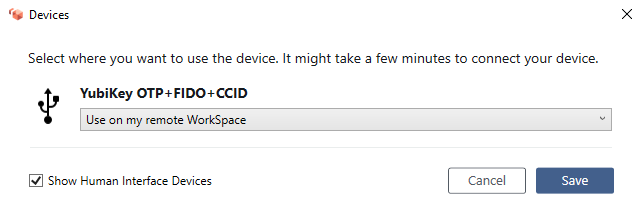
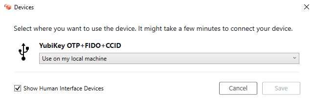

# Peripheral device support for WorkSpaces client applications

The Amazon WorkSpaces client applications offer the following support for peripheral devices. If you have an issue with
using a particular device, have your WorkSpaces administrator send a report to
[https://console.aws.amazon.com/support/home#/](https://console.aws.amazon.com/support/home#/ "https://console.aws.amazon.com/support/home#/").

Device support might differ depending on which streaming protocol your WorkSpace is using, either
PCoIP or DCV. In the 3.0+ versions of the macOS and Windows client applications, you
can see which protocol your WorkSpace is using by choosing **Support**,
**About My WorkSpace**. The iPad, Android, and Linux client applications currently
support only the PCoIP protocol.

###### Contents

- [Monitors](#devices-monitors "#devices-monitors")
- [Keyboards and mice](#devices-input "#devices-input")
- [Audio headsets](#devices-audio "#devices-audio")
- [Printers](#devices-printers "#devices-printers")
- [Scanners, USB drives, and other storage devices](#devices-storage "#devices-storage")
- [Webcams and other video devices](#devices-webcams "#devices-webcams")
- [Smart cards](#devices-smart-cards "#devices-smart-cards")
- [Hardware security keys](#hardware-security-keys "#hardware-security-keys")
- [WebAuthn authenticators](#webauthn-authenticators "#webauthn-authenticators")

## Monitors

The WorkSpaces client applications for Linux, macOS, and Windows support multiple monitors and the use of high DPI displays
on both DCV and PCoIP WorkSpaces. For more information about display support on these WorkSpaces client applications, including how to set up
multiple monitors, see [Display Support for the Linux Client](amazon-workspaces-linux-client.md#linux-display-support "amazon-workspaces-linux-client.md#linux-display-support"),
[Display Support for the macOS Client](amazon-workspaces-osx-client.md#osx-display-support "amazon-workspaces-osx-client.md#osx-display-support"),
or [Display Support for the Windows Client](amazon-workspaces-windows-client.md#windows-display-support "amazon-workspaces-windows-client.md#windows-display-support").

The WorkSpaces Android client application supports a single monitor and the use of high DPI displays on PCoIP WorkSpaces. For more
information about display support in the WorkSpaces Android client application, see
[Display Support for the Android Client](amazon-workspaces-android-client.md#android_display_support "amazon-workspaces-android-client.md#android_display_support").

For more information about support for high DPI displays, see
[Enabling high DPI display for WorkSpaces](high_dpi_support.md "high_dpi_support.md").

## Keyboards and mice

The WorkSpaces client applications for Windows, macOS, and Linux support USB Bluetooth keyboards and mice.

The WorkSpaces client applications for Android and iPad support touch input, and both clients offer on-screen keyboards
and support keyboards attached to the device. The Android client supports mice, and [iPads with iPadOS 13.4 or later support Bluetooth mice](https://support.apple.com/en-us/105004 "https://support.apple.com/en-us/105004"). The iPad client also supports certain SwiftPoint mice
models. For more information, see [Swiftpoint GT, ProPoint, or PadPoint mouse](amazon-workspaces-ipad-client.md#ipad_gt_mouse "amazon-workspaces-ipad-client.md#ipad_gt_mouse").

3D mice aren't supported by the WorkSpaces client applications.

To use languages or keyboards other than English, see [Language and keyboard settings for WorkSpaces](language_keyboard.md "language_keyboard.md").

## Audio headsets

Analog and USB audio headsets are supported on the Android, iPad, macOS, Linux, and Windows client applications,
and on the PCoIP Zero Client. We recommend using a headset for audio calls. If you use your device's built-in
microphone and speakers, you might experience echoing during your conversations. If you're having difficulty
using a headset, see [My headset doesn't work in my WorkSpace](client_troubleshooting.md#headset_problems "client_troubleshooting.md#headset_problems").

## Printers

The Windows and macOS client applications support USB printers and local printing. The other client
applications support other printing methods. For details about printer support for the various clients, see
[Printing from a WorkSpace](printing.md "printing.md").

If you're using a PCoIP zero client device to connect to your WorkSpace and you're having trouble using a
USB printer or other USB peripheral devices, contact your WorkSpaces administrator for assistance. For more
information, see [USB printers and other USB peripherals aren't working for PCoIP zero clients](../adminguide/amazon-workspaces-troubleshooting.md#pcoip_zero_client_usb "../adminguide/amazon-workspaces-troubleshooting.md#pcoip_zero_client_usb") in the
_Amazon WorkSpaces Administration Guide_.

## Scanners, USB drives, and other storage devices

The WorkSpaces clients do not support scanners or locally attached peripheral storage devices, such
as USB flash drives or external hard drives.

If you need to transfer, back up, or synchronize files between your WorkSpace and your local client
device, consider emailing the files to yourself. To see if other
solutions are available to you, contact your WorkSpaces administrator.

## Webcams and other video devices

If your WorkSpace is using the PCoIP protocol, the WorkSpaces clients do not support webcams or
other video devices.

If your WorkSpace is using the DCV, versions 3.1.5 and later of the WorkSpaces client
applications for Windows and macOS support webcams. For the Windows client, you must run the client
on a machine that's running Windows 10 version 1607 or later.

###### To use a webcam

1. Log in to your DCV WorkSpace.
2. Do one of the following, depending on which client you're using.

| If you're using... | Do this                                                                                                                                                                                                                                                                                                                                                                                                                                                                                                       |
| ------------------ | ------------------------------------------------------------------------------------------------------------------------------------------------------------------------------------------------------------------------------------------------------------------------------------------------------------------------------------------------------------------------------------------------------------------------------------------------------------------------------------------------------------- |
| Windows client     | To use a webcam on your DCV WorkSpace, select the **Devices\* • icon Devices icon on upper-right corner of the WorkSpace in the upper-right corner, and then select **Use this device on the remote WorkSpace**. Choose **Save**. To use a webcam on your local computer instead of on your DCV WorkSpace, select the **Devices\* • icon Devices icon on upper-right corner of the WorkSpace in the upper-right corner, and then select **Use Locally**. Choose **Save**. |
| macOS client       | To use a webcam on your DCV WorkSpace, choose **Connections**, **Devices**, and then select **Use this device on the remote WorkSpace**. Choose **Save**. To use a webcam on your local computer instead of on your DCV WorkSpace, choose **Connections**, **Devices**, and then select **Use on local machine**. Choose **Save**.                                                                                                                                                             |

## Smart cards

If your WorkSpace is using the PCoIP protocol, the WorkSpaces clients do not support smart cards.

If your Windows or Linux WorkSpace is using the DCV protocol, version 3.1.1 or later of the WorkSpaces client
application for Windows and version 3.1.5 or later of the WorkSpaces client application for macOS support smart cards.

For more information about using smart cards with your WorkSpace, see
[Smart card authentication for WorkSpaces client](smart_card_support.md "smart_card_support.md").

## Hardware security keys

PCoIP Windows WorkSpaces support USB redirection for YubiKey U2F authentication with Windows WorkSpaces client apps.
For more information, see [USB redirection for WorkSpaces](usb-redirection.md "usb-redirection.md").

### To redirect YubiKey to a WorkSpace for U2F authentication

- To use the YubiKey on your PCoIP WorkSpace, select the **Devices** icon

in the upper-right corner,
and then select **Use this device on my remote WorkSpace**. Choose **Save**.

- To use the YubiKey on your local computer instead of on your WorkSpace, select
  the
  
  in the upper-right corner, and then select **Use on
  my local machine**. Choose **Save**.

## WebAuthn authenticators

If your WorkSpace is using the PCoIP protocol, WebAuthn redirection isn't supported. However, you can use
USB redirection for hardware authenticators, see [Hardware security keys](#hardware-security-keys "#hardware-security-keys")
WebAuthn redirection is supported for WorkSpaces using DCV protocol.
For more information about using smart cards with your WorkSpace, see [WebAuthn authentication for WorkSpaces client](webauthn_support.md "webauthn_support.md").
