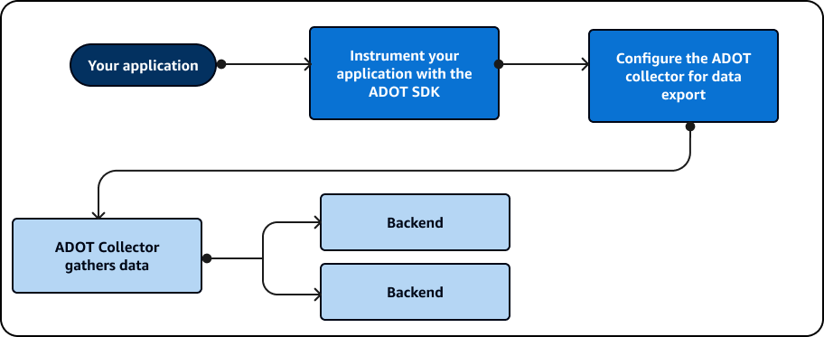
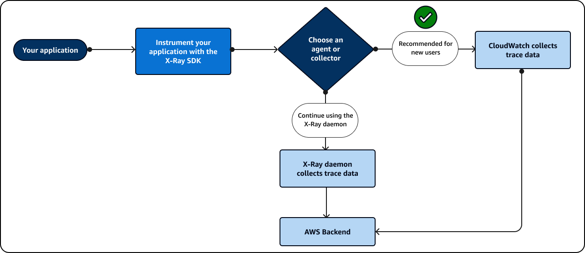

# Use an SDK

###### Note

End-of-support notice – On February 25th, 2027, AWS X-Ray will discontinue support for AWS X-Ray SDKs and daemon. After February 25th, 2027, you will no longer receive updates or releases. For more information on the support timeline, see
[X-Ray SDK and daemon end of support timeline](xray-daemon-eos.md "xray-daemon-eos.md"). We recommend to migrate to OpenTelemetry. For more information on migrating to OpenTelemetry, see [Migrating from X-Ray instrumentation to OpenTelemetry instrumentation](xray-sdk-migration.md "xray-sdk-migration.md") .

Use an SDK if you want to use a command line interface or need more custom tracing,
monitoring, or logging capabilities than what is available in an AWS Management Console. You can also
use an AWS SDK to develop programs that use the X-Ray APIs. You can use either the
AWS Distro for OpenTelemetry (ADOT) SDK or the X-Ray SDK.

If you use an SDK, you can add customizations to your workflow both when you
instrument your application and when you configure your collector or agent. You can use
an SDK to do the following tasks that you can’t do using an AWS Management Console:

- Publish custom metrics – Sample metrics at high resolutions down to 1
  second, use multiple dimensions to add information about a metric, and aggregate
  data points into a statistic set.
- Customize your collector – Customize the configuration for any portion
  of a collector including the receiver, processor, exporter, and
  connector.
- Customize your instrumentation – Customize segments and subsegments,
  add custom key-value pairs as attributes, and create custom metrics.
- Create and update sampling rules programmatically.
  Use the ADOT SDK if you want the flexibility of using a standardized
  OpenTelemetry SDK with added layers of AWS security and
  optimization. The AWS Distro for OpenTelemetry (ADOT) SDK is a vendor-agnostic package that
  allows for integration with back ends from other vendors and non-AWS services without
  having to reinstrument your code.

Use the X-Ray SDK if you are already using the X-Ray SDK, only integrate with AWS
backends, and don’t want to change the way you interact with X-Ray or your application
code.

For more information about each feature, see [Choosing between the AWS Distro for OpenTelemetry and X-Ray SDKs](xray-instrumenting-your-app.md#xray-instrumenting-choosing "xray-instrumenting-your-app.md#xray-instrumenting-choosing").

## Use the ADOT

SDK

The ADOT SDK is a set of open source APIs, libraries and agents
that send data to backend services. ADOT is supported by AWS,
integrates with multiple backends and agents, and provides a large number of open
source libraries maintained by the OpenTelemetry community. Use the
ADOT SDK to instrument your application and collect logs,
metadata, metrics and traces. You can also use ADOT to monitor
services and set an alarm based on your metrics in CloudWatch.

If you are using the ADOT SDK, you have the following options, in
combination with an agent:

- Use the ADOT SDK with the [CloudWatch agent](../../../AmazonCloudWatch/latest/monitoring/Install-CloudWatch-Agent.md "../../../AmazonCloudWatch/latest/monitoring/Install-CloudWatch-Agent.md") – recommended.
- Use the ADOT SDK with the [ADOT Collector](https://aws-otel.github.io/docs/getting-started/collector "https://aws-otel.github.io/docs/getting-started/collector") – recommended if you
  want to use vendor agnostic software with AWS layers of security and
  optimization.

To use the ADOT SDK, do the following:

- Instrument your application using the ADOT SDK. For more
  information, see the documentation for your programming language in the
  [ADOT technical
  documentation](https://aws-otel.github.io/docs/introduction "https://aws-otel.github.io/docs/introduction").
- Configure an ADOT collector to tell it where to send data
  that it collects.

After the ADOT collector receives your data, it sends it to the
backend that you specify in the ADOT configuration.
ADOT can send data to multiple backends, including to vendors
outside of AWS, as shown in the following diagram:

AWS regularly updates ADOT to add functionality and align with
the [OpenTelemetry](https://opentelemetry.io/docs/ "https://opentelemetry.io/docs/") framework.
Updates and future plans for developing ADOT are part of a [roadmap](https://github.com/orgs/aws-observability/projects/4 "https://github.com/orgs/aws-observability/projects/4") that
is available to the public. ADOT supports several programming
languages which include the following:

- Go
- Java
- JavaScript
- Python
- .NET
- Ruby
- PHP

If you are using Python, ADOT can automatically instrument your
application. To get started using ADOT, see [Introduction](https://aws-otel.github.io/docs/introduction "https://aws-otel.github.io/docs/introduction") and
[Getting
Started with the AWS Distro for OpenTelemetry Collector](https://aws-otel.github.io/docs/getting-started/collector "https://aws-otel.github.io/docs/getting-started/collector").

## Use the X-Ray

SDK

The X-Ray SDK is a set of AWS APIs and libraries that send data to AWS
backend services. Use the X-Ray SDK to instrument your application and collect
trace data. You cannot use the X-Ray SDK to collect log or metric data.

If you are using the X-Ray SDK, you have the following options, in combination
with an agent:

- Use the X-Ray SDK with the [AWS X-Ray daemon](xray-daemon.md "xray-daemon.md") – Use this if you don't want to
  update your application code.
- Use the X-Ray SDK with the CloudWatch agent – (recommended) The CloudWatch agent is
  compatible with the X-Ray SDK.

To use the X-Ray SDK, do the following:

- Instrument your application using the X-Ray SDK.
- Configure a collector to tell it where to send data that it collects. You
  can use either the CloudWatch agent or the X-Ray daemon to collect your trace
  information.

After the collector or agent receives your data, it sends it to an AWS backend
that you specify in the agent configuration. The X-Ray SDK can only send data to an
AWS backend as shown in the following diagram:

If you are using Java, you can use the X-Ray SDK to automatically
instrument your application. To get started using the X-Ray SDK, see the libraries
associated with the following programming languages:

- [Go](xray-go.md "xray-go.md")
- [Java](xray-java.md "xray-java.md")
- [Node.js](xray-nodejs.md "xray-nodejs.md")
- [Python](xray-python.md "xray-python.md")
- [.NET](xray-dotnet.md "xray-dotnet.md")
- [Ruby](xray-ruby.md "xray-ruby.md")
