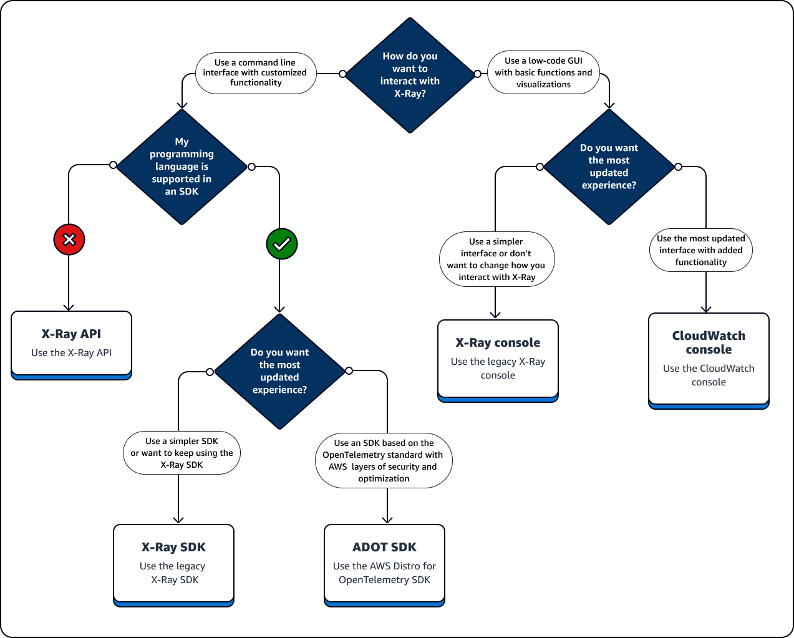

# Choosing an interface

AWS X-Ray can provide insights into how your application works and how well it interacts
with other services and resources. After you instrument or configure your application,
X-Ray collects trace data as your application serves requests. You can analyze this trace
data to identify performance issues, troubleshoot errors, and optimization your resources.
This guide shows you how to interact with X-Ray with the following guidelines:

- Use an AWS Management Console if you want to get started quickly or can use pre-built
  visualizations to perform basic tasks.
  - Choose the Amazon CloudWatch console for the most updated user experience that
    contains all of the X-Ray console’s functionality.
  - Use the X-Ray console if you want a simpler interface or don’t want to
    change how you interact with X-Ray.

- Use an SDK if you need more custom tracing, monitoring or logging capabilities
  than an AWS Management Console can provide.
  - Choose the ADOT SDK if you want a vendor-agnostic SDK based
    on the open source OpenTelemetry SDK with added layers of
    AWS security and optimization.
  - Choose the X-Ray SDK if you want a simpler SDK or don’t want to update
    your application code.

- Use X-Ray API operations if an SDK does not support your application’s
  programming language.
  The following diagram helps you choose how to interact with X-Ray:

###### Explore the interface types

- [Use an SDK](aws-xray-interface-sdk.md "aws-xray-interface-sdk.md")
- [Use a console](aws-xray-interface-console.md "aws-xray-interface-console.md")
- [Use the X-Ray API](xray-api.md "xray-api.md")
