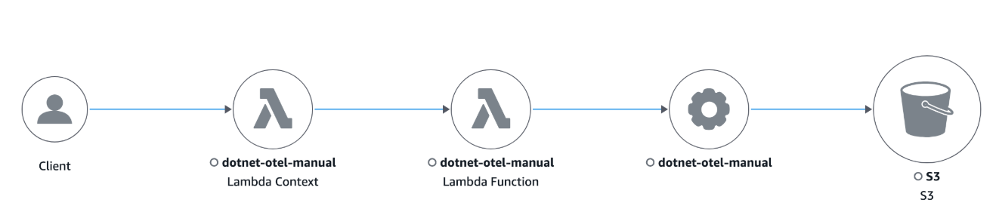

# Migrate to OpenTelemetry .NET

When using X-Ray Tracing in your .NET applications, the X-Ray .NET SDK with manual efforts is used for instrumentation.

This section provides code examples in the [Manual instrumentation solutions with the SDK](#manual-instrumentation-dotnet "#manual-instrumentation-dotnet") section for migrating from the X-Ray manual instrumentation solution to OpenTelemetry manual Instrumentation solutions for .NET. Alternatively,
you can migrate from X-Ray manual instrumentation to OpenTelemetry automatic instrumentation solutions to instrument .NET applications without having to modify application source code in the
[Zero code automatic instrumentation solutions](#zero-code-instrumentation-dotnet "#zero-code-instrumentation-dotnet") section.

###### Sections

- [Zero code automatic instrumentation solutions](#zero-code-instrumentation-dotnet "#zero-code-instrumentation-dotnet")
- [Manual instrumentation solutions with the SDK](#manual-instrumentation-dotnet "#manual-instrumentation-dotnet")
- [Manually creating trace data](#manual-trace-creation-dotnet "#manual-trace-creation-dotnet")
- [Tracing incoming requests (ASP.NET and ASP.NET core instrumentation)](#tracing-incoming-requests-dotnet "#tracing-incoming-requests-dotnet")
- [AWS SDK instrumentation](#aws-sdk-instrumentation-dotnet "#aws-sdk-instrumentation-dotnet")
- [Instrumenting outgoing HTTP calls](#http-instrumentation-dotnet "#http-instrumentation-dotnet")
- [Instrumentation support for other libraries](#other-libraries-dotnet "#other-libraries-dotnet")
- [Lambda instrumentation](#lambda-instrumentation "#lambda-instrumentation")

## Zero code automatic instrumentation solutions

OpenTelemetry provides zero-code auto-instrumentation solutions. These solutions trace requests without requiring changes to your application code.

**OpenTelemetry-based automatic instrumentation options**

1. Using the AWS Distro for OpenTelemetry (ADOT) auto-Instrumentation for .NET – To automatically instrument .NET applications, see [Tracing and Metrics with the AWS Distro for OpenTelemetry .NET Auto-Instrumentation](https://aws-otel.github.io/docs/getting-started/dotnet-sdk/auto-instr "https://aws-otel.github.io/docs/getting-started/dotnet-sdk/auto-instr").

(Optional) Enable CloudWatch Application Signals when automatically instrumenting your applications on AWS with the ADOT .NET auto-instrumentation to:

    * Monitor current application health
    * Track long-term application performance against business objectives
    * Get a unified, application-centric view of your applications, services, and dependencies
    * Monitor and triage application health

For more information, see [Application Signals](../../../AmazonCloudWatch/latest/monitoring/CloudWatch-Application-Monitoring-Sections.md "../../../AmazonCloudWatch/latest/monitoring/CloudWatch-Application-Monitoring-Sections.md"). 2. Using the OpenTelemetry .Net zero-code automatic instrumentation – To automatically instrument with OpenTelemetry .Net, see [Tracing and Metrics with the AWS Distro for OpenTelemetry .NET Auto-Instrumentation](https://aws-otel.github.io/docs/getting-started/dotnet-sdk/auto-instr "https://aws-otel.github.io/docs/getting-started/dotnet-sdk/auto-instr").

## Manual instrumentation solutions with the SDK

Tracing configuration with X-Ray SDK
For .NET web applications, the X-Ray SDK is configured in the appSettings section of the `Web.config` file.

Example Web.config

```

<configuration>
  <appSettings>
    <add key="AWSXRayPlugins" value="EC2Plugin"/>
  </appSettings>
</configuration>

```

For .NET Core, a file named `appsettings.json` with a top-level key named `XRay` is used, and then a configuration object is built o initialize the X-Ray recorder.

Example for .NET `appsettings.json`

```

{
  "XRay": {
    "AWSXRayPlugins": "EC2Plugin"
  }
}

```

Example for .NET Core Program.cs – Recorder configuration

```

using Amazon.XRay.Recorder.Core;
...
AWSXRayRecorder.InitializeInstance(configuration);

```

Tracing configuration with OpenTelemetry SDK
Add these dependencies:

```

dotnet add package OpenTelemetry
dotnet add package OpenTelemetry.Contrib.Extensions.AWSXRay
dotnet add package OpenTelemetry.Sampler.AWS --prerelease
dotnet add package OpenTelemetry.Resources.AWS
dotnet add package OpenTelemetry.Exporter.OpenTelemetryProtocol
dotnet add package OpenTelemetry.Extensions.Hosting
dotnet add package OpenTelemetry.Instrumentation.AspNetCore

```

For your .NET application, configure the OpenTelemetry SDK by setting up the Global TracerProvider. The following example configuration also enables
instrumentation for `ASP.NET Core`. To instrument `ASP.NET`, see [Tracing incoming requests (ASP.NET and ASP.NET core instrumentation)](#tracing-incoming-requests-dotnet "#tracing-incoming-requests-dotnet"). To use
OpenTelemetry with other frameworks, see [Registry](https://opentelemetry.io/ecosystem/registry/ "https://opentelemetry.io/ecosystem/registry/") for more libraries for
supported frameworks.

It is recommend that you configure the following components:

- `An OTLP Exporter` – Required for exporting traces to the CloudWatch Agent/OpenTelemetry Collector
- An AWS X-Ray Propagator – Required for propagating the Trace Context to [AWS Services that are integrated with X-Ray](xray-services.md "xray-services.md")
- An AWS X-Ray Remote Sampler – Required if you need to [sample requests using X-Ray sampling rules](xray-console-sampling.md "xray-console-sampling.md")
- `Resource Detectors` (for example, Amazon EC2 Resource Detector) - To detect metadata of the host running your application

```

using OpenTelemetry;
using OpenTelemetry.Contrib.Extensions.AWSXRay.Trace;
using OpenTelemetry.Sampler.AWS;
using OpenTelemetry.Trace;
using OpenTelemetry.Resources;

var builder = WebApplication.CreateBuilder(args);

var serviceName = "MyServiceName";
var serviceVersion = "1.0.0";

var resourceBuilder = ResourceBuilder
    .CreateDefault()
    .AddService(serviceName: serviceName)
    .AddAWSEC2Detector();

builder.Services.AddOpenTelemetry()
    .ConfigureResource(resource => resource
        .AddAWSEC2Detector()
        .AddService(
            serviceName: serviceName,
            serviceVersion: serviceVersion))
    .WithTracing(tracing => tracing
        .AddSource(serviceName)
        .AddAspNetCoreInstrumentation()
        .AddOtlpExporter()
        .SetSampler(AWSXRayRemoteSampler.Builder(resourceBuilder.Build())
            .SetEndpoint("http://localhost:2000")
            .Build()));

Sdk.SetDefaultTextMapPropagator(new AWSXRayPropagator()); // configure  X-Ray propagator

```

To use OpenTelemetry for a console app, add the following OpenTelemetry configuration at the startup of your program.

```

using OpenTelemetry;
using OpenTelemetry.Contrib.Extensions.AWSXRay.Trace;
using OpenTelemetry.Trace;
using OpenTelemetry.Resources;

var serviceName = "MyServiceName";

var resourceBuilder = ResourceBuilder
    .CreateDefault()
    .AddService(serviceName: serviceName)
    .AddAWSEC2Detector();

var tracerProvider = Sdk.CreateTracerProviderBuilder()
    .AddSource(serviceName)
    .ConfigureResource(resource =>
        resource
            .AddAWSEC2Detector()
            .AddService(
                serviceName: serviceName,
                serviceVersion: serviceVersion
            )
        )
    .AddOtlpExporter() // default address localhost:4317
    .SetSampler(new TraceIdRatioBasedSampler(1.00))
    .Build();

Sdk.SetDefaultTextMapPropagator(new AWSXRayPropagator()); // configure  X-Ray propagator

```

## Manually creating trace data

With X-Ray SDK
With the X-Ray SDK, the `BeginSegment` and `BeginSubsegment` methods were needed to manually create X-Ray segments and sub-segments.

```

using Amazon.XRay.Recorder.Core;

AWSXRayRecorder.Instance.BeginSegment("segment name"); // generates `TraceId` for you
try
{
    // Do something here
    // can create custom subsegments
    AWSXRayRecorder.Instance.BeginSubsegment("subsegment name");
    try
    {
        DoSometing();
    }
    catch (Exception e)
    {
        AWSXRayRecorder.Instance.AddException(e);
    }
    finally
    {
        AWSXRayRecorder.Instance.EndSubsegment();
    }
}
catch (Exception e)
{
    AWSXRayRecorder.Instance.AddException(e);
}
finally
{
    AWSXRayRecorder.Instance.EndSegment();
}

```

With OpenTelemetry SDK In .NET, you can use the activity API to create custom spans to monitor the performance of internal activities that are not captured by instrumentation
libraries. Note that only spans of kind Server are converted into X-Ray segments, all other spans are converted into X-Ray sub-egments.

You can create as many `ActivitySource` instances as needed, but it is recommended to have only one for an entire application/service.

```

using System.Diagnostics;

ActivitySource activitySource = new ActivitySource("ActivitySourceName", "ActivitySourceVersion");


...


using (var activity = activitySource.StartActivity("ActivityName", ActivityKind.Server)) // this will be translated to a X-Ray Segment
{
    // Do something here

    using (var internalActivity = activitySource.StartActivity("ActivityName", ActivityKind.Internal)) // this will be translated to an X-Ray Subsegment
    {
        // Do something here
    }
}

```

**Adding annotations and metadata to traces with OpenTelemetry SDK**

You can also add custom key-value pairs as attributes onto your spans by using the `SetTag` method on an activity. Note that by default, all the span attributes
will be converted into metadata in X-Ray raw data. To ensure that an attribute is converted into an annotation and not metadata, you can add that attribute's key to the list of `aws.xray.annotations` attribute.

```

using (var activity = activitySource.StartActivity("ActivityName", ActivityKind.Server)) // this will be translated to a X-Ray Segment
{
    activity.SetTag("metadataKey", "metadataValue");
    activity.SetTag("annotationKey", "annotationValue");
    string[] annotationKeys = {"annotationKey"};
    activity.SetTag("aws.xray.annotations", annotationKeys);

    // Do something here

    using (var internalActivity = activitySource.StartActivity("ActivityName", ActivityKind.Internal)) // this will be translated to an X-Ray Subsegment
    {
        // Do something here
    }
}

```

**With OpenTelemetry automatic instrumentation**

If you are using an OpenTelemetry automatic instrumentation solution for .NET, and if you need to perform manual instrumentation in your application,
for example, to instrument code within the application itself for sections that are not covered by any auto-instrumentation library.

Since there can only be one global `TracerProvider`, manual instrumentation should not instantiate its own `TracerProvider` if used together alongside auto-instrumentation.
When `TracerProvider` is used, custom manual tracing works the same way when using automatic instrumentation or manual instrumentation through the OpenTelemetry SDK.

## Tracing incoming requests (ASP.NET and ASP.NET core instrumentation)

With X-Ray SDK
To instrument requests served by the ASP.NET application, see [https://docs.aws.amazon.com/xray/latest/devguide/xray-sdk-dotnet-messagehandler.html](xray-sdk-dotnet-messagehandler.md "xray-sdk-dotnet-messagehandler.md") for information on how to
call `RegisterXRay` in the `Init` method of your `global.asax` file.

```

AWSXRayASPNET.RegisterXRay(this, "MyApp");

```

To instrument requests served by your ASP.NET core application, the `UseXRay` method is called before any other middleware in the `Configure` method of your Startup class.

```

app.UseXRay("MyApp");

```

With OpenTelemetry SDKOpenTelemetry also provides instrumentation libraries to collect traces for incoming web requests for ASP.NET and ASP.NET core. The following section lists the
steps needed to add and enable these library instrumentations for your OpenTelemetry configuration, including how to add [ASP.NET](https://learn.microsoft.com/en-us/aspnet/overview "https://learn.microsoft.com/en-us/aspnet/overview") or [ASP.NET](https://learn.microsoft.com/en-us/aspnet/core/?view=aspnetcore-9.0 "https://learn.microsoft.com/en-us/aspnet/core/?view=aspnetcore-9.0") core instrumentation when creating the
Tracer Provider.

For information on how to enable OpenTelemetry.Instrumentation.AspNet, see [Steps to enable OpenTelemetry.Instrumentation.AspNet](https://github.com/open-telemetry/opentelemetry-dotnet-contrib/tree/main/src/OpenTelemetry.Instrumentation.AspNet#steps-to-enable-opentelemetryinstrumentationaspnet "https://github.com/open-telemetry/opentelemetry-dotnet-contrib/tree/main/src/OpenTelemetry.Instrumentation.AspNet#steps-to-enable-opentelemetryinstrumentationaspnet") and for information on how to enable OpenTelemetry.Instrumentation.AspNetCore, see [Steps to enable OpenTelemetry.Instrumentation.AspNetCore](https://github.com/open-telemetry/opentelemetry-dotnet-contrib/tree/main/src/OpenTelemetry.Instrumentation.AspNetCore#steps-to-enable-opentelemetryinstrumentationaspnetcore "https://github.com/open-telemetry/opentelemetry-dotnet-contrib/tree/main/src/OpenTelemetry.Instrumentation.AspNetCore#steps-to-enable-opentelemetryinstrumentationaspnetcore") .

## AWS SDK instrumentation

With X-Ray SDK
Install all AWS SDK clients by calling `RegisterXRayForAllServices()`.

```

using Amazon.XRay.Recorder.Handlers.AwsSdk;
AWSSDKHandler.RegisterXRayForAllServices(); //place this before any instantiation of AmazonServiceClient
AmazonDynamoDBClient client = new AmazonDynamoDBClient(RegionEndpoint.USWest2); // AmazonDynamoDBClient is automatically registered with X-Ray

```

Use one of the following methods for specific AWS service client instrumentation.

```

AWSSDKHandler.RegisterXRay<IAmazonDynamoDB>(); // Registers specific type of AmazonServiceClient : All instances of IAmazonDynamoDB created after this line are registered
AWSSDKHandler.RegisterXRayManifest(String path); // To configure custom AWS Service Manifest file. This is optional, if you have followed "Configuration" section

```

With OpenTelemetry SDKFor the following code example, you will need the following dependency:

```

dotnet add package OpenTelemetry.Instrumentation.AWS

```

To instrument the AWS SDK, update the OpenTelemetry SDK configuration where the Global TracerProvider is setup.

```

builder.Services.AddOpenTelemetry()
    ...
    .WithTracing(tracing => tracing
        .AddAWSInstrumentation()
        ...

```

## Instrumenting outgoing HTTP calls

With X-Ray SDK
The X-Ray .NET SDK traces outgoing HTTP calls through the extension methods `GetResponseTraced()` or `GetAsyncResponseTraced()`
when using `System.Net.HttpWebRequest`, or by using the `HttpClientXRayTracingHandler` handler when using `System.Net.Http.HttpClient`.

With OpenTelemetry SDK For the following code example, you will need the following dependency:

```

dotnet add package OpenTelemetry.Instrumentation.Http

```

To instrument `System.Net.Http.HttpClient` and `System.Net.HttpWebRequest`, update the OpenTelemetry SDK configuration where the Global TracerProvider is setup.

```

builder.Services.AddOpenTelemetry()
    ...
    .WithTracing(tracing => tracing
        .AddHttpClientInstrumentation()
        ...

```

## Instrumentation support for other libraries

You can search and filter the OpenTelemetry Registry for .NET Instrumentation Libraries to find out if OpenTelemetry supports instrumentation for your Library. See the [Registry](https://opentelemetry.io/ecosystem/registry/ "https://opentelemetry.io/ecosystem/registry/") to start searching.

## Lambda instrumentation

With X-Ray SDK
The following procedure was required to use the X-Ray SDK with Lambda:

1. Enable _Active Tracing_ on your Lambda function
2. The Lambda service creates a segment that represents your handler's invocation
3. Create sub-segments or instrument libraries using the X-Ray SDK

With OpenTelemetry-based solutions You can automatically instrument your Lambda with AWS vended Lambda layers. There are two solutions:

- (Recommended) [CloudWatch Application Signals lambda layer](../../../lambda/latest/dg/monitoring-application-signals.md "../../../lambda/latest/dg/monitoring-application-signals.md")
- For better performance, you may want to consider using `OpenTelemetry Manual Instrumentation` to generate OpenTelemetry traces for your Lambda function.

**OpenTelemetry manual instrumentation for AWS Lambda**

The following is the Lambda function code (without instrumentation) example.

```

using System;
using System.Text;
using System.Threading.Tasks;
using Amazon.Lambda.Core;
using Amazon.S3;
using Amazon.S3.Model;

// Assembly attribute to enable Lambda function logging
[assembly: LambdaSerializer(typeof(Amazon.Lambda.Serialization.SystemTextJson.DefaultLambdaJsonSerializer))]

namespace ExampleLambda;

public class ListBucketsHandler
{
    private static readonly AmazonS3Client s3Client = new();

    // new Lambda function handler passed in
    public async Task<string> HandleRequest(object input, ILambdaContext context)
    {
        try
        {
            var DoListBucketsAsyncResponse = await DoListBucketsAsync();
            context.Logger.LogInformation($"Results: {DoListBucketsAsyncResponse.Buckets}");

            context.Logger.LogInformation($"Successfully called ListBucketsAsync");
            return "Success!";
        }
        catch (Exception ex)
        {
            context.Logger.LogError($"Failed to call ListBucketsAsync: {ex.Message}");
            throw;
        }
    }

    private async Task<ListBucketsResponse> DoListBucketsAsync()
    {
        try
        {
            var putRequest = new ListBucketsRequest
            {
            };

            var response = await s3Client.ListBucketsAsync(putRequest);
            return response;
        }
        catch (AmazonS3Exception ex)
        {
            throw new Exception($"Failed to call ListBucketsAsync: {ex.Message}", ex);
        }
    }
}

```

To manually instrument your Lambda handler and the Amazon S3 client, do the following.

1. Instantiate a TracerProvider – The TracerProvider is recommended to be configured with an `XrayUdpSpanExporter`, a ParentBased Always On Sampler, and a `Resource` with `service.name`
   set to the Lambda function name.
2. Instrument the Amazon S3 client with the OpenTemetry AWS SDK instrumentation by calling `AddAWSInstrumentation()` to add AWS SDK client instrumentation to `TracerProvider`
3. Create a wrapper function with the same signature as the original Lambda function. Call `AWSLambdaWrapper.Trace()` API and pass `TracerProvider`, the original Lambda
   function, and its inputs as parameters. Set the wrapper function as the Lambda handler input.

For the following code example, you will need the following dependencies:

```

dotnet add package OpenTelemetry.Instrumentation.AWSLambda
dotnet add package OpenTelemetry.Instrumentation.AWS
dotnet add package OpenTelemetry.Resources.AWS
dotnet add package AWS.Distro.OpenTelemetry.Exporter.Xray.Udp

```

The following code demonstrates the Lambda function after the required changes. You can create additional custom spans to complement the automatically provided spans.

```

using Amazon.Lambda.Core;
using Amazon.S3;
using Amazon.S3.Model;
using OpenTelemetry;
using OpenTelemetry.Instrumentation.AWSLambda;
using OpenTelemetry.Trace;
using AWS.Distro.OpenTelemetry.Exporter.Xray.Udp;
using OpenTelemetry.Resources;

// Assembly attribute to enable Lambda function logging
[assembly: LambdaSerializer(typeof(Amazon.Lambda.Serialization.SystemTextJson.DefaultLambdaJsonSerializer))]

namespace ExampleLambda;

public class ListBucketsHandler
{
    private static readonly AmazonS3Client s3Client = new();

    TracerProvider tracerProvider = Sdk.CreateTracerProviderBuilder()
        .AddAWSLambdaConfigurations()
        .AddProcessor(
            new SimpleActivityExportProcessor(
                // AWS_LAMBDA_FUNCTION_NAME Environment Variable will be defined in AWS Lambda Environment
                new XrayUdpExporter(ResourceBuilder.CreateDefault().AddService(Environment.GetEnvironmentVariable("AWS_LAMBDA_FUNCTION_NAME")).Build())
            )
        )
        .AddAWSInstrumentation()
        .SetSampler(new ParentBasedSampler(new AlwaysOnSampler()))
        .Build();

    // new Lambda function handler passed in
    public async Task<string> HandleRequest(object input, ILambdaContext context)
    => await AWSLambdaWrapper.Trace(tracerProvider, OriginalHandleRequest, input, context);

    public async Task<string> OriginalHandleRequest(object input, ILambdaContext context)
    {
        try
        {
            var DoListBucketsAsyncResponse = await DoListBucketsAsync();
            context.Logger.LogInformation($"Results: {DoListBucketsAsyncResponse.Buckets}");

            context.Logger.LogInformation($"Successfully called ListBucketsAsync");
            return "Success!";
        }
        catch (Exception ex)
        {
            context.Logger.LogError($"Failed to call ListBucketsAsync: {ex.Message}");
            throw;
        }
    }

    private async Task<ListBucketsResponse> DoListBucketsAsync()
    {
        try
        {
            var putRequest = new ListBucketsRequest
            {
            };

            var response = await s3Client.ListBucketsAsync(putRequest);
            return response;
        }
        catch (AmazonS3Exception ex)
        {
            throw new Exception($"Failed to call ListBucketsAsync: {ex.Message}", ex);
        }
    }
}

```

When invoking this Lambda, you will see the following trace in the Trace Map in the CloudWatch console:


