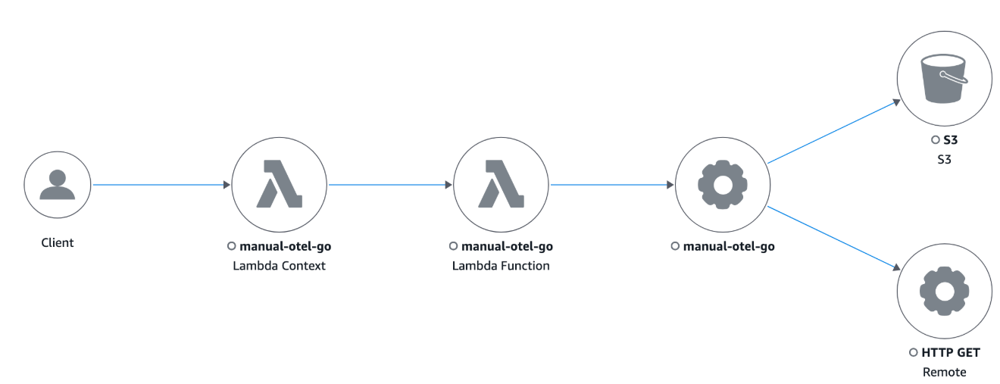

# Migrate to OpenTelemetry Go

Use the following code examples to manually instrument your Go applications with the OpenTelemetry SDK when migrating from X-Ray.

## Manual instrumentation with the SDK

Tracing setup with X-Ray SDK
When using the X-Ray SDK for Go, service plugins or local sampling rules were required to be configured before instrumenting your code.

```

func init() {
    if os.Getenv("ENVIRONMENT") == "production" {
        ec2.Init()
    }

    xray.Configure(xray.Config{
        DaemonAddr:       "127.0.0.1:2000",
        ServiceVersion:   "1.2.3",
    })
}

```

Set up tracing with OpenTelemetry SDK Configure the OpenTelemetry SDK by instantiating a TracerProvider and registering it as the global tracer provider. We recommend configuring the following components:

- OTLP Trace Exporter – Required for exporting traces to the CloudWatch Agent or OpenTelemetry Collector
- X-Ray Propagator – Required for propagating the trace context to AWS services integrated with X-Ray
- X-Ray Remote Sampler – Required for sampling requests using X-Ray sampling rules
- Resource detectors – To detect metadata of the host running your application

```

import (
    "go.opentelemetry.io/contrib/detectors/aws/ec2"
    "go.opentelemetry.io/contrib/propagators/aws/xray"
    "go.opentelemetry.io/contrib/samplers/aws/xray"
    "go.opentelemetry.io/otel"
    "go.opentelemetry.io/otel/exporters/otlp/otlptrace/otlptracegrpc"
    "go.opentelemetry.io/otel/sdk/trace"
)

func setupTracing() error {
    ctx := context.Background()

    exporterEndpoint := os.Getenv("OTEL_EXPORTER_OTLP_ENDPOINT")
    if exporterEndpoint == "" {
        exporterEndpoint = "localhost:4317"
    }

    traceExporter, err := otlptracegrpc.New(ctx,
        otlptracegrpc.WithInsecure(),
        otlptracegrpc.WithEndpoint(exporterEndpoint))
    if err != nil {
        return fmt.Errorf("failed to create OTLP trace exporter: %v", err)
    }

    remoteSampler, err := xray.NewRemoteSampler(ctx, "my-service-name", "ec2")
    if err != nil {
        return fmt.Errorf("failed to create X-Ray Remote Sampler: %v", err)
    }

    ec2Resource, err := ec2.NewResourceDetector().Detect(ctx)
    if err != nil {
        return fmt.Errorf("failed to detect EC2 resource: %v", err)
    }

    tp := trace.NewTracerProvider(
        trace.WithSampler(remoteSampler),
        trace.WithBatcher(traceExporter),
        trace.WithResource(ec2Resource),
    )

    otel.SetTracerProvider(tp)
    otel.SetTextMapPropagator(xray.Propagator{})

    return nil
}

```

## Tracing incoming requests (HTTP handler instrumentation)

With X-Ray SDK
To instrument an HTTP handler with X-Ray, the X-Ray handler method was used to generate segments using NewFixedSegmentNamer.

```

func main() {
    http.Handle("/", xray.Handler(xray.NewFixedSegmentNamer("myApp"), http.HandlerFunc(func(w http.ResponseWriter, r *http.Request) {
        w.Write([]byte("Hello!"))
    })))
    http.ListenAndServe(":8000", nil)
}

```

With OpenTelemetry SDKTo instrument an HTTP handler with OpenTelemetry, use the OpenTelemetry's newHandler method to wrap your original handler code.

```

import (
    "go.opentelemetry.io/contrib/instrumentation/net/http/otelhttp"
)

helloHandler := func(w http.ResponseWriter, req *http.Request) {
    ctx := req.Context()
    span := trace.SpanFromContext(ctx)
    span.SetAttributes(attribute.Bool("isHelloHandlerSpan", true), attribute.String("attrKey", "attrValue"))

    _, _ = io.WriteString(w, "Hello World!\n")
}

otelHandler := otelhttp.NewHandler(http.HandlerFunc(helloHandler), "Hello")

http.Handle("/hello", otelHandler)
err = http.ListenAndServe(":8080", nil)
if err != nil {
    log.Fatal(err)
}

```

## AWS SDK for Go v2 instrumentation

With X-Ray SDK
To instrument outgoing AWS requests from AWS SDK, your clients were instrumented as follows:

```

// Create a segment
ctx, root := xray.BeginSegment(context.TODO(), "AWSSDKV2_Dynamodb")
defer root.Close(nil)

cfg, err := config.LoadDefaultConfig(ctx, config.WithRegion("us-west-2"))
if err != nil {
    log.Fatalf("unable to load SDK config, %v", err)
}
// Instrumenting AWS SDK v2
awsv2.AWSV2Instrumentor(&cfg.APIOptions)
// Using the Config value, create the DynamoDB client
svc := dynamodb.NewFromConfig(cfg)
// Build the request with its input parameters
_, err = svc.ListTables(ctx, &dynamodb.ListTablesInput{
    Limit: aws.Int32(5),
})
if err != nil {
    log.Fatalf("failed to list tables, %v", err)
}

```

With OpenTelemetry SDK Tracing support for downstream AWS SDK calls is provided by OpenTelemetry's AWS SDK for Go v2 Instrumentation. Here's an example of tracing an S3 client call:

```
import (
    ...

    "github.com/aws/aws-sdk-go-v2/config"
    "github.com/aws/aws-sdk-go-v2/service/s3"

    "go.opentelemetry.io/otel"
    oteltrace "go.opentelemetry.io/otel/trace"
    awsConfig "github.com/aws/aws-sdk-go-v2/config"
    "go.opentelemetry.io/contrib/instrumentation/github.com/aws/aws-sdk-go-v2/otelaws"
)

...


    // init aws config
    cfg, err := awsConfig.LoadDefaultConfig(ctx)
    if err != nil {
        panic("configuration error, " + err.Error())
    }

    // instrument all aws clients
    otelaws.AppendMiddlewares(&.APIOptions)


    // Call to S3
    s3Client := s3.NewFromConfig(cfg)
    input := &s3.ListBucketsInput{}
    result, err := s3Client.ListBuckets(ctx, input)
    if err != nil {
        fmt.Printf("Got an error retrieving buckets, %v", err)
        return
    }
```

## Instrumenting outgoing HTTP calls

With X-Ray SDK
To instrument outgoing HTTP calls with X-Ray, the xray.Client was used to create a copy of a provided HTTP client.

```

myClient := xray.Client(http-client)

resp, err := ctxhttp.Get(ctx, xray.Client(nil), url)

```

With OpenTelemetry SDK To instrument HTTP clients with OpenTelemetry, use OpenTelemetry's otelhttp.NewTransport method to wrap the http.DefaultTransport.

```
import (
    "go.opentelemetry.io/contrib/instrumentation/net/http/otelhttp"
)

// Create an instrumented HTTP client.
httpClient := &http.Client{
    Transport: otelhttp.NewTransport(
        http.DefaultTransport,
    ),
}

req, err := http.NewRequestWithContext(ctx, http.MethodGet, "https://api.github.com/repos/aws-observability/aws-otel-go/releases/latest", nil)
if err != nil {
    fmt.Printf("failed to create http request, %v\n", err)
}
res, err := httpClient.Do(req)
if err != nil {
    fmt.Printf("failed to make http request, %v\n", err)
}
// Request body must be closed
defer func(Body io.ReadCloser) {
    err := Body.Close()
    if err != nil {
        fmt.Printf("failed to close http response body, %v\n", err)
    }
}(res.Body)
```

## Instrumentation support for other libraries

You can find the full list of supported library instrumentations for OpenTelemetry Go under [Instrumentation packages](https://github.com/open-telemetry/opentelemetry-go-contrib/tree/main/instrumentation#instrumentation-packages "https://github.com/open-telemetry/opentelemetry-go-contrib/tree/main/instrumentation#instrumentation-packages") .

Alternatively, you can search the OpenTelemetry registry to find out if OpenTelemetry supports instrumentation for your library under [Registry](https://opentelemetry.io/ecosystem/registry/ "https://opentelemetry.io/ecosystem/registry/").

## Manually creating trace data

With X-Ray SDK
With the X-Ray SDK, the BeginSegment and BeginSubsegment methods was required to manually create X-Ray segments and sub-segments.

```

// Start a segment
ctx, seg := xray.BeginSegment(context.Background(), "service-name")
// Start a subsegment
subCtx, subSeg := xray.BeginSubsegment(ctx, "subsegment-name")

// Add metadata or annotation here if necessary
xray.AddAnnotation(subCtx, "annotationKey", "annotationValue")
xray.AddMetadata(subCtx, "metadataKey", "metadataValue")

subSeg.Close(nil)
// Close the segment
seg.Close(nil)

```

With OpenTelemetry SDKUse custom spans to monitor the performance of internal activities that are not captured by instrumentation libraries. Note that only spans of kind Server are converted into X-Ray segments, all other spans are converted into X-Ray sub-segments.

First, you will need to create a Tracer to generate spans, which you can obtain through the `otel.Tracer` method. This will provide a Tracer instance from
the TracerProvider that was registered globally in the Tracing Setup example. You can create as many Tracer instances as needed, but it is common to have one Tracer for an entire application.

```
    tracer := otel.Tracer("application-tracer")
```

```
import (
    ...

    oteltrace "go.opentelemetry.io/otel/trace"
)

...

    var attributes = []attribute.KeyValue{
        attribute.KeyValue{Key: "metadataKey", Value: attribute.StringValue("metadataValue")},
        attribute.KeyValue{Key: "annotationKey", Value: attribute.StringValue("annotationValue")},
        attribute.KeyValue{Key: "aws.xray.annotations", Value: attribute.StringSliceValue([]string{"annotationKey"})},
    }

    ctx := context.Background()

    parentSpanContext, parentSpan := tracer.Start(ctx, "ParentSpan", oteltrace.WithSpanKind(oteltrace.SpanKindServer), oteltrace.WithAttributes(attributes...))
    _, childSpan := tracer.Start(parentSpanContext, "ChildSpan", oteltrace.WithSpanKind(oteltrace.SpanKindInternal))

    // ...

    childSpan.End()
    parentSpan.End()
```

**Adding annotations and metadata to traces with OpenTelemetry SDK**

In the above example, the `WithAttributes` method is used to add attributes to each span. Note that by default, all the span attributes are converted into metadata in X-Ray raw data. To ensure that an attribute is converted into an annotation and not metadata, add the attribute's key to the list of the
`aws.xray.annotations` attribute. For more information, see [Enable The Customized X-Ray Annotations](https://aws-otel.github.io/docs/getting-started/x-ray#enable-the-customized-x-ray-annotations "https://aws-otel.github.io/docs/getting-started/x-ray#enable-the-customized-x-ray-annotations") .

## Lambda manual instrumentation

With X-Ray SDK
With the X-Ray SDK, after your Lambda has _Active Tracing_ was enabled, there were no additional configurations required to use the X-Ray SDK. Lambda created a segment representing the Lambda handler invocation, and
you created sub-segments using the X-Ray SDK without any additional configuration.

With OpenTelemetry SDK The following Lambda function code (without instrumentation) makes an Amazon S3 ListBuckets call and outgoing HTTP request.

```

package main

import (
    "context"
    "encoding/json"
    "fmt"
    "io"
    "net/http"
    "os"

    "github.com/aws/aws-lambda-go/events"
    "github.com/aws/aws-lambda-go/lambda"
    awsconfig "github.com/aws/aws-sdk-go-v2/config"
    "github.com/aws/aws-sdk-go-v2/service/s3"
)

func lambdaHandler(ctx context.Context) (interface{}, error) {
    // Initialize AWS config.
    cfg, err := awsconfig.LoadDefaultConfig(ctx)
    if err != nil {
        panic("configuration error, " + err.Error())
    }

    s3Client := s3.NewFromConfig(cfg)

    // Create an HTTP client.
    httpClient := &http.Client{
        Transport: http.DefaultTransport,
    }

    input := &s3.ListBucketsInput{}
    result, err := s3Client.ListBuckets(ctx, input)
    if err != nil {
        fmt.Printf("Got an error retrieving buckets, %v", err)
    }

    fmt.Println("Buckets:")
    for _, bucket := range result.Buckets {
        fmt.Println(*bucket.Name + ": " + bucket.CreationDate.Format("2006-01-02 15:04:05 Monday"))
    }
    fmt.Println("End Buckets.")

    req, err := http.NewRequestWithContext(ctx, http.MethodGet, "https://api.github.com/repos/aws-observability/aws-otel-go/releases/latest", nil)
    if err != nil {
        fmt.Printf("failed to create http request, %v\n", err)
    }
    res, err := httpClient.Do(req)
    if err != nil {
        fmt.Printf("failed to make http request, %v\n", err)
    }
    defer func(Body io.ReadCloser) {
        err := Body.Close()
        if err != nil {
            fmt.Printf("failed to close http response body, %v\n", err)
        }
    }(res.Body)

    var data map[string]interface{}
    err = json.NewDecoder(res.Body).Decode(&data)
    if err != nil {
        fmt.Printf("failed to read http response body, %v\n", err)
    }
    fmt.Printf("Latest ADOT Go Release is '%s'\n", data["name"])

    return events.APIGatewayProxyResponse{
        StatusCode: http.StatusOK,
        Body:       os.Getenv("_X_AMZN_TRACE_ID"),
    }, nil
}

func main() {
    lambda.Start(lambdaHandler)
}

```

To manually instrument your Lambda handler and the Amazon S3 client, do the following:

1. In _main()_, instantiate a TracerProvider (tp) and register it as the global tracer provider. The TracerProvider is recommended to be configured with:
   1. Simple Span Processor with an X-Ray UDP span exporter to send Traces to Lambda's UDP X-Ray endpoint
   2. Resource with _service.name_ set to the Lambda function name

2. Change the usage of `lambda.Start(lambdaHandler)` to `lambda.Start(otellambda.InstrumentHandler(lambdaHandler, xrayconfig.WithRecommendedOptions(tp)...))`.
3. Instrument the Amazon S3 client with the OpenTemetry AWS SDK instrumentation by appending OpenTelemetry middleware for `aws-sdk-go-v2` into the Amazon S3 client configuration.
4. Instrument the http client by using OpenTelemetry's `otelhttp.NewTransport` method to wrap the `http.DefaultTransport`.

The following code is an example of how the Lambda Function will look like after the changes. You may manually create additional custom spans in addition to the spans provided automatically.

```
package main

import (
    "context"
    "encoding/json"
    "fmt"
    "io"
    "net/http"
    "os"

    "github.com/aws-observability/aws-otel-go/exporters/xrayudp"
    "github.com/aws/aws-lambda-go/events"
    "github.com/aws/aws-lambda-go/lambda"
    awsconfig "github.com/aws/aws-sdk-go-v2/config"
    "github.com/aws/aws-sdk-go-v2/service/s3"

    lambdadetector "go.opentelemetry.io/contrib/detectors/aws/lambda"
    "go.opentelemetry.io/contrib/instrumentation/github.com/aws/aws-lambda-go/otellambda"
    "go.opentelemetry.io/contrib/instrumentation/github.com/aws/aws-lambda-go/otellambda/xrayconfig"
    "go.opentelemetry.io/contrib/instrumentation/github.com/aws/aws-sdk-go-v2/otelaws"
    "go.opentelemetry.io/contrib/instrumentation/net/http/otelhttp"
    "go.opentelemetry.io/contrib/propagators/aws/xray"
    "go.opentelemetry.io/otel"
    "go.opentelemetry.io/otel/attribute"
    "go.opentelemetry.io/otel/sdk/resource"
    "go.opentelemetry.io/otel/sdk/trace"
    semconv "go.opentelemetry.io/otel/semconv/v1.26.0"
)

func lambdaHandler(ctx context.Context) (interface{}, error) {
    // Initialize AWS config.
    cfg, err := awsconfig.LoadDefaultConfig(ctx)
    if err != nil {
        panic("configuration error, " + err.Error())
    }

    // Instrument all AWS clients.
    otelaws.AppendMiddlewares(&cfg.APIOptions)
    // Create an instrumented S3 client from the config.
    s3Client := s3.NewFromConfig(cfg)

    // Create an instrumented HTTP client.
    httpClient := &http.Client{
        Transport: otelhttp.NewTransport(
            http.DefaultTransport,
        ),
    }

    // return func(ctx context.Context) (interface{}, error) {
    input := &s3.ListBucketsInput{}
    result, err := s3Client.ListBuckets(ctx, input)
    if err != nil {
        fmt.Printf("Got an error retrieving buckets, %v", err)
    }

    fmt.Println("Buckets:")
    for _, bucket := range result.Buckets {
        fmt.Println(*bucket.Name + ": " + bucket.CreationDate.Format("2006-01-02 15:04:05 Monday"))
    }
    fmt.Println("End Buckets.")

    req, err := http.NewRequestWithContext(ctx, http.MethodGet, "https://api.github.com/repos/aws-observability/aws-otel-go/releases/latest", nil)
    if err != nil {
        fmt.Printf("failed to create http request, %v\n", err)
    }
    res, err := httpClient.Do(req)
    if err != nil {
        fmt.Printf("failed to make http request, %v\n", err)
    }
    defer func(Body io.ReadCloser) {
        err := Body.Close()
        if err != nil {
            fmt.Printf("failed to close http response body, %v\n", err)
        }
    }(res.Body)

    var data map[string]interface{}
    err = json.NewDecoder(res.Body).Decode(&data)
    if err != nil {
        fmt.Printf("failed to read http response body, %v\n", err)
    }
    fmt.Printf("Latest ADOT Go Release is '%s'\n", data["name"])

    return events.APIGatewayProxyResponse{
        StatusCode: http.StatusOK,
        Body:       os.Getenv("_X_AMZN_TRACE_ID"),
    }, nil
}

func main() {
    ctx := context.Background()
    detector := lambdadetector.NewResourceDetector()
    lambdaResource, err := detector.Detect(context.Background())
    if err != nil {
        fmt.Printf("failed to detect lambda resources: %v\n", err)
    }

    var attributes = []attribute.KeyValue{
        attribute.KeyValue{Key: semconv.ServiceNameKey, Value: attribute.StringValue(os.Getenv("AWS_LAMBDA_FUNCTION_NAME"))},
    }
    customResource := resource.NewWithAttributes(semconv.SchemaURL, attributes...)
    mergedResource, _ := resource.Merge(lambdaResource, customResource)

    xrayUdpExporter, _ := xrayudp.NewSpanExporter(ctx)
    tp := trace.NewTracerProvider(
        trace.WithSpanProcessor(trace.NewSimpleSpanProcessor(xrayUdpExporter)),
        trace.WithResource(mergedResource),
    )

    defer func(ctx context.Context) {
        err := tp.Shutdown(ctx)
        if err != nil {
            fmt.Printf("error shutting down tracer provider: %v", err)
        }
    }(ctx)

    otel.SetTracerProvider(tp)
    otel.SetTextMapPropagator(xray.Propagator{})

    lambda.Start(otellambda.InstrumentHandler(lambdaHandler, xrayconfig.WithRecommendedOptions(tp)...))
}
```

When invoking Lambda, you will see the following trace in the `Trace Map` in the CloudWatch console:


