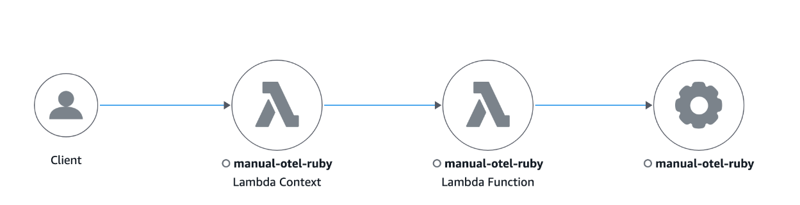

# Migrate to OpenTelemetry Ruby

To migrate your Ruby applications from X-Ray SDK to OpenTelemetry instrumentation, use the following code examples and guidance for manual instrumentation.

###### Sections

- [Manually instrument your solutions with the SDK](#manual-instrumentation-ruby "#manual-instrumentation-ruby")
- [Tracing incoming requests (Rails instrumentation)](#tracing-incoming-requests-ruby "#tracing-incoming-requests-ruby")
- [AWS SDK instrumentation](#aws-sdk-instrumentation-ruby "#aws-sdk-instrumentation-ruby")
- [Instrumenting outgoing HTTP calls](#http-instrumentation-ruby "#http-instrumentation-ruby")
- [Instrumentation support for other libraries](#xray-migration-libraries-ruby "#xray-migration-libraries-ruby")
- [Manually creating trace data](#manual-trace-creation-ruby "#manual-trace-creation-ruby")
- [Lambda manual instrumentation](#lambda-instrumentation-ruby "#lambda-instrumentation-ruby")

## Manually instrument your solutions with the SDK

Tracing setup with X-Ray SDK
X-Ray SDK for Ruby required you to configure your code with service plug-ins.

```
require 'aws-xray-sdk'

XRay.recorder.configure(plugins: [:ec2, :elastic_beanstalk])

```

Tracing setup with OpenTelemetry SDK

###### Note

X-Ray remote sampling is currently not available to be configured for OpenTelemetry Ruby.

For a Ruby on Rails application, place your configuration code in a Rails initializer. For more information, see [Getting Started](https://opentelemetry.io/docs/languages/ruby/getting-started/#initialization "https://opentelemetry.io/docs/languages/ruby/getting-started/#initialization").
For all manually instrumented Ruby programs, you must use the `OpenTelemetry::SDK.configure` method to configure the OpenTelemetry Ruby SDK.

First, install the following packages:

```
bundle add opentelemetry-sdk opentelemetry-exporter-otlp opentelemetry-propagator-xray

```

Next, configure the OpenTelemetry SDK through the configuration code that runs when your program initializes. It is recommend that you configure the following components:

- `OTLP Exporter` – Required for exporting traces to the CloudWatch agent and OpenTelemetry collector
- `An AWSX-Ray Propagator` – Required for propagating the trace context to AWS services that are integrated with X-Ray

```
require 'opentelemetry-sdk'
require 'opentelemetry-exporter-otlp'

# Import the gem containing the AWS X-Ray for OTel Ruby ID Generator and propagator
require 'opentelemetry-propagator-xray'

OpenTelemetry::SDK.configure do |c|
  c.service_name = 'my-service-name'

  c.add_span_processor(
    # Use the BatchSpanProcessor to send traces in groups instead of one at a time
    OpenTelemetry::SDK::Trace::Export::BatchSpanProcessor.new(
      # Use the default OLTP Exporter to send traces to the ADOT Collector
      OpenTelemetry::Exporter::OTLP::Exporter.new(
        # The OpenTelemetry Collector is running as a sidecar and listening on port 4318
        endpoint:"http://127.0.0.1:4318/v1/traces"
      )
    )
  )

  # The X-Ray Propagator injects the X-Ray Tracing Header into downstream calls
  c.propagators = [OpenTelemetry::Propagator::XRay::TextMapPropagator.new]
end

```

OpenTelemetry SDKs also have the concept of library instrumentations. Enabling these will automatically create spans for libraries such as the AWS SDK. OpenTelemetry provides the option to enable all library instrumentations or specify which library instrumentations to enable.

To enable all instrumentations, first install the `opentelemetry-instrumentation-all` package:

```
bundle add opentelemetry-instrumentation-all

```

Next, update the configuration to enable all library instrumentations as shown below:

```
require 'opentelemetry/instrumentation/all'
...

OpenTelemetry::SDK.configure do |c|
   ...

  c.use_all() # Enable all instrumentations
end

```

OpenTelemetry SDKs also have the concept of library instrumentations. Enabling these will automatically create spans for libraries such as the AWS SDK. OpenTelemetry provides the option to enable all library instrumentations or specify which library instrumentations to enable.

To enable all instrumentations, first install the `opentelemetry-instrumentation-all` package:

```
bundle add opentelemetry-instrumentation-all

```

Next, update the configuration to enable all library instrumentations as shown below:

```
require 'opentelemetry/instrumentation/all'
...

OpenTelemetry::SDK.configure do |c|
   ...

  c.use_all() # Enable all instrumentations
end

```

## Tracing incoming requests (Rails instrumentation)

With X-Ray SDK
With X-Ray SDK, X-Ray tracing is configured for the Rails framework upon initialization.

**Example** – config/initializers/aws_xray.rb

```
Rails.application.config.xray = {
  name: 'my app',
  patch: %I[net_http aws_sdk],
  active_record: true
}

```

With OpenTelemetry SDKFirst, install the following packages:

```

bundle add opentelemetry-instrumentation-rack opentelemetry-instrumentation-rails opentelemetry-instrumentation-action_pack opentelemetry-instrumentation-active_record opentelemetry-instrumentation-action_view

```

Next, update the configuration to enable instrumentation for your Rails application as shown below:

```
# During SDK configuration
OpenTelemetry::SDK.configure do |c|

  ...

  c.use 'OpenTelemetry::Instrumentation::Rails'
  c.use 'OpenTelemetry::Instrumentation::Rack'
  c.use 'OpenTelemetry::Instrumentation::ActionPack'
  c.use 'OpenTelemetry::Instrumentation::ActiveSupport'
  c.use 'OpenTelemetry::Instrumentation::ActionView'

  ...

end
```

## AWS SDK instrumentation

With X-Ray SDK
To instrument outgoing AWS requests from AWS SDK, the AWS SDK clients are patched with X-Ray like the following example:

```
require 'aws-xray-sdk'
require 'aws-sdk-s3'

# Patch AWS SDK clients
XRay.recorder.configure(plugins: [:aws_sdk])

# Use the instrumented client
s3 = Aws::S3::Client.new
s3.list_buckets

```

With OpenTelemetry SDKAWS SDK for Ruby V3 provides support for recording and emitting OpenTelemetry traces. For information on how to configure OpenTelemetry for a service client, see [Configuring observability features in the AWS SDK for Ruby](sdk-for-ruby/v3/developer-guide/observability.md "sdk-for-ruby/v3/developer-guide/observability.md") .

## Instrumenting outgoing HTTP calls

When making HTTP calls to external services, you might need to manually instrument the calls if automatic instrumentation isn’t available or doesn’t provide enough detail.

With X-Ray SDK
To instrument downstream calls, the X-Ray SDK for Ruby was used to patch the `net/http` library that your application uses:

```
require 'aws-xray-sdk'

config = {
  name: 'my app',
  patch: %I[net_http]
}

XRay.recorder.configure(config)

```

With OpenTelemetry SDKTo enable the `net/http` instrumentation using OpenTelemetry, first install the `opentelemetry-instrumentation-net_http` package:

```
bundle add opentelemetry-instrumentation-net_http

```

Next, update the configuration to enable the `net/http` instrumentation as shown below:

```
OpenTelemetry::SDK.configure do |c|
   ...

  c.use 'OpenTelemetry::Instrumentation::Net::HTTP'
  ...

end

```

## Instrumentation support for other libraries

You can find the full list of supported Library instrumentations for OpenTelemetry Ruby under [opentelemetry-ruby-contrib](https://github.com/open-telemetry/opentelemetry-ruby-contrib/tree/main/instrumentation "https://github.com/open-telemetry/opentelemetry-ruby-contrib/tree/main/instrumentation") .

Alternatively, you can search the OpenTelemetry Registry to find out if OpenTelemetry supports instrumentation. For more information, see [Registry](https://opentelemetry.io/ecosystem/registry/ "https://opentelemetry.io/ecosystem/registry/").

## Manually creating trace data

With X-Ray SDK
Using X-Ray, the `aws-xray-sdk` package required you to manually create segments and their child sub-segments to trace your application. You may have also added X-Ray annotations and metadata to your segments or sub-segments:

```
require 'aws-xray-sdk'
...

# Start a segment
segment = XRay.recorder.begin_segment('my-service')

# Add annotations (indexed key-value pairs)
segment.annotations[:user_id] = 'user-123'
segment.annotations[:payment_status] = 'completed'

# Add metadata (non-indexed data)
segment.metadata[:order] = {
  id: 'order-456',
  items: [
    { product_id: 'prod-1', quantity: 2 },
    { product_id: 'prod-2', quantity: 1 }
  ],
  total: 67.99
}

# Add metadata to a specific namespace
segment.metadata(namespace: 'payment') do |metadata|
  metadata[:transaction_id] = 'tx-789'
  metadata[:payment_method] = 'credit_card'
end

# Create a subsegment with annotations and metadata
segment.subsegment('payment-processing') do |subsegment1|
  subsegment1.annotations[:payment_id] = 'pay-123'
  subsegment1.metadata[:details] = { amount: 67.99, currency: 'USD' }

  # Create a nested subsegment
  subsegment1.subsegment('operation-2') do |subsegment2|
    # Do more work...
  end
end

# Close the segment
segment.close

```

With OpenTelemetry SDK You can use custom spans to monitor the performance of internal activities that are not captured by instrumentation libraries. Note that only spans of kind server are converted into X-Ray segments, all other spans are converted into X-Ray sub-segments.
By default, spans are `INTERNAL`.

First, create a Tracer in order to generate spans, which you can obtain through the `OpenTelemetry.tracer_provider.tracer('<YOUR_TRACER_NAME>')` method. This will provide a Tracer instance that is registered globally in you application's OpenTelemetry configuration.
It is common to have a single Tracer for an entire application. Create an OpenTelemetry tracer and use it to create spans:

```
require 'opentelemetry-sdk'

...

# Get a tracer
tracer = OpenTelemetry.tracer_provider.tracer('my-application')

# Create a server span (equivalent to X-Ray segment)
tracer.in_span('my-application', kind: OpenTelemetry::Trace::SpanKind::SERVER) do |span|
  # Do work...

  # Create nested spans of default kind INTERNAL will become an X-Ray subsegment
  tracer.in_span('operation-1') do |child_span1|
    # Set attributes (equivalent to X-Ray annotations and metadata)
    child_span1.set_attribute('key', 'value')

    # Do more work...
    tracer.in_span('operation-2') do |child_span2|
      # Do more work...
    end
  end
end

```

**Adding annotations and metadata to traces with OpenTelemetry SDK**

Use the `set_attribute` method to add attributes to each span. Note that by default, all these span attributes will be converted into metadata in X-Ray raw data. To ensure that an attribute is converted into an annotation and not metadata, you can
add that attributes key to the list of `aws.xray.annotations` attribute. For more information, see [Enable The Customized X-Ray Annotations](https://aws-otel.github.io/docs/getting-started/x-ray#enable-the-customized-x-ray-annotations "https://aws-otel.github.io/docs/getting-started/x-ray#enable-the-customized-x-ray-annotations") .

```
# SERVER span will become an X-Ray segment
tracer.in_span('my-server-operation', kind: OpenTelemetry::Trace::SpanKind::SERVER) do |span|
    # Your server logic here
    span.set_attribute('attribute.key', 'attribute.value')
    span.set_attribute("metadataKey", "metadataValue")
    span.set_attribute("annotationKey1", "annotationValue")

    # Create X-Ray annotations
    span.set_attribute("aws.xray.annotations", ["annotationKey1"])
end

```

## Lambda manual instrumentation

With X-Ray SDK
After _Active Tracing_ was enabled on Lambda, there are no additional configurations required to use the X-Ray SDK. Lambda will create a segment representing the Lambda handler invocation, and you can create sub-segments or instrument
libraries using the X-Ray SDK without any additional configuration.

With OpenTelemetry SDKConsider the following sample Lambda function code (without instrumentation):

```
require 'json'
def lambda_handler(event:, context:)
    # TODO implement
    { statusCode: 200, body: JSON.generate('Hello from Lambda!') }
end

```

To manually instrument your Lambda, you will need to:

1. Add the following gems for your Lambda

```
gem 'opentelemetry-sdk'
gem 'opentelemetry-exporter-otlp'
gem 'opentelemetry-propagator-xray'
gem 'aws-distro-opentelemetry-exporter-xray-udp'
gem 'opentelemetry-instrumentation-aws_lambda'
gem 'opentelemetry-propagator-xray', '~> 0.24.0' # Requires version v0.24.0 or higher

```

2. Initialize OpenTelemetry SDK outside your Lambda Handler. The OpenTelemetry SDK is recommended to be configured with:
   1. A simple span processor with an X-Ray UDP span exporter to send Traces to Lambda's UDP X-Ray endpoint
   2. An X-Ray Lambda propagator
   3. `service_name` configuration to be set to the Lambda function name

3. In your Lambda handler class, add the following lines to instrument your Lambda Handler:

```
  class Handler
        extend OpenTelemetry::Instrumentation::AwsLambda::Wrap
        ...

        instrument_handler :process
    end
```

The following code demonstrates the Lambda function after the required changes. You can create additional custom spans to complement the automatically provided spans.

```
require 'json'
require 'opentelemetry-sdk'
require 'aws/distro/opentelemetry/exporter/xray/udp'
require 'opentelemetry/propagator/xray'
require 'opentelemetry/instrumentation/aws_lambda'

# Initialize OpenTelemetry SDK outside handler
OpenTelemetry::SDK.configure do |c|
  # Configure the AWS Distro for OpenTelemetry X-Ray Lambda exporter
  c.add_span_processor(
    OpenTelemetry::SDK::Trace::Export::SimpleSpanProcessor.new(
      AWS::Distro::OpenTelemetry::Exporter::XRay::UDP::AWSXRayUDPSpanExporter.new
    )
  )

  # Configure X-Ray Lambda propagator
  c.propagators = [OpenTelemetry::Propagator::XRay.lambda_text_map_propagator]

  # Set minimal resource information
  c.resource = OpenTelemetry::SDK::Resources::Resource.create({
    OpenTelemetry::SemanticConventions::Resource::SERVICE_NAME => ENV['AWS_LAMBDA_FUNCTION_NAME']
  })
  c.use 'OpenTelemetry::Instrumentation::AwsLambda'
end

module LambdaFunctions
  class Handler
    extend OpenTelemetry::Instrumentation::AwsLambda::Wrap
    def self.process(event:, context:)
      "Hello!"
    end
    instrument_handler :process
  end
end

```

The following is an example trace map of an instrumented Lambda function written in Ruby.



You can also use Lambda layers to configure OpenTelemetry for your Lambda. For more information, see [OpenTelemetry AWS-Lambda Instrumentation](https://github.com/open-telemetry/opentelemetry-ruby-contrib/tree/main/instrumentation/aws_lambda#usage "https://github.com/open-telemetry/opentelemetry-ruby-contrib/tree/main/instrumentation/aws_lambda#usage") .
