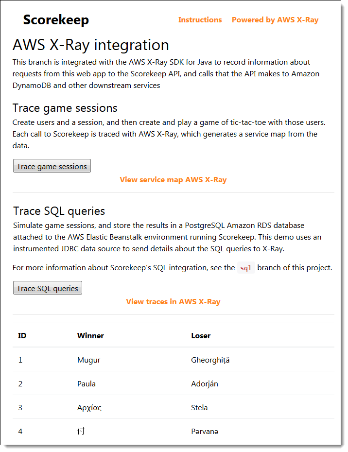
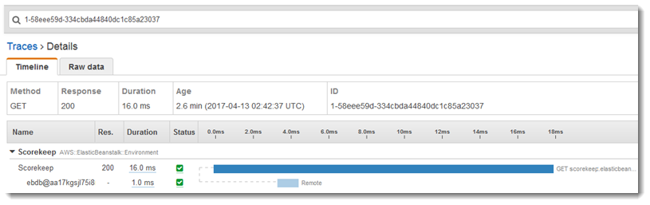

# Instrumenting calls to a PostgreSQL database

###### Note

X-Ray SDK/Daemon Maintenance Notice – On February 25th, 2026, the AWS X-Ray SDKs/Daemon will enter maintenance mode, where AWS will limit X-Ray SDK and Daemon releases to address security issues only. For more information on the support timeline, see
[X-Ray SDK and Daemon Support timeline](xray-sdk-daemon-timeline.md "xray-sdk-daemon-timeline.md"). We recommend to migrate to OpenTelemetry. For more information on migrating to OpenTelemetry, see [Migrating from X-Ray instrumentation to OpenTelemetry instrumentation](xray-sdk-migration.md "xray-sdk-migration.md") .

The `application-pgsql.properties` file adds the X-Ray PostgreSQL
tracing interceptor to the data source created in [`RdsWebConfig.java`](https://github.com/awslabs/eb-java-scorekeep/tree/xray/src/main/java/scorekeep/RdsWebConfig.java "https://github.com/awslabs/eb-java-scorekeep/tree/xray/src/main/java/scorekeep/RdsWebConfig.java").

###### Example [`application-pgsql.properties`](https://github.com/awslabs/eb-java-scorekeep/tree/xray/src/main/resources/application-pgsql.properties "https://github.com/awslabs/eb-java-scorekeep/tree/xray/src/main/resources/application-pgsql.properties") – PostgreSQL database

instrumentation

```
spring.datasource.continue-on-error=true
spring.jpa.show-sql=false
spring.jpa.hibernate.ddl-auto=create-drop
`spring.datasource.jdbc-interceptors=com.amazonaws.xray.sql.postgres.TracingInterceptor`
spring.jpa.database-platform=org.hibernate.dialect.PostgreSQL94Dialect
```

###### Note

See [Configuring Databases with
Elastic Beanstalk](../../../elasticbeanstalk/latest/dg/using-features.managing.md "../../../elasticbeanstalk/latest/dg/using-features.managing.md") in the _AWS Elastic Beanstalk Developer Guide_ for
details on how to add a PostgreSQL database to the application environment.

The X-Ray demo page in the `xray` branch includes a demo that uses the
instrumented data source to generate traces that show information about the SQL queries that
it generates. Navigate to the `/#/xray` path in the running application or choose
**Powered by AWS X-Ray** in the navigation bar to see the demo
page.


Choose **Trace SQL queries** to simulate game sessions and store the
results in the attached database. Then, choose **View traces in AWS X-Ray**
to see a filtered list of traces that hit the API's `/api/history` route.

Choose one of the traces from the list to see the timeline, including the SQL
query.


