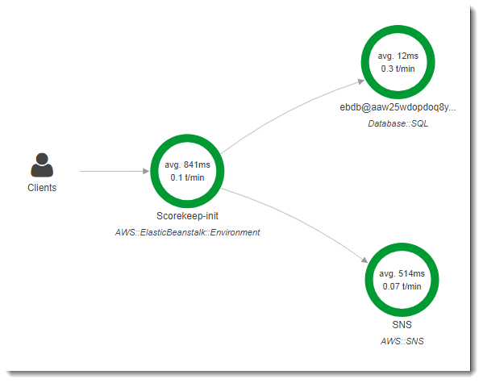

# Instrumenting startup code

###### Note

End-of-support notice – On February 25th, 2027, AWS X-Ray will discontinue support for AWS X-Ray SDKs and daemon. After February 25th, 2027, you will no longer receive updates or releases. For more information on the support timeline, see
[X-Ray SDK and daemon end of support timeline](xray-daemon-eos.md "xray-daemon-eos.md"). We recommend to migrate to OpenTelemetry. For more information on migrating to OpenTelemetry, see [Migrating from X-Ray instrumentation to OpenTelemetry instrumentation](xray-sdk-migration.md "xray-sdk-migration.md") .

The X-Ray SDK for Java automatically creates segments for incoming requests. As long as a
request is in scope, you can use instrumented clients and record subsegments without issue. If
you try to use an instrumented client in startup code, though, you'll get a [SegmentNotFoundException](../../../xray-sdk-for-java/latest/javadoc/com/amazonaws/xray/exceptions/SegmentNotFoundException.md "../../../xray-sdk-for-java/latest/javadoc/com/amazonaws/xray/exceptions/SegmentNotFoundException.md").

Startup code runs outside of the standard request/response flow of a web application, so you
need to create segments manually to instrument it. Scorekeep shows the instrumentation of
startup code in its `WebConfig` files. Scorekeep calls an SQL database and Amazon SNS
during startup.


The default `WebConfig` class creates an Amazon SNS subscription for notifications. To
provide a segment for the X-Ray SDK to write to when the Amazon SNS client is used, Scorekeep calls
`beginSegment` and `endSegment` on the global recorder.

###### Example [`src/main/java/scorekeep/WebConfig.java`](https://github.com/awslabs/eb-java-scorekeep/tree/xray/src/main/java/scorekeep/WebConfig.java#L49 "https://github.com/awslabs/eb-java-scorekeep/tree/xray/src/main/java/scorekeep/WebConfig.java#L49") – Instrumented

AWS SDK client in startup code

```
`AWSXRay.beginSegment("Scorekeep-init");`
if ( System.getenv("NOTIFICATION_EMAIL") != null ){
  try { Sns.createSubscription(); }
  catch (Exception e ) {
    logger.warn("Failed to create subscription for email "+  System.getenv("NOTIFICATION_EMAIL"));
  }
}
`AWSXRay.endSegment();`
```

In `RdsWebConfig`, which Scorekeep uses when an Amazon RDS database is connected, the
configuration also creates a segment for the SQL client that Hibernate uses when it applies the
database schema during startup.

###### Example [`src/main/java/scorekeep/RdsWebConfig.java`](https://github.com/awslabs/eb-java-scorekeep/tree/xray/src/main/java/scorekeep/RdsWebConfig.java#L83 "https://github.com/awslabs/eb-java-scorekeep/tree/xray/src/main/java/scorekeep/RdsWebConfig.java#L83") –

Instrumented SQL database client in startup code

```
@PostConstruct
public void schemaExport() {
  EntityManagerFactoryImpl entityManagerFactoryImpl = (EntityManagerFactoryImpl) localContainerEntityManagerFactoryBean.getNativeEntityManagerFactory();
  SessionFactoryImplementor sessionFactoryImplementor = entityManagerFactoryImpl.getSessionFactory();
  StandardServiceRegistry standardServiceRegistry = sessionFactoryImplementor.getSessionFactoryOptions().getServiceRegistry();
  MetadataSources metadataSources = new MetadataSources(new BootstrapServiceRegistryBuilder().build());
  metadataSources.addAnnotatedClass(GameHistory.class);
  MetadataImplementor metadataImplementor = (MetadataImplementor) metadataSources.buildMetadata(standardServiceRegistry);
  SchemaExport schemaExport = new SchemaExport(standardServiceRegistry, metadataImplementor);

  `AWSXRay.beginSegment("Scorekeep-init");`
  schemaExport.create(true, true);
  `AWSXRay.endSegment();`
}
```

`SchemaExport` runs automatically and uses an SQL client. Since the client is
instrumented, Scorekeep must override the default implementation and provide a segment for the
SDK to use when the client is invoked.
