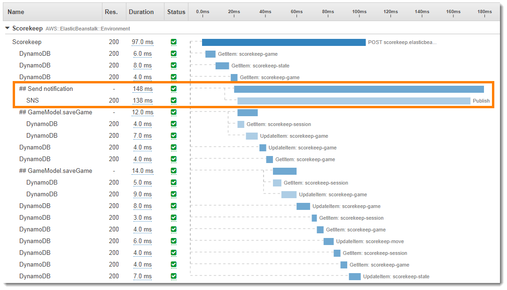

# Using instrumented clients in worker threads

###### Note

End-of-support notice – On February 25th, 2027, AWS X-Ray will discontinue support for AWS X-Ray SDKs and daemon. After February 25th, 2027, you will no longer receive updates or releases. For more information on the support timeline, see
[X-Ray SDK and daemon end of support timeline](xray-daemon-eos.md "xray-daemon-eos.md"). We recommend to migrate to OpenTelemetry. For more information on migrating to OpenTelemetry, see [Migrating from X-Ray instrumentation to OpenTelemetry instrumentation](xray-sdk-migration.md "xray-sdk-migration.md") .

Scorekeep uses a worker thread to publish a notification to Amazon SNS when a user wins a game.
Publishing the notification takes longer than the rest of the request operations combined, and
doesn't affect the client or user. Therefore, performing the task asynchronously is a good way
to improve response time.

However, the X-Ray SDK for Java doesn't know which segment was active when the thread is
created. As a result, when you try to use the instrumented AWS SDK for Java client within the thread,
it throws a `SegmentNotFoundException`, crashing the thread.

###### Example Web-1.error.log

```
Exception in thread "Thread-2" com.amazonaws.xray.exceptions.SegmentNotFoundException: Failed to begin subsegment named 'AmazonSNS': segment cannot be found.
        at sun.reflect.NativeConstructorAccessorImpl.newInstance0(Native Method)
        at sun.reflect.NativeConstructorAccessorImpl.newInstance(NativeConstructorAccessorImpl.java:62)
        at sun.reflect.DelegatingConstructorAccessorImpl.newInstance(DelegatingConstructorAccessorImpl.java:45)
...
```

To fix this, the application uses `GetTraceEntity` to get a reference to the
segment in the main thread, and `Entity.run()` to safely run the worker thread
code with access to the segment's context.

###### Example [`src/main/java/scorekeep/MoveFactory.java`](https://github.com/awslabs/eb-java-scorekeep/tree/xray/src/main/java/scorekeep/MoveFactory.java#L70 "https://github.com/awslabs/eb-java-scorekeep/tree/xray/src/main/java/scorekeep/MoveFactory.java#L70") – Passing

trace context to a worker thread

```
import com.amazonaws.xray.AWSXRay;
import com.amazonaws.xray.AWSXRayRecorder;
import com.amazonaws.xray.entities.Entity;
import com.amazonaws.xray.entities.Segment;
import com.amazonaws.xray.entities.Subsegment;
...
      `Entity segment = recorder.getTraceEntity();`
      Thread comm = new Thread() {
        public void run() {
         `segment.run(() -> {`
            `Subsegment subsegment = AWSXRay.beginSubsegment("## Send notification");`
            Sns.sendNotification("Scorekeep game completed", "Winner: " + userId);
            `AWSXRay.endSubsegment();`
          }
        }
```

Because the request is now resolved before the call to Amazon SNS, the application creates a
separate subsegment for the thread. This prevents the X-Ray SDK from closing the segment before
it records the response from Amazon SNS. If no subsegment is open when Scorekeep resolved the
request, the response from Amazon SNS could be lost.


See [Passing segment context between threads in a
multithreaded application](xray-sdk-java-multithreading.md "xray-sdk-java-multithreading.md") for more information about
multithreading.
