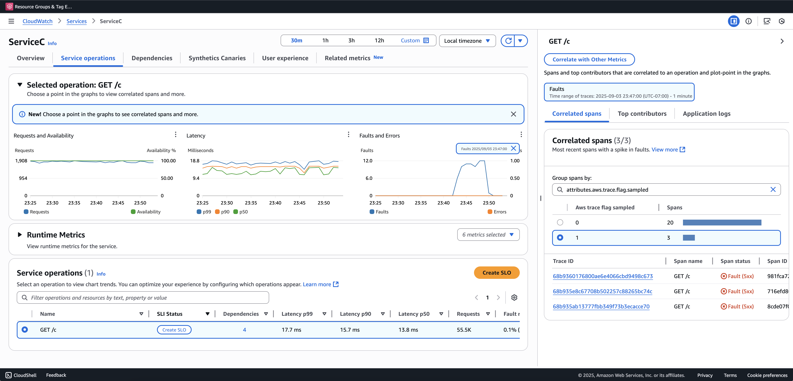

# Configuring adaptive sampling

Missing critical traces during anomaly spikes can make root cause analysis difficult. However, maintaining high sampling rates is expensive. X-Ray adaptive sampling provides complete visibility into anomalies and controls cost during normal operations. With adaptive sampling, you set a maximum sampling rate, and X-Ray
automatically adjusts within that limit. X-Ray calculates the minimum boost needed to capture error traces. If your baseline rate captures enough data, no boost occurs. You only pay for extra sampling when needed.

Benefits of using adaptive sampling:

- Complete incident visibility – Get full traces during incidents without manual intervention. X-Ray automatically adjusts sampling rates to capture error traces, then returns to normal rates.
- Root cause visibility – Always see the source of problems. X-Ray captures critical error data even when full trace sampling isn't triggered.
- Optimize costs – Brief sampling boosts (up to 1 minute) and automatic cooldown periods prevent oversampling. You pay only for the data you need to diagnose issues.

###### Topics

- [Supported SDKs and platforms](#adaptive-sampling-supported-sdks "#adaptive-sampling-supported-sdks")
- [Choose your adaptive sampling approach](#adaptive-sampling-features "#adaptive-sampling-features")
- [Local SDK configuration](#local-sdk-configuration "#local-sdk-configuration")

## Supported SDKs and platforms

**Supported SDK** – Adaptive sampling requires the latest version of the ADOT SDK.

**Supported language** – Java (version [v2.11.5](https://github.com/aws-observability/aws-otel-java-instrumentation/releases/tag/v2.11.5 "https://github.com/aws-observability/aws-otel-java-instrumentation/releases/tag/v2.11.5") or higher)

Your application must be instrumented with the supported ADOT SDK and executed together with either the Amazon CloudWatch Agent or the OpenTelemetry Collector.

For example, Amazon EC2, Amazon ECS, and Amazon EKS are common platforms where AWS Application Signals provides guidance for enabling the ADOT SDK and Amazon CloudWatch Agent.

## Choose your adaptive sampling approach

Adaptive sampling supports two approaches, Sampling Boost and Anomaly Span Capture. These can be applied independently or can be combined together.

### Sampling boost

Adaptive sampling boost is based on sampling rules and works with the existing X-Ray head-based sampling model. Head-based sampling means that sampling decisions are made at the root service, and the sampling flag is passed downstream to all services in the call chain.

- **Rule-based boosting** – Boosting is always tied to a specific X-Ray sampling rule. Each rule can define its own maximum boost rate and cool down behavior.
- **Head-based sampling** – Sampling decisions are made at the root service, and the sampling flag is passed downstream to all services in the call chain.
- **Anomaly-driven** – X-Ray relies on the SDK to report anomaly statistics. When X-Ray detects anomalies such as errors or high latency, it uses these statistics to calculate an appropriate boost rate (up to the configured maximum).

**Anomaly reporting**

Every application service in the call chain can emit anomaly statistics through the required SDK:

- **Root service** – Must run on a supported SDK and platform to enable sampling boost. If the root service is not supported, no boost will occur.
- **Downstream services** – Downstream services only report anomalies; they cannot make sampling decisions. When a downstream service is running a supported SDK, anomalies detected can trigger a sampling boost.
  When a downstream service is unsupported (for example, running an older SDK) , anomalies on that service will not trigger a boost. These services can still propagate the context downstream when they follow standard context propagation
  (such as W3C trace context and baggage). This ensures that supported SDKs in further downstream services can report anomalies that trigger a boost.

**Boost timing and scope**

- **Trigger delay** – You can expect a sampling boost to begin as low as 10 seconds after X-Ray detects an anomaly.
- **Boost period** – After X-Ray triggers a boost, it lasts up to 1 minute before returning back to the base sampling rate.
- **Boost cool down** – After a boost occurs, X-Ray will not trigger another boost for the same rule until the cool down window has passed.

For example, when you set `cooldown` to 10 minutes, once a boost ends, no new boost can be triggered until the next 10 minutes window.

Special case: when you set `cooldown` to 1 minute, and since a boost itself can last up to 1 minute, boosts can effectively be triggered continuously if anomaly persist.

###### Note

Use supported SDKs and platforms for your root service. Sampling boost works only with supported SDKs and platforms. While sampling boost has a high probability of capturing anomaly traces, it may not capture every anomaly trace.

**Boost visibility**

When a sampling rule is configured with adaptive sampling boost, X-Ray automatically emits vended metrics that allow you to monitor boost activity.

- **Metric name** – `SamplingRate`
- **Dimension** – `RuleName` (set to the actual rule name)

Each rule with `SamplingRateBoost` enabled will publish its effective sampling rate, including both the baseline rate and any temporary boosts. This allows you to:

- Track when boosts are triggered
- Monitor the effective sampling rate for each rule
- Correlate boosts with application anomalies (such as error spikes or latency events)

You can view these metrics in **Amazon CloudWatch Metrics, under AWS/X-Ray namespace. The metric value is a floating-point number between 0 and 1, representing the effective sampling rate**.

**Configure sampling boost using X-Ray sampling rules**

You can enable adaptive sampling directly in your existing X-Ray sampling rules by adding a new `SamplingRateBoost` field. For more information, see
[Customizing sampling rules](xray-console-sampling.md#xray-console-custom "xray-console-sampling.md#xray-console-custom"). This provides a centralized way to enable adaptive sampling without modifying application code or
applying application deployment. When you enable adaptive sampling, X-Ray automatically increases sampling during anomalies such as error spikes or latency outliers, while keeping sampling rates within your configured maximum. `SamplingRateBoost` can be
applied to any custom sampling rule except the `Default` sampling rule.

The `SamplingRateBoost` field defines the upper bound and behavior for anomaly-driven sampling.

```

"SamplingRateBoost": {
  "MaxRate": 0.25,
  "CooldownWindowMinutes": 10
}

```

The `MaxRate` defines the maximum sampling rate X-Ray will apply when it detects anomalies. Value range is `0.0` to `1.0`. For example, `"MaxRate": 0.25` allows sampling to increase up to 25% of requests during an anomaly window.
X-Ray determines the appropriate rate between your baseline and the maximum, depending on anomaly activity.

The `CooldownWindowMinutes` defines time window (in minutes) in which only one sampling rate boost can be triggered. After a boost occurs, no further boosts are allowed until the next window. The Value type is _integer (minutes)_.

**Example rule with adaptive sampling**

```

{
  "RuleName": "MyAdaptiveRule",
  "Priority": 1,
  "ReservoirSize": 1,
  "FixedRate": 0.05,
  "ServiceName": "*",
  "ServiceType": "*",
  "Host": "*",
  "HTTPMethod": "*",
  "URLPath": "*",
  "SamplingRateBoost": {
    "MaxRate": 0.25,
    "CooldownWindowMinutes": 10
  }
}

```

In this example, baseline sampling is 5% (`FixedRate: 0.05`). During anomalies, X-Ray can increase sampling up to 25% (`MaxRate: 0.25`). Boost only once every 10 minutes.

**Anomaly condition configuration**

When no anomaly condition configuration is provided, the ADOT SDK uses **HTTP 5xx error codes** as the default anomaly condition to trigger sampling boost.

You can also fine tune anomaly conditions locally in the supported ADOT SDK using environment variables. For more information, see [Local SDK configuration](#local-sdk-configuration "#local-sdk-configuration").

### Anomaly spans capture

Anomaly span capture ensures that critical spans representing anomalies are always recorded, even if the full trace is not sampled. This feature complements sampling boost by focusing on
capturing the anomaly itself, rather than increasing sampling for future traces.

When the ADOT SDK detects an anomaly, it emits that span immediately, regardless of the sampling decision. Since the SDK emits only spans related to the anomaly, these traces
are partial traces, not full end-to-end transactions.

Once the ADOT SDK detects an anomaly span, it attempts to emit as many spans from the same trace as possible. All spans emitted under this feature are tagged with the attribute, `aws.trace.flag.sampled = 0`.
This allows you to easily distinguish partial traces (anomaly capture) from complete traces (normal sampling) in transaction search and analysis.

We recommend onboarding [Transaction Search](xray-transactionsearch.md "xray-transactionsearch.md") to view and query partial traces. The following example shows a Service page in [Application Signals](../../../AmazonCloudWatch/latest/monitoring/CloudWatch-Application-Monitoring-Sections.md "../../../AmazonCloudWatch/latest/monitoring/CloudWatch-Application-Monitoring-Sections.md") console.
ServiceC is configured with anomaly span capture, and it is part of a call chain where sampling boost applies. This configurations generates both complete and partial traces. You can use the `aws.trace.flag.sampled` attribute to distinguish between trace types.



Anomaly spans capture can only be enabled or customized through the [Local SDK configuration](#local-sdk-configuration "#local-sdk-configuration").

## Local SDK configuration

You can configure adaptive sampling features in the ADOT SDK by providing a YAML configuration through an environment variable. Local configuration provides fine-grained control over anomaly conditions, thresholds.

This is required for _anomaly span capture_ and optional for customizing _sampling boost_ conditions. The following is an example of the configuration:

```

version: 1.0
anomalyConditions:
  - errorCodeRegex: "^5\\d\\d$"
    usage: both
  - operations:
      - "/api"
    errorCodeRegex: "^429|5\\d\\d$"
    highLatencyMs: 300
    usage: sampling-boost
  - highLatencyMs: 1000
    usage: anomaly-span-capture

anomalyCaptureLimit:
  anomalyTracesPerSecond: 1

```

Field definitions are below:

- `version` – Schema version for the configuration file
- `anomalyConditions` – Defines the conditions under which anomalies are detected and how they are used
  - `errorCodeRegex` – Regular expression defining which HTTP status codes are considered anomalies
  - `operations` – List of operations or endpoints to which the condition applies
  - `highLatencyMs` – Latency threshold (in milliseconds) above which spans are treated as anomalies
  - `usage` – Defines which feature the condition applies to:
    - `both` – Applies to **sampling boost** and **anomaly span capture** (Default if usage is not specified)
    - `sampling-boost` – Used only for triggering sampling boosts
    - `anomaly-span-capture` – Used only for anomaly span capture

- `anomalyCaptureLimit` – Defines limits on how many traces with anomaly spans are emitted.

`anomalyTracesPerSecond` – Maximum number of traces with anomaly spans captured per second, to prevent excessive span volume (Default value is 1 if anomalyCaptureLimit is not present).

###### Note

- `AnomalyConditions` **overrides** the default anomaly condition for sampling boost (HTTP 5xx). If you want to retain the default condition while using local configuration, you must explicitly include it in any item
  of `AnomalyConditions`.
- For each `anomalyConditions` item:
  - When the `operations` field is **omitted**, the condition applies to **all operations** (service level)
  - When the `operations` field is present but set to an **empty list**, the condition applies to **no operations**, making that item a no-op
  - When both `errorCodeRegex` and `highLatencyMs` are omitted, the condition has no anomaly criteria to evaluate, making that item a no-op

- Logical relationships:
  - Between items in `anomalyConditions`, the relationship is **OR**.
  - Within a single item, multiple fields (for example, `errorCodeRegex` and `highLatencyMs`) are combined with **AND**.

  For example:

  ```

  errorCodeRegex: "^429|5\\d\\d$"
  highLatencyMs: 300

  ```

  This condition means, **status code matches 429 or 5xx AND latency ≥ 300 ms**.

### Apply the Local Configuration to ADOT SDK

You can apply the local configuration to the ADOT SDK by setting the environment variable `AWS_XRAY_ADAPTIVE_SAMPLING_CONFIG`. The value must be a valid YAML document (inline or nested).

For example, Amazon EC2 and Amazon ECS, set the environment variable directly:

```

AWS_XRAY_ADAPTIVE_SAMPLING_CONFIG="{version: 1.0, anomalyConditions: [{errorCodeRegex: \"^500$\", usage: \"sampling-boost\"}, {errorCodeRegex: \"^501$\", usage: \"anomaly-trace-capture\"}], anomalyCaptureLimit: {anomalyTracesPerSecond: 10}}"

```

For Amazon EKS, define the environment variable inside the pod spec as nested YAML:

```

apiVersion: v1
kind: Pod
metadata:
  name: adot-sample
spec:
  containers:
    - name: adot-app
      image: my-app:latest
      env:
        - name: AWS_XRAY_ADAPTIVE_SAMPLING_CONFIG
          value: |
            version: 1.0
            anomalyConditions:
              - errorCodeRegex: "^500$"
                usage: sampling-boost
              - errorCodeRegex: "^501$"
                usage: anomaly-trace-capture
            anomalyCaptureLimit:
              anomalyTracesPerSecond: 10

```
