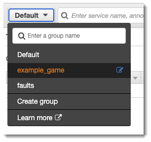
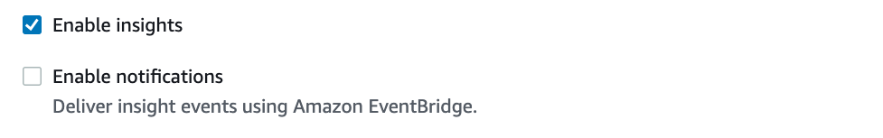
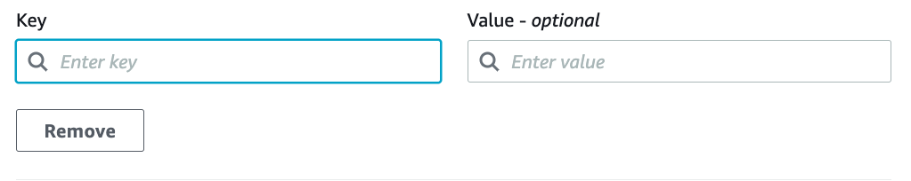
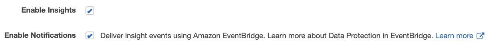
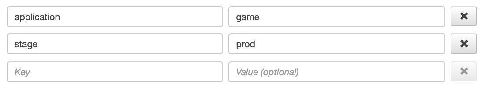

# Configuring groups

Groups are a collection of traces that are defined by a filter expression. You can use
groups to generate additional service graphs and supply Amazon CloudWatch metrics. You can use the
AWS X-Ray console or X-Ray API to create and manage groups for your services. This topic
describes how to create and manage groups by using the X-Ray console. For information about how
to manage groups by using the X-Ray API, see [Groups](xray-api-configuration.md#xray-api-configuration-groups "xray-api-configuration.md#xray-api-configuration-groups").

You can create groups of traces for trace maps, traces, or analytics. When you create a group, the group
becomes available as a filter on the group dropdown menu on all three pages: **Trace Map**,
**Traces**, and **Analytics**.


Groups are identified by their name or an Amazon Resource Name (ARN), and contain a filter
expression. The service compares incoming traces to the expression and stores them accordingly.
For more information about how to build a filter expression, see [Using filter expressions](xray-console-filters.md "xray-console-filters.md").

Updating a group's filter expression doesn't change data that's already recorded. The update
applies only to subsequent traces. This can result in a merged graph of the new and old
expressions. To avoid this, delete a current group and create a new one.

###### Note

Groups are billed by the number of retrieved traces that match the filter expression. For
more information, see [AWS X-Ray pricing](https://aws.amazon.com/xray/pricing/ "https://aws.amazon.com/xray/pricing/").

###### Topics

- [Create a group](#xray-console-group-create-console "#xray-console-group-create-console")
- [Apply a group](#xray-console-group-apply "#xray-console-group-apply")
- [Edit a group](#xray-console-group-edit "#xray-console-group-edit")
- [Clone a group](#xray-console-group-clone "#xray-console-group-clone")
- [Delete a group](#xray-console-group-delete "#xray-console-group-delete")
- [View group metrics in Amazon CloudWatch](#xray-console-group-cloudwatch "#xray-console-group-cloudwatch")

## Create a group

###### Note

You can now configure X-Ray groups from within the Amazon CloudWatch console.
You can also continue to use the X-Ray console.

CloudWatch console

1. Sign in to the AWS Management Console and open the CloudWatch console at
   [https://console.aws.amazon.com/cloudwatch/](https://console.aws.amazon.com/cloudwatch/ "https://console.aws.amazon.com/cloudwatch/").
2. Choose **Settings** in the left navigation pane.
3. Choose **View settings** under **Groups** within the **X-Ray traces** section.
4. Choose **Create group** above the list of groups.
5. On the **Create group** page, enter a name for the group. A group name can have a maximum
   of 32 characters, and contain alphanumeric characters and dashes. Group names are case sensitive.
6. Enter a filter expression. For more information about how to build a filter expression, see [Using filter expressions](xray-console-filters.md "xray-console-filters.md"). In the following example, the group
   filters for fault traces from the service `api.example.com`. and requests to the service where the
   response time was greater than or equal to five seconds.

```
fault = true AND http.url CONTAINS "example/game" AND responsetime >= 5
```

7. In **Insights**, enable or disable insights access for the group. For more information
   about insights, see [Using X-Ray insights](xray-console-insights.md "xray-console-insights.md").

 8. In **Tags**, choose **Add new tag** to enter a tag key, and optionally, a tag value.
Continue to add additional tags as desired. Tag keys must be unique. To delete a tag, choose **Remove**
underneath each tag. For more information about tags, see [Tagging X-Ray sampling rules and groups](xray-tagging.md "xray-tagging.md").

 9. Choose **Create group**.

X-Ray console

1. Sign in to the AWS Management Console and open the X-Ray console at
   [https://console.aws.amazon.com/xray/home](https://console.aws.amazon.com/xray/home "https://console.aws.amazon.com/xray/home").
2. Open the **Create group** page from the **Groups** page in the left
   navigation pane, or from the group menu on one of the following pages: **Trace Map**,
   **Traces**, and **Analytics**.
3. On the **Create group** page, enter a name for the group. A group name can have a maximum
   of 32 characters, and contain alphanumeric characters and dashes. Group names are case sensitive.
4. Enter a filter expression. For more information about how to build a filter expression, see [Using filter expressions](xray-console-filters.md "xray-console-filters.md"). In the following example, the group
   filters for fault traces from the service `api.example.com`. and requests to the service where the
   response time was greater than or equal to five seconds.

```
fault = true AND http.url CONTAINS "example/game" AND responsetime >= 5
```

5. In **Insights**, enable or disable insights access for the group. For more information
   about insights, see [Using X-Ray insights](xray-console-insights.md "xray-console-insights.md").

 6. In **Tags**, enter a tag key, and optionally, a tag value. As you add a tag, a new line
appears for you to enter another tag. Tag keys must be unique. To delete a tag, choose **X**
at the end of the tag's row. For more information about tags, see [Tagging X-Ray sampling rules and groups](xray-tagging.md "xray-tagging.md").

 7. Choose **Create group**.

## Apply a group

CloudWatch console

1. Sign in to the AWS Management Console and open the CloudWatch console at
   [https://console.aws.amazon.com/cloudwatch/](https://console.aws.amazon.com/cloudwatch/ "https://console.aws.amazon.com/cloudwatch/").
2. Open one of the following pages from the navigation pane under **X-Ray traces**:
   - **Trace Map**
   - **Traces**

3. Enter a group name into the **Filter by X-Ray group** filter. The data shown on the page changes to
   match the filter expression set in the group.

X-Ray console

1. Sign in to the AWS Management Console and open the X-Ray console at
   [https://console.aws.amazon.com/xray/home](https://console.aws.amazon.com/xray/home "https://console.aws.amazon.com/xray/home").
2. Open one of the following pages from the navigation pane:
   - **Trace Map**
   - **Traces**
   - **Analytics**

3. On the group menu, choose the group that you created in [Create a group](#xray-console-group-create-console "#xray-console-group-create-console"). The data shown on the page changes to
   match the filter expression set in the group.

## Edit a group

CloudWatch console

1. Sign in to the AWS Management Console and open the CloudWatch console at
   [https://console.aws.amazon.com/cloudwatch/](https://console.aws.amazon.com/cloudwatch/ "https://console.aws.amazon.com/cloudwatch/").
2. Choose **Settings** in the left navigation pane.
3. Choose **View settings** under **Groups** within the **X-Ray traces** section.
4. Choose a group from the **Groups** section and then choose **Edit**.
5. Although you can't rename a group, you can update the filter expression. For more information about how to
   build a filter expression, see [Using filter expressions](xray-console-filters.md "xray-console-filters.md"). In
   the following example, the group filters for fault traces from the service `api.example.com`, where
   the request URL address contains `example/game`, and response time for requests was greater than or
   equal to five seconds.

```
fault = true AND http.url CONTAINS "example/game" AND responsetime >= 5
```

6. In **Insights**, enable or disable insights access for the group. For more information
   about insights, see [Using X-Ray insights](xray-console-insights.md "xray-console-insights.md").

 7. In **Tags**, choose **Add new tag** to enter a tag key, and optionally, a tag value.
Continue to add additional tags as desired. Tag keys must be unique. To delete a tag, choose **Remove**
underneath each tag. For more information about tags, see [Tagging X-Ray sampling rules and groups](xray-tagging.md "xray-tagging.md").

 8. When you're finished updating the group, choose **Update group**.

X-Ray console

1. Sign in to the AWS Management Console and open the X-Ray console at
   [https://console.aws.amazon.com/xray/home](https://console.aws.amazon.com/xray/home "https://console.aws.amazon.com/xray/home").
2. Do one of the following to open the **Edit group** page.
   1. On the **Groups** page, choose the name of a group to edit
      it.
   2. On the group menu on one of the following pages, point to a group, and then choose
      **Edit**.
      - **Trace Map**
      - **Traces**
      - **Analytics**

3. Although you can't rename a group, you can update the filter expression. For more information about how to
   build a filter expression, see [Using filter expressions](xray-console-filters.md "xray-console-filters.md"). In
   the following example, the group filters for fault traces from the service `api.example.com`, where
   the request URL address contains `example/game`, and response time for requests was greater than or
   equal to five seconds.

```
fault = true AND http.url CONTAINS "example/game" AND responsetime >= 5
```

4. In **Insights**, enable or disable insights and insights notifications for the group. For
   more information about insights, see [Using X-Ray insights](xray-console-insights.md "xray-console-insights.md").

 5. In **Tags**, edit tag keys and values. Tag keys must be unique. Tag values are
optional; you can delete values, if you want. To delete a tag, choose **X** at the end
of the tag's row. For more information about tags, see [Tagging X-Ray sampling rules and groups](xray-tagging.md "xray-tagging.md").

 6. When you're finished updating the group, choose **Update group**.

## Clone a group

Cloning a group creates a new group that has the filter expression and tags of an existing
group. When you clone a group, the new group has the same name as the group from which it's
cloned, with `-clone` appended to the name.

CloudWatch console

1. Sign in to the AWS Management Console and open the CloudWatch console at
   [https://console.aws.amazon.com/cloudwatch/](https://console.aws.amazon.com/cloudwatch/ "https://console.aws.amazon.com/cloudwatch/").
2. Choose **Settings** in the left navigation pane.
3. Choose **View settings** under **Groups** within the **X-Ray traces** section.
4. Choose a group from the **Groups** section and then choose **Clone**.
5. On the **Create group** page, the name of the group is
   `group-name``-clone`. Optionally, enter a new name for the group. A
   group name can have a maximum of 32 characters, and contain alphanumeric characters and dashes. Group names
   are case sensitive.
6. You can keep the filter expression from the existing group, or optionally, enter a new
   filter expression. For more information about how to build a filter expression, see [Using filter expressions](xray-console-filters.md "xray-console-filters.md"). In the following
   example, the group filters for fault traces from the service `api.example.com`.
   and requests to the service where the response time was greater than or equal to five
   seconds.

```
service("api.example.com") { fault = true OR responsetime >= 5 }
```

7. In **Tags**, edit tag keys and values, if needed. Tag keys must be unique. Tag values are
   optional; you can delete values if you want. To delete a tag, choose **X** at the end of the
   tag's row. For more information about tags, see [Tagging X-Ray sampling rules and groups](xray-tagging.md "xray-tagging.md").
8. Choose **Create group**.

X-Ray console

1. Sign in to the AWS Management Console and open the X-Ray console at
   [https://console.aws.amazon.com/xray/home](https://console.aws.amazon.com/xray/home "https://console.aws.amazon.com/xray/home").
2. Open the **Groups** page from the left navigation pane,
   and the choose the name of a group that you want to clone.
3. Choose **Clone group** from the **Actions** menu.
4. On the **Create group** page, the name of the group is
   `group-name``-clone`. Optionally, enter a new name for the group. A
   group name can have a maximum of 32 characters, and contain alphanumeric characters and dashes. Group names
   are case sensitive.
5. You can keep the filter expression from the existing group, or optionally, enter a new
   filter expression. For more information about how to build a filter expression, see [Using filter expressions](xray-console-filters.md "xray-console-filters.md"). In the following
   example, the group filters for fault traces from the service `api.example.com`.
   and requests to the service where the response time was greater than or equal to five
   seconds.

```
service("api.example.com") { fault = true OR responsetime >= 5 }
```

6. In **Tags**, edit tag keys and values, if needed. Tag keys must be unique. Tag values are
   optional; you can delete values if you want. To delete a tag, choose **X** at the end of the
   tag's row. For more information about tags, see [Tagging X-Ray sampling rules and groups](xray-tagging.md "xray-tagging.md").
7. Choose **Create group**.

## Delete a group

Follow steps in this section to delete a group. You can't delete the
**Default** group.

CloudWatch console

1. Sign in to the AWS Management Console and open the CloudWatch console at
   [https://console.aws.amazon.com/cloudwatch/](https://console.aws.amazon.com/cloudwatch/ "https://console.aws.amazon.com/cloudwatch/").
2. Choose **Settings** in the left navigation pane.
3. Choose **View settings** under **Groups** within the **X-Ray traces** section.
4. Choose a group from the **Groups** section and then choose **Delete**.
5. When you're prompted to confirm, choose **Delete**.

X-Ray console

1. Sign in to the AWS Management Console and open the X-Ray console at
   [https://console.aws.amazon.com/xray/home](https://console.aws.amazon.com/xray/home "https://console.aws.amazon.com/xray/home").
2. Open the **Groups** page from the left navigation pane,
   and the choose the name of a group that you want to delete.
3. On the **Actions** menu, choose **Delete
   group**.
4. When you're prompted to confirm, choose **Delete**.

## View group metrics in Amazon CloudWatch

After a group is created, incoming traces are checked against the group’s filter expression as they're stored
in the X-Ray service. Metrics for the number of traces matching each criteria are published to Amazon CloudWatch every
minute. Choosing **View metric** on the **Edit group** page opens the CloudWatch
console to the **Metric** page. For more information about how to use CloudWatch metrics, see [Using Amazon CloudWatch
Metrics](../../../AmazonCloudWatch/latest/monitoring/working_with_metrics.md "../../../AmazonCloudWatch/latest/monitoring/working_with_metrics.md") in the _Amazon CloudWatch User Guide_.

CloudWatch console

1. Sign in to the AWS Management Console and open the CloudWatch console at
   [https://console.aws.amazon.com/cloudwatch/](https://console.aws.amazon.com/cloudwatch/ "https://console.aws.amazon.com/cloudwatch/").
2. Choose **Settings** in the left navigation pane.
3. Choose **View settings** under **Groups** within the **X-Ray traces** section.
4. Choose a group from the **Groups** section and then choose **Edit**.
5. On the **Edit group** page, choose **View metric**.

The CloudWatch console **Metrics** page opens in a new tab.

X-Ray console

1. Sign in to the AWS Management Console and open the X-Ray console at
   [https://console.aws.amazon.com/xray/home](https://console.aws.amazon.com/xray/home "https://console.aws.amazon.com/xray/home").
2. Open the **Groups** page from the left navigation pane,
   and the choose the name of a group that you want to view metrics for.
3. On the **Edit group** page, choose **View metric**.

The CloudWatch console **Metrics** page opens in a new tab.
