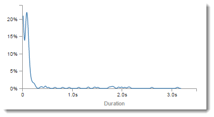
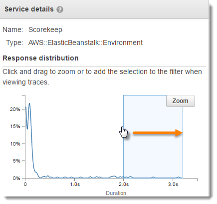
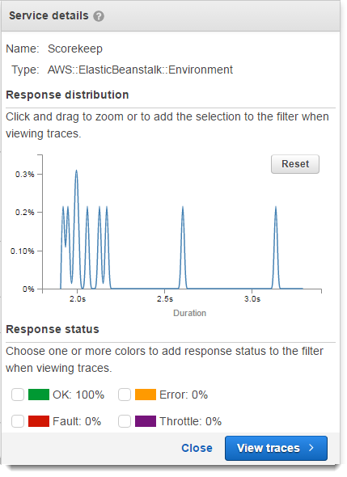

# Using latency histograms

When you select a node or edge on an AWS X-Ray [trace map](xray-console-servicemap.md "xray-console-servicemap.md"), the
X-Ray console shows a latency distribution histogram.

## Latency

Latency is the amount of time between when a request starts and when it completes. A histogram shows a
distribution of latencies. It shows duration on the x-axis, and the percentage of requests that match each duration
on the y-axis.

This histogram shows a service that completes most requests in less than 300 ms. A small percentage of requests
take up to 2 seconds, and a few outliers take more time.

## Interpreting service details

Service
histograms and edge histograms provide a visual representation of latency from the viewpoint of a service or
requester.

- Choose a _service node_ by clicking the circle. X-Ray shows a histogram for requests
  served by the service. The latencies are those recorded by the service, and don't include any network latency
  between the service and the requester.
- Choose an _edge_ by clicking the line or arrow tip of the edge between two services.
  X-Ray shows a histogram for requests from the requester that were served by the downstream service. The
  latencies are those recorded by the requester, and include latency in the network connection between the two
  services.

To interpret the **Service details** panel histogram, you can look for values that differ the
most from the majority of values in the histogram. These _outliers_ can be seen as peaks or
spikes in the histogram, and you can view the traces for a specific area to investigate what's going on.

To view traces filtered by latency, select a range on the histogram. Click where you want to start the selection
and drag from left to right to highlight a range of latencies to include in the trace filter.

After selecting a range, you can choose **Zoom** to view just that portion of the histogram and
refine your selection.

Once you have the focus set to the area you're interested in, choose **View traces**.
