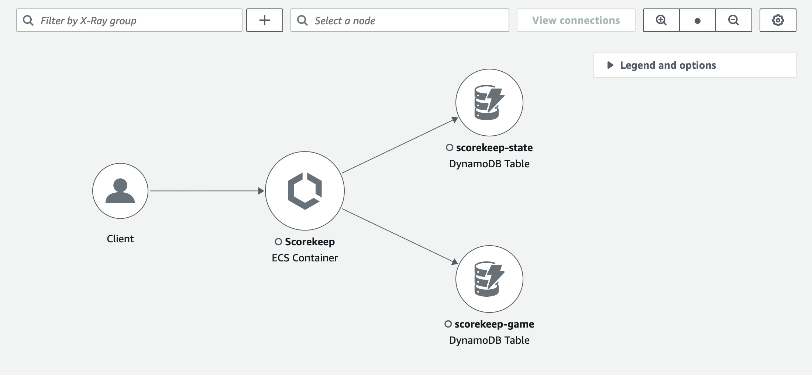
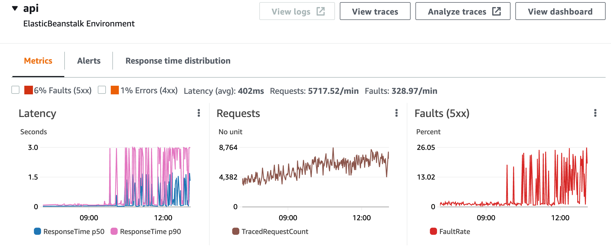
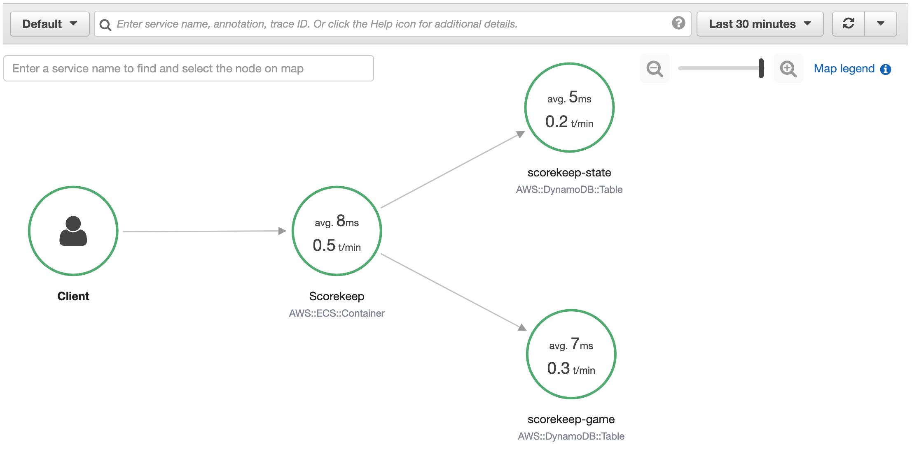
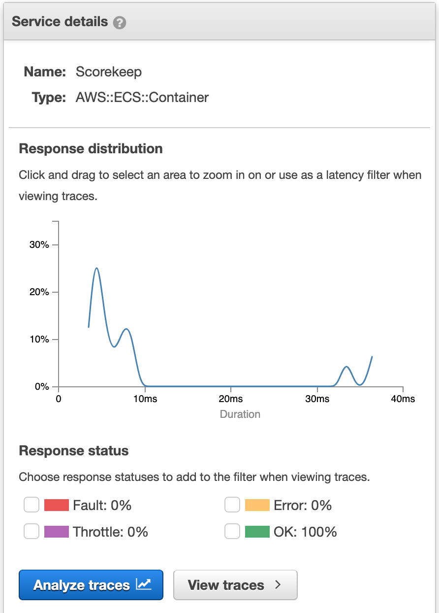
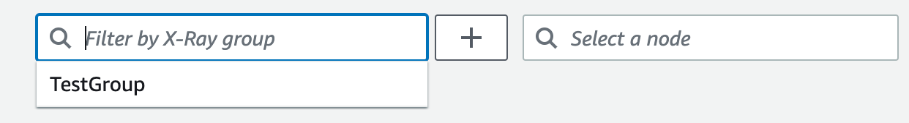
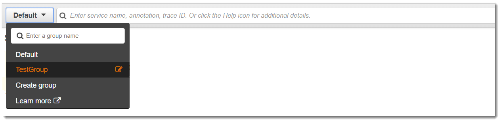

# Using the X-Ray trace map

View the X-Ray trace map to identify services where errors are occurring, connections with
high latency, or traces for requests that were unsuccessful.

###### Note

CloudWatch now includes [Application
Signals](../../../AmazonCloudWatch/latest/monitoring/CloudWatch-Application-Monitoring-Sections.md "../../../AmazonCloudWatch/latest/monitoring/CloudWatch-Application-Monitoring-Sections.md"), which can discover and monitor your application services, clients, synthetics canaries, and
service dependencies. Use Application Signals to see a list or visual map of your services, view health metrics
based on your service level objectives (SLOs), and drill down to see correlated X-Ray traces for more detailed
troubleshooting.

The X-Ray service map and CloudWatch ServiceLens map are combined into the X-Ray trace map within the Amazon CloudWatch
console. Open the [CloudWatch console](https://console.aws.amazon.com/cloudwatch/ "https://console.aws.amazon.com/cloudwatch/") and choose **Trace
Map** under **X-Ray traces** from the left navigation pane.

## Viewing the trace map

The trace map is a visual representation of the trace data that's generated by your applications. The map
shows service nodes that serve requests, upstream client nodes that represent the origins of the requests, and
downstream service nodes that represent web services and resources that are used by an application while
processing a request.

The trace map displays a connected view of traces across event-driven applications that use Amazon SQS and Lambda.
For more information, see [tracing event-driven applications](xray-tracelinking.md "xray-tracelinking.md").
The trace map also supports [cross-account tracing](xray-console-crossaccount.md "xray-console-crossaccount.md"), displaying nodes from multiple accounts in a single map.

CloudWatch console

###### To view the trace map in the CloudWatch console

1. Open the [CloudWatch console](https://console.aws.amazon.com/cloudwatch/ "https://console.aws.amazon.com/cloudwatch/").
   Choose **Trace Map** under the **X-Ray Traces** section in the left
   navigation pane.

 2. Choose a service node to view requests for that node, or an edge between two nodes to view requests that
traveled that connection. 3. Additional information is displayed below the trace map, including tabs for metrics, alerts, and response time distribution.
On the **Metrics** tab, select a range within each graph to drill down to view more detail, or choose **Faults** or
**Errors** options to filter traces. On the **Response time distribution** tab,
select a range within the graph to filter traces by response time.

 4. View traces by choosing
**View traces**, or if a filter has been applied, choose **View filtered traces**. 5. Choose **View logs** to see CloudWatch logs associated with the selected node. Not all trace map nodes support viewing logs.
See [troubleshooting CloudWatch logs](xray-troubleshooting.md#xray-troubleshooting-Nologs "xray-troubleshooting.md#xray-troubleshooting-Nologs") for more information.

The trace map indicates issues within each node by outlining it with colors:

- **Red** for server faults (500 series errors)
- **Yellow** for client errors (400 series errors)
- **Purple** for throttling errors (429 Too Many Requests)

If your trace map is large, use the on-screen controls or mouse
to zoom in and out and move the map around.

X-Ray console

###### To view the Service map

1. Open the [X-Ray console](https://console.aws.amazon.com/xray/home# "https://console.aws.amazon.com/xray/home#").
   The service map is displayed by default. You can also choose **Service Map** from the left navigation pane.

 2. Choose a service node to view requests for that node, or an edge between two nodes to view requests that
traveled that connection. 3. Use the response distribution [histogram](xray-console-histograms.md "xray-console-histograms.md") to filter traces by duration, and select
status codes for which you want to view traces. Then choose **View traces** to open the trace
list with the filter expression applied.

The service map indicates the health of each node by coloring it based on the ratio of successful calls to
errors and faults:

- **Green** for successful calls
- **Red** for server faults (500 series errors)
- **Yellow** for client errors (400 series errors)
- **Purple** for throttling errors (429 Too Many Requests)

If your service map is large, use the on-screen controls or mouse
to zoom in and out and move the map around.

###### Note

The X-Ray trace map can display up to 10,000 nodes. In rare scenarios where the total number of service nodes
exceeds this limit, you may receive an error and be unable to display a complete trace map in the console.

## Filtering the trace map by group

Using a [filter expression](xray-console-filters.md "xray-console-filters.md"), you can define criteria by which to include traces within a group.
Use the following steps to then display that specific group in the trace map.

CloudWatch console
Choose a group name from the group filter on the top-left of the trace map.

X-Ray console
Choose a group name from the drop-down menu to the left of the search bar.

The service map will now be filtered to display traces that match the filter expression of the selected group.

## Trace map legend and options

The trace map includes a legend and several options for customizing the map display.

CloudWatch console
Choose the **Legend and options** drop-down at the top-right of the map.
Choose what is displayed within nodes, including:

- **Metrics** displays the average response time and number of traces sent per minute
  during the chosen time range.
- **Nodes** displays the service icon within each node.

Choose additional map settings from the **Preferences** pane, which can be accessed via the
gear icon at the top-right of the map. These settings include selecting which metric is used to determine
the size of each node, and which canaries should be displayed on the map.

X-Ray console
Display the service map legend by choosing the **Map legend** link at the top-right of the map.
Service map options can be chosen at the bottom-right of the trace map, including:

- **Service Icons** toggles what is displayed within each node, displaying either the
  service icon, or the average response time and number of traces sent per minute during the chosen time range.
- **Node sizing: None** sets all nodes to the same size.
- **Node sizing: Health** sizes nodes by the number of impacted requests including errors, faults, or throttled requests.
- **Node sizing: Traffic** sizes nodes by the total number of requests.
