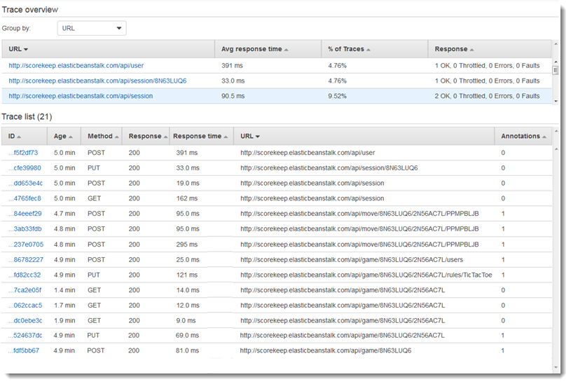
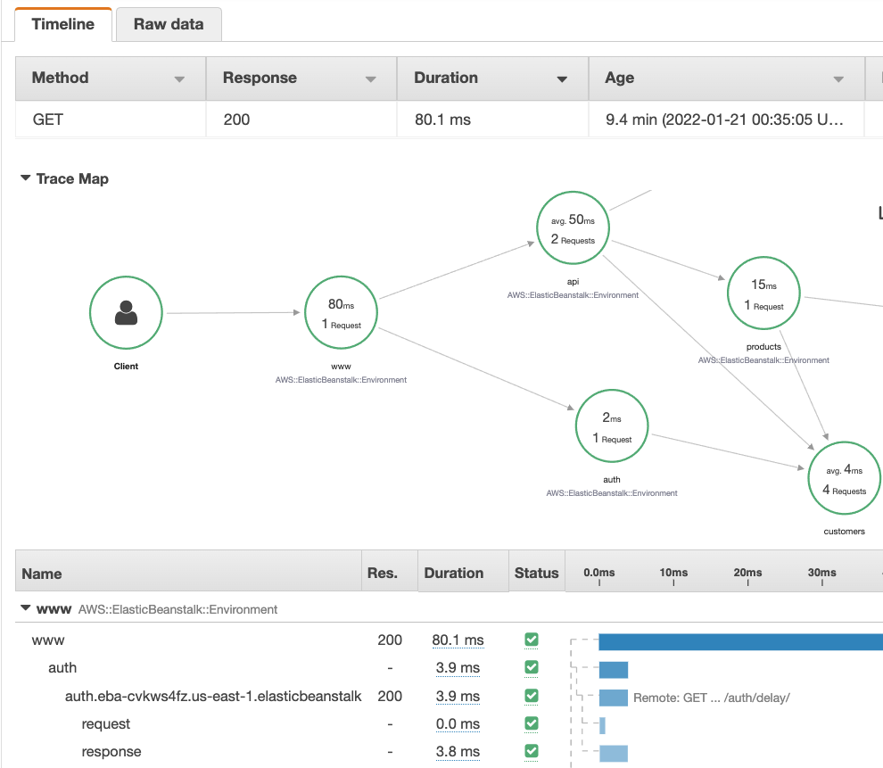
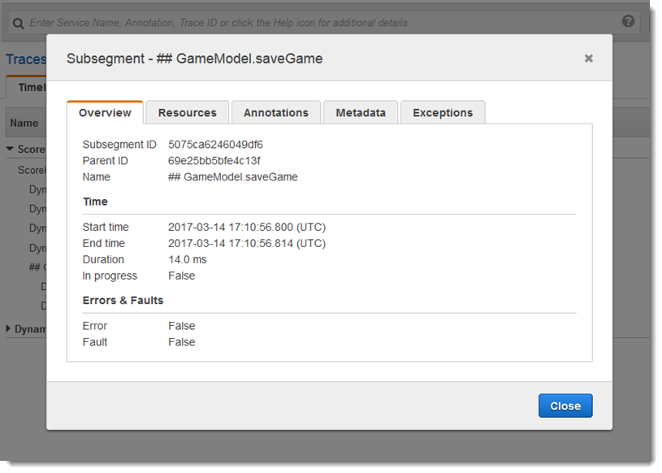

# Viewing traces and trace details

Use the **Traces** page in the X-Ray console to find traces by URL,
response code, or other data from the trace summary. After selecting a trace from the trace
list, the **Trace details** page displays a map of service nodes that are
associated with the selected trace and a timeline of trace segments.

## Viewing traces

CloudWatch console

###### To view traces in the CloudWatch console

1. Sign in to the AWS Management Console and open the CloudWatch console at
   [https://console.aws.amazon.com/cloudwatch/](https://console.aws.amazon.com/cloudwatch/ "https://console.aws.amazon.com/cloudwatch/").
2. In the left navigation pane, choose **X-Ray traces**, then
   choose **Traces**. You can filter by group or enter a [filter expression](xray-console-filters.md "xray-console-filters.md"). This filters the traces
   that are displayed in the **Traces** section at the bottom of the
   page.

Alternatively, you can use the service map to navigate to a specific service
node, and then view traces. This opens the **Traces** page with a
query already applied. 3. Refine your query in the **Query refiners** section. To filter
traces by a common attribute, choose an option from the down arrow next to
**Refine query by**. The options include the following:

    * Node – Filter traces by service node.
    * Resource ARN – Filter traces by a resource associated with a trace.
     Examples of these resources include Amazon Elastic Compute Cloud (Amazon EC2) instance, an AWS Lambda
     function, or an Amazon DynamoDB table.
    * User – Filter traces with a user ID.
    * Error root cause message – Filter traces by error root cause.
    * URL – Filter traces by a URL path used by your application.
    * HTTP status code – Filter traces by the HTTP status code returned by
     your application. You can specify a custom response code or select from the
     following:

    	+ `200` – The request was successful.
    	+ `401` – The request lacked valid authentication
    	 credentials.
    	+ `403` – The request lacked valid permissions.
    	+ `404` – The server could not find the requested
    	 resource.
    	+ `500` – The server encountered an unexpected condition
    	 and generated an internal error.

Choose one or more entries and then choose **Add to query** to
add to the filter expression at the top of the page. 4. To find a single trace, enter a [trace
ID](xray-api-sendingdata.md#xray-api-traceids "xray-api-sendingdata.md#xray-api-traceids") directly into the query field. You can use X-Ray format or World Wide
Web Consortium (W3C) format. For example, a trace that's created using the [AWS Distro for OpenTelemetry](xray-instrumenting-your-app.md#xray-instrumenting-opentel "xray-instrumenting-your-app.md#xray-instrumenting-opentel") is in W3C format.

###### Note

When you query traces that are created with a W3C-format trace ID, the console
displays the matching trace in X-Ray format. For example, if you query for
`4efaaf4d1e8720b39541901950019ee5` in W3C format, the console
displays the X-Ray equivalent:
`1-4efaaf4d-1e8720b39541901950019ee5`. 5. Choose **Run query** at any time to display a list of matching
traces within the **Traces** section at the bottom of the page. 6. To display the **Trace details** page for a single trace,
select a trace ID from the list.

The following image shows a **Trace map** containing service
nodes associated with the trace and edges between the nodes representing the path
taken by segments that compose the trace. A **Trace summary**
follows the **Trace Map**. The summary contains information about a
sample `GET` operation, its **Response Code**, the
**Duration** that the trace took to run, and the
**Age** of the request. The **Segments
Timeline** follows the **Trace Summary** that shows the
duration of trace segments and subsegments.

If you have an event-driven application that uses Amazon SQS and Lambda, you can see a
connected view of traces for each request in the **Trace map**. In
the map, traces from message producers are linked to traces from AWS Lambda consumers
and are displayed as a dashed-line edge. For more information about event-driven
applications, see [Tracing event-driven applications](xray-tracelinking.md "xray-tracelinking.md").

The **Traces** and **Trace details** pages
also support [cross-account tracing](xray-console-crossaccount.md "xray-console-crossaccount.md"),
which can list traces from multiple accounts in the trace list and inside a single
trace map.

X-Ray console

###### To view traces in the X-Ray console

1. Open the [Traces](https://console.aws.amazon.com/xray/home#/traces "https://console.aws.amazon.com/xray/home#/traces") page in the X-Ray console. The **Trace
   overview** panel shows a list of traces that are grouped by common
   features including **Error root causes**,
   **ResourceARN**, and **InstanceId**.
2. To select a common feature to view a grouped set of traces, expand the down
   arrow next to **Group by**. The following illustration shows a
   trace overview of traces that are grouped by URL for the [AWS X-Ray sample application](xray-scorekeep.md "xray-scorekeep.md"), and a list of
   associated traces.

 3. Choose the **ID** of a trace to view it under the
**Trace list**. You can also choose **Service
map** in the navigation pane to view traces for a specific service node.
Then you can view traces that are associated with that node.

The **Timeline** tab shows the request flow for the trace, and
includes the following:

    * A map of the path for each segment in the trace.
    * How long it took for the segment to reach a node in the trace map.
    * How many requests were made to the node in the trace map.

The following illustration shows an example **Trace Map**
associated with a `GET` request made to a sample application. The arrows
show the path that each segment took to complete the request. The service nodes show
the number of requests made during the `GET` request.

For more information about the **Timeline** tab, see the
following **Exploring the trace timeline**
section.

The **Raw data** tab shows information about the trace, and the
segments and subsegments that compose the trace, in `JSON` format. This
information may include the following:

    * Timestamps
    * Unique IDs
    * Resources associated with the segment or subsegment
    * The source, or origin, of the segment or subsegment
    * Additional information about the request to your application such as the
     response from an HTTP request

## Exploring the trace timeline

The **Timeline** section shows a hierarchy of segments and subsegments
next to a horizontal bar that corresponds to time they used to complete their tasks. The first
entry in the list is the segment, which represents all data recorded by the service for a
single request. Subsegments are indented and listed following the segment. Columns contain
information about each segment.

CloudWatch console
In the CloudWatch console, the **Segments Timeline** provides the
following information:

- The first column: Lists the segments and subsegments in the selected
  trace.
- The **Segment status** column: Lists the status outcome of each
  segment and subsegment.
- The **Response code** column: Lists an HTTP response status
  code to a browser request made by the segment or subsegment, when available.
- The **Duration** column: Lists how long the segment or
  subsegment ran.
- The **Hosted in** column: Lists the namespace or environment
  where the segment or subsegment is ran, if applicable. For more information, see
  [Dimensions collected and dimension combinations](../../../AmazonCloudWatch/latest/monitoring/AppSignals-StandardMetrics.md#AppSignals-StandardMetrics-Dimensions "../../../AmazonCloudWatch/latest/monitoring/AppSignals-StandardMetrics.md#AppSignals-StandardMetrics-Dimensions").
- The last column: Displays horizontal bars that correspond to the duration that
  the segment or subsegment ran, in relation to the other segments or subsegments in
  the timeline.

To group the list of segments and subsegments by service node, turn on
**Group by nodes**.

X-Ray console
In the trace details page, choose the **Timeline** tab to see the
timeline for each segment and subsegment that makes up a trace.

In the X-Ray console, the **Timeline** provides the following
information:

- The **Name** column: Lists the names of the segments and
  subsegments in the trace.
- The **Res.** column: Lists an HTTP response status code to a
  browser request made by the segment or subsegment, when available.
- The **Duration** column: Lists how long the segment or
  subsegment ran.
- The **Status** column: Lists the outcome of the segment or
  subsegment status.
- The last column: Displays horizontal bars that correspond to the duration that
  the segment or subsegment ran, in relation to the other segments or subsegments in
  the timeline.

To see the raw trace data that the console uses to generate the timeline, choose the
**Raw data** tab. The raw data shows you information about the trace,
and the segments and subsegments that compose the trace in `JSON` format.
This information may include the following:

- Timestamps
- Unique IDs
- Resources associated with the segment or subsegment
- The source, or origin, of the segment or subsegment
- Additional information about the request to your application such as the
  response from an HTTP request.

When you use an instrumented AWS SDK, HTTP, or SQL client
to make calls to external resources, the X-Ray SDK records subsegments automatically. You can
also use the X-Ray SDK to record custom subsegments for any function or block of code.
Additional subsegments that are recorded while a custom subsegment are open become children of
the custom subsegment.

## Viewing segment details

From the trace **Timeline**, choose the name of a segment to view its
details.

The **Segment details** panel shows the **Overview**,
**Resources**, **Annotations**,
**Metadata**, **Exceptions**, and **SQL**
tabs. The following apply:

- The **Overview** tab shows information about the request and
  response. Information includes the name, start time, end time, duration, the request URL,
  request operation, request response code, and any errors and faults.
- The **Resources** tab for a segment shows information from the X-Ray
  SDK and about the AWS resources running your application. Use the Amazon EC2, AWS Elastic Beanstalk, or
  Amazon ECS plugins for the X-Ray SDK to record service-specific resource information. For more
  information about plugins, see the **Service plugins**
  section in [Configuring the X-Ray SDK for Java](xray-sdk-java-configuration.md "xray-sdk-java-configuration.md").
- The remaining tabs show **Annotations**,
  **Metadata**, and **Exceptions** that are recorded for
  the segment. Exceptions are captured automatically when they are generated from an
  instrumented request. Annotations and metadata contain additional information that you
  record by using the operations that the X-Ray SDK provides. To add annotations or
  metadata to your segments, use the X-Ray SDK. For more information, see the
  language-specific link listed under Instrumenting your application with AWS X-Ray SDKs in
  [Instrumenting your application
  for AWS X-Ray](xray-instrumenting-your-app.md "xray-instrumenting-your-app.md").

## Viewing subsegment details

From the trace timeline, choose the name of a subsegment to view its details:

- The **Overview** tab contains information about the request and
  response. This includes the name, start time, end time, duration, the request
  URL, request operation, request response code, and any errors and faults.
  For subsegments generated with instrumented clients, the **Overview** tab
  contains information about the request and response from your application's point of
  view.
- The **Resources** tab for a subsegment shows details about the AWS
  resources that were used to run the subsegment. For example, the resources tab may include
  an AWS Lambda function ARN, information about a DynamoDB table, any operation that is called,
  and request ID.
- The remaining tabs show **Annotations**,
  **Metadata**, and **Exceptions** recorded on the
  subsegment. Exceptions are captured automatically when they are generated from an
  instrumented request. Annotations and metadata contain additional information that you
  record by using the operations that the X-Ray SDK provides. Use the X-Ray SDK to add
  annotations or metadata to your segments. For more information, see the language-specific
  link listed under **Instrumenting your application with AWS X-Ray
  SDKs** in [Instrumenting your application
  for AWS X-Ray](xray-instrumenting-your-app.md "xray-instrumenting-your-app.md").

For custom subsegments, the **Overview** tab shows the name of the
subsegment, which you can set to specify the area of the code or function that it records. For
more information, see the language-specific link listed under **Instrumenting your application with AWS X-Ray SDKs** in [Generating custom subsegments with the
X-Ray SDK for Java](xray-sdk-java-subsegments.md "xray-sdk-java-subsegments.md").

The following image shows the **Overview** tab for a custom subsegment.
The overview contains the subsegment ID, parent ID, Name, start and end times, duration,
status and errors or faults.

The **Metadata** tab for a custom subsegment contains information in
JSON format about resources used by that subsegment.
