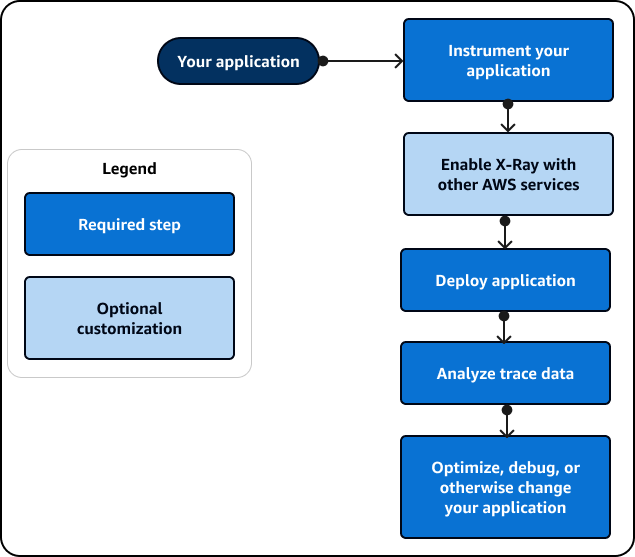

# Getting started with X-Ray

###### Note

End-of-support notice – On February 25th, 2027, AWS X-Ray will discontinue support for AWS X-Ray SDKs and daemon. After February 25th, 2027, you will no longer receive updates or releases. For more information on the support timeline, see
[X-Ray SDK and daemon end of support timeline](xray-daemon-eos.md "xray-daemon-eos.md"). We recommend to migrate to OpenTelemetry. For more information on migrating to OpenTelemetry, see [Migrating from X-Ray instrumentation to OpenTelemetry instrumentation](xray-sdk-migration.md "xray-sdk-migration.md") .

To use X-Ray, take the following steps:

1. Instrument your application, which allows X-Ray to track how your application processes
   a request.
   - Use the X-Ray SDKs, X-Ray APIs, ADOT or CloudWatch Application Signals to
     send trace data to X-Ray. For more information about which interface to use, see [Choosing an interface](aws-xray-interface.md "aws-xray-interface.md").
     For more information about instrumentation, see [Instrumenting your application
     for AWS X-Ray](xray-instrumenting-your-app.md "xray-instrumenting-your-app.md").

2. (Optional) Configure X-Ray to work with other AWS services that integrate with
   X-Ray. You can sample traces and add headers to incoming requests, run an agent or
   collector, and automatically send trace data to X-Ray. For more information, see [Integrating AWS X-Ray with other AWS services](xray-services.md "xray-services.md").
3. Deploy your instrumented application. As your application receives requests, the X-Ray SDK will
   record trace, segment and subsegment data. In this step, you might also have to set up an
   IAM policy and deploy an agent or collector.
   - For example scripts to deploy an application using the AWS Distro for OpenTelemetry (ADOT) SDK and the CloudWatch agent on different
     platforms, see [Application Signals Demo Scripts](https://github.com/aws-observability/application-signals-demo/tree/main/scripts "https://github.com/aws-observability/application-signals-demo/tree/main/scripts").
   - For an example script to deploy an application using the X-Ray SDK and the X-Ray daemon, see [AWS X-Ray sample application](xray-scorekeep.md "xray-scorekeep.md").

4. (Optional) Open a console to view and analyze the data. You can see a GUI representation
   of a trace map, service map, and more to inspect how your application functions. Use the
   graphical information in the console to optimize, debug and understand your
   application. For more information about choosing a console, see [Use a console](aws-xray-interface-console.md "aws-xray-interface-console.md").
   The following diagram shows how to get started using X-Ray:

For an example of the data and maps that are available in the console, launch a [sample application](xray-scorekeep.md "xray-scorekeep.md") that is already instrumented to generate
trace data. In a few minutes, you can generate traffic, send segments to X-Ray, and view a
trace and service map.
