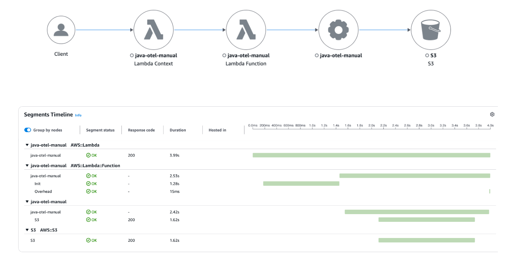

# Migrating to OpenTelemetry Java

This section provides guidance on migrating from the X-Ray SDK to the OpenTelemetry SDK for Java applications.

###### Sections

- [Zero code automatic instrumentation solution](#xray-migration-zero-code "#xray-migration-zero-code")
- [Manual instrumentation solutions with the SDK](#xray-migration-sdk "#xray-migration-sdk")
- [Tracing incoming requests (spring framework instrumentation)](#xray-migration-tracing-setup-otel "#xray-migration-tracing-setup-otel")
- [AWS SDK v2 instrumentation](#xray-migration-sdkv2 "#xray-migration-sdkv2")
- [Instrumenting outgoing HTTP calls](#xray-migration-http "#xray-migration-http")
- [Instrumentation support for other libraries](#xray-migration-libraries "#xray-migration-libraries")
- [Manually creating trace data](#xray-migration-tracedata "#xray-migration-tracedata")
- [Lambda instrumentation](#xray-migration-lambda "#xray-migration-lambda")

## Zero code automatic instrumentation solution

With X-Ray Java agent
To enable the X-Ray Java agent, your application's JVM arguments were required to be modified.

```
-javaagent:/`path-to-disco`/disco-java-agent.jar=pluginPath=/`path-to-disco`/disco-plugins
```

With OpenTelemetry-based Java agent To use OpenTelemetry-based Java agents.

- Use the AWS Distro for OpenTelemetry (ADOT) Auto-Instrumentation Java agent for automatic instrumentation with the ADOT Java agent. For more information,
  see [Auto-Instrumentation for Traces and Metrics with the Java agent](https://aws-otel.github.io/docs/getting-started/java-sdk/auto-instr "https://aws-otel.github.io/docs/getting-started/java-sdk/auto-instr"). If you only want tracing, disable the `OTEL_METRICS_EXPORTER=none` environment variable. to export metrics from the Java
  agent.

(Optional) You can also enable CloudWatch Application Signals when automatically instrumenting your applications on AWS with the ADOT Java auto-instrumentation to monitor current application health and track
long-term application performance. Application Signals provides an unified, application-centric view of your applications, services, and dependencies, and helps monitor and triage application health. For more information, see [Application Signals](../../../AmazonCloudWatch/latest/monitoring/CloudWatch-Application-Monitoring-Sections.md "../../../AmazonCloudWatch/latest/monitoring/CloudWatch-Application-Monitoring-Sections.md").

- Use the OpenTelemetry Java agent for automatic instrumentation. For more information, see [Zero-code instrumentation with the Java Agent](https://opentelemetry.io/docs/zero-code/java/agent/ "https://opentelemetry.io/docs/zero-code/java/agent/").

## Manual instrumentation solutions with the SDK

Tracing setup with X-Ray SDK
To instrument your code with the X-Ray SDK for Java, first, the `AWSXRay` class was required to be configured with service plug-ins and local sampling rules, then a provided recorder was used.

```
static {
    AWSXRayRecorderBuilder builder = AWSXRayRecorderBuilder.standard().withPlugin(new EC2Plugin()).withPlugin(new ECSPlugin());
    AWSXRay.setGlobalRecorder(builder.build());
}
```

Tracing setup with OpenTelemetry SDK The following dependencies are required.

```
<dependencyManagement>
        <dependencies>
            <dependency>
                <groupId>io.opentelemetry</groupId>
                <artifactId>opentelemetry-bom</artifactId>
                <version>1.49.0</version>
                <type>pom</type>
                <scope>import</scope>
            </dependency>
            <dependency>
                <groupId>io.opentelemetry.instrumentation</groupId>
                <artifactId>opentelemetry-instrumentation-bom</artifactId>
                <version>2.15.0</version>
                <type>pom</type>
                <scope>import</scope>
            </dependency>
        </dependencies>
    </dependencyManagement>
    <dependencies>
        <dependency>
            <groupId>io.opentelemetry</groupId>
            <artifactId>opentelemetry-sdk</artifactId>
        </dependency>
        <dependency>
            <groupId>io.opentelemetry</groupId>
            <artifactId>opentelemetry-api</artifactId>
        </dependency>
        <dependency>
            <groupId>io.opentelemetry.semconv</groupId>
            <artifactId>opentelemetry-semconv</artifactId>
        </dependency>
        <dependency>
            <groupId>io.opentelemetry</groupId>
            <artifactId>opentelemetry-exporter-otlp</artifactId>
        </dependency>
        <dependency>
            <groupId>io.opentelemetry.contrib</groupId>
            <artifactId>opentelemetry-aws-xray</artifactId>
            <version>1.46.0</version>
        </dependency>
        <dependency>
            <groupId>io.opentelemetry.contrib</groupId>
            <artifactId>opentelemetry-aws-xray-propagator</artifactId>
            <version>1.46.0-alpha</version>
        </dependency>
        <dependency>
            <groupId>io.opentelemetry.contrib</groupId>
            <artifactId>opentelemetry-aws-resources</artifactId>
            <version>1.46.0-alpha</version>
        </dependency>
    </dependencies>
```

Configure the OpenTelemetry SDK by instantiating a `TracerProvider` and globally register an `OpenTelemetrySdk` object.
Configure these components:

- An OTLP Span Exporter (for example, OtlpGrpcSpanExporter) - Required for exporting traces to the CloudWatch agent or OpenTelemetry Collector
- An AWS X-Ray Propagator – Required for propagating the Trace Context to AWS Services that are integrated with X-Ray
- An AWS X-Ray Remote Sampler – Required if you need to sample requests using X-Ray Sampling Rules
- Resource Detectors(for example, EcsResource or Ec2Resource) – Detect metadata of the host running your application

```
import io.opentelemetry.api.common.Attributes;
import io.opentelemetry.context.propagation.ContextPropagators;
import io.opentelemetry.contrib.aws.resource.Ec2Resource;
import io.opentelemetry.contrib.aws.resource.EcsResource;
import io.opentelemetry.contrib.awsxray.AwsXrayRemoteSampler;
import io.opentelemetry.contrib.awsxray.propagator.AwsXrayPropagator;
import io.opentelemetry.exporter.otlp.trace.OtlpGrpcSpanExporter;
import io.opentelemetry.sdk.OpenTelemetrySdk;
import io.opentelemetry.sdk.resources.Resource;
import io.opentelemetry.sdk.trace.SdkTracerProvider;
import io.opentelemetry.sdk.trace.export.BatchSpanProcessor;
import io.opentelemetry.sdk.trace.samplers.Sampler;
import static io.opentelemetry.semconv.ServiceAttributes.SERVICE_NAME;

// ...

    private static final Resource otelResource =
        Resource.create(Attributes.of(SERVICE_NAME, "`YOUR_SERVICE_NAME`"))
            .merge(EcsResource.get())
            .merge(Ec2Resource.get());
    private static final SdkTracerProvider sdkTracerProvider =
        SdkTracerProvider.builder()
            .addSpanProcessor(BatchSpanProcessor.create(
                OtlpGrpcSpanExporter.getDefault()
            ))
            .addResource(otelResource)
            .setSampler(Sampler.parentBased(
                AwsXrayRemoteSampler.newBuilder(otelResource).build()
            ))
            .build();
    // Globally registering a TracerProvider makes it available throughout the application to create as many Tracers as needed.
    private static final OpenTelemetrySdk openTelemetry =
        OpenTelemetrySdk.builder()
            .setTracerProvider(sdkTracerProvider)
            .setPropagators(ContextPropagators.create(AwsXrayPropagator.getInstance()))
            .buildAndRegisterGlobal();
```

## Tracing incoming requests (spring framework instrumentation)

With X-Ray SDK
For information on how to use the X-Ray SDK with the spring framework to instrument your application, see [AOP with Spring and the X-Ray SDK for Java](xray-sdk-java-aop-spring.md "xray-sdk-java-aop-spring.md"). To enable AOP in Spring, complete these steps.

1. [Configure Spring](xray-sdk-java-aop-spring.md#xray-sdk-java-aop-spring-configuration "xray-sdk-java-aop-spring.md#xray-sdk-java-aop-spring-configuration")
2. [Adding a tracing filter to your application](xray-sdk-java-aop-spring.md#xray-sdk-java-aop-filters-spring "xray-sdk-java-aop-spring.md#xray-sdk-java-aop-filters-spring")
3. [Annotate your code or implement an interface](xray-sdk-java-aop-spring.md#xray-sdk-java-aop-annotate-or-implement "xray-sdk-java-aop-spring.md#xray-sdk-java-aop-annotate-or-implement")
4. [Activate X-Ray in your application](xray-sdk-java-aop-spring.md#xray-sdk-java-aop-activate-xray "xray-sdk-java-aop-spring.md#xray-sdk-java-aop-activate-xray")

With OpenTelemetry SDKOpenTelemetry provides instrumentation libraries to collect traces for incoming requests for Spring Boot applications. To enable Spring Boot instrumentation with minimal configuration, include the following dependency.

```
<dependency>
           <groupId>io.opentelemetry.instrumentation</groupId>
            <artifactId>opentelemetry-spring-boot-starter</artifactId>
        </dependency>
```

For more information on how to enable and configure Spring Boot instrumentation for your OpenTelemetry setup, see OpenTelemetry's [Getting started](https://opentelemetry.io/docs/zero-code/java/spring-boot-starter/getting-started/ "https://opentelemetry.io/docs/zero-code/java/spring-boot-starter/getting-started/").

Using OpenTelemetry-based Java agentsThe default recommended method for instrumenting Spring Boot applications is by using the [OpenTelemetry Java agent](https://opentelemetry.io/docs/zero-code/java/agent/ "https://opentelemetry.io/docs/zero-code/java/agent/") with _bytecode_ instrumentation, which also provides more out-of-the-box instrumentations and configurations when compared to directly using the SDK.
For get started, see [Zero code automatic instrumentation solution](#xray-migration-zero-code "#xray-migration-zero-code").

## AWS SDK v2 instrumentation

With X-Ray SDK
The X-Ray SDK for Java can automatically instrument all AWS SDK v2 clients when you added the `aws-xray-recorder-sdk-aws-sdk-v2-instrumentor` sub-module in your build.

To instrument individual clients downstream client calls to AWS services with AWS SDK for Java 2.2 and later, the `aws-xray-recorder-sdk-aws-sdk-v2-instrumentor` module from your build configuration was excluded
and the `aws-xray-recorder-sdk-aws-sdk-v2` module was included. Individual clients were instrumented by configuring them with a `TracingInterceptor`.

```
import com.amazonaws.xray.interceptors.TracingInterceptor;
import software.amazon.awssdk.core.client.config.ClientOverrideConfiguration
import software.amazon.awssdk.services.dynamodb.DynamoDbClient;
//...

public class MyModel {
  private DynamoDbClient client = DynamoDbClient.builder()
    .region(Region.US_WEST_2)
    .overrideConfiguration(
      ClientOverrideConfiguration.builder()
        .addExecutionInterceptor(new TracingInterceptor())
        .build()
      )
    .build();
//...
```

With OpenTelemetry SDK To automatically instrument all AWS SDK clients, add the `opentelemetry-aws-sdk-2.2-autoconfigure` sub-module.

```
<dependency>
            <groupId>io.opentelemetry.instrumentation</groupId>
            <artifactId>opentelemetry-aws-sdk-2.2-autoconfigure</artifactId>
            <version>2.15.0-alpha</version>
            <scope>runtime</scope>
        </dependency>
```

To instrument individual AWSSDK clients, add the `opentelemetry-aws-sdk-2.2` sub-module.

```
<dependency>
            <groupId>io.opentelemetry.instrumentation</groupId>
            <artifactId>opentelemetry-aws-sdk-2.2</artifactId>
            <version>2.15.0-alpha</version>
            <scope>compile</scope>
        </dependency>
```

Then, register an interceptor when creating an AWS SDK Client.

```
import io.opentelemetry.instrumentation.awssdk.v2_2.AwsSdkTelemetry;

// ...

    AwsSdkTelemetry telemetry = AwsSdkTelemetry.create(openTelemetry);
    private final S3Client S3_CLIENT = S3Client.builder()
      .overrideConfiguration(ClientOverrideConfiguration.builder()
        .addExecutionInterceptor(telemetry.newExecutionInterceptor())
        .build())
      .build();
```

## Instrumenting outgoing HTTP calls

With X-Ray SDK
To instrument outgoing HTTP requests with X-Ray, the X-Ray SDK for Java’s version of the Apache HttpClient was required.

```
import com.amazonaws.xray.proxies.apache.http.HttpClientBuilder;
...
  public String randomName() throws IOException {
    CloseableHttpClient httpclient = HttpClientBuilder.create().build();
```

With OpenTelemetry SDK Similarly to the X-Ray Java SDK, OpenTelemetry provides an `ApacheHttpClientTelemetry` class that has a builder method that allows creation of an
instance of an the `HttpClientBuilder` to provide OpenTelemetry-based spans and context propagation for Apache HttpClient.

```
<dependency>
            <groupId>io.opentelemetry.instrumentation</groupId>
            <artifactId>opentelemetry-apache-httpclient-5.2</artifactId>
            <version>2.15.0-alpha</version>
            <scope>compile</scope>
        </dependency>
```

The following is a code example from the [opentelemetry-java-instrumentation](https://github.com/open-telemetry/opentelemetry-java-instrumentation/tree/main/instrumentation/apache-httpclient/apache-httpclient-5.2/library "https://github.com/open-telemetry/opentelemetry-java-instrumentation/tree/main/instrumentation/apache-httpclient/apache-httpclient-5.2/library") . The HTTP Client provided by newHttpClient() will generate traces for executed requests.

```
import io.opentelemetry.api.OpenTelemetry;
import io.opentelemetry.instrumentation.apachehttpclient.v5_2.ApacheHttpClientTelemetry;
import org.apache.hc.client5.http.classic.HttpClient;
import org.apache.hc.client5.http.impl.classic.HttpClientBuilder;

public class ApacheHttpClientConfiguration {

  private OpenTelemetry openTelemetry;

  public ApacheHttpClientConfiguration(OpenTelemetry openTelemetry) {
    this.openTelemetry = openTelemetry;
  }

  // creates a new http client builder for constructing http clients with open telemetry instrumentation
  public HttpClientBuilder createBuilder() {
    return ApacheHttpClientTelemetry.builder(openTelemetry).build().newHttpClientBuilder();
  }

  // creates a new http client with open telemetry instrumentation
  public HttpClient newHttpClient() {
    return ApacheHttpClientTelemetry.builder(openTelemetry).build().newHttpClient();
  }
}
```

## Instrumentation support for other libraries

Find the full list of supported Library instrumentations for OpenTelemetry Java in its respective instrumentation GitHub repository , under [Supported libraries, frameworks, application servers, and JVMs](https://github.com/open-telemetry/opentelemetry-java-instrumentation/blob/main/docs/supported-libraries.md "https://github.com/open-telemetry/opentelemetry-java-instrumentation/blob/main/docs/supported-libraries.md") .

Alternatively, you can search the OpenTelemetry Registry to find out if OpenTelemetry supports instrumentation.
To start searching, see [Registry](https://opentelemetry.io/ecosystem/registry/ "https://opentelemetry.io/ecosystem/registry/").

## Manually creating trace data

With X-Ray SDK
With the X-Ray SDK, the `beginSegment` and `beginSubsegment` methods are needed to manually create X-Ray segments and sub-segments.

```
  Segment segment = xrayRecorder.beginSegment("ManualSegment");
        segment.putAnnotation("annotationKey", "annotationValue");
        segment.putMetadata("metadataKey", "metadataValue");

        try {
            Subsegment subsegment = xrayRecorder.beginSubsegment("ManualSubsegment");
            subsegment.putAnnotation("key", "value");

            // Do something here

        } catch (Exception e) {
            subsegment.addException(e);
        } finally {
            xrayRecorder.endSegment();
        }
```

With OpenTelemetry SDKYou can use custom spans to monitor the performance of internal activities that are not captured by instrumentation libraries. Note that only span kind server are converted into X-Ray segments, all other spans are converted into
X-Ray sub-segments.

First, you will need to create a _Tracer_ in order to generate spans, which you can obtain through the `openTelemetry.getTracer` method. This will provide a Tracer instance from the `TracerProvider` that was registered globally in the
[Manual instrumentation solutions with the SDK](#xray-migration-sdk "#xray-migration-sdk") example. You can create as many Tracer instances as needed, but it is common to have one Tracer for an entire application.

```
Tracer tracer = openTelemetry.getTracer("`my-app`");
```

You can use the Tracer to create spans.

```
import io.opentelemetry.api.common.AttributeKey;
import io.opentelemetry.api.trace.Span;
import io.opentelemetry.api.trace.SpanKind;
import io.opentelemetry.api.trace.Tracer;
import io.opentelemetry.context.Scope;

...

// SERVER span will become an X-Ray segment
Span span = tracer.spanBuilder("get-token")
  .setKind(SpanKind.SERVER)
  .setAttribute("key", "value")
  .startSpan();
try (Scope ignored = span.makeCurrent()) {

  span.setAttribute("metadataKey", "metadataValue");
  span.setAttribute("annotationKey", "annotationValue");

  // The following ensures that "annotationKey: annotationValue" is an annotation in X-Ray raw data.
  span.setAttribute(AttributeKey.stringArrayKey("aws.xray.annotations"), List.of("annotationKey"));

  // Do something here
}

span.end();
```

Spans have a default type of _INTERNAL_.

```
// Default span of type INTERNAL will become an X-Ray subsegment
Span span = tracer.spanBuilder("process-header")
  .startSpan();
try (Scope ignored = span.makeCurrent()) {
  doProcessHeader();
}
```

**Adding annotations and metadata to traces with OpenTelemetry SDK**

In the above example, the `setAttribute` method is used to add attributes to each span. By default, all the span attributes will be converted into metadata in X-Ray raw data. To ensure that an attribute is converted into an
annotation and not metadata, the above example adds that attribute’s key to the list of the `aws.xray.annotations` attribute. For more information, see [Enable the Customized X-Ray Annotations](https://aws-otel.github.io/docs/getting-started/x-ray#enable-the-customized-x-ray-annotations "https://aws-otel.github.io/docs/getting-started/x-ray#enable-the-customized-x-ray-annotations") and [Annotations and metadata](xray-concepts.md#xray-concepts-annotations "xray-concepts.md#xray-concepts-annotations").

**With OpenTelemetry-based Java agents**

If you are using the Java agent to automatically instrument your application, you need to perform manual instrumentation in your application. For example, to instrument code within the application for sections that are not covered by any auto-instrumentation library.

To perform manual instrumentation with the agent, you need to use the `opentelemetry-api` artifact. The artifact version cannot be newer than the agent version.

```
import io.opentelemetry.api.GlobalOpenTelemetry;
import io.opentelemetry.api.trace.Span;

// ...

        Span parentSpan = Span.current();
        Tracer tracer = GlobalOpenTelemetry.getTracer("my-app");
        Span span = tracer.spanBuilder("my-span-name")
            .setParent(io.opentelemetry.context.Context.current().with(parentSpan))
            .startSpan();
        span.end();
```

## Lambda instrumentation

With X-Ray SDK
Using the X-Ray SDK, after your Lambda has _Active Tracing_ enabled, there is no additional configuration required to use the X-Ray SDK. Lambda will create a segment representing the Lambda handler invocation, and you can create sub-segments or instrument libraries using the X-Ray SDK without any additional configuration.

With OpenTelemetry-based solutionsAuto-instrumentation Lambda layers – You can automatically instrument your Lambda with AWS vended Lambda layers using the following solutions:

- CloudWatch Application Signals Lambda layer (Recommended)

###### Note

This Lambda layer has CloudWatch Application Signals enabled by default, which enables performance and health monitoring for your Lambda application by collecting both metrics and traces.
For just tracing, set the Lambda environment variable `OTEL_AWS_APPLICATION_SIGNALS_ENABLED=false`.

    + Enables performance and health monitoring for your Lambda application
    + Collects both metrics and traces by default

- AWS managed Lambda layer for ADOT Java. For more information, see [AWS Distro for OpenTelemetry Lambda Support For Java](https://aws-otel.github.io/docs/getting-started/lambda/lambda-java "https://aws-otel.github.io/docs/getting-started/lambda/lambda-java").

To use manual instrumentation along with auto-instrumentation layer, see [Manual instrumentation solutions with the SDK](#xray-migration-sdk "#xray-migration-sdk"). For reduced cold starts, consider using OpenTelemetry manual instrumentation to generate OpenTelemetry traces for your Lambda function.

**OpenTelemetry manual instrumentation for AWS Lambda**

Consider the following Lambda function code that makes an Amazon S3 ListBuckets call.

```
package example;

import com.amazonaws.services.lambda.runtime.Context;
import com.amazonaws.services.lambda.runtime.RequestHandler;

import software.amazon.awssdk.services.s3.S3Client;
import software.amazon.awssdk.services.s3.model.ListBucketsRequest;
import software.amazon.awssdk.services.s3.model.ListBucketsResponse;
import software.amazon.awssdk.services.s3.model.S3Exception;

public class ListBucketsLambda implements RequestHandler<String, String> {

    private final S3Client S3_CLIENT = S3Client.builder()
        .build();

    @Override
    public String handleRequest(String input, Context context) {
        try {
            ListBucketsResponse response = makeListBucketsCall();
            context.getLogger().log("response: " + response.toString());
            return "Success";
        } catch (Exception e) {
            throw new RuntimeException(e);
        }
    }

    private ListBucketsResponse makeListBucketsCall() {
        try {
            ListBucketsRequest listBucketsRequest = ListBucketsRequest.builder()
                .build();
            ListBucketsResponse response = S3_CLIENT.listBuckets(listBucketsRequest);
            return response;
        } catch (S3Exception e) {
            throw new RuntimeException("Failed to call S3 listBuckets" + e.awsErrorDetails().errorMessage(), e);
        }
    }
}
```

Here are the dependencies.

```
dependencies {
    implementation('com.amazonaws:aws-lambda-java-core:1.2.3')
    implementation('software.amazon.awssdk:s3:2.28.29')
    implementation('org.slf4j:slf4j-nop:2.0.16')
}
```

To manually instrument your Lambda handler and the Amazon S3 client, do the following.

1. Replace your function classes that implement `RequestHandler` (or RequestStreamHandler) with those that extend `TracingRequestHandler` (or TracingRequestStreamHandler).
2. Instantiate a TracerProvider and globally register an OpenTelemetrySdk object. The TracerProvider is recommended to be configured with:
   1. A Simple Span Processor with an X-Ray UDP span exporter to send Traces to Lambda’s UDP X-Ray endpoint
   2. A ParentBased always on sampler (Default if not configured)
   3. A Resource with service.name set to the Lambda function name
   4. An X-Ray Lambda propagator

3. Change the `handleRequest` method to `doHandleRequest` and pass the `OpenTelemetrySdk` object to the base class.
4. Instrument the Amazon S3 client with the OpenTemetry AWS SDK instrumentation by registering the interceptor when building the client.

You need the following OpenTelemetry-related dependencies.

```
dependencies {
    ...

    implementation("software.amazon.distro.opentelemetry:aws-distro-opentelemetry-xray-udp-span-exporter:0.1.0")

    implementation(platform('io.opentelemetry.instrumentation:opentelemetry-instrumentation-bom:2.14.0'))
    implementation(platform('io.opentelemetry:opentelemetry-bom:1.48.0'))

    implementation('io.opentelemetry:opentelemetry-sdk')
    implementation('io.opentelemetry:opentelemetry-api')
    implementation('io.opentelemetry.contrib:opentelemetry-aws-xray-propagator:1.45.0-alpha')
    implementation('io.opentelemetry.contrib:opentelemetry-aws-resources:1.45.0-alpha')
    implementation('io.opentelemetry.instrumentation:opentelemetry-aws-lambda-core-1.0:2.14.0-alpha')
    implementation('io.opentelemetry.instrumentation:opentelemetry-aws-sdk-2.2:2.14.0-alpha')
}
```

The following code demonstrates the Lambda function after the required changes. You can create additional custom spans to complement the automatically provided spans.

```
package example;

import java.time.Duration;

import com.amazonaws.services.lambda.runtime.Context;

import io.opentelemetry.api.common.Attributes;
import io.opentelemetry.context.propagation.ContextPropagators;
import io.opentelemetry.contrib.aws.resource.LambdaResource;
import io.opentelemetry.contrib.awsxray.propagator.AwsXrayLambdaPropagator;
import io.opentelemetry.instrumentation.awslambdacore.v1_0.TracingRequestHandler;
import io.opentelemetry.instrumentation.awssdk.v2_2.AwsSdkTelemetry;
import io.opentelemetry.sdk.OpenTelemetrySdk;
import io.opentelemetry.sdk.resources.Resource;
import io.opentelemetry.sdk.trace.SdkTracerProvider;
import io.opentelemetry.sdk.trace.export.SimpleSpanProcessor;
import io.opentelemetry.sdk.trace.samplers.Sampler;
import static io.opentelemetry.semconv.ServiceAttributes.SERVICE_NAME;
import software.amazon.awssdk.core.client.config.ClientOverrideConfiguration;
import software.amazon.awssdk.services.s3.S3Client;
import software.amazon.awssdk.services.s3.model.ListBucketsRequest;
import software.amazon.awssdk.services.s3.model.ListBucketsResponse;
import software.amazon.awssdk.services.s3.model.S3Exception;
import software.amazon.distro.opentelemetry.exporter.xray.udp.trace.AwsXrayUdpSpanExporterBuilder;

public class ListBucketsLambda extends TracingRequestHandler<String, String> {
    private static final Resource lambdaResource = LambdaResource.get();
    private static final SdkTracerProvider sdkTracerProvider =
        SdkTracerProvider.builder()
            .addSpanProcessor(SimpleSpanProcessor.create(
                new AwsXrayUdpSpanExporterBuilder().build()
            ))
            .addResource(
                lambdaResource
                .merge(Resource.create(Attributes.of(SERVICE_NAME, System.getenv("AWS_LAMBDA_FUNCTION_NAME"))))
            )
            .setSampler(Sampler.parentBased(Sampler.alwaysOn()))
            .build();
    private static final OpenTelemetrySdk openTelemetry =
        OpenTelemetrySdk.builder()
            .setTracerProvider(sdkTracerProvider)
            .setPropagators(ContextPropagators.create(AwsXrayLambdaPropagator.getInstance()))
            .buildAndRegisterGlobal();
    private static final AwsSdkTelemetry telemetry = AwsSdkTelemetry.create(openTelemetry);
    private final S3Client S3_CLIENT = S3Client.builder()
        .overrideConfiguration(ClientOverrideConfiguration.builder()
            .addExecutionInterceptor(telemetry.newExecutionInterceptor())
            .build())
        .build();

    public ListBucketsLambda() {
        super(openTelemetry, Duration.ofMillis(0));
    }

    @Override
    public String doHandleRequest(String input, Context context) {
        try {
            ListBucketsResponse response = makeListBucketsCall();
            context.getLogger().log("response: " + response.toString());
            return "Success";
        } catch (Exception e) {
            throw new RuntimeException(e);
        }
    }

    private ListBucketsResponse makeListBucketsCall() {
        try {
            ListBucketsRequest listBucketsRequest = ListBucketsRequest.builder()
                .build();
            ListBucketsResponse response = S3_CLIENT.listBuckets(listBucketsRequest);
            return response;
        } catch (S3Exception e) {
            throw new RuntimeException("Failed to call S3 listBuckets" + e.awsErrorDetails().errorMessage(), e);
        }
    }
}
```

When invoking the Lambda function, you will see the following trace under _Trace Map_ in the CloudWatch console.


