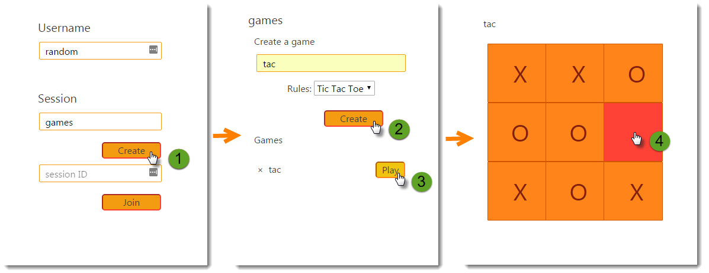
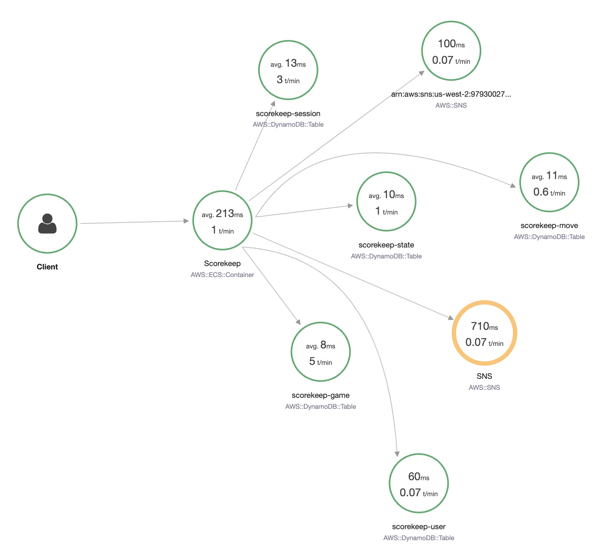

# AWS X-Ray sample application

###### Note

X-Ray SDK/Daemon Maintenance Notice – On February 25th, 2026, the AWS X-Ray SDKs/Daemon will enter maintenance mode, where AWS will limit X-Ray SDK and Daemon releases to address security issues only. For more information on the support timeline, see
[X-Ray SDK and Daemon Support timeline](xray-sdk-daemon-timeline.md "xray-sdk-daemon-timeline.md"). We recommend to migrate to OpenTelemetry. For more information on migrating to OpenTelemetry, see [Migrating from X-Ray instrumentation to OpenTelemetry instrumentation](xray-sdk-migration.md "xray-sdk-migration.md") .

The AWS X-Ray [eb-java-scorekeep](https://github.com/awslabs/eb-java-scorekeep/tree/xray "https://github.com/awslabs/eb-java-scorekeep/tree/xray") sample app, available on
GitHub, shows the use of the AWS X-Ray SDK to instrument incoming HTTP calls, DynamoDB SDK clients, and HTTP
clients. The sample app uses CloudFormation to create DynamoDB tables, compile Java code on instance, and run the X-Ray daemon
without any additional configuration.

See the [Scorekeep tutorial](scorekeep-tutorial.md "scorekeep-tutorial.md") to start installing and
using an instrumented sample application, using the AWS Management Console or the AWS CLI.

The sample includes a front-end web app, the API that it calls, and the DynamoDB tables that it uses to store
data. Basic instrumentation with [filters](xray-sdk-java-filters.md "xray-sdk-java-filters.md"), [plugins](xray-sdk-java-configuration.md "xray-sdk-java-configuration.md"), and [instrumented AWS SDK clients](xray-sdk-java-awssdkclients.md "xray-sdk-java-awssdkclients.md") is shown in the
project's `xray-gettingstarted` branch. This is the branch that you deploy in the
[getting started tutorial](scorekeep-tutorial.md "scorekeep-tutorial.md"). Because this branch only
includes the basics, you can diff it against the `master` branch to quickly
understand the basics.

The sample application shows basic instrumentation in these files:

- **HTTP request filter** – [`WebConfig.java`](https://github.com/awslabs/eb-java-scorekeep/tree/xray/src/main/java/scorekeep/WebConfig.java "https://github.com/awslabs/eb-java-scorekeep/tree/xray/src/main/java/scorekeep/WebConfig.java")
- **AWS SDK client instrumentation** – [`build.gradle`](https://github.com/awslabs/eb-java-scorekeep/tree/xray/build.gradle "https://github.com/awslabs/eb-java-scorekeep/tree/xray/build.gradle")
  The `xray` branch of the application includes the use of [HTTPClient](xray-sdk-java-httpclients.md "xray-sdk-java-httpclients.md"), [Annotations](xray-sdk-java-segment.md "xray-sdk-java-segment.md"), [SQL queries](xray-sdk-java-sqlclients.md "xray-sdk-java-sqlclients.md"), [custom subsegments](xray-sdk-java-subsegments.md "xray-sdk-java-subsegments.md"), an instrumented [AWS Lambda](xray-services-lambda.md "xray-services-lambda.md") function, and [instrumented initialization code and scripts](scorekeep-startup.md "scorekeep-startup.md").

To support user log-in and AWS SDK for JavaScript use in the browser, the `xray-cognito`
branch adds Amazon Cognito to support user authentication and authorization. With credentials retrieved
from Amazon Cognito, the web app also sends trace data to X-Ray to record request information from the
client's point of view. The browser client appears as its own node on the trace map, and
records additional information, including the URL of the page that the user is viewing, and the
user's ID.

Finally, the `xray-worker` branch adds an instrumented Python Lambda function that
runs independently, processing items from an Amazon SQS queue. Scorekeep adds an item to the queue
each time a game ends. The Lambda worker, triggered by CloudWatch Events, pulls items from the queue every
few minutes and processes them to store game records in Amazon S3 for analysis.

###### Topics

- [Getting started with the Scorekeep sample
  application](scorekeep-tutorial.md "scorekeep-tutorial.md")
- [Manually instrumenting AWS SDK clients](scorekeep-sdkclients.md "scorekeep-sdkclients.md")
- [Creating additional subsegments](scorekeep-subsegments.md "scorekeep-subsegments.md")
- [Recording annotations, metadata, and user IDs](scorekeep-annotations.md "scorekeep-annotations.md")
- [Instrumenting outgoing HTTP calls](scorekeep-httpclient.md "scorekeep-httpclient.md")
- [Instrumenting calls to a PostgreSQL database](scorekeep-postgresql.md "scorekeep-postgresql.md")
- [Instrumenting AWS Lambda functions](scorekeep-lambda.md "scorekeep-lambda.md")
- [Instrumenting startup code](scorekeep-startup.md "scorekeep-startup.md")
- [Instrumenting scripts](scorekeep-scripts.md "scorekeep-scripts.md")
- [Instrumenting a web app client](scorekeep-client.md "scorekeep-client.md")
- [Using instrumented clients in worker threads](scorekeep-workerthreads.md "scorekeep-workerthreads.md")
