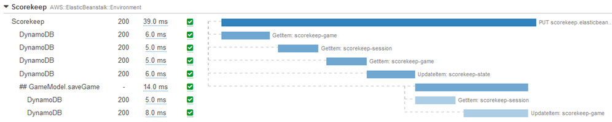

# Generating custom subsegments with the

X-Ray SDK for Java

###### Note

End-of-support notice – On February 25th, 2027, AWS X-Ray will discontinue support for AWS X-Ray SDKs and daemon. After February 25th, 2027, you will no longer receive updates or releases. For more information on the support timeline, see
[X-Ray SDK and daemon end of support timeline](xray-daemon-eos.md "xray-daemon-eos.md"). We recommend to migrate to OpenTelemetry. For more information on migrating to OpenTelemetry, see [Migrating from X-Ray instrumentation to OpenTelemetry instrumentation](xray-sdk-migration.md "xray-sdk-migration.md") .

Subsegments extend a trace's
[segment](xray-concepts.md#xray-concepts-segments "xray-concepts.md#xray-concepts-segments") with details about work done in order to serve
a request. Each time you make a call with an instrumented client, the X-Ray SDK records the information
generated in a subsegment. You can create additional subsegments to group other subsegments, to measure
the performance of a section of code, or to record annotations and metadata.

To manage subsegments, use the `beginSubsegment` and `endSubsegment` methods.

###### Example GameModel.java - custom subsegment

```
import com.amazonaws.xray.AWSXRay;
...
  public void saveGame(Game game) throws SessionNotFoundException {
    // wrap in subsegment
    `Subsegment subsegment = AWSXRay.beginSubsegment("Save Game");`
    try {
      // check session
      String sessionId = game.getSession();
      if (sessionModel.loadSession(sessionId) == null ) {
        throw new SessionNotFoundException(sessionId);
      }
      mapper.save(game);
    } `catch (Exception e) {
 subsegment.addException(e);
 throw e;
 } finally {
 AWSXRay.endSubsegment();`
    }
  }
```

In this example, the code within the subsegment loads the game's session from DynamoDB with a
method on the session model, and uses the AWS SDK for Java's DynamoDB mapper to save the game. Wrapping
this code in a subsegment makes the calls DynamoDB children of the `Save Game`
subsegment in the trace view in the console.


If the code in your subsegment throws checked exceptions, wrap it in a `try`
block and call `AWSXRay.endSubsegment()` in a `finally` block to ensure
that the subsegment is always closed. If a subsegment is not closed, the parent segment cannot
be completed and won't be sent to X-Ray.

For code that doesn't throw checked exceptions, you can pass the code to
`AWSXRay.CreateSubsegment` as a Lambda function.

###### Example Subsegment Lambda function

```
import com.amazonaws.xray.AWSXRay;

`AWSXRay.createSubsegment("getMovies", (subsegment) -> {
 // function code
});`
```

When you create a subsegment within a segment or another subsegment, the X-Ray SDK for Java
generates an ID for it and records the start time and end time.

###### Example Subsegment with metadata

```
"subsegments": [{
  "id": "6f1605cd8a07cb70",
  "start_time": 1.480305974194E9,
  "end_time": 1.4803059742E9,
  "name": "Custom subsegment for UserModel.saveUser function",
  "metadata": {
    "debug": {
      "test": "Metadata string from UserModel.saveUser"
    }
  },
```

For asynchronous and multi-threaded programming, you must manually pass the subsegment to the `endSubsegment()`
method to ensure it is closed correctly because the X-Ray context may be modified during async execution.
If an asynchronous subsegment is closed after its parent segment is closed, this method will automatically stream
the entire segment to the X-Ray daemon.

###### Example Asynchronous Subsegment

```

@GetMapping("/api")
public ResponseEntity<?> api() {
  CompletableFuture.runAsync(() -> {
      Subsegment subsegment = AWSXRay.beginSubsegment("Async Work");
      try {
          Thread.sleep(3000);
      } catch (InterruptedException e) {
          subsegment.addException(e);
          throw e;
      } finally {
          AWSXRay.endSubsegment(subsegment);
      }
  });
  return ResponseEntity.ok().build();
}
```
