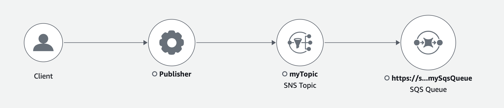
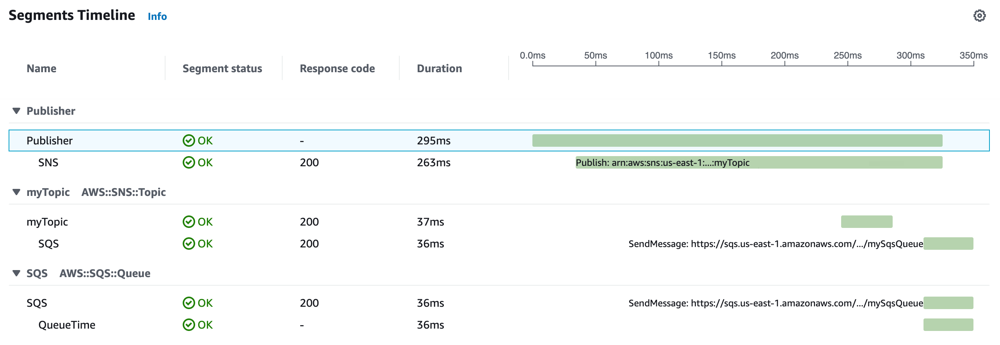
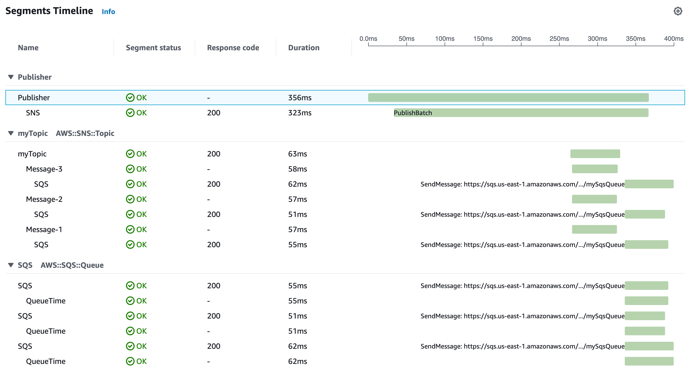

# Amazon SNS and AWS X-Ray

You can use AWS X-Ray with Amazon Simple Notification Service (Amazon SNS) to trace and analyze requests as they travel through your SNS
topics to your [SNS-supported
subscription services](../../../sns/latest/dg/sns-active-tracing.md "../../../sns/latest/dg/sns-active-tracing.md"). Use X-Ray tracing with Amazon SNS to analyze latencies in your messages and their
back-end services, such as how long a request spends in a topic, and how long it takes to deliver the message to
each of the topic’s subscriptions. Amazon SNS supports X-Ray tracing for both standard and FIFO topics.

If you publish to an Amazon SNS topic from a service that’s already instrumented with X-Ray, Amazon SNS passes the
trace context from publisher to subscribers. In addition, you can turn on active tracing to send segment data
about your Amazon SNS subscriptions to X-Ray for messages published from an instrumented SNS client. [Turn on active tracing](../../../sns/latest/dg/sns-active-tracing.md "../../../sns/latest/dg/sns-active-tracing.md") for an Amazon SNS
topic by using the Amazon SNS console, or by using the Amazon SNS API or CLI. See [Instrumenting your application](xray-instrumenting-your-app.md "xray-instrumenting-your-app.md") for more information about
instrumenting your SNS clients.

## Configure Amazon SNS active tracing

You can use the Amazon SNS console or the AWS CLI or SDK to configure Amazon SNS active tracing.

When you use the Amazon SNS console, Amazon SNS attempts to create the necessary permissions for SNS to call X-Ray.
The attempt can be rejected if you don't have sufficient permissions to modify X-Ray resource policies. For
more information about these permissions, see [Identity and access management in
Amazon SNS](../../../sns/latest/dg/sns-authentication-and-access-control.md "../../../sns/latest/dg/sns-authentication-and-access-control.md") and [Example cases for Amazon SNS access control](../../../sns/latest/dg/sns-access-policy-use-cases.md "../../../sns/latest/dg/sns-access-policy-use-cases.md") in the Amazon Simple Notification Service Developer Guide. For more information about
turning on active tracing using the Amazon SNS console, see [Enabling active tracing on an Amazon SNS topic](../../../sns/latest/dg/sns-active-tracing.md "../../../sns/latest/dg/sns-active-tracing.md") in
the Amazon Simple Notification Service Developer Guide.

When using the AWS CLI or SDK to turn on active tracing, you must manually configure the permissions
using resource-based policies. Use [`PutResourcePolicy`](../api/API_PutResourcePolicy.md "../api/API_PutResourcePolicy.md") to configure
X-Ray with the necessary resource-based policy to allow Amazon SNS to send traces to X-Ray.

###### Example X-Ray resource-based policy for Amazon SNS active tracing

This example policy document specifies the permissions that Amazon SNS needs to send trace data to X-Ray:

```
{
    Version: "2012-10-17",
    Statement: [
      {
        Sid: "SNSAccess",
        Effect: Allow,
        Principal: {
          Service: "sns.amazonaws.com",
        },
        Action: [
          "xray:PutTraceSegments",
          "xray:GetSamplingRules",
          "xray:GetSamplingTargets"
        ],
        Resource: "*",
        Condition: {
          StringEquals: {
            "aws:SourceAccount": "`account-id`"
          },
          StringLike: {
            "aws:SourceArn": "arn:`partition`:sns:`region`:`account-id`:`topic-name`"
          }
        }
      }
    ]
  }
```

Use the CLI to create a resource-based policy that gives Amazon SNS permissions to send trace data to X-Ray:

```
aws xray put-resource-policy --policy-name MyResourcePolicy --policy-document '{ "Version": "2012-10-17",		 	 	  "Statement": [ { "Sid": "SNSAccess", "Effect": "Allow", "Principal": { "Service": "sns.amazonaws.com" }, "Action": [ "xray:PutTraceSegments", "xray:GetSamplingRules", "xray:GetSamplingTargets" ], "Resource": "*", "Condition": { "StringEquals": { "aws:SourceAccount": "`account-id`" }, "StringLike": { "aws:SourceArn": "arn:`partition`:sns:`region`:`account-id`:`topic-name`" } } } ] }'
```

To use these examples, replace `partition`,
`region`, `account-id`, and
`topic-name` with your specific AWS partition, region, account ID, and
Amazon SNS topic name. To give all Amazon SNS topics permission to send trace data to X-Ray, replace the topic name with
`*`.

## View Amazon SNS publisher and subscriber traces in the X-Ray console

Use the X-Ray console to view a trace map and trace details that display a connected view of Amazon SNS
publishers and subscribers. When Amazon SNS active tracing is turned on for a topic, the X-Ray trace map and
trace details map displays connected nodes for Amazon SNS publishers, the Amazon SNS topic, and downstream
subscribers:



After choosing a trace that spans an Amazon SNS publisher and subscriber, the X-Ray trace details page displays a
trace details map and segment timeline.

###### Example timeline with Amazon SNS publisher and subscriber

This example shows a timeline that includes an Amazon SNS publisher that sends a message to an Amazon SNS topic,
which is processed by an Amazon SQS subscriber.



The example timeline above provides details about the Amazon SNS message flow:

- The **SNS** segment represents the round-trip duration of the `Publish` API call from the client.
- The **myTopic** segment represents the latency of the Amazon SNS response to the publish request.
- The **SQS** subsegment represents the round-trip time it takes Amazon SNS to publish the message to an
  Amazon SQS queue.
- The time between the **myTopic** segment and the **SQS** subsegment represents
  the time that the message spends in the Amazon SNS system.

###### Example timeline with batched Amazon SNS messages

If multiple Amazon SNS messages are batched within a single trace, the segment timeline displays segments
that represent each message that's processed.


