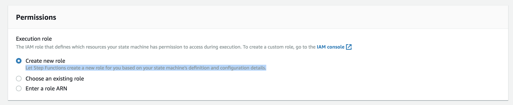

# AWS Step Functions and AWS X-Ray

AWS X-Ray integrates with AWS Step Functions to trace and analyze requests for Step Functions. You can
visualize the components of your
state
machine, identify performance bottlenecks, and troubleshoot requests that
resulted in an error. For more information, see [AWS X-Ray and Step Functions](../../../step-functions/latest/dg/concepts-xray-tracing.md "../../../step-functions/latest/dg/concepts-xray-tracing.md") in the AWS Step Functions Developer Guide.

###### To enable X-Ray tracing when creating a new state machine

1. Open the Step Functions console at
   [https://console.aws.amazon.com/states/](https://console.aws.amazon.com/states/ "https://console.aws.amazon.com/states/").
2. Choose **Create a state machine**.
3. On the **Define state machine** page, choose either
   **Author with code snippets** or **Start with a
   template**. If you choose to run a sample project, you
   can't
   enable X-Ray tracing during
   creation.
   Instead,
   enable
   X-Ray tracing after
   you
   create your state
   machine.
4. Choose **Next**.
5. On the **Specify details** page, configure your state machine.
6. Choose **Enable X-Ray tracing**.

###### To enable X-Ray tracing in an existing state machine

1. In the Step Functions console, select the state machine for which you want to enable tracing.
2. Choose **Edit**.
3. Choose **Enable X-Ray tracing**.
4. (Optional) Auto-generate a new role for your state machine to include X-Ray permissions by choosing **Create new role** from the Permissions window.

 5. Choose **Save**.

###### Note

When you create a new state machine, it's
automatically
traced if the request is sampled and tracing is enabled in an upstream service such as
Amazon API Gateway or AWS Lambda. For any existing state machine not configured through the console,
for example through an AWS CloudFormation template,
check
that you have an IAM policy that grants sufficient permissions to enable X-Ray
traces.
