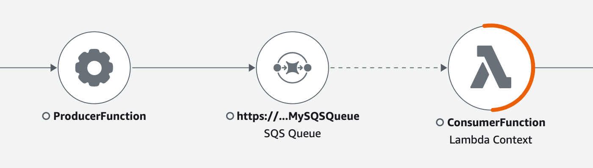
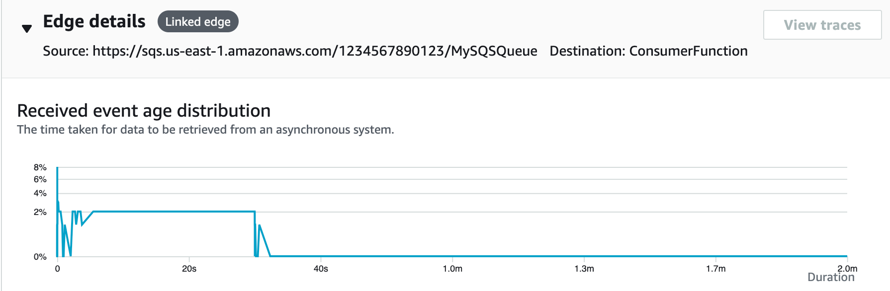
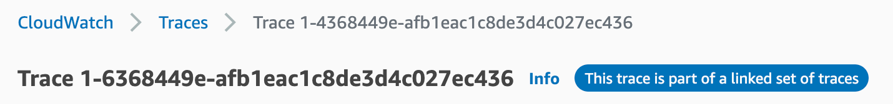
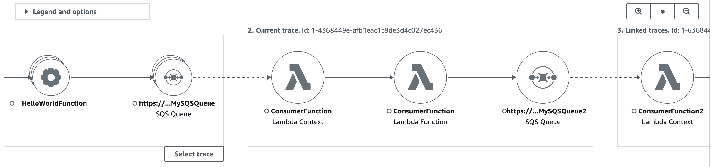
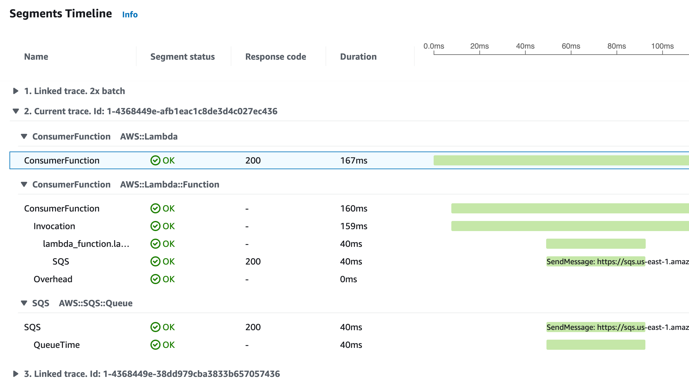
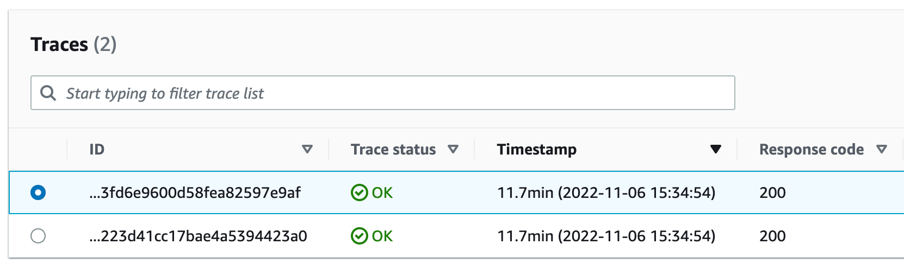
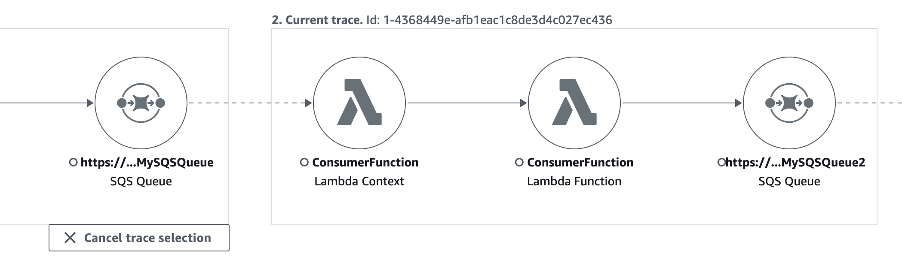

# Tracing event-driven applications

AWS X-Ray supports tracing event-driven applications using Amazon SQS and AWS Lambda. Use the CloudWatch console to see a
connected view of each request as it's queued with Amazon SQS and
processed by one or more Lambda functions. Traces from upstream message producers are automatically linked to traces
from downstream Lambda consumer nodes, creating an end-to-end view of the application.

###### Note

Each trace segment can be linked to up to 20 traces, while a trace can include a maximum of 100 links. In certain scenarios,
linking additional traces may result in exceeding the [maximum trace document size](../../../general/latest/gr/xray.md#limits_xray "../../../general/latest/gr/xray.md#limits_xray"),
causing a potentially incomplete trace. This can happen, for example, when a Lambda function with tracing enabled sends
many SQS messages to a queue in a single invocation. If you encounter this issue, a mitigation is available which uses
the X-Ray SDKs. See the X-Ray SDK for
[Java](https://github.com/aws/aws-xray-sdk-java#oversampling-mitigation "https://github.com/aws/aws-xray-sdk-java#oversampling-mitigation"),
[Node.js](https://github.com/aws/aws-xray-sdk-node/tree/master/packages/core#oversampling-mitigation "https://github.com/aws/aws-xray-sdk-node/tree/master/packages/core#oversampling-mitigation"),
[Python](https://github.com/aws/aws-xray-sdk-python#oversampling-mitigation "https://github.com/aws/aws-xray-sdk-python#oversampling-mitigation"),
[Go](https://github.com/aws/aws-xray-sdk-go#oversampling-mitigation "https://github.com/aws/aws-xray-sdk-go#oversampling-mitigation"), or
[.NET](https://github.com/aws/aws-xray-sdk-dotnet#oversampling-mitigation "https://github.com/aws/aws-xray-sdk-dotnet#oversampling-mitigation") for more information.

## View linked traces in the trace map

Use the **Trace Map** page within the [CloudWatch
console](https://console.aws.amazon.com/cloudwatch/ "https://console.aws.amazon.com/cloudwatch/") to view a trace map with traces from message producers that are linked to traces from Lambda
consumers. These links are displayed with a dashed-line edge that connects the Amazon SQS node and downstream Lambda
consumer nodes.

Select a dashed-line edge to display a _received event age_ histogram, which maps the
spread of event age when it's received by consumers. The age is calculated each time an event is received.

## View linked trace details

###### View trace details sent from a message producer, Amazon SQS queue, or Lambda consumer:

1. Use the **Trace Map** to select a message producer, Amazon SQS, or Lambda consumer node.
2. Choose **View traces** from the node details pane to display a list of traces. You can
   also navigate directly to the **Traces** page within the CloudWatch console.
3. Choose a specific trace from the list to open the trace details page. The trace details page displays a
   message when the selected trace is part of a linked set of traces.

The trace details map displays the current trace, along with upstream and downstream linked traces, each of which are
contained within a box that indicates the bounds of each trace. If the currently selected trace is linked to
multiple upstream or downstream traces, the nodes within the upstream or downstream linked traces are stacked, and
a **Select trace** button is displayed.

Beneath the trace details map, a timeline of trace segments displays, including upstream and downstream linked
traces. If there are multiple upstream or downstream linked traces, their segment details can't be displayed. To
view segment details for a single trace within a set of linked traces, [select a single trace](#xray-tracelinking-filterbatch "#xray-tracelinking-filterbatch") as described below.

## Select a single trace within a set of linked traces

###### Filter a linked set of traces to a single trace, to see segment details in the timeline.

1. Choose **Select trace** underneath the linked traces on the trace details map. A list of traces displays.

 2. Select the radio button next to a trace to view it within the trace details map. 3. Choose **Cancel trace selection** to view the entire set of linked traces.

